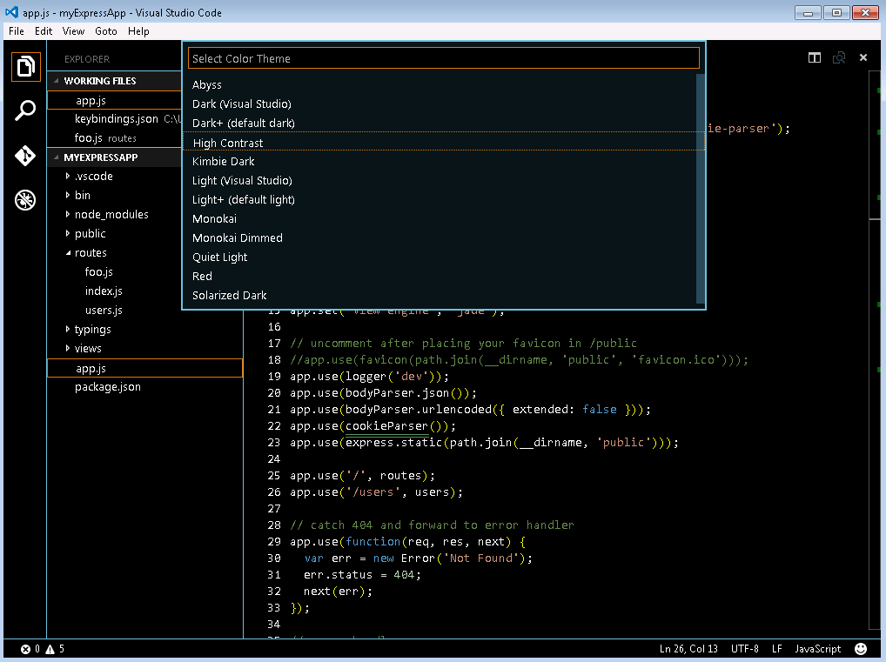
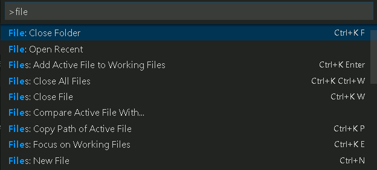
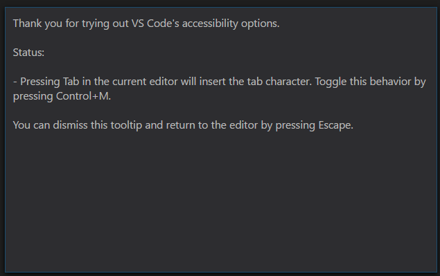

<a href="../../index.html" class="icon icon-home">vscode</a>

-

- [Home](../../index.html)

-

- - Customization
  - [Keyboard shortcuts](../../customization/keyboard-shortcuts/index.html)

-

- - Editor
  - <a href="index.html" class="current">Accessibility</a>
    - [Accessibility](#accessibility)
    - <a href="#zoom" class="toctree-l4">Zoom</a>
    - <a href="#persisted-zoom-level" class="toctree-l4">Persisted Zoom Level</a>
    - <a href="#high-contrast-theme" class="toctree-l4">High Contrast Theme</a>
    - <a href="#keyboard-navigation" class="toctree-l4">Keyboard Navigation</a>
    - <a href="#tab-navigation" class="toctree-l4">Tab Navigation</a>
    - <a href="#tab-trapping" class="toctree-l4">Tab trapping</a>
    - <a href="#screen-readers" class="toctree-l4">Screen Readers</a>
    - <a href="#accessibility-help" class="toctree-l4">Accessibility Help</a>
    - <a href="#debugger-accessibility" class="toctree-l4">Debugger Accessibility</a>
    - <a href="#current-known-issues" class="toctree-l4">Current Known Issues</a>
    - <a href="#next-steps" class="toctree-l4">Next Steps</a>
  - [Codebasics](../codebasics/index.html)
  - [Command line](../command-line/index.html)
  - [Debugging](../debugging/index.html)
  - [Editingevolved](../editingevolved/index.html)
  - [Emmet](../emmet/index.html)
  - [Extension gallery](../extension-gallery/index.html)
  - [Integrated terminal](../integrated-terminal/index.html)
  - [Intellisense](../intellisense/index.html)
  - [Tasks appendix](../tasks-appendix/index.html)
  - [Tasks v1 appendix](../tasks-v1-appendix/index.html)
  - [Tasks v1](../tasks-v1/index.html)
  - [Tasks](../tasks/index.html)
  - [Userdefinedsnippets](../userdefinedsnippets/index.html)
  - [Versioncontrol](../versioncontrol/index.html)
  - [Whyvscode](../whyvscode/index.html)

-

- - extensionAPI
  - [Activation events](../../extensionAPI/activation-events/index.html)
  - [Api debugging](../../extensionAPI/api-debugging/index.html)
  - [Api markdown](../../extensionAPI/api-markdown/index.html)
  - [Api scm](../../extensionAPI/api-scm/index.html)
  - [Extension manifest](../../extensionAPI/extension-manifest/index.html)
  - [Extension points](../../extensionAPI/extension-points/index.html)
  - [Language support](../../extensionAPI/language-support/index.html)
  - [Overview](../../extensionAPI/overview/index.html)
  - [Patterns and principles](../../extensionAPI/patterns-and-principles/index.html)
  - [Vscode api commands](../../extensionAPI/vscode-api-commands/index.html)
  - [Vscode api](../../extensionAPI/vscode-api/index.html)

-

- - Extensions
  - [Debugging extensions](../../extensions/debugging-extensions/index.html)
  - [Example debuggers](../../extensions/example-debuggers/index.html)
  - [Example hello world](../../extensions/example-hello-world/index.html)
  - [Example language server](../../extensions/example-language-server/index.html)
  - [Example word count](../../extensions/example-word-count/index.html)
  - [Overview](../../extensions/overview/index.html)
  - [Publish extension](../../extensions/publish-extension/index.html)
  - [Samples](../../extensions/samples/index.html)
  - [Testing extensions](../../extensions/testing-extensions/index.html)
  - [Themes snippets colorizers](../../extensions/themes-snippets-colorizers/index.html)
  - [Yocode](../../extensions/yocode/index.html)

-

- - Getstarted
  - [Introvideos](../../getstarted/introvideos/index.html)
  - [Keybindings](../../getstarted/keybindings/index.html)
  - [Locales](../../getstarted/locales/index.html)
  - [Settings](../../getstarted/settings/index.html)
  - [Theme color reference](../../getstarted/theme-color-reference/index.html)
  - [Themes](../../getstarted/themes/index.html)
  - [Userinterface](../../getstarted/userinterface/index.html)

-

- - Introvideos
  - [Basics](../../introvideos/basics/index.html)
  - [Codeediting](../../introvideos/codeediting/index.html)
  - [Configure](../../introvideos/configure/index.html)
  - [Debugging](../../introvideos/debugging/index.html)
  - [Extend](../../introvideos/extend/index.html)
  - [Intellisense](../../introvideos/intellisense/index.html)
  - [Quicktour](../../introvideos/quicktour/index.html)
  - [Versioncontrol](../../introvideos/versioncontrol/index.html)

-

- - Languages
  - [Cpp](../../languages/cpp/index.html)
  - [Csharp](../../languages/csharp/index.html)
  - [Css](../../languages/css/index.html)
  - [Dockerfile](../../languages/dockerfile/index.html)
  - [Go](../../languages/go/index.html)
  - [Html](../../languages/html/index.html)
  - [Identifiers](../../languages/identifiers/index.html)
  - [Javascript](../../languages/javascript/index.html)
  - [Jsconfig](../../languages/jsconfig/index.html)
  - [Json](../../languages/json/index.html)
  - [Markdown](../../languages/markdown/index.html)
  - [Overview](../../languages/overview/index.html)
  - [Php](../../languages/php/index.html)
  - [Python](../../languages/python/index.html)
  - [Tsql](../../languages/tsql/index.html)
  - [Typescript](../../languages/typescript/index.html)

-

- - Nodejs
  - [Angular tutorial](../../nodejs/angular-tutorial/index.html)
  - [Extensions](../../nodejs/extensions/index.html)
  - [Javascript transpilers](../../nodejs/javascript-transpilers/index.html)
  - [Nodejs debugging](../../nodejs/nodejs-debugging/index.html)
  - [Nodejs deployment](../../nodejs/nodejs-deployment/index.html)
  - [Nodejs tutorial](../../nodejs/nodejs-tutorial/index.html)
  - [Other javascript runtimes](../../nodejs/other-javascript-runtimes/index.html)
  - [Overview](../../nodejs/overview/index.html)
  - [Reactjs tutorial](../../nodejs/reactjs-tutorial/index.html)
  - [Tasks](../../nodejs/tasks/index.html)

-

- - Other
  - [Dotnet](../../other/dotnet/index.html)
  - [Office](../../other/office/index.html)
  - [Unity](../../other/unity/index.html)

-

- - Setup
  - [Additional components](../../setup/additional-components/index.html)
  - [Linux](../../setup/linux/index.html)
  - [Mac](../../setup/mac/index.html)
  - [Network](../../setup/network/index.html)
  - [Setup overview](../../setup/setup-overview/index.html)
  - [Windows](../../setup/windows/index.html)

-

- - Supporting
  - [Errors](../../supporting/errors/index.html)
  - [Faq](../../supporting/faq/index.html)
  - [Requirements](../../supporting/requirements/index.html)

-

[vscode](../../index.html)

- [Docs](../../index.html) »
- Editor »
- Accessibility
-

---

# Accessibility

Visual Studio Code has many features to help make the editor accessible to all users. Zoom and High Contrast colors improve editor visibility, keyboard-only navigation allows use without a mouse and the editor has been optimized for screen readers.

## Zoom

You can increase the Zoom level in VS Code with the **View** &gt; **Zoom In** command (`kb(workbench.action.zoomIn)`). The zoom level increases by 20% each time the command is executed. The **View** &gt; **Zoom Out** (`kb(workbench.action.zoomOut)`) command lets you decrease the Zoom level.

## Persisted Zoom Level

When you adjust the zoom level with the **View** &gt; **Zoom In / Out** commands, the zoom level is persisted in the `window.zoomLevel` [setting](https://vscode.readthedocs.io/docs/getstarted/settings.md). The default value is 0 and each increment increases the zoom level by 20%.

## High Contrast Theme

We support a High Contrast color theme on all platforms. Use **File** &gt; **Preferences** &gt; **Color Theme** to display the **Select Color Theme** drop-down and select the **High Contrast** theme.

## Keyboard Navigation

You will find that VS Code provides an exhaustive list of commands in the **Command Palette** (`kb(workbench.action.showCommands)`) so that you can run VS Code without using the mouse. Press `kb(workbench.action.showCommands)` then type a command name (e.g. 'git') to filter the list of commands.

VS Code also has many preset keyboard shortcuts for commands. These are displayed to the right of the command in the **Command Palette**.

You can also set your own keyboard shortcuts. **File** &gt; **Preferences** &gt; **Keyboard Shortcuts** brings up the **Default Keyboard Shortcuts** in the left pane and your customizable `keybindings.json` on the right. See [Key Bindings](https://vscode.readthedocs.io/docs/getstarted/keybindings.md) for more details on customizing or adding your own keyboard shortcuts.

## Tab Navigation

You can use the `kbstyle(Tab)` key to jump between VS Code UI controls. Use `kbstyle(Shift+Tab)` to tab in reverse order. As you tab through the UI controls, you can see an indicator around the UI element once the element gains focus.

Some areas that support Tab navigation are:

- The View switcher (Files, Search, Git, Debug)
- The header of collapsible sections in a view to expand/collapse
- Actions in views and sections
- Actions for items in the tree

## Tab trapping

By default, pressing the `kbstyle(Tab)` within a source code file inserts the Tab character (or spaces depending on your Indentation setting) and does not leave the open file. You can toggle the trapping of `kbstyle(Tab)` with `kb(editor.action.toggleTabFocusMode)` and subsequent `kbstyle(Tab)` keys will move focus out of the file. When default `kbstyle(Tab)` trapping is off, you will see an indicator in the Status Bar.

You can also toggle `kbstyle(Tab)` trapping from the **Command Palette** (`kb(workbench.action.showCommands)`) with the **Toggle Use of Tab Key for Setting Focus** action.

Read-only files never trap the `kbstyle(Tab)` key. The **Integrated Terminal** panel respects the `kbstyle(Tab)` trapping mode and can be toggled with `kb(editor.action.toggleTabFocusMode)`.

## Screen Readers

VS Code supports screen readers in the editor using a strategy based on paging the text. We have tested using the [NVDA screen reader](https://www.nvaccess.org/), but we expect all screen readers to benefit from this support.

> When using NVDA on Windows, we recommend to install [this plugin](https://files.derekriemer.com/globalEditorTimer-1.0.nvda-addon) from [Derek Riemer](https://github.com/derekriemer), which increases NVDA's timeout for receiving a caret move event from 30ms to 200ms. This plugin will no longer be needed when NVDA ships a new version [where the built-in timeout is increased from 30ms to 100ms](https://github.com/nvaccess/nvda/pull/7201).

The **Go to Next/Previous Error or Warning** actions (`kb(editor.action.marker.next)` and `kb(editor.action.marker.prev)`) allow screen readers to announce the error or warning messages.

When the suggestions pop up, they will get announced to screen readers. It is possible to navigate the suggestions using `kbstyle(Ctrl+Up)` and `kbstyle(Ctrl+Down)`, you can dismiss the suggestions with `kbstyle(Shift+Escape)` and if suggestions get in your way, you can disable the auto-popup of suggestions with the `editor.quickSuggestions` setting.

The **Go to Next/Previous Difference** actions (F7 and Shift+F7), when in a diff editor pane, will bring up the Diff Review Pane, which allows the navigation of the diffs, presented in a unified patch format. Arrow Up and Arrow Down can be used to navigate through the unchanged, inserted or deleted lines. Pressing Enter will return focus to the modified pane of the diff editor at the selected line number (or closest still existing line number in case a deleted line is selected). Use Escape or Shift+Escape to dismiss the Diff Review Pane.

> The **Integrated Terminal** does not currently support screen readers. There is an [open GitHub issue](https://github.com/Microsoft/vscode/issues/8339) tracking this.

## Accessibility Help

You can press `kb(editor.action.showAccessibilityHelp)` to trigger the **Show Accessibility Help** dialog while in an editor to check the state of various accessibility options in VS Code:

## Debugger Accessibility

The VS Code debugger UI is user accessible and has the following features:

- Changes in debug state are read out (e.g. 'started', 'breakpoint hit', 'terminated', ...).
- All debug actions are keyboard accessible.
- Both the Debug View and Debug Console support Tab navigation.
- Debug hover is keyboard accessible (`kb(editor.action.showHover)`).

## Current Known Issues

VS Code has some known accessibility issues depending on the platform.

### Windows

You can not use the keyboard (right, left arrow keys) to move between top-level menu items (**File**, **Edit**, **View**, etc). This is due to Electron issue [#2504](https://github.com/atom/electron/issues/2504).

### Mac

There is limited screen reader support for the editor with VoiceOver.

### Linux

There is no screen reader support for the editor.

## Next Steps

Read on to find out about:

- [Visual Studio Code User Interface](https://vscode.readthedocs.io/docs/getstarted/userinterface.md) - A quick orientation to VS Code.
- [Basic Editing](https://vscode.readthedocs.io/docs/editor/codebasics.md) - Learn about the powerful VS Code editor.
- [Code Navigation](https://vscode.readthedocs.io/docs/editor/editingevolved.md) - Move quickly through your source code.

<a href="../codebasics/index.html" class="btn btn-neutral float-right" title="Codebasics">Next </a> <a href="../../customization/keyboard-shortcuts/index.html" class="btn btn-neutral" title="Keyboard shortcuts"> Previous</a>

---

  Read the Docs  
