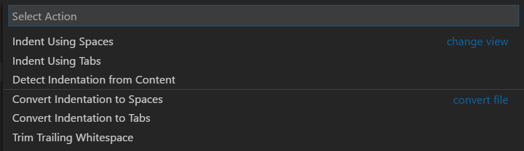

<a href="../../index.html" class="icon icon-home">vscode</a>

-

- [Home](../../index.html)

-

- - Customization
  - [Keyboard shortcuts](../../customization/keyboard-shortcuts/index.html)

-

- - Editor
  - [Accessibility](../accessibility/index.html)
  - <a href="index.html" class="current">Codebasics</a>
    - [Basic Editing](#basic-editing)
    - <a href="#keyboard-shortcuts" class="toctree-l4">Keyboard shortcuts</a>
    - <a href="#multiple-selections-multi-cursor" class="toctree-l4">Multiple selections (multi-cursor)</a>
    - <a href="#column-box-selection" class="toctree-l4">Column (box) selection</a>
    - <a href="#save-auto-save" class="toctree-l4">Save / Auto Save</a>
    - <a href="#hot-exit" class="toctree-l4">Hot Exit</a>
    - <a href="#search-across-files" class="toctree-l4">Search Across Files</a>
    - <a href="#intellisense" class="toctree-l4">IntelliSense</a>
    - <a href="#formatting" class="toctree-l4">Formatting</a>
    - <a href="#folding" class="toctree-l4">Folding</a>
    - <a href="#indentation" class="toctree-l4">Indentation</a>
    - <a href="#file-encoding-support" class="toctree-l4">File Encoding Support</a>
    - <a href="#next-steps" class="toctree-l4">Next Steps</a>
    - <a href="#common-questions" class="toctree-l4">Common Questions</a>
  - [Command line](../command-line/index.html)
  - [Debugging](../debugging/index.html)
  - [Editingevolved](../editingevolved/index.html)
  - [Emmet](../emmet/index.html)
  - [Extension gallery](../extension-gallery/index.html)
  - [Integrated terminal](../integrated-terminal/index.html)
  - [Intellisense](../intellisense/index.html)
  - [Tasks appendix](../tasks-appendix/index.html)
  - [Tasks v1 appendix](../tasks-v1-appendix/index.html)
  - [Tasks v1](../tasks-v1/index.html)
  - [Tasks](../tasks/index.html)
  - [Userdefinedsnippets](../userdefinedsnippets/index.html)
  - [Versioncontrol](../versioncontrol/index.html)
  - [Whyvscode](../whyvscode/index.html)

-

- - extensionAPI
  - [Activation events](../../extensionAPI/activation-events/index.html)
  - [Api debugging](../../extensionAPI/api-debugging/index.html)
  - [Api markdown](../../extensionAPI/api-markdown/index.html)
  - [Api scm](../../extensionAPI/api-scm/index.html)
  - [Extension manifest](../../extensionAPI/extension-manifest/index.html)
  - [Extension points](../../extensionAPI/extension-points/index.html)
  - [Language support](../../extensionAPI/language-support/index.html)
  - [Overview](../../extensionAPI/overview/index.html)
  - [Patterns and principles](../../extensionAPI/patterns-and-principles/index.html)
  - [Vscode api commands](../../extensionAPI/vscode-api-commands/index.html)
  - [Vscode api](../../extensionAPI/vscode-api/index.html)

-

- - Extensions
  - [Debugging extensions](../../extensions/debugging-extensions/index.html)
  - [Example debuggers](../../extensions/example-debuggers/index.html)
  - [Example hello world](../../extensions/example-hello-world/index.html)
  - [Example language server](../../extensions/example-language-server/index.html)
  - [Example word count](../../extensions/example-word-count/index.html)
  - [Overview](../../extensions/overview/index.html)
  - [Publish extension](../../extensions/publish-extension/index.html)
  - [Samples](../../extensions/samples/index.html)
  - [Testing extensions](../../extensions/testing-extensions/index.html)
  - [Themes snippets colorizers](../../extensions/themes-snippets-colorizers/index.html)
  - [Yocode](../../extensions/yocode/index.html)

-

- - Getstarted
  - [Introvideos](../../getstarted/introvideos/index.html)
  - [Keybindings](../../getstarted/keybindings/index.html)
  - [Locales](../../getstarted/locales/index.html)
  - [Settings](../../getstarted/settings/index.html)
  - [Theme color reference](../../getstarted/theme-color-reference/index.html)
  - [Themes](../../getstarted/themes/index.html)
  - [Userinterface](../../getstarted/userinterface/index.html)

-

- - Introvideos
  - [Basics](../../introvideos/basics/index.html)
  - [Codeediting](../../introvideos/codeediting/index.html)
  - [Configure](../../introvideos/configure/index.html)
  - [Debugging](../../introvideos/debugging/index.html)
  - [Extend](../../introvideos/extend/index.html)
  - [Intellisense](../../introvideos/intellisense/index.html)
  - [Quicktour](../../introvideos/quicktour/index.html)
  - [Versioncontrol](../../introvideos/versioncontrol/index.html)

-

- - Languages
  - [Cpp](../../languages/cpp/index.html)
  - [Csharp](../../languages/csharp/index.html)
  - [Css](../../languages/css/index.html)
  - [Dockerfile](../../languages/dockerfile/index.html)
  - [Go](../../languages/go/index.html)
  - [Html](../../languages/html/index.html)
  - [Identifiers](../../languages/identifiers/index.html)
  - [Javascript](../../languages/javascript/index.html)
  - [Jsconfig](../../languages/jsconfig/index.html)
  - [Json](../../languages/json/index.html)
  - [Markdown](../../languages/markdown/index.html)
  - [Overview](../../languages/overview/index.html)
  - [Php](../../languages/php/index.html)
  - [Python](../../languages/python/index.html)
  - [Tsql](../../languages/tsql/index.html)
  - [Typescript](../../languages/typescript/index.html)

-

- - Nodejs
  - [Angular tutorial](../../nodejs/angular-tutorial/index.html)
  - [Extensions](../../nodejs/extensions/index.html)
  - [Javascript transpilers](../../nodejs/javascript-transpilers/index.html)
  - [Nodejs debugging](../../nodejs/nodejs-debugging/index.html)
  - [Nodejs deployment](../../nodejs/nodejs-deployment/index.html)
  - [Nodejs tutorial](../../nodejs/nodejs-tutorial/index.html)
  - [Other javascript runtimes](../../nodejs/other-javascript-runtimes/index.html)
  - [Overview](../../nodejs/overview/index.html)
  - [Reactjs tutorial](../../nodejs/reactjs-tutorial/index.html)
  - [Tasks](../../nodejs/tasks/index.html)

-

- - Other
  - [Dotnet](../../other/dotnet/index.html)
  - [Office](../../other/office/index.html)
  - [Unity](../../other/unity/index.html)

-

- - Setup
  - [Additional components](../../setup/additional-components/index.html)
  - [Linux](../../setup/linux/index.html)
  - [Mac](../../setup/mac/index.html)
  - [Network](../../setup/network/index.html)
  - [Setup overview](../../setup/setup-overview/index.html)
  - [Windows](../../setup/windows/index.html)

-

- - Supporting
  - [Errors](../../supporting/errors/index.html)
  - [Faq](../../supporting/faq/index.html)
  - [Requirements](../../supporting/requirements/index.html)

-

[vscode](../../index.html)

- [Docs](../../index.html) »
- Editor »
- Codebasics
-

---

# Basic Editing

Visual Studio Code is an editor first and foremost and includes the features you need for highly productive source code editing. This topic takes you through the basics of the editor and helps you get moving with your code.

## Keyboard shortcuts

Being able to keep your hands on the keyboard when writing code is crucial for high productivity. VS Code has a rich set of default keyboard shortcuts as well as allowing you to customize them.

- [Keyboard Shortcuts Reference](https://vscode.readthedocs.io/docs/getstarted/keybindings.md#keyboard-shortcuts-reference) - Learn the most commonly used and popular keyboard shortcuts by downloading the reference sheet.
- [Install a Keymap extension](https://vscode.readthedocs.io/docs/getstarted/keybindings.md#keymap-extensions) - Use the keyboard shortcuts of your old editor (such as Sublime Text, Atom, and Vim) in VS Code by installing a Keymap extension.
- [Customize Keyboard Shortcuts](https://vscode.readthedocs.io/docs/getstarted/keybindings.md#customizing-shortcuts) - Change the default keyboard shortcuts to fit your style.

## Multiple selections (multi-cursor)

VS Code supports multiple cursors for fast simultaneous edits. You can add secondary cursors (rendered thinner) with `kbstyle(Alt+Click)`. Each cursor operates independently based on the context it sits in. A common way to add more cursors is with `kb(editor.action.insertCursorBelow)` or `kb(editor.action.insertCursorAbove)` that insert cursors below or above.

> **Note:** Your graphics card driver (for example NVIDIA) might overwrite these default shortcuts.

`kb(editor.action.addSelectionToNextFindMatch)` selects the word at the cursor, or the next occurrence of the current selection.

> **Tip:** You can also add more cursors with `kb(editor.action.selectHighlights)`, which will add a selection at each occurrence of the current selected text.

### Multi-cursor modifier

If you'd like to change the modifier key for applying multiple cursors to `kbstyle(Cmd+Click)` on macOS and `kbstyle(Ctrl+Click)` on Windows and Linux, you can do so with the `editor.multiCursorModifier` [setting](https://vscode.readthedocs.io/docs/getstarted/settings.md). This lets users coming from other editors such as Sublime Text or Atom continue to use the keyboard modifier they are familiar with.

The setting can be set to:

- `ctrlCmd` - Maps to `kbstyle(Ctrl)` on Windows and `kbstyle(Cmd)` on macOS.
- `alt` - The existing default `kbstyle(Alt)`.

There's also a menu item **Use Ctrl+Click for Multi-Cursor** in the **Selection** menu to quickly toggle this setting.

The **Go To Definition** and **Open Link** gestures will also respect this setting and adapt such that they do not conflict. For example, when the setting is `ctrlCmd`, multiple cursors can be added with `kbstyle(Ctrl/Cmd+Click)`, and opening links or going to definition can be invoked with `kbstyle(Alt+Click)`.

### Shrink/expand selection

Quickly shrink or expand the current selection. Trigger it with `kb(editor.action.smartSelect.shrink)` and `kb(editor.action.smartSelect.grow)`

Here's an example of expanding the selection with `kb(editor.action.smartSelect.grow)`:

## Column (box) selection

Hold `kbstyle(Shift)` and `kbstyle(Alt)` while dragging to do column selection:

There are also default key bindings for column selection on Mac and Windows, but not on Linux.

<table><thead><tr class="header"><th>Key</th><th>Command</th><th>Command id</th></tr></thead><tbody><tr class="odd"><td><code>kb(cursorColumnSelectDown)</code></td><td>Column Select Down</td><td><code>cursorColumnSelectDown</code></td></tr><tr class="even"><td><code>kb(cursorColumnSelectUp)</code></td><td>Column Select Up</td><td><code>cursorColumnSelectUp</code></td></tr><tr class="odd"><td><code>kb(cursorColumnSelectLeft)</code></td><td>Column Select Left</td><td><code>cursorColumnSelectLeft</code></td></tr><tr class="even"><td><code>kb(cursorColumnSelectRight)</code></td><td>Column Select Right</td><td><code>cursorColumnSelectRight</code></td></tr><tr class="odd"><td><code>kb(cursorColumnSelectPageDown)</code></td><td>Column Select Page Down</td><td><code>cursorColumnSelectPageDown</code></td></tr><tr class="even"><td><code>kb(cursorColumnSelectPageUp)</code></td><td>Column Select Page Up</td><td><code>cursorColumnSelectPageUp</code></td></tr></tbody></table>

You can [edit](https://vscode.readthedocs.io/docs/getstarted/keybindings.md) your `keybindings.json` to bind them to something more familiar if you wish.

## Save / Auto Save

By default, VS Code requires an explicit action to save your changes to disk, `kb(workbench.action.files.save)`.

However, it's easy to turn on `Auto Save`, which will save your changes after a configured delay or when focus leaves the editor. With this option turned on, there is no need to explicitly save the file. The easiest way to turn on `Auto Save` is with the **File** &gt; **Auto Save** toggle which turns on and off save after a delay.

For more control over `Auto Save`, open User or Workspace [settings](https://vscode.readthedocs.io/docs/getstarted/settings.md) and find the associated settings:

- `files.autoSave`: Can have the values:
- `off` - to disable auto save.
- `afterDelay` - to save files after a configured delay.
- `onFocusChange` - to save files when focus moves out of the editor of the dirty file.
- `onWindowChange` - to save files when the focus moves out of the VS Code window.
- `files.autoSaveDelay`: Configures the delay in milliseconds when `files.autoSave` is configured to `afterDelay`.

## Hot Exit

VS Code will remember unsaved changes to files when you exit by default. Hot exit is triggered when the application is closed via **File** &gt; **Exit** (**Code** &gt; **Quit** on macOS) or when the last window is closed.

You can configure hot exit by setting `files.hotExit` to the following values:

- `"off"`: Disable hot exit.
- `"onExit"`: Hot exit will be triggered when the application is closed, that is when the last window is closed on Windows/Linux or when the `workbench.action.quit` command is triggered (from the **Command Palette**, keyboard shortcut or menu). All windows with backups will be restored upon next launch.
- `"onExitAndWindowClose"`: Hot exit will be triggered when the application is closed, that is when the last window is closed on Windows/Linux or when the `workbench.action.quit` command is triggered (from the **Command Palette**, keyboard shortcut or menu), and also for any window with a folder opened regardless of whether it is the last window. All windows without folders opened will be restored upon next launch. To restore folder windows as they were before shutdown, set `window.restoreWindows` to `all`.

## Search Across Files

VS Code allows you to quickly search over all files in the currently-opened folder. Press `kb(workbench.view.search)` and enter your search term. Search results are grouped into files containing the search term, with an indication of the hits in each file and its location. Expand a file to see a preview of all of the hits within that file. Then single-click on one of the hits to view it in the editor.

> **Tip:** We support regular expression searching in the search box, too.

You can configure advanced search options with `kb(workbench.action.search.toggleQueryDetails)`. This will show additional fields to configure the search.

### Advanced Search Options

In the two input boxes below the search box, you can include and exclude files. If you enter `example`, that will match every folder and file named `example` in the workspace. If you enter `./example`, that will match the folder `example/` at the top level of your workspace. You can also use glob syntax:

- `*` to match one or more characters in a path segment
- `?` to match on one character in a path segment
- `**` to match any number of path segments, including none
- `{}` to group conditions (e.g. `{**/*.html,**/*.txt}` matches all HTML and text files)
- `[]` to declare a range of characters to match (e.g., `example.[0-9]` to match on `example.0`, `example.1`, …)

VS Code excludes some folders by default to reduce the number of search results that you are not interested in (for example: `node_modules`). Open [settings](https://vscode.readthedocs.io/docs/getstarted/settings.md) to change these rules under the `files.exclude` and `search.exclude` section.

Also note the two toggle buttons in the **files to exclude** box. The left one determines whether to exclude files that are ignored by your `.gitignore` file. The right determines whether to exclude files that are matched by your `files.exclude` and `search.exclude` settings.

> **Tip:** From the Explorer, you can right-click on a folder and select **Find in Folder** to search inside a folder only.

While VS Code does support regular expression searches, backreferences, lookaround, and multiline matches are not supported. This is because VS Code depends on the search tool [ripgrep](https://github.com/BurntSushi/ripgrep), which, while extremely fast, doesn't support these advanced regex features.

### Search and Replace

You can also Search and Replace across files. Expand the Search widget to display the Replace text box.

When you type text into the Replace text box, you will see a diff display of the pending changes. You can replace across all files from the Replace text box, replace all in one file or replace a single change.

> **Tip:** You can quickly reuse a previous search term by using `kb(search.history.showNext)` and `kb(search.history.showPrevious)` to navigate through your search term history.

## IntelliSense

We'll always offer word completion, but for the rich [languages](https://vscode.readthedocs.io/docs/languages/overview.md), such as JavaScript, JSON, HTML, CSS, Less, Sass, C# and TypeScript, we offer a true IntelliSense experience. If a language service knows possible completions, the IntelliSense suggestions will pop up as you type. You can always manually trigger it with `kb(editor.action.triggerSuggest)`. By default, `kbstyle(Tab)` or `kbstyle(Enter)` are the accept keyboard triggers but you can also [customize these key bindings](https://vscode.readthedocs.io/docs/getstarted/keybindings.md).

> **Tip:** The suggestions filtering supports CamelCase so you can type the letters which are upper cased in a method name to limit the suggestions. For example, "cra" will quickly bring up "createApplication".
>
> **Tip:** IntelliSense suggestions can be configured via the `editor.quickSuggestions` and `editor.suggestOnTriggerCharacters` [settings](https://vscode.readthedocs.io/docs/getstarted/settings.md).

JavaScript and TypeScript developers can take advantage of the [npmjs](https://www.npmjs.com/) type declaration (typings) file repository to get IntelliSense for common JavaScript libraries (Node.js, React, Angular). You can find a good explanation on using type declaration files in the [JavaScript language](https://vscode.readthedocs.io/docs/languages/javascript.md#intellisense) topic and the [Node.js](https://vscode.readthedocs.io/docs/nodejs/nodejs-tutorial.md) tutorial.

Learn more in the [IntelliSense document](https://vscode.readthedocs.io/docs/editor/intellisense.md).

## Formatting

VS Code has great support for source code formatting. The editor has two explicit format actions:

- **Format Document** (`kb(editor.action.formatDocument)`) - Format the entire active file.
- **Format Selection** (`kb(editor.action.formatSelection)`) - Format the selected text.

You can invoke these from the **Command Palette** (`kb(workbench.action.showCommands)`) or the editor context menu.

VS Code has default formatters for JavaScript, TypeScript, JSON, and HTML. Each language has specific formatting options (for example, `html.format.indentInnerHtml`) which you can tune to your preference in your user or workspace [settings](https://vscode.readthedocs.io/docs/getstarted/settings.md). You can also disable the default language formatter if you have another extension installed that provides formatting for the same language.

    "html.format.enable": false

Along with manually invoking code formatting, you can also trigger formatting based on user gestures such as typing, saving or pasting. These are off by default but you can enable these behaviors through the following [settings](https://vscode.readthedocs.io/docs/getstarted/settings.md):

- `editor.formatOnType` - Format the line after typing.
- `editor.formatOnSave` - Format a file on save.
- `editor.formatOnPaste` - Format the pasted content.

> Note: Not all formatters support format on paste as to do so they must support formatting a selection or range of text.

In addition to the default formatters, you can find extensions on the Marketplace to support other languages or formatting tools. There is a `Formatters` category so you can easily search and find [formatting extensions](https://marketplace.visualstudio.com/search?target=VSCode&category=Formatters&sortBy=Downloads). In the **Extensions** view search box, type 'formatters' or 'category:formatters' to see a filtered list of extensions within VS Code.

## Folding

You can fold regions of source code using the folding icons on the gutter between line numbers and line start. Move the mouse over the gutter to fold and unfold regions. The folding regions are evaluated based on the indentation of lines. A folding region starts when a line has a smaller indent than one or more following lines, and ends when there is a line with the same or smaller indent.

You can also use the following actions:

- Fold (`kb(editor.fold)`) folds the innermost uncollapsed region at the cursor
- Unfold (`kb(editor.unfold)`) unfolds the collapsed region at the cursor
- Fold All (`kb(editor.foldAll)`) folds all region in the editor
- Unfold All (`kb(editor.unfoldAll)`) unfolds all regions in the editor
- Fold Level X (`kb(editor.foldLevel2)` for level 2) folds all regions of level X, except the region at the current cursor position

## Indentation

VS Code lets you control text indentation and whether you'd like to use spaces or tab stops. By default, VS Code inserts spaces and uses 4 spaces per `kbstyle(Tab)` key. If you'd like to use another default, you can modify the `editor.insertSpaces` and `editor.tabSize` [settings](../../docs/getstarted/settings.html).

        "editor.insertSpaces": true,
        "editor.tabSize": 4,

### Auto-detection

VS Code analyzes your open file and determines the indentation used in the document. The auto-detected indentation overrides your default indentation settings. The detected setting is displayed on the right side of the Status Bar:

You can click on the Status Bar indentation display to bring up a drop-down with indentation commands allowing you to change the default settings for the open file or convert between tab stops and spaces.

> **Note:** VS Code auto-detection checks for indentations of 2, 4, 6 or 8 spaces. If your file uses a different number of spaces, the indentation may not be correctly detected. For example, if your convention is to indent with 3 spaces, you may want to turn off `editor.detectIndentation` and explicitly set the tab size to 3.

        "editor.detectIndentation": false,
        "editor.tabSize": 3,

## File Encoding Support

Set the file encoding globally or per workspace by using the `files.encoding` setting in **User Settings** or **Workspace Settings**.

You can view the file encoding in the status bar.

Click on the encoding button in the status bar to reopen or save the active file with a different encoding.

Then choose an encoding.

## Next Steps

You've covered the basic user interface - there is a lot more to VS Code. Read on to find out about:

- [Intro Video - Setup and Basics](https://vscode.readthedocs.io/docs/introvideos/basics.md) - Watch a tutorial on the basics of VS Code.
- [User/Workspace Settings](https://vscode.readthedocs.io/docs/getstarted/settings.md) - Learn how to configure VS Code to your preferences through user and workspace settings.
- [Code Navigation](https://vscode.readthedocs.io/docs/editor/editingevolved.md) - Peek and Goto Definition, and more
- [Integrated Terminal](https://vscode.readthedocs.io/docs/editor/integrated-terminal.md) - Learn about the integrated terminal for quickly performing command line tasks from within VS Code.
- [IntelliSense](https://vscode.readthedocs.io/docs/editor/intellisense.md) - VS Code brings smart code completions.
- [Debugging](https://vscode.readthedocs.io/docs/editor/debugging.md) - This is where VS Code really shines

## Common Questions

**Q: Is it possible to globally search and replace?**

**A:** Yes, expand the Search view text box to include a replace text field. You can search and replace across all the files in your workspace. Note that if you did not open VS Code on a folder, the search will only run on the currently open files.

**Q: How do I turn on word wrap?**

**A:** You can control word wrap through the `editor.wordWrap` [setting](https://vscode.readthedocs.io/docs/getstarted/settings.md). By default `editor.wordwrap` is `off` but if you set to it to `on`, text will wrap on the editor's viewport width.

        "editor.wordwrap": "on"

You can toggle word wrap for the VS Code session with `kb(editor.action.toggleWordWrap)`. Restarting VS Code will pick up the persisted `editor.wordwrap` value.

You can also add vertical column rulers to the editor with the `editor.rulers` setting which takes an array of column character positions where you'd like vertical rulers.

<a href="../command-line/index.html" class="btn btn-neutral float-right" title="Command line">Next </a> <a href="../accessibility/index.html" class="btn btn-neutral" title="Accessibility"> Previous</a>

---

  Read the Docs  
