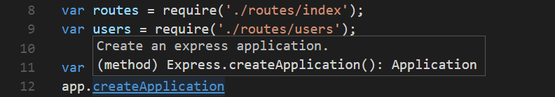

<a href="../../index.html" class="icon icon-home">vscode</a>

-

- [Home](../../index.html)

-

- - Customization
  - [Keyboard shortcuts](../../customization/keyboard-shortcuts/index.html)

-

- - Editor
  - [Accessibility](../accessibility/index.html)
  - [Codebasics](../codebasics/index.html)
  - [Command line](../command-line/index.html)
  - [Debugging](../debugging/index.html)
  - <a href="index.html" class="current">Editingevolved</a>
    - [Code Navigation](#code-navigation)
    - <a href="#quick-file-navigation" class="toctree-l4">Quick File Navigation</a>
    - <a href="#go-to-definition" class="toctree-l4">Go to Definition</a>
    - <a href="#go-to-type-definition" class="toctree-l4">Go to Type Definition</a>
    - <a href="#go-to-implementation" class="toctree-l4">Go to Implementation</a>
    - <a href="#go-to-symbol" class="toctree-l4">Go to Symbol</a>
    - <a href="#open-symbol-by-name" class="toctree-l4">Open symbol by name</a>
    - <a href="#peek" class="toctree-l4">Peek</a>
    - <a href="#bracket-matching" class="toctree-l4">Bracket matching</a>
    - <a href="#reference-information" class="toctree-l4">Reference information</a>
    - <a href="#rename-symbol" class="toctree-l4">Rename symbol</a>
    - <a href="#errors-warnings" class="toctree-l4">Errors &amp; Warnings</a>
    - <a href="#code-action" class="toctree-l4">Code Action</a>
    - <a href="#next-steps" class="toctree-l4">Next Steps</a>
  - [Emmet](../emmet/index.html)
  - [Extension gallery](../extension-gallery/index.html)
  - [Integrated terminal](../integrated-terminal/index.html)
  - [Intellisense](../intellisense/index.html)
  - [Tasks appendix](../tasks-appendix/index.html)
  - [Tasks v1 appendix](../tasks-v1-appendix/index.html)
  - [Tasks v1](../tasks-v1/index.html)
  - [Tasks](../tasks/index.html)
  - [Userdefinedsnippets](../userdefinedsnippets/index.html)
  - [Versioncontrol](../versioncontrol/index.html)
  - [Whyvscode](../whyvscode/index.html)

-

- - extensionAPI
  - [Activation events](../../extensionAPI/activation-events/index.html)
  - [Api debugging](../../extensionAPI/api-debugging/index.html)
  - [Api markdown](../../extensionAPI/api-markdown/index.html)
  - [Api scm](../../extensionAPI/api-scm/index.html)
  - [Extension manifest](../../extensionAPI/extension-manifest/index.html)
  - [Extension points](../../extensionAPI/extension-points/index.html)
  - [Language support](../../extensionAPI/language-support/index.html)
  - [Overview](../../extensionAPI/overview/index.html)
  - [Patterns and principles](../../extensionAPI/patterns-and-principles/index.html)
  - [Vscode api commands](../../extensionAPI/vscode-api-commands/index.html)
  - [Vscode api](../../extensionAPI/vscode-api/index.html)

-

- - Extensions
  - [Debugging extensions](../../extensions/debugging-extensions/index.html)
  - [Example debuggers](../../extensions/example-debuggers/index.html)
  - [Example hello world](../../extensions/example-hello-world/index.html)
  - [Example language server](../../extensions/example-language-server/index.html)
  - [Example word count](../../extensions/example-word-count/index.html)
  - [Overview](../../extensions/overview/index.html)
  - [Publish extension](../../extensions/publish-extension/index.html)
  - [Samples](../../extensions/samples/index.html)
  - [Testing extensions](../../extensions/testing-extensions/index.html)
  - [Themes snippets colorizers](../../extensions/themes-snippets-colorizers/index.html)
  - [Yocode](../../extensions/yocode/index.html)

-

- - Getstarted
  - [Introvideos](../../getstarted/introvideos/index.html)
  - [Keybindings](../../getstarted/keybindings/index.html)
  - [Locales](../../getstarted/locales/index.html)
  - [Settings](../../getstarted/settings/index.html)
  - [Theme color reference](../../getstarted/theme-color-reference/index.html)
  - [Themes](../../getstarted/themes/index.html)
  - [Userinterface](../../getstarted/userinterface/index.html)

-

- - Introvideos
  - [Basics](../../introvideos/basics/index.html)
  - [Codeediting](../../introvideos/codeediting/index.html)
  - [Configure](../../introvideos/configure/index.html)
  - [Debugging](../../introvideos/debugging/index.html)
  - [Extend](../../introvideos/extend/index.html)
  - [Intellisense](../../introvideos/intellisense/index.html)
  - [Quicktour](../../introvideos/quicktour/index.html)
  - [Versioncontrol](../../introvideos/versioncontrol/index.html)

-

- - Languages
  - [Cpp](../../languages/cpp/index.html)
  - [Csharp](../../languages/csharp/index.html)
  - [Css](../../languages/css/index.html)
  - [Dockerfile](../../languages/dockerfile/index.html)
  - [Go](../../languages/go/index.html)
  - [Html](../../languages/html/index.html)
  - [Identifiers](../../languages/identifiers/index.html)
  - [Javascript](../../languages/javascript/index.html)
  - [Jsconfig](../../languages/jsconfig/index.html)
  - [Json](../../languages/json/index.html)
  - [Markdown](../../languages/markdown/index.html)
  - [Overview](../../languages/overview/index.html)
  - [Php](../../languages/php/index.html)
  - [Python](../../languages/python/index.html)
  - [Tsql](../../languages/tsql/index.html)
  - [Typescript](../../languages/typescript/index.html)

-

- - Nodejs
  - [Angular tutorial](../../nodejs/angular-tutorial/index.html)
  - [Extensions](../../nodejs/extensions/index.html)
  - [Javascript transpilers](../../nodejs/javascript-transpilers/index.html)
  - [Nodejs debugging](../../nodejs/nodejs-debugging/index.html)
  - [Nodejs deployment](../../nodejs/nodejs-deployment/index.html)
  - [Nodejs tutorial](../../nodejs/nodejs-tutorial/index.html)
  - [Other javascript runtimes](../../nodejs/other-javascript-runtimes/index.html)
  - [Overview](../../nodejs/overview/index.html)
  - [Reactjs tutorial](../../nodejs/reactjs-tutorial/index.html)
  - [Tasks](../../nodejs/tasks/index.html)

-

- - Other
  - [Dotnet](../../other/dotnet/index.html)
  - [Office](../../other/office/index.html)
  - [Unity](../../other/unity/index.html)

-

- - Setup
  - [Additional components](../../setup/additional-components/index.html)
  - [Linux](../../setup/linux/index.html)
  - [Mac](../../setup/mac/index.html)
  - [Network](../../setup/network/index.html)
  - [Setup overview](../../setup/setup-overview/index.html)
  - [Windows](../../setup/windows/index.html)

-

- - Supporting
  - [Errors](../../supporting/errors/index.html)
  - [Faq](../../supporting/faq/index.html)
  - [Requirements](../../supporting/requirements/index.html)

-

[vscode](../../index.html)

- [Docs](../../index.html) »
- Editor »
- Editingevolved
-

---

# Code Navigation

Visual Studio Code has a high productivity code editor which, when combined with programming language services, gives you the power of an IDE and the speed of a text editor. In this topic, we'll first describe VS Code's language intelligence features (suggestions, parameter hints, smart code navigation) and then show the power of the core text editor.

## Quick File Navigation

The Explorer is great for navigating between files when you are exploring a project. However, when you are working on a task, you will find yourself quickly jumping between the same set of files. VS Code provides two powerful commands to navigate in and across files with easy-to-use key bindings.

Hold `kbstyle(Ctrl)` and press `kbstyle(Tab)` to view a list of all files open in an editor group. To open one of these files, use `kbstyle(Tab)` again to pick the file you want to navigate to, then release `kbstyle(Ctrl)` to open it.

Alternatively, you can use `kb(workbench.action.navigateBack)` and `kb(workbench.action.navigateForward)` to navigate between files and edit locations. If you are jumping around between different lines of the same file, these shortcuts allow you to navigate between those locations easily.

> **Tip:** You can open any file by its name when you type `kb(workbench.action.quickOpen)` (**Quick Open**).

## Go to Definition

If a [language](https://vscode.readthedocs.io/docs/languages/overview.md) supports it, you can go to the definition of a symbol by pressing `kb(editor.action.goToDeclaration)`.

If you press `kbstyle(Ctrl)` and hover over a symbol, a preview of the declaration will appear:

> **Tip:** You can jump to the definition with `kbstyle(Ctrl+Click)` or open the definition to the side with `kbstyle(Ctrl+Alt+Click)`.

## Go to Type Definition

Some [languages](https://vscode.readthedocs.io/docs/languages/overview.md) also support jumping to the type definition of a symbol by running the **Go to Type Definition** command from either the editor context menu or the **Command Palette**. This will take you to the definition of the type of a symbol. The command `editor.action.goToTypeDefinition` is not bound to a keyboard shortcut by default but you can add your own custom [keybinding](https://vscode.readthedocs.io/docs/getstarted/keybindings.md).

## Go to Implementation

[Languages](https://vscode.readthedocs.io/docs/languages/overview.md) can also support jumping to the implementation of a symbol by pressing `kb(editor.action.goToImplementation)`. For an interface, this shows all the implementors of that interface and for abstract methods, this shows all concrete implementations of that method.

## Go to Symbol

You can navigate symbols inside a file with `kb(workbench.action.gotoSymbol)`. By typing `kbstyle(:)` the symbols will be grouped by category. Just press `kbstyle(Up)` or `kbstyle(Down)` and navigate to the place you want.

## Open symbol by name

Some languages support jumping to a symbol across files with `kb(workbench.action.showAllSymbols)`. Just type the first letter of a type you want to navigate to, regardless of which file contains it, and press `kbstyle(Enter)`.

## Peek

We think there's nothing worse than a big context switch when all you want is to quickly check something. That's why we support peeked editors. When you execute a **Find All References** search (via `kb(editor.action.referenceSearch.trigger)`), or a **Peek Definition** (via `kb(editor.action.previewDeclaration)`), we embed the result inline:

You can navigate between different references in the peeked editor and make quick edits right there. Clicking on the peeked editor filename or double-clicking in the result list will open the reference in the outer editor.

> **Tip:** Additionally, the peek window is closed if you press `kbstyle(Escape)` or double-click in the peek editor region. You can disable this behavior with the `editor.stablePeek` [setting](https://vscode.readthedocs.io/docs/getstarted/settings.md).

## Bracket matching

Matching brackets will be highlighted as soon as the cursor is near one of them.

> **Tip:** You can jump to the matching bracket with `kb(editor.action.jumpToBracket)`

## Reference information

Some languages like C# support inline reference information, that is updated live. This allows you to quickly analyze the impact of your edit or the popularity of your specific method or property throughout your project:

> **Tip:** Directly invoke the **Find All References** action by clicking on these annotations.
>
> **Tip:** Reference information shown in CodeLens can be turned on or off through the `editor.codeLens` setting.

## Rename symbol

Some languages support rename symbol across files. Press `kb(editor.action.rename)` and then type the new desired name and press `kbstyle(Enter)`. All usages of the symbol will be renamed, across files.

## Errors & Warnings

Warnings or Errors can be generated either via [configured tasks](https://vscode.readthedocs.io/docs/editor/tasks.md), by rich language services, or by linters, that constantly analyze your code in the background. Since we love bug-free code, warnings and errors show up in multiple places:

- In the status bar, there is a summary of all errors and warnings counts.
- You can click on the summary or press `kb(workbench.actions.view.problems)` to display the **PROBLEMS** panel with a list of all current errors.
- If you open a file that has errors or warnings, they will be rendered inline with the text and in the overview ruler.

> **Tip:** To loop through errors or warnings in the current file, you can press `kb(editor.action.marker.next)` or `kb(editor.action.marker.prev)` which will show an inline zone detailing the problem and possible code actions (if available):

## Code Action

Warnings and Errors can provide Code Actions (also known as Quick Fixes) to help fix issues. These will be displayed in the editor in the left margin as a lightbulb. Clicking on the lightbulb will either display the Code Action options or perform the action.

## Next Steps

Now that you know how the editor works, time to try a few other things...

- [Intro Video - Code Editing](https://vscode.readthedocs.io/docs/introvideos/codeediting.md) - Watch an introductory video on code editing features.
- [User Interface](https://vscode.readthedocs.io/docs/getstarted/userinterface.md) - In case you missed a basic orientation around VS Code.
- [Key Bindings](https://vscode.readthedocs.io/docs/getstarted/keybindings.md) - Learn how to modify key bindings to your preference.
- [Debugging](https://vscode.readthedocs.io/docs/editor/debugging.md) - This is where VS Code really shines.

<a href="../emmet/index.html" class="btn btn-neutral float-right" title="Emmet">Next </a> <a href="../debugging/index.html" class="btn btn-neutral" title="Debugging"> Previous</a>

---

  Read the Docs  
