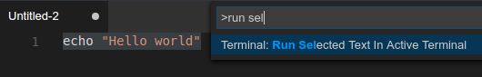

<a href="../../index.html" class="icon icon-home">vscode</a>

-

- [Home](../../index.html)

-

- - Customization
  - [Keyboard shortcuts](../../customization/keyboard-shortcuts/index.html)

-

- - Editor
  - [Accessibility](../accessibility/index.html)
  - [Codebasics](../codebasics/index.html)
  - [Command line](../command-line/index.html)
  - [Debugging](../debugging/index.html)
  - [Editingevolved](../editingevolved/index.html)
  - [Emmet](../emmet/index.html)
  - [Extension gallery](../extension-gallery/index.html)
  - <a href="index.html" class="current">Integrated terminal</a>
    - [Integrated Terminal](#integrated-terminal)
    - <a href="#managing-multiple-terminals" class="toctree-l4">Managing Multiple Terminals</a>
    - <a href="#configuration" class="toctree-l4">Configuration</a>
    - <a href="#terminal-display-settings" class="toctree-l4">Terminal Display Settings</a>
    - <a href="#key-bindings" class="toctree-l4">Key Bindings</a>
    - <a href="#common-questions" class="toctree-l4">Common Questions</a>
  - [Intellisense](../intellisense/index.html)
  - [Tasks appendix](../tasks-appendix/index.html)
  - [Tasks v1 appendix](../tasks-v1-appendix/index.html)
  - [Tasks v1](../tasks-v1/index.html)
  - [Tasks](../tasks/index.html)
  - [Userdefinedsnippets](../userdefinedsnippets/index.html)
  - [Versioncontrol](../versioncontrol/index.html)
  - [Whyvscode](../whyvscode/index.html)

-

- - extensionAPI
  - [Activation events](../../extensionAPI/activation-events/index.html)
  - [Api debugging](../../extensionAPI/api-debugging/index.html)
  - [Api markdown](../../extensionAPI/api-markdown/index.html)
  - [Api scm](../../extensionAPI/api-scm/index.html)
  - [Extension manifest](../../extensionAPI/extension-manifest/index.html)
  - [Extension points](../../extensionAPI/extension-points/index.html)
  - [Language support](../../extensionAPI/language-support/index.html)
  - [Overview](../../extensionAPI/overview/index.html)
  - [Patterns and principles](../../extensionAPI/patterns-and-principles/index.html)
  - [Vscode api commands](../../extensionAPI/vscode-api-commands/index.html)
  - [Vscode api](../../extensionAPI/vscode-api/index.html)

-

- - Extensions
  - [Debugging extensions](../../extensions/debugging-extensions/index.html)
  - [Example debuggers](../../extensions/example-debuggers/index.html)
  - [Example hello world](../../extensions/example-hello-world/index.html)
  - [Example language server](../../extensions/example-language-server/index.html)
  - [Example word count](../../extensions/example-word-count/index.html)
  - [Overview](../../extensions/overview/index.html)
  - [Publish extension](../../extensions/publish-extension/index.html)
  - [Samples](../../extensions/samples/index.html)
  - [Testing extensions](../../extensions/testing-extensions/index.html)
  - [Themes snippets colorizers](../../extensions/themes-snippets-colorizers/index.html)
  - [Yocode](../../extensions/yocode/index.html)

-

- - Getstarted
  - [Introvideos](../../getstarted/introvideos/index.html)
  - [Keybindings](../../getstarted/keybindings/index.html)
  - [Locales](../../getstarted/locales/index.html)
  - [Settings](../../getstarted/settings/index.html)
  - [Theme color reference](../../getstarted/theme-color-reference/index.html)
  - [Themes](../../getstarted/themes/index.html)
  - [Userinterface](../../getstarted/userinterface/index.html)

-

- - Introvideos
  - [Basics](../../introvideos/basics/index.html)
  - [Codeediting](../../introvideos/codeediting/index.html)
  - [Configure](../../introvideos/configure/index.html)
  - [Debugging](../../introvideos/debugging/index.html)
  - [Extend](../../introvideos/extend/index.html)
  - [Intellisense](../../introvideos/intellisense/index.html)
  - [Quicktour](../../introvideos/quicktour/index.html)
  - [Versioncontrol](../../introvideos/versioncontrol/index.html)

-

- - Languages
  - [Cpp](../../languages/cpp/index.html)
  - [Csharp](../../languages/csharp/index.html)
  - [Css](../../languages/css/index.html)
  - [Dockerfile](../../languages/dockerfile/index.html)
  - [Go](../../languages/go/index.html)
  - [Html](../../languages/html/index.html)
  - [Identifiers](../../languages/identifiers/index.html)
  - [Javascript](../../languages/javascript/index.html)
  - [Jsconfig](../../languages/jsconfig/index.html)
  - [Json](../../languages/json/index.html)
  - [Markdown](../../languages/markdown/index.html)
  - [Overview](../../languages/overview/index.html)
  - [Php](../../languages/php/index.html)
  - [Python](../../languages/python/index.html)
  - [Tsql](../../languages/tsql/index.html)
  - [Typescript](../../languages/typescript/index.html)

-

- - Nodejs
  - [Angular tutorial](../../nodejs/angular-tutorial/index.html)
  - [Extensions](../../nodejs/extensions/index.html)
  - [Javascript transpilers](../../nodejs/javascript-transpilers/index.html)
  - [Nodejs debugging](../../nodejs/nodejs-debugging/index.html)
  - [Nodejs deployment](../../nodejs/nodejs-deployment/index.html)
  - [Nodejs tutorial](../../nodejs/nodejs-tutorial/index.html)
  - [Other javascript runtimes](../../nodejs/other-javascript-runtimes/index.html)
  - [Overview](../../nodejs/overview/index.html)
  - [Reactjs tutorial](../../nodejs/reactjs-tutorial/index.html)
  - [Tasks](../../nodejs/tasks/index.html)

-

- - Other
  - [Dotnet](../../other/dotnet/index.html)
  - [Office](../../other/office/index.html)
  - [Unity](../../other/unity/index.html)

-

- - Setup
  - [Additional components](../../setup/additional-components/index.html)
  - [Linux](../../setup/linux/index.html)
  - [Mac](../../setup/mac/index.html)
  - [Network](../../setup/network/index.html)
  - [Setup overview](../../setup/setup-overview/index.html)
  - [Windows](../../setup/windows/index.html)

-

- - Supporting
  - [Errors](../../supporting/errors/index.html)
  - [Faq](../../supporting/faq/index.html)
  - [Requirements](../../supporting/requirements/index.html)

-

[vscode](../../index.html)

- [Docs](../../index.html) »
- Editor »
- Integrated terminal
-

---

# Integrated Terminal

In Visual Studio Code, you can open an integrated terminal, initially starting at the root of your workspace. This can be very convenient as you don't have to switch windows or alter the state of an existing terminal to perform a quick command line task.

To open the terminal:

- Use the `kb(workbench.action.terminal.toggleTerminal)` keyboard shortcut with the backtick character.
- Use the **View** | **Integrated Terminal** menu command.
- From the **Command Palette** (`kb(workbench.action.showCommands)`), use the **View:Toggle Integrated Terminal** command.

> **Note:** You can still open an external shell with the Explorer **Open in Command Prompt** command (**Open in Terminal** on Mac or Linux) if you prefer to work outside VS Code.

## Managing Multiple Terminals

You can create multiple terminals open to different locations and easily navigate between them. Terminal instances can be added by hitting the plus icon on the top-right of the **TERMINAL** panel or by triggering the `kb(workbench.action.terminal.new)` command. This creates another entry in the dropdown list that can be used to switch between them.

Remove terminal instances by pressing the trash can button.

> **Tip:** If you use multiple terminals extensively, you can add key bindings for the `focusNext`, `focusPrevious` and `kill` commands outlined in the [Key Bindings section](https://vscode.readthedocs.io/docs/editor/integrated-terminal.md#key-bindings) to allow navigation between them using only the keyboard.

## Configuration

The shell used defaults to `$SHELL` on Linux and macOS, PowerShell on Windows 10 and cmd.exe on earlier versions of Windows. These can be overridden manually by setting `terminal.integrated.shell.*` in [settings](https://vscode.readthedocs.io/docs/getstarted/settings.md). Arguments can be passed to the terminal shell on Linux and macOS using the `terminal.integrated.shellArgs.*` settings.

### Windows

Correctly configuring your shell on Windows is a matter of locating the right executable and updating the setting. Below are a list of common shell executables and their default locations:

    // 64-bit cmd if available, otherwise 32-bit
    "terminal.integrated.shell.windows": "C:\\Windows\\sysnative\\cmd.exe"
    // 64-bit PowerShell if available, otherwise 32-bit
    "terminal.integrated.shell.windows": "C:\\Windows\\sysnative\\WindowsPowerShell\\v1.0\\powershell.exe"
    // Git Bash
    "terminal.integrated.shell.windows": "C:\\Program Files\\Git\\bin\\bash.exe"
    // Bash on Ubuntu (on Windows)
    "terminal.integrated.shell.windows": "C:\\Windows\\sysnative\\bash.exe"

> **Note:** To be used as an integrated terminal, the shell executable must be a console application so that `stdin/stdout/stderr` can be redirected.
>
> **Tip:** The integrated terminal shell is running with the permissions of VS Code. If you need to run a shell command with elevated (administrator) or different permissions, you can use platform utilities such as `runas.exe` within a terminal.

### Shell arguments

You can pass arguments to the shell when it is launched.

For example, to enable running bash as a login shell (which runs `.bash_profile`), pass in the `-l` argument (with double quotes):

    // Linux
    "terminal.integrated.shellArgs.linux": ["-l"]

## Terminal Display Settings

You can customize the integrated terminal font and line height with the following settings:

- `terminal.integrated.fontFamily`
- `terminal.integrated.fontSize`
- `terminal.integrated.lineHeight`

## Key Bindings

The **View: Toggle Integrated Terminal** command is bound to `kb(workbench.action.terminal.toggleTerminal)` to quickly toggle the integrated terminal panel in and out of view.

Below are the keyboard shortcuts to quickly navigate within the integrated terminal:

<table><thead><tr class="header"><th>Key</th><th>Command</th></tr></thead><tbody><tr class="odd"><td><code>kb(workbench.action.terminal.toggleTerminal)</code></td><td>Show integrated terminal</td></tr><tr class="even"><td><code>kb(workbench.action.terminal.new)</code></td><td>Create new terminal</td></tr><tr class="odd"><td><code>kb(workbench.action.terminal.scrollup)</code></td><td>Scroll up</td></tr><tr class="even"><td><code>kb(workbench.action.terminal.scrolldown)</code></td><td>Scroll down</td></tr><tr class="odd"><td><code>kb(workbench.action.terminal.scrollupPage)</code></td><td>Scroll page up</td></tr><tr class="even"><td><code>kb(workbench.action.terminal.scrolldownPage)</code></td><td>Scroll page down</td></tr><tr class="odd"><td><code>kb(workbench.action.terminal.scrollToTop)</code></td><td>Scroll to top</td></tr><tr class="even"><td><code>kb(workbench.action.terminal.scrollToBottom)</code></td><td>Scroll to bottom</td></tr><tr class="odd"><td><code>kb(workbench.action.terminal.clear)</code></td><td>Clear the terminal</td></tr></tbody></table>

Other terminal commands are available and can be bound to your preferred keyboard shortcuts.

They are:

- `workbench.action.terminal.focus`: Focus the terminal. This is like toggle but focuses the terminal instead of hiding it, if it is visible.
- `workbench.action.terminal.focusNext`: Focuses the next terminal instance.
- `workbench.action.terminal.focusPrevious`: Focuses the previous terminal instance.
- `workbench.action.terminal.kill`: Remove the current terminal instance.
- `workbench.action.terminal.runSelectedText`: Run the selected text in the terminal instance.
- `workbench.action.terminal.runActiveFile`: Run the active file in the terminal instance.

### Run Selected Text

To use the `runSelectedText` command, select text in an editor and run the command **Terminal: Run Selected Text in Active Terminal** via the **Command Palette** (`kb(workbench.action.showCommands)`):

The terminal will attempt to run the selected text.

If no text is selected in the active editor, the line that the cursor is on is run in the terminal.

### Copy & Paste

The keybindings for copy and paste follow platform standards:

- Linux: `kbstyle(Ctrl+Shift+C)` and `kbstyle(Ctrl+Shift+V)`
- Mac: `kbstyle(Cmd+C)` and `kbstyle(Cmd+V)`
- Windows: `kbstyle(Ctrl+C)` and `kbstyle(Ctrl+V)`

### Find

The Integrated Terminal has basic find functionality which can be triggered with `kb(workbench.action.terminal.focusFindWidget)`.

If you want `Ctrl+F` to go to the shell instead of launching the Find widget on Linux and Windows, you will need to remove the keybinding like so:

    { "key": "ctrl+f", "command": "-workbench.action.terminal.focusFindWidget",
                          "when": "terminalFocus" },

### Rename terminal sessions

Integrated Terminal sessions can now be renamed using the **Terminal: Rename** (`workbench.action.terminal.rename`) command. The new name will be displayed in the terminal selection drop-down.

### Forcing key bindings to pass through the terminal

While focus is in the integrated terminal, many key bindings will not work as the keystrokes are passed to and consumed by the terminal itself. The `terminal.integrated.commandsToSkipShell` setting can be used to get around this. It contains an array of command names whose key bindings will skip processing by the shell and instead be processed by the VS Code key binding system. By default this includes all terminal key bindings in addition to a select few commonly used key bindings.

## Common Questions

### Why is VS Code shortcut X not working when the terminal has focus?

Currently the terminal consumes many key bindings, preventing Visual Studio Code from reacting to them. Some examples are `kbstyle(F1)` to open the **Command Palette** and `kbstyle(Ctrl+P)` for **Quick Open** on Linux and Windows. This is necessary as various terminal programs and/or shells may respond to these key bindings themselves. There are plans to explore a blacklist that would prevent certain key bindings from being handled by the terminal (see [#7269](https://github.com/Microsoft/vscode/issues/7269)).

### Integrated terminal exited with code 1 on Windows 10

This can happen if you run VS Code in compatibility mode which may be turned on automatically if you have upgraded Windows. You can change this by right-clicking the executable and selecting properties, then uncheck "Run this program in compatibility mode" in the compatibility tab.

### Can I use Cmder with the terminal on Windows?

Yes, to use the [Cmder](http://cmder.net/) console emulator in VS Code, you need to create a `vscode.bat` file in your cmder path with the following contents:

    @echo off
    SET CMDER_ROOT=C:\cmder (your path to cmder)
    "%CMDER_ROOT%\vendor\init.bat"

then in your VS Code user settings, add the following to your `settings.json` file:

    "terminal.integrated.shell.windows": "C:\\WINDOWS\\sysnative\\cmd.exe",
    "terminal.integrated.shellArgs.windows": ["/K", "C:\\cmder\\vscode.bat"]

Note: The example above assumes you are running 32-bit VS Code on 64-bit Windows and need to use `sysnative`. If you are running the 64-bit version of VS Code, you would use `System32`.

<a href="../intellisense/index.html" class="btn btn-neutral float-right" title="Intellisense">Next </a> <a href="../extension-gallery/index.html" class="btn btn-neutral" title="Extension gallery"> Previous</a>

---

  Read the Docs  
