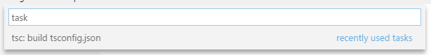
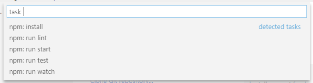
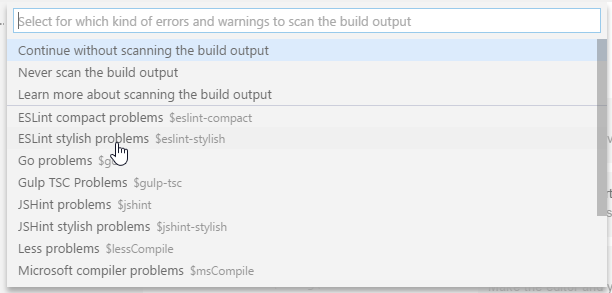
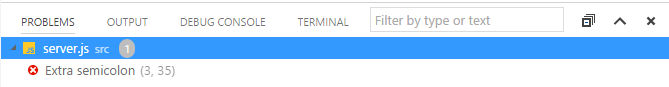
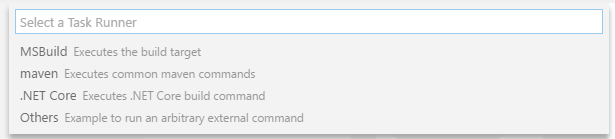
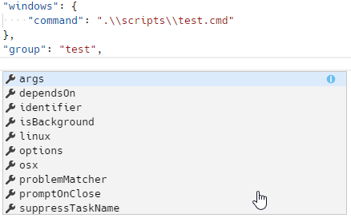
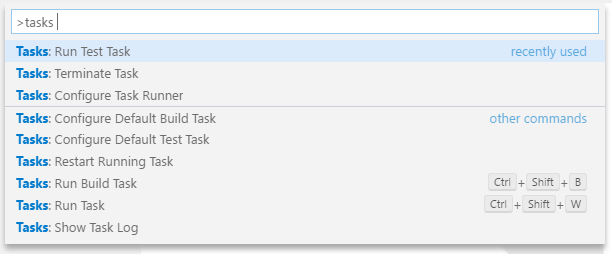
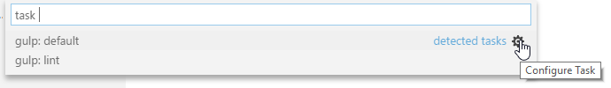

<a href="../../index.html" class="icon icon-home">vscode</a>

-

- [Home](../../index.html)

-

- - Customization
  - [Keyboard shortcuts](../../customization/keyboard-shortcuts/index.html)

-

- - Editor
  - [Accessibility](../accessibility/index.html)
  - [Codebasics](../codebasics/index.html)
  - [Command line](../command-line/index.html)
  - [Debugging](../debugging/index.html)
  - [Editingevolved](../editingevolved/index.html)
  - [Emmet](../emmet/index.html)
  - [Extension gallery](../extension-gallery/index.html)
  - [Integrated terminal](../integrated-terminal/index.html)
  - [Intellisense](../intellisense/index.html)
  - [Tasks appendix](../tasks-appendix/index.html)
  - [Tasks v1 appendix](../tasks-v1-appendix/index.html)
  - [Tasks v1](../tasks-v1/index.html)
  - <a href="index.html" class="current">Tasks</a>
    - [Integrate with External Tools via Tasks](#integrate-with-external-tools-via-tasks)
    - <a href="#typescript-hello-world" class="toctree-l4">TypeScript Hello World</a>
    - <a href="#task-auto-detection" class="toctree-l4">Task auto-detection</a>
    - <a href="#custom-tasks" class="toctree-l4">Custom tasks</a>
    - <a href="#output-behavior" class="toctree-l4">Output behavior</a>
    - <a href="#customizing-auto-detected-tasks" class="toctree-l4">Customizing auto-detected tasks</a>
    - <a href="#processing-task-output-with-problem-matchers" class="toctree-l4">Processing task output with problem matchers</a>
    - <a href="#binding-keyboard-shortcuts-to-tasks" class="toctree-l4">Binding keyboard shortcuts to tasks</a>
    - <a href="#variable-substitution" class="toctree-l4">Variable substitution</a>
    - <a href="#operating-system-specific-properties" class="toctree-l4">Operating system specific properties</a>
    - <a href="#examples-of-tasks-in-action" class="toctree-l4">Examples of tasks in action</a>
    - <a href="#defining-a-problem-matcher" class="toctree-l4">Defining a problem matcher</a>
    - <a href="#defining-a-multi-line-problem-matcher" class="toctree-l4">Defining a multi-line problem matcher</a>
    - <a href="#background-watching-tasks" class="toctree-l4">Background / watching tasks</a>
    - <a href="#convert-from-010-to-200" class="toctree-l4">Convert from "0.1.0" to "2.0.0"</a>
    - <a href="#next-steps" class="toctree-l4">Next Steps</a>
  - [Userdefinedsnippets](../userdefinedsnippets/index.html)
  - [Versioncontrol](../versioncontrol/index.html)
  - [Whyvscode](../whyvscode/index.html)

-

- - extensionAPI
  - [Activation events](../../extensionAPI/activation-events/index.html)
  - [Api debugging](../../extensionAPI/api-debugging/index.html)
  - [Api markdown](../../extensionAPI/api-markdown/index.html)
  - [Api scm](../../extensionAPI/api-scm/index.html)
  - [Extension manifest](../../extensionAPI/extension-manifest/index.html)
  - [Extension points](../../extensionAPI/extension-points/index.html)
  - [Language support](../../extensionAPI/language-support/index.html)
  - [Overview](../../extensionAPI/overview/index.html)
  - [Patterns and principles](../../extensionAPI/patterns-and-principles/index.html)
  - [Vscode api commands](../../extensionAPI/vscode-api-commands/index.html)
  - [Vscode api](../../extensionAPI/vscode-api/index.html)

-

- - Extensions
  - [Debugging extensions](../../extensions/debugging-extensions/index.html)
  - [Example debuggers](../../extensions/example-debuggers/index.html)
  - [Example hello world](../../extensions/example-hello-world/index.html)
  - [Example language server](../../extensions/example-language-server/index.html)
  - [Example word count](../../extensions/example-word-count/index.html)
  - [Overview](../../extensions/overview/index.html)
  - [Publish extension](../../extensions/publish-extension/index.html)
  - [Samples](../../extensions/samples/index.html)
  - [Testing extensions](../../extensions/testing-extensions/index.html)
  - [Themes snippets colorizers](../../extensions/themes-snippets-colorizers/index.html)
  - [Yocode](../../extensions/yocode/index.html)

-

- - Getstarted
  - [Introvideos](../../getstarted/introvideos/index.html)
  - [Keybindings](../../getstarted/keybindings/index.html)
  - [Locales](../../getstarted/locales/index.html)
  - [Settings](../../getstarted/settings/index.html)
  - [Theme color reference](../../getstarted/theme-color-reference/index.html)
  - [Themes](../../getstarted/themes/index.html)
  - [Userinterface](../../getstarted/userinterface/index.html)

-

- - Introvideos
  - [Basics](../../introvideos/basics/index.html)
  - [Codeediting](../../introvideos/codeediting/index.html)
  - [Configure](../../introvideos/configure/index.html)
  - [Debugging](../../introvideos/debugging/index.html)
  - [Extend](../../introvideos/extend/index.html)
  - [Intellisense](../../introvideos/intellisense/index.html)
  - [Quicktour](../../introvideos/quicktour/index.html)
  - [Versioncontrol](../../introvideos/versioncontrol/index.html)

-

- - Languages
  - [Cpp](../../languages/cpp/index.html)
  - [Csharp](../../languages/csharp/index.html)
  - [Css](../../languages/css/index.html)
  - [Dockerfile](../../languages/dockerfile/index.html)
  - [Go](../../languages/go/index.html)
  - [Html](../../languages/html/index.html)
  - [Identifiers](../../languages/identifiers/index.html)
  - [Javascript](../../languages/javascript/index.html)
  - [Jsconfig](../../languages/jsconfig/index.html)
  - [Json](../../languages/json/index.html)
  - [Markdown](../../languages/markdown/index.html)
  - [Overview](../../languages/overview/index.html)
  - [Php](../../languages/php/index.html)
  - [Python](../../languages/python/index.html)
  - [Tsql](../../languages/tsql/index.html)
  - [Typescript](../../languages/typescript/index.html)

-

- - Nodejs
  - [Angular tutorial](../../nodejs/angular-tutorial/index.html)
  - [Extensions](../../nodejs/extensions/index.html)
  - [Javascript transpilers](../../nodejs/javascript-transpilers/index.html)
  - [Nodejs debugging](../../nodejs/nodejs-debugging/index.html)
  - [Nodejs deployment](../../nodejs/nodejs-deployment/index.html)
  - [Nodejs tutorial](../../nodejs/nodejs-tutorial/index.html)
  - [Other javascript runtimes](../../nodejs/other-javascript-runtimes/index.html)
  - [Overview](../../nodejs/overview/index.html)
  - [Reactjs tutorial](../../nodejs/reactjs-tutorial/index.html)
  - [Tasks](../../nodejs/tasks/index.html)

-

- - Other
  - [Dotnet](../../other/dotnet/index.html)
  - [Office](../../other/office/index.html)
  - [Unity](../../other/unity/index.html)

-

- - Setup
  - [Additional components](../../setup/additional-components/index.html)
  - [Linux](../../setup/linux/index.html)
  - [Mac](../../setup/mac/index.html)
  - [Network](../../setup/network/index.html)
  - [Setup overview](../../setup/setup-overview/index.html)
  - [Windows](../../setup/windows/index.html)

-

- - Supporting
  - [Errors](../../supporting/errors/index.html)
  - [Faq](../../supporting/faq/index.html)
  - [Requirements](../../supporting/requirements/index.html)

-

[vscode](../../index.html)

- [Docs](../../index.html) »
- Editor »
- Tasks
-

---

--- Order: 10 Area: editor TOCTitle: Tasks ContentId: F5EA1A52-1EF2-4127-ABA6-6CEF5447C608 PageTitle: Tasks in Visual Studio Code DateApproved: 9/7/2017 MetaDescription: Expand your development workflow with task integration in Visual Studio Code.

---

# Integrate with External Tools via Tasks

---

If you are using Visual Studio Code version 1.13 or earlier, please refer to the previous version of the Tasks [documentation](https://vscode.readthedocs.io/docs/editor/tasks-v1.md).

---

Lots of tools exist to automate tasks like linting, building, packaging, testing or deploying software systems. Examples include the [TypeScript Compiler](https://www.typescriptlang.org/), linters like [ESLint](http://eslint.org/) and [TSLint](https://palantir.github.io/tslint/) as well as build systems like [Make](https://en.wikipedia.org/wiki/Make_software), [Ant](https://ant.apache.org/), [Gulp](http://gulpjs.com/), [Jake](http://jakejs.com/), [Rake](https://ruby.github.io/rake/) and [MSBuild](https://github.com/Microsoft/msbuild).

These tools are mostly run from the command line and automate jobs inside and outside the inner software development loop (edit, compile, test, and debug). Given their importance in the development life-cycle, it is very helpful to be able to run tools and analyze their results from within VS Code.

> **Note:** Task support is only available when working on a workspace folder. It is not available when editing single files.

## TypeScript Hello World

Let's start with a simple "Hello World" TypeScript program that we want to compile to JavaScript.

Create an empty folder "mytask", generate a `tsconfig.json` file and start VS Code from that folder.

    mkdir mytask
    cd mytask
    tsc --init
    code .

Now create a `HelloWorld.ts` file with the following content

    class Startup {
        public static main(): number {
            console.log('Hello World');
            return 0;
        }
    }

    Startup.main();

Pressing `kb(workbench.action.tasks.build)` or running **Run Build Task...** from the global **Tasks** menu show the following picker:

Selecting the entry executes the TypeScript compiler and translates the TypeScript file to a JavaScript file. When the compiler has finished, there should be a `HelloWorld.js` file.

You can also define the TypeScript build task as the default build task so that it is executed directly when triggering **Run Build Task** (`kb(workbench.action.tasks.build)`). To do so, select **Configure Default Build Task** from the global **Tasks** menu. This shows you a picker with the available build tasks. Select **TypeScript** and VS Code will generate the following `tasks.json` file:

    {
        // See https://go.microsoft.com/fwlink/?LinkId=733558
        // for the documentation about the tasks.json format
        "version": "2.0.0",
        "tasks": [
            {
                "type": "typescript",
                "tsconfig": "tsconfig.json",
                "problemMatcher": [
                    "$tsc"
                ],
                "group": {
                    "kind": "build",
                    "isDefault": true
                }
            }
        ]
    }

Unlike the previous `0.1.0` version of the `tasks.json` file, this does not define a new task. It annotates the TypeScript compile tasks contributed by VS Code's TypeScript extension to be the default build task. You can now execute the TypeScript compiler by simply pressing `kb(workbench.action.tasks.build)`.

## Task auto-detection

VS Code currently auto-detects tasks for the following systems: Gulp, Grunt, Jake and npm. We are working with the corresponding extension authors to add support for Maven and the C# `dotnet` command as well. If you develop a JavaScript application using Node.js as the runtime, you usually have a `package.json` file describing your dependencies and the scripts to run. If you have cloned the [eslint-starter](https://github.com/spicydonuts/eslint-starter) example, then executing **Run Tasks** from the global menu shows the following list:

Select **npm: install** to install the necessary Node.js modules. When prompted to select a problem matcher, select **Continue without scanning the build output**. This will install all necessary Node.js modules.

Now open the `server.js` file and add a semicolon to the end of a statement (note the ESLint starter assumes statements without a semicolon) and execute the **Run Tasks** again. This time select the **npm: run lint** task. When prompted for the problem matcher to use, select **ESLint stylish**

Executing the task produces one error shown in the **Problems** view:

In additon, VS Code created a `tasks.json` file with the following content:

    {
        // See https://go.microsoft.com/fwlink/?LinkId=733558
        // for the documentation about the tasks.json format
        "version": "2.0.0",
        "tasks": [
            {
                "type": "npm",
                "script": "lint",
                "problemMatcher": [
                    "$eslint-stylish"
                ]
            }
        ]
    }

This instructs VS Code to scan the output of the **npm lint** script for problems using the ESLint stylish format.

For Gulp, Grunt, and Jake, the task auto-detection works the same. Below is an example of the tasks detected for the [vscode-node-debug](https://github.com/Microsoft/vscode-node-debug) extension.

> **Tip:** You can run your task through **Quick Open** (`kb(workbench.action.quickOpen)`) by typing 'task', `kbstyle(Space)` and the command name. In this case, 'task lint'.

## Custom tasks

Not all tasks or scripts can be auto-detected in your workspace. Sometimes it is necessary to define your own custom tasks. Assume you have a script to run your tests since it is necessary to setup some environment correctly. The script is stored in a script folder inside your workspace and named `test.sh` for Linux and macOS and `test.cmd` for Windows. Run **Configure Tasks** from the global **Tasks** menu. This opens the following picker:

> **Note:** If you don't see the list of task runner templates, you may already have a `tasks.json` file in your folder and its contents will be open in the editor. Close the file and either delete or rename it for this example.

We are working on more auto-detection support, so this list will get smaller and smaller in the future. Since we want to write our own custom task, select **Others** from the list. This opens the `tasks.json` file with a task skeleton. Replace the contents with the following:

    {
        // See https://go.microsoft.com/fwlink/?LinkId=733558
        // for the documentation about the tasks.json format
        "version": "2.0.0",
        "tasks": [
            {
                "taskName": "Run tests",
                "type": "shell",
                "command": "./scripts/test.sh",
                "windows": {
                    "command": ".\\scripts\\test.cmd"
                },
                "group": "test",
                "presentation": {
                    "reveal": "always",
                    "panel": "new"
                }
            }
        ]
    }

The task's properties have the following semantic:

- **taskName**: The tasks's name used in the user interface.
- **type**: The task's type. For a custom task, this can either be `shell` or `process`. If `shell` is specified, the command is interpreted as a shell command (for example: bash, cmd, or PowerShell). If `process` is specified, the command is interpreted as a process to execute. If `shell` is used, any arguments to the command should be embedded into the `command` property to support proper argument quoting. For example, if the test script accepts a `--debug` argument then the command property would be: `./scripts/test.sh --debug`.
- **command**: The actual command to execute.
- **windows**: Any Windows specific properties. Will be used instead of the default properties when the command is executed on the Windows operating system.
- **group**: Defines to which group the task belongs. In the example, it belongs to the `test` group. Tasks that belong to the test group can be executed by running **Run Test Task** from the **Command Palette**.
- **presentation**: Defines how the task output is handled in the user interface. In this example, the Integrated Terminal showing the output is `always` revealed and a `new` terminal is created on every task run.

There are more task properties to configure your workflow. You can use IntelliSense with `kb(editor.action.triggerSuggest)` to get an overview of the valid properties.

In addition to the global menu bar, task commands can be accessed using the **Command Palette** (`kb(workbench.action.showCommands)`). You can filter on 'task' and can see the various task related commands.

## Output behavior

Sometimes you want to control how the Integrated Terminal panel behaves when running tasks. For instance, you may want to maximize editor space and only look at task output if you think there is a problem. The behavior of the terminal can be controled using the `presentation` property of a task. It offers the following properties:

- **reveal**: Controls whether the Integrated Terminal panel is brought to front. Valid values are:
- _always_ - The panel is always brought to front. This is the default.
- _never_ - The user must explicitly bring the terminal panel to the front using the **View** > **Integrated Terminal** command (`kb(workbench.action.terminal.toggleTerminal)`).
- _silent_ - The terminal panel is brought to front only if the output is not scanned for errors and warnings.
- **focus**: Controls whether the teminal is taking input focus or not. Default is `false`.
- **echo**: Controls whether the executed command is echoed in the terminal. Default is `true`.
- **panel**: Controls whether the terminal instance is shared between task runs. Possible values are:
- _shared_: The terminal is shared and the output of other task runs are added to the same terminal.
- _dedicated_: The terminal is dedicated to a specific task. If that task is executed again, the terminal is reused. However the output of a different task is presented in a different terminal.
- _new_: Every execution of that task is using a new clean terminal.

You can modify the terminal panel behavior for auto-detected tasks as well. For example, if you want to change the output behavior for the **npm: run lint** from the ESLint example from above, simply add the `presentation` property to it:

    {
        // See https://go.microsoft.com/fwlink/?LinkId=733558
        // for the documentation about the tasks.json format
        "version": "2.0.0",
        "tasks": [
            {
                "type": "npm",
                "script": "lint",
                "problemMatcher": [
                    "$eslint-stylish"
                ],
                "presentation": {
                    "reveal": "never"
                }
            }
        ]
    }

You can also mix custom tasks with configurations for detected tasks. A `tasks.json` that configures the **npm: run lint** task and adds a custom **Run Test** tasks looks like this:

    {
        // See https://go.microsoft.com/fwlink/?LinkId=733558
        // for the documentation about the tasks.json format
        "version": "2.0.0",
        "tasks": [
            {
                "type": "npm",
                "script": "lint",
                "problemMatcher": [
                    "$eslint-stylish"
                ],
                "presentation": {
                    "reveal": "never"
                },
            },
            {
                "taskName": "Run tests",
                "type": "shell",
                "command": "./scripts/test.sh",
                "windows": {
                    "command": ".\\scripts\\test.cmd"
                },
                "group": "test",
                "presentation": {
                    "reveal": "always",
                    "panel": "new"
                }
            }
        ]
    }

## Customizing auto-detected tasks

As mentioned above, you can customize auto-detected tasks in the `tasks.json` file. You usually do so to modify presentation properties or to attach a problem matcher to scan the task's output for errors and warnings. You can customize a task directly from the **Run Task** list by pressing the gear icon to the right to insert the corresponding task reference into the `tasks.json` file. Assume you have the following Gulp file to lint JavaScript files using ESLint (the file is taken from https://github.com/adametry/gulp-eslint):

    const gulp = require('gulp');
    const eslint = require('gulp-eslint');

    gulp.task('lint', () => {
        // ESLint ignores files with "node_modules" paths.
        // So, it's best to have gulp ignore the directory as well.
        // Also, Be sure to return the stream from the task;
        // Otherwise, the task may end before the stream has finished.
        return gulp.src(['**/*.js','!node_modules/**'])
            // eslint() attaches the lint output to the "eslint" property
            // of the file object so it can be used by other modules.
            .pipe(eslint())
            // eslint.format() outputs the lint results to the console.
            // Alternatively use eslint.formatEach() (see Docs).
            .pipe(eslint.format())
            // To have the process exit with an error code (1) on
            // lint error, return the stream and pipe to failAfterError last.
            .pipe(eslint.failAfterError());
    });

    gulp.task('default', ['lint'], function () {
        // This will only run if the lint task is successful...
    });

Executing **Run Task** from the global **Tasks** menu will show the following picker:

Press the gear icon. This will create the following `tasks.json` file:

    {
        // See https://go.microsoft.com/fwlink/?LinkId=733558
        // for the documentation about the tasks.json format
        "version": "2.0.0",
        "tasks": [
            {
                "type": "gulp",
                "task": "default",
                "problemMatcher": []
            }
        ]
    }

Usually you would now add a problem matcher (in this case `$eslint-stylish`) or modify the presentation settings.

## Processing task output with problem matchers

VS Code can process the output from a task with a problem matcher and we ship with a number of them 'in-the-box':

- **TypeScript**: `$tsc` assumes that file names in the output are relative to the opened folder.
- **TypeScript Watch**: `$tsc-watch` matches problems reported from the `tsc` compiler when executed in watch mode.
- **JSHint**: `$jshint` assumes that file names are reported as an absolute path.
- **JSHint Stylish**: `$jshint-stylish` assumes that file names are reported as an absolute path.
- **ESLint Compact**: `$eslint-compact` assumes that file names in the output are relative to the opened folder.
- **ESLint Stylish**: `$eslint-stylish` assumes that file names in the output are relative to the opened folder.
- **Go**: `$go` matches problems reported from the `go` compiler. Assumes that file names are relative to the opened folder.
- **CSharp and VB Compiler**: `$mscompile` assumes that file names are reported as an absolute path.
- **Less**: `$lessCompile` assumes that file names are reported as absolute path.

Problem matchers scan the task output text for known warning or error strings and report these inline in the editor and in the Problems panel.

You can also create your own problem matcher which we'll discuss [in a later section](https://vscode.readthedocs.io/docs/editor/tasks.md#defining-a-problem-matcher).

## Binding keyboard shortcuts to tasks

If you need to run a task frequently, you can define a keyboard shortcut for the task.

For example, to bind `Ctrl+H` to the **Run tests** task from above, add the following to your `keybindings.json` file:

    {
        "key": "ctrl+h",
        "command": "workbench.action.tasks.runTask",
        "args": "Run tests"
    }

## Variable substitution

When authoring tasks configurations, it is often useful to have a set of predefined common variables. VS Code supports variable substitution inside strings in the `tasks.json` file and has the following predefined variables:

- **${workspaceRoot}** the path of the folder opened in VS Code
- **${workspaceRootFolderName}** the name of the folder opened in VS Code without any slashes (/)
- **${file}** the current opened file
- **${relativeFile}** the current opened file relative to `workspaceRoot`
- **${fileBasename}** the current opened file's basename
- **${fileBasenameNoExtension}** the current opened file's basename without the extension
- **${fileDirname}** the current opened file's dirname
- **${fileExtname}** the current opened file's extension
- **${cwd}** the task runner's current working directory on startup
- **${lineNumber}** the current selected line number in the active file

You can also reference environment variables through **${env:Name}** (for example, ${env:PATH}). Be sure to match the environment variable name's casing, for example `${env:Path}` on Windows.

Below is an example of a custom task configuration that passes the current opened file to the TypeScript compiler.

    {
        "taskName": "TypeScript compile",
        "type": "shell",
        "command": "tsc ${file}",
        "problemMatcher": [
            "$tsc"
        ]
    }

## Operating system specific properties

The task system supports defining values (for example, the command to be executed) specific to an operating system. To do so, put an operating system specific literal into the `tasks.json` file and specify the corresponding properties inside that literal.

Below is an example that uses the Node.js executable as a command and is treated differently on Windows and Linux:

    {
        "taskName": "Run Node",
        "type": "process",
        "windows": {
            "command": "C:\\Program Files\\nodejs\\node.exe"
        },
        "linux": {
            "command": "/usr/bin/node"
        }
    }

Valid operating properties are `windows` for Windows, `linux` for Linux, and `osx` for macOS. Properties defined in an operating system specific scope override properties defined in the task or global scope.

Task properties can also be defined in the global scope. If present, they will be used for specific tasks unless they define the same property with a different value. In the example below, there is a global `presentation` property that defines that all tasks should be executed in a new panel:

    {
        // See https://go.microsoft.com/fwlink/?LinkId=733558
        // for the documentation about the tasks.json format
        "version": "2.0.0",
        "presentation": {
            "panel": "new"
        },
        "tasks": [
            {
                "taskName": "TS - Compile current file",
                "type": "shell",
                "command": "tsc ${file}",
                "problemMatcher": [
                    "$tsc"
                ]
            }
        ]
    }

## Examples of tasks in action

To highlight the power of tasks, here are a few examples of how VS Code can use tasks to integrate external tools like linters and compilers.

### Transpiling TypeScript to JavaScript

The [TypeScript topic](https://vscode.readthedocs.io/docs/languages/typescript.md#transpiling-typescript-into-javascript) includes an example that creates a task to transpile TypeScript to JavaScript and observe any related errors from within VS Code.

### Compiling Markdown to HTML

The Markdown topic provides two examples for compiling Markdown to HTML:

1.  [Manually compiling with a Build task](https://vscode.readthedocs.io/docs/languages/markdown.md#compiling-markdown-into-html)
2.  [Automating the compile step with a file watcher](https://vscode.readthedocs.io/docs/languages/markdown.md#automating-markdown-compilation)

### Transpiling Less and Sass into CSS

The CSS topic provides examples of how to use Tasks to generate CSS files.

1.  [Manually transpiling with a Build task](https://vscode.readthedocs.io/docs/languages/css.md#transpiling-sass-and-less-into-css)
2.  [Automation of the compile step with a file watcher](https://vscode.readthedocs.io/docs/languages/css.md#automating-sassless-compilation)

## Defining a problem matcher

VS Code ships some of the most common problem matchers 'in-the-box'. However, there are lots of compilers and linting tools out there, all of which produce their own style of errors and warnings so you may want to create your own problem matcher.

We have a `helloWorld.c` program in which the developer mistyped **printf** as **prinft**. Compiling it with [gcc](https://gcc.gnu.org/) will produce the following warning:

    helloWorld.c:5:3: warning: implicit declaration of function ‘prinft’

We want to produce a problem matcher that can capture the message in the output and show a corresponding problem in VS Code. Problem matchers heavily rely on [regular expressions](https://en.wikipedia.org/wiki/Regular_expression). The section below assumes you are familiar with regular expressions.

> **Tip:** We have found the [RegEx101 playground](https://regex101.com/) to be a great way to develop and test regular expressions.

A matcher that captures the above warning (and errors) looks like this:

    {
        // The problem is owned by the cpp language service.
        "owner": "cpp",
        // The file name for reported problems is relative to the opened folder.
        "fileLocation": ["relative", "${workspaceRoot}"],
        // The actual pattern to match problems in the output.
        "pattern": {
            // The regular expression. Example to match: helloWorld.c:5:3: warning: implicit declaration of function ‘prinft’ [-Wimplicit-function-declaration]
            "regexp": "^(.*):(\\d+):(\\d+):\\s+(warning|error):\\s+(.*)$",
            // The first match group matches the file name which is relative.
            "file": 1,
            // The second match group matches the line on which the problem occurred.
            "line": 2,
            // The third match group matches the column at which the problem occurred.
            "column": 3,
            // The fourth match group matches the problem's severity. Can be ignored. Then all problems are captured as errors.
            "severity": 4,
            // The fifth match group matches the message.
            "message": 5
        }
    }

Please note that the file, line and message properties are mandatory.

Here is a finished `tasks.json` file with the code above (comments removed) wrapped with the actual task details:

    {
        "version": "0.1.0",
        "command": "gcc",
        "args": ["-Wall", "helloWorld.c", "-o", "helloWorld"],
        "problemMatcher": {
            "owner": "cpp",
            "fileLocation": ["relative", "${workspaceRoot}"],
            "pattern": {
                "regexp": "^(.*):(\\d+):(\\d+):\\s+(warning|error):\\s+(.*)$",
                "file": 1,
                "line": 2,
                "column": 3,
                "severity": 4,
                "message": 5
            }
        }
    }

Running it inside VS Code and pressing `kb(workbench.actions.view.problems)` to get the list of problems gives you the following output:

There are a couple more properties that can be used inside a pattern. These are:

- **location** if the problem location is line or line,column or startLine,startColumn,endLine,endColumn then our generic location match group can be used.
- **endLine** the match group index for the problem's end line. Can be omitted if no end line value is provided by the compiler.
- **endColumn** the match group index for the problem's end column. Can be omitted if no end column value is provided by the compiler.
- **code** the match group index for the problem's code. Can be omitted if no code value is provided by the compiler.

> **Note:** A functional pattern must at least provide a match group for file, message and line or location.

## Defining a multi-line problem matcher

Some tools spread problems found in a source file over several lines, especially if stylish reporters are used. An example is [ESLint](http://eslint.org/); in stylish mode it produces output like this:

    test.js
      1:0   error  Missing "use strict" statement                 strict
    ✖ 1 problems (1 errors, 0 warnings)

Our problem matcher is line-based so we need to capture the file name (test.js) with a different regular expression than the actual problem location and message (1:0 error Missing "use strict" statement).

To do this we use an array of problem patterns for the `pattern` property. This way you define a pattern per each line you want to match.

The following problem pattern matches the output from ESLint in stylish mode - but still has one small issue which we will resolve next. The code below has a first regular expression to capture the file name and the second to capture the line, column, severity, message and error code:

    {
        "owner": "javascript",
        "fileLocation": ["relative", "${workspaceRoot}"],
        "pattern": [
            {
                "regexp": "^([^\\s].*)$",
                "file": 1
            },
            {
                "regexp": "^\\s+(\\d+):(\\d+)\\s+(error|warning|info)\\s+(.*)\\s\\s+(.*)$",
                "line": 1,
                "column": 2,
                "severity": 3,
                "message": 4,
                "code": 5
            }
        ]
    }

However, this pattern will not work if there is more than one problem on a resource. For instance, imagine the following output from ESLint:

    test.js
      1:0   error  Missing "use strict" statement                 strict
      1:9   error  foo is defined but never used                  no-unused-vars
      2:5   error  x is defined but never used                    no-unused-vars
      2:11  error  Missing semicolon                              semi
      3:1   error  "bar" is not defined                           no-undef
      4:1   error  Newline required at end of file but not found  eol-last
    ✖ 6 problems (6 errors, 0 warnings)

The pattern's first regular expression will match "test.js", the second "1:0 error ...". The next line "1:9 error ..." is processed but not matched by the first regular expression and so no problem is captured.

To make this work, the last regular expression of a multi-line pattern can specify the `loop` property. If set to true, it instructs the task system to apply the last pattern of a multi-line matcher to the lines in the output as long as the regular expression matches.

The information captured by all previous patterns is combined with the information captured by the last pattern and turned into a problem inside VS Code.

Here is a problem matcher to fully capture ESLint stylish problems:

    {
        "owner": "javascript",
        "fileLocation": ["relative", "${workspaceRoot}"],
        "pattern": [
            {
                "regexp": "^([^\\s].*)$",
                "file": 1
            },
            {
                "regexp": "^\\s+(\\d+):(\\d+)\\s+(error|warning|info)\\s+(.*)\\s\\s+(.*)$",
                "line": 1,
                "column": 2,
                "severity": 3,
                "message": 4,
                "code": 5,
                "loop": true
            }
        ]
    }

## Background / watching tasks

Some tools support running in the background while watching the file system for changes and then triggering an action when a file changes on disk. With `Gulp` such functionality is provided through the npm module [gulp-watch](https://www.npmjs.com/package/gulp-watch). The TypeScript compiler `tsc` has built in support for this via the `--watch command` line option.

To provide feedback that a background task is active in VS Code and producing problem results, a problem matcher has to use additional information to detect these `state` changes in the output. Let's take the `tsc` compiler as an example. When the compiler is started in watch mode, it prints the following additional information to the console:

    > tsc --watch
    12:30:36 PM - Compilation complete. Watching for file changes.

When a file changes on disk which contains a problem, the following output appears:

    12:32:35 PM - File change detected. Starting incremental compilation...
    src/messages.ts(276,9): error TS2304: Cannot find name 'candidate'.
    12:32:35 PM - Compilation complete. Watching for file changes.

Looking at the output shows the following pattern:

- The compiler runs when `File change detected. Starting incremental compilation...` is printed to the console.
- The compiler stops when `Compilation complete. Watching for file changes.` is printed to the console.
- Between those two strings problems are reported.
- The compiler also runs once the initial start (without printing `File change detected. Starting incremental compilation...` to the console).

To capture this information, a problem matcher can provide a `watching` property.

For the `tsc` compiler, an appropriate `watching` property looks like this:

    "watching": {
        "activeOnStart": true,
        "beginsPattern": "^\\s*\\d{1,2}:\\d{1,2}:\\d{1,2}(?: AM| PM)? - File change detected\\. Starting incremental compilation\\.\\.\\.",
        "endsPattern": "^\\s*\\d{1,2}:\\d{1,2}:\\d{1,2}(?: AM| PM)? - Compilation complete\\. Watching for file changes\\."
    }

In addition to the `watching` property on the problem matcher, the task itself has to be marked as `isBackground` so that the task keeps running in the background.

A full handcrafted `tasks.json` for a `tsc` task running in watch mode looks like this:

    {
        "version": "0.1.0",
        "command": "tsc",
        "suppressTaskName": true,
        "tasks": [
            {
                "taskName": "watch",
                "args": ["--watch"],
                "isBackground": true,
                "problemMatcher": {
                    "owner": "typescript",
                    "fileLocation": "relative",
                    "pattern": {
                        "regexp": "^([^\\s].*)\\((\\d+|\\,\\d+|\\d+,\\d+,\\d+,\\d+)\\):\\s+(error|warning|info)\\s+(TS\\d+)\\s*:\\s*(.*)$",
                        "file": 1,
                        "location": 2,
                        "severity": 3,
                        "code": 4,
                        "message": 5
                    },
                    "watching": {
                        "activeOnStart": true,
                        "beginsPattern": "^\\s*\\d{1,2}:\\d{1,2}:\\d{1,2}(?: AM| PM)? - File change detected\\. Starting incremental compilation\\.\\.\\.",
                        "endsPattern": "^\\s*\\d{1,2}:\\d{1,2}:\\d{1,2}(?: AM| PM)? - Compilation complete\\. Watching for file changes\\."
                    }
                }
            }
        ]
    }

## Convert from "0.1.0" to "2.0.0"

Since the `2.0.0` version comes with lots of new auto-detection features, you can try removing an existing `tasks.json` file to see which tasks still work. Simply rename the existing `tasks.json` to `tasks.json.off`. If you have lots of customizations then you can switch by changing the version attribute to `"2.0.0"`. After doing so, you might encounter warnings because some old properties are now deprecated. Here is how to get rid of the deprecations:

- **isShellCommand**: Use the `"type": "shell"` property instead.
- **isBuildCommand**: Use the `"group": "build"` property instead.
- **isTestCommand**: Use the `"group": "test"` property instead.
- **echoCommand**: Use the `"presentation" : { "echo": "..." }` property instead.
- **showOutput**: Use the `"presentation" : { "reveal": "..." }` property instead.
- **suppressTaskName**: By default, the task name gets appended to the list of arguments when running a task version `0.1.0`. Since version `2.0.0` supports commands per task, simply inline the command into the task and specify the arguments accordingly.

Consider the following `0.1.0` configuration:

    {
        "version": "0.1.0",
        "isShellCommand": true,
        "command": "script",
        "tasks": [
            {
                "taskName": "Run tests",
                "suppressTaskName": true,
                "args": [
                    "test"
                ]
            }
        ]
    }

The corresponding `2.0.0` configuration would look like this:

    {
        "version": "2.0.0",
        "tasks": [
            {
                "taskName": "Run tests",
                "type": "shell",
                "command": "script test"
            }
        ]
    }

- **taskSelector**: Move the command into the task and specify the task selector inside the command.

<!-- -->

    {
        "version": "0.1.0",
        "command": "msbuild",
        "args": [
            "/property:GenerateFullPaths=true"
        ],
        "taskSelector": "/t:",
        "tasks": [
            {
                "taskName": "build"
            }
        ]
    }

A corresponding `2.0.0` configuration would look like this:

    {
        "version": "2.0.0",
        "tasks": [
            {
                "taskName": "build",
                "command": "msbuild",
                "args": [
                    "/property:GenerateFullPaths=true",
                    "/t:build"
                ]
            }
        ]
    }

If you want to use a `0.1.0` version of the `tasks.json` file with the new terminal runner, you can add the `runner` property to the `tasks.json` file: `"runner": "terminal"`.

## Next Steps

That was tasks - let's keep going...

- [tasks.json Schema](https://vscode.readthedocs.io/docs/editor/tasks-appendix.md) - You can review the full `tasks.json` schema and descriptions.
- [Basic Editing](https://vscode.readthedocs.io/docs/editor/codebasics.md) - Learn about the powerful VS Code editor.
- [Code Navigation](https://vscode.readthedocs.io/docs/editor/editingevolved.md) - Move quickly through your source code.\* [Language Support](https://vscode.readthedocs.io/docs/languages/overview.md) - Learn about our supported programming languages, both shipped with VS Code and through community extensions.
- [Debugging](https://vscode.readthedocs.io/docs/editor/debugging.md) - Debug your source code directly in the VS Code editor.

<a href="../userdefinedsnippets/index.html" class="btn btn-neutral float-right" title="Userdefinedsnippets">Next </a> <a href="../tasks-v1/index.html" class="btn btn-neutral" title="Tasks v1"> Previous</a>

---

  Read the Docs  
