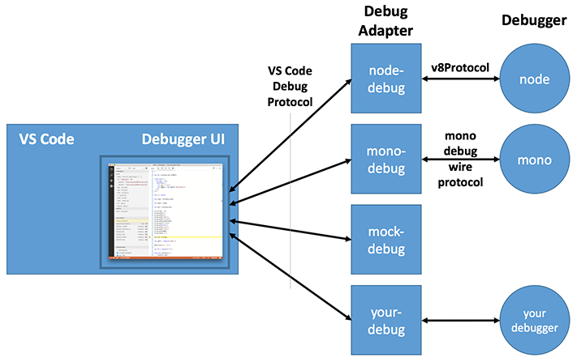

<a href="../../index.html" class="icon icon-home">vscode</a>

-

- [Home](../../index.html)

-

- - Customization
  - [Keyboard shortcuts](../../customization/keyboard-shortcuts/index.html)

-

- - Editor
  - [Accessibility](../../editor/accessibility/index.html)
  - [Codebasics](../../editor/codebasics/index.html)
  - [Command line](../../editor/command-line/index.html)
  - [Debugging](../../editor/debugging/index.html)
  - [Editingevolved](../../editor/editingevolved/index.html)
  - [Emmet](../../editor/emmet/index.html)
  - [Extension gallery](../../editor/extension-gallery/index.html)
  - [Integrated terminal](../../editor/integrated-terminal/index.html)
  - [Intellisense](../../editor/intellisense/index.html)
  - [Tasks appendix](../../editor/tasks-appendix/index.html)
  - [Tasks v1 appendix](../../editor/tasks-v1-appendix/index.html)
  - [Tasks v1](../../editor/tasks-v1/index.html)
  - [Tasks](../../editor/tasks/index.html)
  - [Userdefinedsnippets](../../editor/userdefinedsnippets/index.html)
  - [Versioncontrol](../../editor/versioncontrol/index.html)
  - [Whyvscode](../../editor/whyvscode/index.html)

-

- - extensionAPI
  - [Activation events](../activation-events/index.html)
  - <a href="index.html" class="current">Api debugging</a>
    - [The VS Code Debug Protocol](#the-vs-code-debug-protocol)
    - <a href="#debug-adapter" class="toctree-l4">Debug Adapter</a>
    - <a href="#the-vs-code-debug-protocol-in-a-nutshell" class="toctree-l4">The VS Code Debug Protocol in a Nutshell</a>
    - <a href="#next-steps" class="toctree-l4">Next Steps</a>
  - [Api markdown](../api-markdown/index.html)
  - [Api scm](../api-scm/index.html)
  - [Extension manifest](../extension-manifest/index.html)
  - [Extension points](../extension-points/index.html)
  - [Language support](../language-support/index.html)
  - [Overview](../overview/index.html)
  - [Patterns and principles](../patterns-and-principles/index.html)
  - [Vscode api commands](../vscode-api-commands/index.html)
  - [Vscode api](../vscode-api/index.html)

-

- - Extensions
  - [Debugging extensions](../../extensions/debugging-extensions/index.html)
  - [Example debuggers](../../extensions/example-debuggers/index.html)
  - [Example hello world](../../extensions/example-hello-world/index.html)
  - [Example language server](../../extensions/example-language-server/index.html)
  - [Example word count](../../extensions/example-word-count/index.html)
  - [Overview](../../extensions/overview/index.html)
  - [Publish extension](../../extensions/publish-extension/index.html)
  - [Samples](../../extensions/samples/index.html)
  - [Testing extensions](../../extensions/testing-extensions/index.html)
  - [Themes snippets colorizers](../../extensions/themes-snippets-colorizers/index.html)
  - [Yocode](../../extensions/yocode/index.html)

-

- - Getstarted
  - [Introvideos](../../getstarted/introvideos/index.html)
  - [Keybindings](../../getstarted/keybindings/index.html)
  - [Locales](../../getstarted/locales/index.html)
  - [Settings](../../getstarted/settings/index.html)
  - [Theme color reference](../../getstarted/theme-color-reference/index.html)
  - [Themes](../../getstarted/themes/index.html)
  - [Userinterface](../../getstarted/userinterface/index.html)

-

- - Introvideos
  - [Basics](../../introvideos/basics/index.html)
  - [Codeediting](../../introvideos/codeediting/index.html)
  - [Configure](../../introvideos/configure/index.html)
  - [Debugging](../../introvideos/debugging/index.html)
  - [Extend](../../introvideos/extend/index.html)
  - [Intellisense](../../introvideos/intellisense/index.html)
  - [Quicktour](../../introvideos/quicktour/index.html)
  - [Versioncontrol](../../introvideos/versioncontrol/index.html)

-

- - Languages
  - [Cpp](../../languages/cpp/index.html)
  - [Csharp](../../languages/csharp/index.html)
  - [Css](../../languages/css/index.html)
  - [Dockerfile](../../languages/dockerfile/index.html)
  - [Go](../../languages/go/index.html)
  - [Html](../../languages/html/index.html)
  - [Identifiers](../../languages/identifiers/index.html)
  - [Javascript](../../languages/javascript/index.html)
  - [Jsconfig](../../languages/jsconfig/index.html)
  - [Json](../../languages/json/index.html)
  - [Markdown](../../languages/markdown/index.html)
  - [Overview](../../languages/overview/index.html)
  - [Php](../../languages/php/index.html)
  - [Python](../../languages/python/index.html)
  - [Tsql](../../languages/tsql/index.html)
  - [Typescript](../../languages/typescript/index.html)

-

- - Nodejs
  - [Angular tutorial](../../nodejs/angular-tutorial/index.html)
  - [Extensions](../../nodejs/extensions/index.html)
  - [Javascript transpilers](../../nodejs/javascript-transpilers/index.html)
  - [Nodejs debugging](../../nodejs/nodejs-debugging/index.html)
  - [Nodejs deployment](../../nodejs/nodejs-deployment/index.html)
  - [Nodejs tutorial](../../nodejs/nodejs-tutorial/index.html)
  - [Other javascript runtimes](../../nodejs/other-javascript-runtimes/index.html)
  - [Overview](../../nodejs/overview/index.html)
  - [Reactjs tutorial](../../nodejs/reactjs-tutorial/index.html)
  - [Tasks](../../nodejs/tasks/index.html)

-

- - Other
  - [Dotnet](../../other/dotnet/index.html)
  - [Office](../../other/office/index.html)
  - [Unity](../../other/unity/index.html)

-

- - Setup
  - [Additional components](../../setup/additional-components/index.html)
  - [Linux](../../setup/linux/index.html)
  - [Mac](../../setup/mac/index.html)
  - [Network](../../setup/network/index.html)
  - [Setup overview](../../setup/setup-overview/index.html)
  - [Windows](../../setup/windows/index.html)

-

- - Supporting
  - [Errors](../../supporting/errors/index.html)
  - [Faq](../../supporting/faq/index.html)
  - [Requirements](../../supporting/requirements/index.html)

-

[vscode](../../index.html)

- [Docs](../../index.html) »
- extensionAPI »
- Api debugging
-

---

# The VS Code Debug Protocol

Since Visual Studio Code implements a language agnostic debug UI, it does not communicate directly with real debuggers but instead talks to so-called _debug adapters_ through an abstract wire protocol, the _VS Code Debug Protocol_.

Extensibility of the debug component of VS Code is currently limited to adding new debug adapters. So it is not (yet) possible to extend the debugger UI in similar ways as for example the editor component of VS Code.

## Debug Adapter

A debug adapter is a standalone executable that talks to a real debugger and translates between the VS Code Debug Protocol and the concrete protocol of the debugger. Since a debug adapter can be implemented in the language that is best suited or a given debugger or runtime, the wire protocol is more important than the API of a particular client library that implements that protocol.

You can find the VS Code Debug Protocol specification expressed as a [JSON schema](https://github.com/Microsoft/vscode-debugadapter-node/blob/master/debugProtocol.json) or as a (generated) [TypeScript definition](https://github.com/Microsoft/vscode-debugadapter-node/blob/master/protocol/src/debugProtocol.ts) file in the [`vscode-debugadapter-node`](https://github.com/Microsoft/vscode-debugadapter-node) repository. Both files show the detailed structure of the individual protocol requests, responses and events. The protocol is also available as the NPM module [`vscode-debugprotocol`](https://www.npmjs.com/package/vscode-debugprotocol).

We have implemented client libraries for the VS Code Debug Protocol in TypeScript and C#, but only the JavaScript/TypeScript client library is already available as an NPM module [`vscode-debugadapter-node`](https://github.com/Microsoft/vscode-debugadapter-node). You can find the C# client library in the [Mono Debug](https://github.com/Microsoft/vscode-mono-debug/blob/master/src/DebugSession.cs) repository.

The following debugger extension projects can serve as examples for how to implement debug adapters:

<table><thead><tr class="header"><th>GitHub Project</th><th>Description</th><th>Implementation Language</th></tr></thead><tbody><tr class="odd"><td><a href="https://github.com/Microsoft/vscode-node-debug.git">Node Debug</a></td><td>The built-in v8-based Node.js debugger</td><td>TypeScript/JavaScript</td></tr><tr class="even"><td><a href="https://github.com/Microsoft/vscode-node-debug2.git">Node Debug2</a></td><td>The built-in CDP-based Node.js debugger</td><td>TypeScript/JavaScript</td></tr><tr class="odd"><td><a href="https://github.com/Microsoft/vscode-mono-debug.git">Mono Debug</a></td><td>A simple C# debugger for Mono</td><td>C#</td></tr><tr class="even"><td><a href="https://github.com/Microsoft/vscode-mock-debug.git">Mock Debug</a></td><td>A 'fake' debugger</td><td>TypeScript/JavaScript</td></tr></tbody></table>

## The VS Code Debug Protocol in a Nutshell

In this section we give a high-level overview of the interaction between VS Code and a debug adapter. This should help you in your implementation of a debug adapter based on the VS Code Debug Protocol.

When a debug sessions starts, VS Code launches the debug adapter executable and talks to it through _stdin_ and _stdout_. VS Code sends an **initialize** request to configure the adapter with information about the path format (native or URI) and whether line and column values are 0 or 1 based. If your adapter is derived from the TypeScript or C# default implementation `DebugSession`, you don't have to handle the initialize request yourself.

Depending on the 'request' attribute used in the launch configuration created by the user, VS Code either sends a _launch_ or an _attach_ request. For **launch** the debug adapter has to launch a runtime or program so that it can be debugged. If the program can interact with the user through stdin/stdout, it is important that the debug adapter launches the program in an interactive terminal or console. For **attach** the debug adapter has to attach or connect to an already running program.

Since arguments for both requests are highly dependent on a specific debug adapter implementation, the VS Code Debug Protocol does not prescribe any arguments. Instead VS Code passes all arguments from the user's launch configuration to the _launch_ or _attach_ requests. A schema for IntelliSense and hover information for these attributes can be contributed in the `package.json` of the debug adapter extension. This will guide the user when creating or editing launch configurations.

Since VS Code persists breakpoints on behalf of the debug adapter, it has to register the breakpoints with the debug adapter when a session starts. Since VS Code does not know when is a good time for this, the debug adapter is expected to send an **initialize** event to VS Code to announce that it is ready to accept breakpoint configuration requests.

VS Code will then send all breakpoints by calling these breakpoint configuration requests:

- **setBreakpoints** for every source file with breakpoints,
- **setFunctionBreakpoints** if the debug adapter supports function breakpoints,
- **setExceptionBreakpoints** if the debug adapter supports any exception options,
- **configurationDoneRequest** to indicate the end of the configuration sequence.

So don't forget to send the _initialize_ event when you are ready to accept breakpoints. Otherwise persisted breakpoints are not restored.

The _setBreakpoint_ request sets all breakpoints that exist for a file (so it is not incremental). A simple implementation of this semantics in the debug adapter is to clear all breakpoints for a file and then set the breakpoints specified in the request. _setBreakpoints_ and _setFunctionBreakpoints_ are expected to return the 'actual' breakpoints and VS Code updates the UI dynamically if a breakpoint could not be set at the requested position and was moved by the debugger backend.

Whenever the program stops (on program entry, because a breakpoint was hit, an exception occurred, or the user requested execution to be paused), the debug adapter has to send a **stopped** event with the appropriate reason and thread id. Upon receipt VS Code will first request the **threads** (see below), and then the **stacktrace** (a list of stack frames) for the thread mentioned in the stopped event. If the user then drills into the stack frame, VS Code first requests the **scopes** for a stack frame, and then the **variables** for a scope. If a variable is itself structured, VS Code requests its properties through additional _variables_ requests. This leads to the following hierarchy:

    Threads
       Stackframes
          Scopes
             Variables
                ...
                   Variables

The VS Code debug UI supports multiple threads (but you are probably not aware of this if you are only using the Node.js debugger). Whenever VS Code receives a **stopped** or a **thread** event, VS Code requests all **threads** that exist at that point in time and displays them if there are more than one. If only one thread is detected, the VS Code UI stays in single thread mode. **Thread** events are optional but a debug adapter can send them to force VS Code to update the threads UI dynamically even when not in a stopped state.

After a successful **launch** or **attach** VS Code requests the baseline of currently existing threads with the **threads** request and then starts to listen for **thread** events to detect new or terminated threads. Even if your debug adapter does not support multiple threads, it must implement the **threads** request and return a single (dummy) thread. The id of this thread must be used in all requests where a thread id is required, e.g. **stacktrace**, **pause**, **continue**, **next**, **stepIn**, and **stepOut**.

VS Code terminates a debug session with the **disconnect** request. If the debug target was 'launched' _disconnect_ is expected to terminate the target program (even forcefully if necessary). If the debug target has been 'attached' initially, _disconnect_ should detach it from the target (so that it will continue to run). In both cases and in the case that the target terminated normally or crashed the debug adapter must fire a **terminated** event. After receiving a response from the _disconnect_ request, VS Code will terminate the debug adapter.

## Next Steps

To learn more about VS Code extensibility model, try these topics:

- [Example Debuggers](https://vscode.readthedocs.io/docs/extensions/example-debuggers.md) - See a working 'mock' debugger example
- [Extension API Overview](https://vscode.readthedocs.io/docs/extensionAPI/overview.md) - Learn about the full VS Code extensibility model.
- [Extension Manifest File](https://vscode.readthedocs.io/docs/extensionAPI/extension-manifest.md) - VS Code package.json extension manifest file reference
- [Contribution Points](https://vscode.readthedocs.io/docs/extensionAPI/extension-points.md) - VS Code contribution points reference

<a href="../api-markdown/index.html" class="btn btn-neutral float-right" title="Api markdown">Next </a> <a href="../activation-events/index.html" class="btn btn-neutral" title="Activation events"> Previous</a>

---

  Read the Docs  
