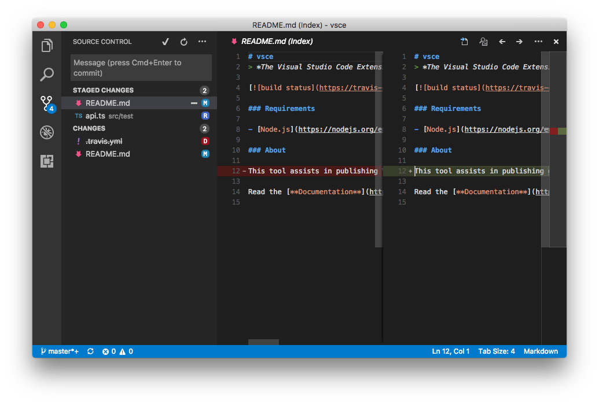
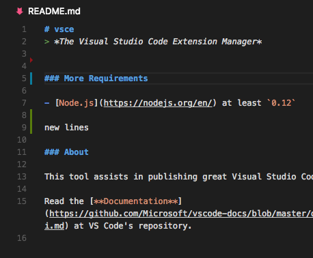

<a href="../../index.html" class="icon icon-home">vscode</a>

-

- [Home](../../index.html)

-

- - Customization
  - [Keyboard shortcuts](../../customization/keyboard-shortcuts/index.html)

-

- - Editor
  - [Accessibility](../../editor/accessibility/index.html)
  - [Codebasics](../../editor/codebasics/index.html)
  - [Command line](../../editor/command-line/index.html)
  - [Debugging](../../editor/debugging/index.html)
  - [Editingevolved](../../editor/editingevolved/index.html)
  - [Emmet](../../editor/emmet/index.html)
  - [Extension gallery](../../editor/extension-gallery/index.html)
  - [Integrated terminal](../../editor/integrated-terminal/index.html)
  - [Intellisense](../../editor/intellisense/index.html)
  - [Tasks appendix](../../editor/tasks-appendix/index.html)
  - [Tasks v1 appendix](../../editor/tasks-v1-appendix/index.html)
  - [Tasks v1](../../editor/tasks-v1/index.html)
  - [Tasks](../../editor/tasks/index.html)
  - [Userdefinedsnippets](../../editor/userdefinedsnippets/index.html)
  - [Versioncontrol](../../editor/versioncontrol/index.html)
  - [Whyvscode](../../editor/whyvscode/index.html)

-

- - extensionAPI
  - [Activation events](../activation-events/index.html)
  - [Api debugging](../api-debugging/index.html)
  - [Api markdown](../api-markdown/index.html)
  - <a href="index.html" class="current">Api scm</a>
    - [Source Control in VS Code](#source-control-in-vs-code)
    - <a href="#source-control-model" class="toctree-l4">Source Control Model</a>
    - <a href="#source-control-view" class="toctree-l4">Source Control View</a>
    - <a href="#quick-diff" class="toctree-l4">Quick Diff</a>
    - <a href="#next-steps" class="toctree-l4">Next Steps</a>
  - [Extension manifest](../extension-manifest/index.html)
  - [Extension points](../extension-points/index.html)
  - [Language support](../language-support/index.html)
  - [Overview](../overview/index.html)
  - [Patterns and principles](../patterns-and-principles/index.html)
  - [Vscode api commands](../vscode-api-commands/index.html)
  - [Vscode api](../vscode-api/index.html)

-

- - Extensions
  - [Debugging extensions](../../extensions/debugging-extensions/index.html)
  - [Example debuggers](../../extensions/example-debuggers/index.html)
  - [Example hello world](../../extensions/example-hello-world/index.html)
  - [Example language server](../../extensions/example-language-server/index.html)
  - [Example word count](../../extensions/example-word-count/index.html)
  - [Overview](../../extensions/overview/index.html)
  - [Publish extension](../../extensions/publish-extension/index.html)
  - [Samples](../../extensions/samples/index.html)
  - [Testing extensions](../../extensions/testing-extensions/index.html)
  - [Themes snippets colorizers](../../extensions/themes-snippets-colorizers/index.html)
  - [Yocode](../../extensions/yocode/index.html)

-

- - Getstarted
  - [Introvideos](../../getstarted/introvideos/index.html)
  - [Keybindings](../../getstarted/keybindings/index.html)
  - [Locales](../../getstarted/locales/index.html)
  - [Settings](../../getstarted/settings/index.html)
  - [Theme color reference](../../getstarted/theme-color-reference/index.html)
  - [Themes](../../getstarted/themes/index.html)
  - [Userinterface](../../getstarted/userinterface/index.html)

-

- - Introvideos
  - [Basics](../../introvideos/basics/index.html)
  - [Codeediting](../../introvideos/codeediting/index.html)
  - [Configure](../../introvideos/configure/index.html)
  - [Debugging](../../introvideos/debugging/index.html)
  - [Extend](../../introvideos/extend/index.html)
  - [Intellisense](../../introvideos/intellisense/index.html)
  - [Quicktour](../../introvideos/quicktour/index.html)
  - [Versioncontrol](../../introvideos/versioncontrol/index.html)

-

- - Languages
  - [Cpp](../../languages/cpp/index.html)
  - [Csharp](../../languages/csharp/index.html)
  - [Css](../../languages/css/index.html)
  - [Dockerfile](../../languages/dockerfile/index.html)
  - [Go](../../languages/go/index.html)
  - [Html](../../languages/html/index.html)
  - [Identifiers](../../languages/identifiers/index.html)
  - [Javascript](../../languages/javascript/index.html)
  - [Jsconfig](../../languages/jsconfig/index.html)
  - [Json](../../languages/json/index.html)
  - [Markdown](../../languages/markdown/index.html)
  - [Overview](../../languages/overview/index.html)
  - [Php](../../languages/php/index.html)
  - [Python](../../languages/python/index.html)
  - [Tsql](../../languages/tsql/index.html)
  - [Typescript](../../languages/typescript/index.html)

-

- - Nodejs
  - [Angular tutorial](../../nodejs/angular-tutorial/index.html)
  - [Extensions](../../nodejs/extensions/index.html)
  - [Javascript transpilers](../../nodejs/javascript-transpilers/index.html)
  - [Nodejs debugging](../../nodejs/nodejs-debugging/index.html)
  - [Nodejs deployment](../../nodejs/nodejs-deployment/index.html)
  - [Nodejs tutorial](../../nodejs/nodejs-tutorial/index.html)
  - [Other javascript runtimes](../../nodejs/other-javascript-runtimes/index.html)
  - [Overview](../../nodejs/overview/index.html)
  - [Reactjs tutorial](../../nodejs/reactjs-tutorial/index.html)
  - [Tasks](../../nodejs/tasks/index.html)

-

- - Other
  - [Dotnet](../../other/dotnet/index.html)
  - [Office](../../other/office/index.html)
  - [Unity](../../other/unity/index.html)

-

- - Setup
  - [Additional components](../../setup/additional-components/index.html)
  - [Linux](../../setup/linux/index.html)
  - [Mac](../../setup/mac/index.html)
  - [Network](../../setup/network/index.html)
  - [Setup overview](../../setup/setup-overview/index.html)
  - [Windows](../../setup/windows/index.html)

-

- - Supporting
  - [Errors](../../supporting/errors/index.html)
  - [Faq](../../supporting/faq/index.html)
  - [Requirements](../../supporting/requirements/index.html)

-

[vscode](../../index.html)

- [Docs](../../index.html) »
- extensionAPI »
- Api scm
-

---

# Source Control in VS Code

Visual Studio Code allows extension authors to define Source Control Management (SCM) features through its extension API. There is a slim, yet powerful API surface which allows many different SCM systems to be integrated in VS Code, while having a common user interface with all of them.

VS Code itself ships with one Source Control provider: Git. This documentation will help you integrate your own SCM system.

Note that you can always refer to the [`vscode` namespace API reference](https://vscode.readthedocs.io/docs/extensionAPI/vscode-api.md#scm) in our documentation.

## Source Control Model

An `SourceControl` is the entity responsible for populating the Source Control model with **resource states**, instances of `SourceControlResourceState`. Resource states are themselves organized in **groups**, instances of `SourceControlResourceGroup`.

You can create a new SourceControl with `vscode.scm.createSourceControl`.

In order to better understand how these three entities correlate with each other, let's take [Git](https://github.com/Microsoft/vscode/tree/master/extensions/git) as an example. Consider the following output of `git status`:

    vsce master* → git status
    On branch master
    Your branch is up-to-date with 'origin/master'.
    Changes to be committed:
      (use "git reset HEAD <file>..." to unstage)

            modified:   README.md
            renamed:    src/api.ts -> src/test/api.ts

    Changes not staged for commit:
      (use "git add/rm <file>..." to update what will be committed)
      (use "git checkout -- <file>..." to discard changes in working directory)

            deleted:    .travis.yml
            modified:   README.md

There are many things going on in this workspace. First, the `README.md` file has been modified, staged and then modified once again. Second, the `src/api.ts` file has been moved to `src/test/api.ts` and that move was staged. Finally, the `.travis.yml` file has been deleted.

For this workspace, Git defines two resource groups: the **working tree** and the **index**. Each **file change** within that group is **resource state**:

- **Index** - resource group
- `README.md`, modified - resource state
- `src/test/api.ts`, renamed from `src/api.ts` - resource state
- **Working Tree** - resource group
- `.travis.yml`, deleted - resource state
- `README.md`, modified - resource state

Note how the same file, `README.md`, is part of two distinct resource states.

Here's how Git creates this model:

    function createResourceUri(relativePath: string): vscode.Uri {
      const absolutePath = path.join(vscode.workspace.rootPath, relativePath);
      return vscode.Uri.file(absolutePath);
    }

    const gitSCM = vscode.scm.createSourceControl('git', "Git");

    const index = gitSCM.createResourceGroup('index', "Index");
    index.resourceStates = [
      { resourceUri: createResourceUri('README.md') },
      { resourceUri: createResourceUri('src/test/api.ts') }
    ];

    const workingTree = gitSCM.createResourceGroup('workingTree', "Changes");
    workingTree.resourceStates = [
      { resourceUri: createResourceUri('.travis.yml') },
      { resourceUri: createResourceUri('README.md') }
    ];

Changes made to the source control and resource groups will be propagated to the Source Control view.

## Source Control View

VS Code is able to populate the Source Control view, as the Source Control model changes. Resource states are customizable using `SourceControlResourceDecorations`:

    export interface SourceControlResourceState {
      readonly decorations?: SourceControlResourceDecorations;
    }

The previous example would be sufficient to populate a simple list in the Source Control view, but there are many user interactions that the user might want to perform with each resource. For instance, what happens when the user clicks a resource state? The resource state can optionally provide a command to handle this action:

    export interface SourceControlResourceState {
      readonly command?: Command;
    }

### Menus

There are three Source Control menu ids where you can place menu items, in order to provide the user with a much richer user interface.

The `scm/title` menu is located to the right of the SCM view title. The menu items in the `navigation` group will be inline, while all the others will be within the `…` dropdown.

The `scm/resourceGroup/context` and `scm/resourceState/context` are similar. The former will let you customize resource groups, while the later refers to resource states. Place menu items in the `inline` group to have them inline. All other menu item groups will be represented in a context menu usually accessible using the mouse right-click. Commands called from within these menus will have the respective resource states on passed as arguments. Note that the SCM view supports multiple selection thus a command might receive more than one resource at a time in its arguments.

For example, Git supports staging multiple files by adding the `git.stage` command to the `scm/resourceState/context` menu and using such a method declaration:

    stage(...resourceStates: SourceControlResourceState[]): Promise<void>;

When creating them, `SourceControl` and `SourceControlResourceGroup` instances require you to provide an `id` string. These values will be populated in the `scmProvider` and `scmResourceGroup` context keys, respectively. You can rely on these context keys in the `when` clauses of your menu items. Here's how Git is able to show a menu item for its `git.stage` command:

    {
      "command": "git.stage",
      "when": "scmProvider == git && scmResourceGroup == merge",
      "group": "inline"
    }

### SCM Input Box

The Source Control Input Box, located atop of each Source Control view, allows the user to input a message. You can get (and set) this message in order to perform operations. In Git, for example, this is used as the commit box, in which users type in commit messages and `git commit` commands pick them up.

    export interface SourceControlInputBox {
      value: string;
    }

    export interface SourceControl {
      readonly inputBox: SourceControlInputBox;
    }

The user can type Ctrl+Enter (or Cmd+Enter on macOS) to accept any message. You can handle this event by providing a `acceptInputCommand` to your `SourceControl` instance.

    export interface SourceControl {
      readonly acceptInputCommand?: Command;
    }

## Quick Diff

VS Code also supports displaying **quick diff** editor gutter decorations.

These decorations are computed by VS Code itself. All you need to do is provide VS Code with the original contents of any given file.

    export interface SourceControl {
      quickDiffProvider?: QuickDiffProvider;
    }

Using a `QuickDiffProvider`, your implementation is able to tell VS Code what's the `Uri` of the original resource that matches the resource which `Uri` is provided as an argument.

You can combine this API with the [`registerTextDocumentContentProvider` method in the `workspace` namespace](https://vscode.readthedocs.io/docs/extensionAPI/vscode-api.md#workspace), which lets you provide contents for arbitrary resources, given a `Uri`.

## Next Steps

To learn more about VS Code extensibility model, try these topics:

- [SCM API Reference](https://vscode.readthedocs.io/docs/extensionAPI/vscode-api.md#scm) - Read the full SCM API documentation
- [Git Extension](https://github.com/Microsoft/vscode/tree/master/extensions/git) - Learn by reading the Git extension implementation
- [Extension API Overview](https://vscode.readthedocs.io/docs/extensionAPI/overview.md) - Learn about the full VS Code extensibility model.
- [Extension Manifest File](https://vscode.readthedocs.io/docs/extensionAPI/extension-manifest.md) - VS Code package.json extension manifest file reference
- [Contribution Points](https://vscode.readthedocs.io/docs/extensionAPI/extension-points.md) - VS Code contribution points reference

<a href="../extension-manifest/index.html" class="btn btn-neutral float-right" title="Extension manifest">Next </a> <a href="../api-markdown/index.html" class="btn btn-neutral" title="Api markdown"> Previous</a>

---

  Read the Docs  
