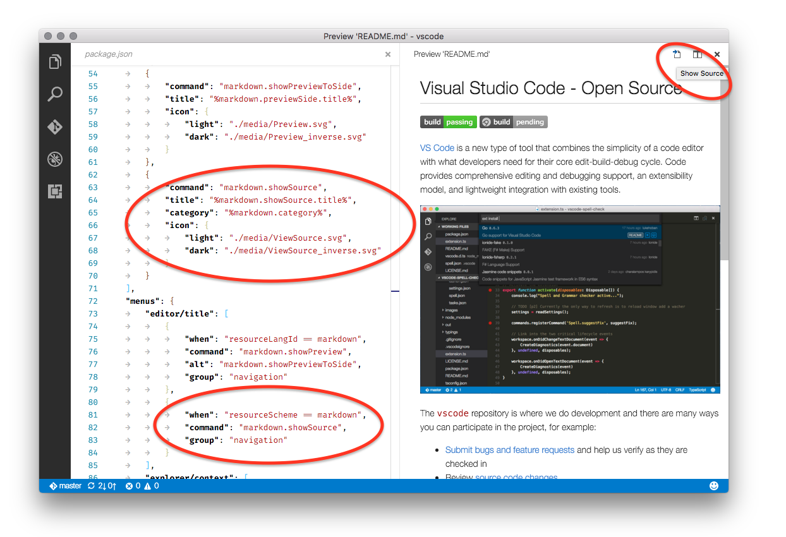
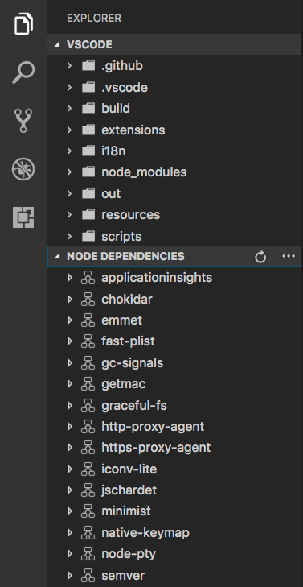

<a href="../../index.html" class="icon icon-home">vscode</a>

-

- [Home](../../index.html)

-

- - Customization
  - [Keyboard shortcuts](../../customization/keyboard-shortcuts/index.html)

-

- - Editor
  - [Accessibility](../../editor/accessibility/index.html)
  - [Codebasics](../../editor/codebasics/index.html)
  - [Command line](../../editor/command-line/index.html)
  - [Debugging](../../editor/debugging/index.html)
  - [Editingevolved](../../editor/editingevolved/index.html)
  - [Emmet](../../editor/emmet/index.html)
  - [Extension gallery](../../editor/extension-gallery/index.html)
  - [Integrated terminal](../../editor/integrated-terminal/index.html)
  - [Intellisense](../../editor/intellisense/index.html)
  - [Tasks appendix](../../editor/tasks-appendix/index.html)
  - [Tasks v1 appendix](../../editor/tasks-v1-appendix/index.html)
  - [Tasks v1](../../editor/tasks-v1/index.html)
  - [Tasks](../../editor/tasks/index.html)
  - [Userdefinedsnippets](../../editor/userdefinedsnippets/index.html)
  - [Versioncontrol](../../editor/versioncontrol/index.html)
  - [Whyvscode](../../editor/whyvscode/index.html)

-

- - extensionAPI
  - [Activation events](../activation-events/index.html)
  - [Api debugging](../api-debugging/index.html)
  - [Api markdown](../api-markdown/index.html)
  - [Api scm](../api-scm/index.html)
  - [Extension manifest](../extension-manifest/index.html)
  - <a href="index.html" class="current">Extension points</a>
    - [Contribution Points - package.json](#contribution-points-packagejson)
    - <a href="#contributesconfiguration" class="toctree-l4">contributes.configuration</a>
    - <a href="#contributesconfigurationdefaults" class="toctree-l4">contributes.configurationDefaults</a>
    - <a href="#contributescommands" class="toctree-l4">contributes.commands</a>
    - <a href="#contributesmenus" class="toctree-l4">contributes.menus</a>
    - <a href="#contributeskeybindings" class="toctree-l4">contributes.keybindings</a>
    - <a href="#contributeslanguages" class="toctree-l4">contributes.languages</a>
    - <a href="#contributesdebuggers" class="toctree-l4">contributes.debuggers</a>
    - <a href="#contributesbreakpoints" class="toctree-l4">contributes.breakpoints</a>
    - <a href="#contributesgrammars" class="toctree-l4">contributes.grammars</a>
    - <a href="#contributesthemes" class="toctree-l4">contributes.themes</a>
    - <a href="#contributessnippets" class="toctree-l4">contributes.snippets</a>
    - <a href="#contributesjsonvalidation" class="toctree-l4">contributes.jsonValidation</a>
    - <a href="#contributesviews" class="toctree-l4">contributes.views</a>
    - <a href="#contributesproblemmatchers" class="toctree-l4">contributes.problemMatchers</a>
    - <a href="#contributesproblempatterns" class="toctree-l4">contributes.problemPatterns</a>
    - <a href="#next-steps" class="toctree-l4">Next Steps</a>
  - [Language support](../language-support/index.html)
  - [Overview](../overview/index.html)
  - [Patterns and principles](../patterns-and-principles/index.html)
  - [Vscode api commands](../vscode-api-commands/index.html)
  - [Vscode api](../vscode-api/index.html)

-

- - Extensions
  - [Debugging extensions](../../extensions/debugging-extensions/index.html)
  - [Example debuggers](../../extensions/example-debuggers/index.html)
  - [Example hello world](../../extensions/example-hello-world/index.html)
  - [Example language server](../../extensions/example-language-server/index.html)
  - [Example word count](../../extensions/example-word-count/index.html)
  - [Overview](../../extensions/overview/index.html)
  - [Publish extension](../../extensions/publish-extension/index.html)
  - [Samples](../../extensions/samples/index.html)
  - [Testing extensions](../../extensions/testing-extensions/index.html)
  - [Themes snippets colorizers](../../extensions/themes-snippets-colorizers/index.html)
  - [Yocode](../../extensions/yocode/index.html)

-

- - Getstarted
  - [Introvideos](../../getstarted/introvideos/index.html)
  - [Keybindings](../../getstarted/keybindings/index.html)
  - [Locales](../../getstarted/locales/index.html)
  - [Settings](../../getstarted/settings/index.html)
  - [Theme color reference](../../getstarted/theme-color-reference/index.html)
  - [Themes](../../getstarted/themes/index.html)
  - [Userinterface](../../getstarted/userinterface/index.html)

-

- - Introvideos
  - [Basics](../../introvideos/basics/index.html)
  - [Codeediting](../../introvideos/codeediting/index.html)
  - [Configure](../../introvideos/configure/index.html)
  - [Debugging](../../introvideos/debugging/index.html)
  - [Extend](../../introvideos/extend/index.html)
  - [Intellisense](../../introvideos/intellisense/index.html)
  - [Quicktour](../../introvideos/quicktour/index.html)
  - [Versioncontrol](../../introvideos/versioncontrol/index.html)

-

- - Languages
  - [Cpp](../../languages/cpp/index.html)
  - [Csharp](../../languages/csharp/index.html)
  - [Css](../../languages/css/index.html)
  - [Dockerfile](../../languages/dockerfile/index.html)
  - [Go](../../languages/go/index.html)
  - [Html](../../languages/html/index.html)
  - [Identifiers](../../languages/identifiers/index.html)
  - [Javascript](../../languages/javascript/index.html)
  - [Jsconfig](../../languages/jsconfig/index.html)
  - [Json](../../languages/json/index.html)
  - [Markdown](../../languages/markdown/index.html)
  - [Overview](../../languages/overview/index.html)
  - [Php](../../languages/php/index.html)
  - [Python](../../languages/python/index.html)
  - [Tsql](../../languages/tsql/index.html)
  - [Typescript](../../languages/typescript/index.html)

-

- - Nodejs
  - [Angular tutorial](../../nodejs/angular-tutorial/index.html)
  - [Extensions](../../nodejs/extensions/index.html)
  - [Javascript transpilers](../../nodejs/javascript-transpilers/index.html)
  - [Nodejs debugging](../../nodejs/nodejs-debugging/index.html)
  - [Nodejs deployment](../../nodejs/nodejs-deployment/index.html)
  - [Nodejs tutorial](../../nodejs/nodejs-tutorial/index.html)
  - [Other javascript runtimes](../../nodejs/other-javascript-runtimes/index.html)
  - [Overview](../../nodejs/overview/index.html)
  - [Reactjs tutorial](../../nodejs/reactjs-tutorial/index.html)
  - [Tasks](../../nodejs/tasks/index.html)

-

- - Other
  - [Dotnet](../../other/dotnet/index.html)
  - [Office](../../other/office/index.html)
  - [Unity](../../other/unity/index.html)

-

- - Setup
  - [Additional components](../../setup/additional-components/index.html)
  - [Linux](../../setup/linux/index.html)
  - [Mac](../../setup/mac/index.html)
  - [Network](../../setup/network/index.html)
  - [Setup overview](../../setup/setup-overview/index.html)
  - [Windows](../../setup/windows/index.html)

-

- - Supporting
  - [Errors](../../supporting/errors/index.html)
  - [Faq](../../supporting/faq/index.html)
  - [Requirements](../../supporting/requirements/index.html)

-

[vscode](../../index.html)

- [Docs](../../index.html) »
- extensionAPI »
- Extension points
-

---

# Contribution Points - package.json

This document covers the various contribution points that are defined in the [`package.json` extension manifest](https://vscode.readthedocs.io/docs/extensionAPI/extension-manifest.md).

- [`configuration`](https://vscode.readthedocs.io/docs/extensionAPI/extension-points.md#contributesconfiguration)
- [`commands`](https://vscode.readthedocs.io/docs/extensionAPI/extension-points.md#contributescommands)
- [`menus`](https://vscode.readthedocs.io/docs/extensionAPI/extension-points.md#contributesmenus)
- [`keybindings`](https://vscode.readthedocs.io/docs/extensionAPI/extension-points.md#contributeskeybindings)
- [`languages`](https://vscode.readthedocs.io/docs/extensionAPI/extension-points.md#contributeslanguages)
- [`debuggers`](https://vscode.readthedocs.io/docs/extensionAPI/extension-points.md#contributesdebuggers)
- [`breakpoints`](https://vscode.readthedocs.io/docs/extensionAPI/extension-points.md#contributesbreakpoints)
- [`grammars`](https://vscode.readthedocs.io/docs/extensionAPI/extension-points.md#contributesgrammars)
- [`themes`](https://vscode.readthedocs.io/docs/extensionAPI/extension-points.md#contributesthemes)
- [`snippets`](https://vscode.readthedocs.io/docs/extensionAPI/extension-points.md#contributessnippets)
- [`jsonValidation`](https://vscode.readthedocs.io/docs/extensionAPI/extension-points.md#contributesjsonvalidation)
- [`views`](https://vscode.readthedocs.io/docs/extensionAPI/extension-points.md#contributesviews)
- [`problemMatchers`](https://vscode.readthedocs.io/docs/extensionAPI/extension-points.md#contributesproblemmatchers)
- [`problemPatterns`](https://vscode.readthedocs.io/docs/extensionAPI/extension-points.md#contributesproblempatterns)

## contributes.configuration

Contribute configuration keys that will be exposed to the user. The user will be able to set these configuration options either from User Settings or from the Workspace Settings.

When contributing configuration keys, a JSON schema describing these keys is actually contributed. This ensures the user gets great tooling support when authoring VS Code settings files.

You can read these values from your extension using `vscode.workspace.getConfiguration('myExtension')`.

### Example

    "contributes": {
        "configuration": {
            "type": "object",
            "title": "TypeScript configuration",
            "properties": {
                "typescript.useCodeSnippetsOnMethodSuggest": {
                    "type": "boolean",
                    "default": false,
                    "description": "Complete functions with their parameter signature."
                },
                "typescript.tsdk": {
                    "type": ["string", "null"],
                    "default": null,
                    "description": "Specifies the folder path containing the tsserver and lib*.d.ts files to use."
                }
            }
        }
    }

## contributes.configurationDefaults

Contribute default language specific editor configurations. This will override default editor configurations for the provided language.

The following example contributes default editor configurations for the `markdown` language:

### Example

    "contributes": {
        "configurationDefaults": {
            "[markdown]": {
                "editor.wordWrap": "on",
                "editor.quickSuggestions": false
            }
        }
    }

## contributes.commands

Contribute an entry consisting of a title and a command to invoke to the Command Palette (`kb(workbench.action.showCommands)`).

> **Note:** When a command is invoked (from a key binding or from the Command Palette), VS Code will emit an activationEvent `onCommand:${command}`.

### Example

    "contributes": {
        "commands": [{
            "command": "extension.sayHello",
            "title": "Hello World"
        }]
    }

## contributes.menus

Contribute a menu item for a command to the editor or Explorer. The menu item definition contains the command that should be invoked when selected and the condition under which the item should show. The latter is defined with the `when` clause which uses the key bindings [when clause contexts](https://vscode.readthedocs.io/docs/getstarted/keybindings.md#when-clause-contexts). In addition to the mandatory `command` property, an alternative command can be defined using the `alt`-property. It will be shown and invoked when pressing `kbstyle(Alt)` while hovering over a menu item. Last, a `group`-property defines sorting and grouping of menu items. The `navigation` group is special as it will always be sorted to the top/beginning of a menu.

Currently extension writers can contribute to:

- The global Command Palette - `commandPalette`
- The Explorer context menu - `explorer/context`
- The editor context menu - `editor/context`
- The editor title menu bar - `editor/title`
- The editor title context menu - `editor/title/context`
- The debug callstack view context menu - `debug/callstack/context`
- The [SCM title menu](https://vscode.readthedocs.io/docs/extensionAPI/api-scm.md#menus) - `scm/title`
- [SCM resource groups](https://vscode.readthedocs.io/docs/extensionAPI/api-scm.md#menus) menus - `scm/resourceGroup/context`
- [SCM resources](https://vscode.readthedocs.io/docs/extensionAPI/api-scm.md#menus) menus - `scm/resource/context`
- The [View title menu](https://vscode.readthedocs.io/docs/extensionAPI/extension-points.md#contributesviews) - `view/title`
- The [View item menu](https://vscode.readthedocs.io/docs/extensionAPI/extension-points.md#contributesviews) - `view/item/context`

> **Note:** When a command is invoked from a (context) menu, VS Code tries to infer the currently selected resource and passes that as a parameter when invoking the command. For instance, a menu item inside the Explorer is passed the URI of the selected resource and a menu item inside an editor is passed the URI of the document.

In addition to a title, commands can also define icons which VS Code will show in the editor title menu bar.

### Example

    "contributes": {
        "menus": {
            "editor/title": [{
                "when": "resourceLangId == markdown",
                "command": "markdown.showPreview",
                "alt": "markdown.showPreviewToSide",
                "group": "navigation"
            }]
        }
    }

### Context specific visibility of Command Palette menu items

When registering commands in `package.json`, they will automatically be shown in the **Command Palette** (`kb(workbench.action.showCommands)`). To allow more control over command visibility, there is the `commandPalette` menu item. It allows you to define a `when` condition to control if a command should be visible in the **Command Palette** or not.

The snippet below makes the 'Hello World' command only visible in the **Command Palette** when something is selected in the editor:

    "commands": [{
        "command": "extension.sayHello",
        "title": "Hello World"
    }],
    "menus": {
        "commandPalette": [{
            "command": "extension.sayHello",
            "when": "editorHasSelection"
        }]
    }

### Sorting of groups

Menu items can be sorted into groups. They are sorted in lexicographical order with the following defaults/rules.

The context menu of the editor has these default:

- `navigation` - The `navigation` group comes first in all cases.
- `1_modification` - This group comes next and contains commands that modify your code.
- `9_cutcopypaste` - The last default group with the basic editing commands.

You can add menu items to these groups or add new groups of menu items in between, below, or above. Only the editor context menu allows this grouping control.

### Sorting inside groups

The order inside a group depends on the title or an order-attribute. The group-local order of a menu item is specified by appending `@<number>` to the group identifier as shown below:

    "editor/title": [{
        "when": "editorHasSelection",
        "command": "extension.Command",
        "group": "myGroup@1"
    }]

## contributes.keybindings

Contribute a key binding rule defining what command should be invoked when the user presses a key combination. See the [Key Bindings](https://vscode.readthedocs.io/docs/getstarted/keybindings.md) topic where key bindings are explained in detail.

Contributing a key binding will cause the Default Keyboard Shortcuts to display your rule, and every UI representation of the command will now show the key binding you have added. And, of course, when the user presses the key combination the command will be invoked.

> **Note:** Because VS Code runs on Windows, Mac and Linux, where modifiers differ, you can use "key" to set the default key combination and overwrite it with a specific platform.
>
> **Note:** When a command is invoked (from a key binding or from the Command Palette), VS Code will emit an activationEvent `onCommand:${command}`.

### Example

Defining that `kbstyle(Ctrl+F1)` under Windows and Linux and `kbstyle(Cmd+F1)` under Mac trigger the `"extension.sayHello"` command:

    "contributes": {
        "keybindings": [{
            "command": "extension.sayHello",
            "key": "ctrl+f1",
            "mac": "cmd+f1",
            "when": "editorTextFocus"
        }]
    }

## contributes.languages

Contribute the definition of a language. This will introduce a new language or enrich the knowledge VS Code has about a language.

In this context, a language is basically a string identifier that is associated to a file (See `TextDocument.getLanguageId()`).

VS Code uses three hints to determine the language a file will be associated with. Each "hint" can be enriched independently:

1.  the extension of the filename (`extensions` below)
2.  the filename (`filenames` below)
3.  the first line inside the file (`firstLine` below)

When a file is opened by the user, these three rules are applied and a language is determined. VS Code will then emit an activationEvent `onLanguage:${language}` (e.g. `onLanguage:python` for the example below)

The `aliases` property contains human readable names under which the language is known. The first item in this list will be picked as the language label (as rendered in the status bar on the right).

The `configuration` property specifies a path to the language configuration file. The path is relative to the extension folder, and is typically `./language-configuration.json`. The file uses the JSON format and can contain the following properties:

- `comments` - Defines the comment symbols
- `blockComment` - The begin and end token used to mark a block comment. Used by the 'Toggle Block Comment' command.
- `lineComment` - The begin token used to mark a line comment. Used by the 'Add Line Comment' command.
- `brackets` - Defines the bracket symbols that influence the indentation of code between the brackets. Used by the editor to determine or correct the new indentation level when entering a new line.
- `autoClosingPairs` - Defines the open and close symbols for the auto-close functionality. When an open symbol is entered, the editor will insert the close symbol automatically. Auto closing pairs optionally take a `notIn` parameter to deactivate a pair inside strings or comments.
- `surroundingPairs` - Defines the open and close pairs used to surround a selected string.

If your language configuration file name is or ends with `language-configuration.json`, you will get validation and editing support in VS Code.

### Example

    ...
    "contributes": {
        "languages": [{
            "id": "python",
            "extensions": [ ".py" ],
            "aliases": [ "Python", "py" ],
            "filenames": [ ... ],
            "firstLine": "^#!/.*\\bpython[0-9.-]*\\b",
            "configuration": "./language-configuration.json"
        }]
    }

language-configuration.json

    {
        "comments": {
            "lineComment": "//",
            "blockComment": [ "/*", "*/" ]
        },
        "brackets": [
            ["{", "}"],
            ["[", "]"],
            ["(", ")"]
        ],
        "autoClosingPairs": [
            ["{", "}"],
            ["[", "]"],
            ["(", ")"],
            { "open": "'", "close": "'", "notIn": ["string", "comment"] },
            { "open": "/**", "close": " */", "notIn": ["string"] }
        ],
        "surroundingPairs": [
            ["{", "}"],
            ["[", "]"],
            ["(", ")"],
            ["<", ">"],
            ["'", "'"]
        ]
    }

## contributes.debuggers

Contribute a debugger to VS Code. A debugger contribution has the following properties:

- `type` is a unique ID that is used to identify this debugger in a launch configuration.
- `label` is the user visible name of this debugger in the UI.
- `program` the path to the debug adapter that implements the VS Code debug protocol against the real debugger or runtime.
- `runtime` if the path to the debug adapter is not an executable but needs a runtime.
- `configurationAttributes` is the schema for launch configuration arguments specific to this debugger.
- `initialConfigurations` lists launch configurations that are used to populate an initial launch.json.
- `configurationSnippets` lists launch configurations that are available through IntelliSense when editing a launch.json.
- `variables` introduces substitution variables and binds them to commands implemented by the debugger extension.
- `languages` those languages for which the debug extension could be considered the "default debugger".
- `adapterExecutableCommand` the command ID where the debug adapters executable path and arguments are dynamically calculated. The command returns a structure with this format: `json command: "<executable>", args: [ "<argument1>", "<argument2>", ... ]` The attribute `command` must be a either an absolute path to an executable or a name of executable looked up via the PATH environment variable. The special value `node` will be mapped to VS Code's built-in node runtime without being looked up on the PATH.

### Example

    "contributes": {
        "debuggers": [{
            "type": "node",
            "label": "Node Debug",

            "program": "./out/node/nodeDebug.js",
            "runtime": "node",

            "languages": ["javascript", "typescript", "javascriptreact", "typescriptreact"],

            "configurationAttributes": {
                "launch": {
                    "required": [ "program" ],
                    "properties": {
                        "program": {
                            "type": "string",
                            "description": "The program to debug."
                        }
                    }
                }
            },

            "initialConfigurations": [{
                "type": "node",
                "request": "launch",
                "name": "Launch Program",
                "program": "${workspaceRoot}/app.js"
            }],

            "configurationSnippets": [
                {
                    "label": "Node.js: Attach Configuration",
                    "description": "A new configuration for attaching to a running node program.",
                    "body": {
                        "type": "node",
                        "request": "attach",
                        "name": "${2:Attach to Port}",
                        "port": 5858
                    }
                }
            ],

            "variables": {
                "PickProcess": "extension.node-debug.pickNodeProcess"
            }
        }]
    }

For a full walkthrough on how to integrate a `debugger` go to [Debuggers](https://vscode.readthedocs.io/docs/extensions/example-debuggers.md).

## contributes.breakpoints

Usually a debugger extension will also have a `contributes.breakpoints` entry where the extension lists the language file types for which setting breakpoints will be enabled.

    "contributes": {
        "breakpoints": [
            {
                "language": "javascript"
            },
            {
                "language": "javascriptreact"
            }
        ]
    }

## contributes.grammars

Contribute a TextMate grammar to a language. You must provide the `language` this grammar applies to, the TextMate `scopeName` for the grammar and the file path.

> **Note:** The file containing the grammar can be in JSON (filenames ending in .json) or in XML plist format (all other files).

### Example

    "contributes": {
        "grammars": [{
            "language": "shellscript",
            "scopeName": "source.shell",
            "path": "./syntaxes/Shell-Unix-Bash.tmLanguage"
        }]
    }

See [Adding Language Colorization](https://vscode.readthedocs.io/docs/extensions/themes-snippets-colorizers.md) for instructions on using the [yo code extension generator](https://vscode.readthedocs.io/docs/extensions/yocode.md) to quickly package TextMate .tmLanguage files as VS Code extensions.

## contributes.themes

Contribute a TextMate theme to VS Code. You must specify a label, whether the theme is a dark theme or a light theme (such that the rest of VS Code changes to match your theme) and the path to the file (XML plist format).

### Example

    "contributes": {
        "themes": [{
            "label": "Monokai",
            "uiTheme": "vs-dark",
            "path": "./themes/Monokai.tmTheme"
        }]
    }

See [Changing the Color Theme](https://vscode.readthedocs.io/docs/extensions/themes-snippets-colorizers.md) for instructions on using the [yo code extension generator](https://vscode.readthedocs.io/docs/extensions/yocode.md) to quickly package TextMate .tmTheme files as VS Code extensions.

## contributes.snippets

    "contributes": {
        "snippets": [{
            "language": "go",
            "path": "./snippets/go.json"
        }]
    }

## contributes.jsonValidation

Contribute a validation schema for a specific type of `json` file. The `url` value can be either a local path to a schema file included in the extension or a remote server URL such as a [json schema store](http://schemastore.org/json).

    "contributes": {
        "jsonValidation": [{
            "fileMatch": ".jshintrc",
            "url": "http://json.schemastore.org/jshintrc"
        }]
    }

## contributes.views

Contribute a view to VS Code. You must specify an identifier and name for the view. You can contribute to following locations:

- `explorer`: Explorer view in the Side Bar
- `debug`: Debug view in the Side Bar

When the user opens the view, VS Code will then emit an activationEvent `onView:${viewId}` (e.g. `onView:nodeDependencies` for the example below). You can also control the visibility of the view by providing the `when` context value.

    "contributes": {
        "views": {
            "explorer": [
                {
                    "id": "nodeDependencies",
                    "name": "Node Dependencies",
                    "when": "workspaceHasPackageJSON"
                }
            ]
        }
    }

Extension writers should register a [provider](https://vscode.readthedocs.io/docs/extensionAPI/vscode-api.md#TreeDataProvider) programmatically to populate data in the view. Refer to examples [here](https://github.com/Microsoft/vscode-extension-samples/tree/master/tree-view-sample).

## contributes.problemMatchers

Contribute problem matcher patterns. These contributions work in both the output panel runner and in the terminal runner. Below is an example to contribute a problem matcher for the gcc compiler in an extension:

    "contributes": {
        "problemMatchers": [
            {
                "name": "gcc",
                "owner": "cpp",
                "fileLocation": ["relative", "${workspaceRoot}"],
                "pattern": {
                    "regexp": "^(.*):(\\d+):(\\d+):\\s+(warning|error):\\s+(.*)$",
                    "file": 1,
                    "line": 2,
                    "column": 3,
                    "severity": 4,
                    "message": 5
                }
            }
        ]
    }

This problem matcher can now be used in a `tasks.json` file via a name reference `$gcc`. An example looks like this:

    {
        "version": "0.1.0",
        "command": "gcc",
        "args": ["-Wall", "helloWorld.c", "-o", "helloWorld"],
        "problemMatcher": "$gcc"
    }

Also see: [Defining a Problem Matcher](https://vscode.readthedocs.io/docs/editor/tasks.md#defining-a-problem-matcher)

## contributes.problemPatterns

Contributes named problem patterns that can be used in problem matchers (see above).

## Next Steps

To learn more about VS Code extensibility model, try these topic:

- [Extension Manifest File](https://vscode.readthedocs.io/docs/extensionAPI/extension-manifest.md) - VS Code package.json extension manifest file reference
- [Activation Events](https://vscode.readthedocs.io/docs/extensionAPI/activation-events.md) - VS Code activation events reference

<a href="../language-support/index.html" class="btn btn-neutral float-right" title="Language support">Next </a> <a href="../extension-manifest/index.html" class="btn btn-neutral" title="Extension manifest"> Previous</a>

---

  Read the Docs  
