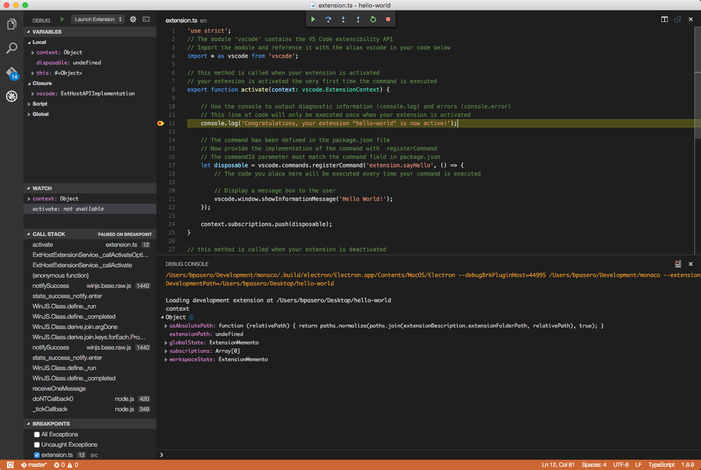

<a href="../../index.html" class="icon icon-home">vscode</a>

-

- [Home](../../index.html)

-

- - Customization
  - [Keyboard shortcuts](../../customization/keyboard-shortcuts/index.html)

-

- - Editor
  - [Accessibility](../../editor/accessibility/index.html)
  - [Codebasics](../../editor/codebasics/index.html)
  - [Command line](../../editor/command-line/index.html)
  - [Debugging](../../editor/debugging/index.html)
  - [Editingevolved](../../editor/editingevolved/index.html)
  - [Emmet](../../editor/emmet/index.html)
  - [Extension gallery](../../editor/extension-gallery/index.html)
  - [Integrated terminal](../../editor/integrated-terminal/index.html)
  - [Intellisense](../../editor/intellisense/index.html)
  - [Tasks appendix](../../editor/tasks-appendix/index.html)
  - [Tasks v1 appendix](../../editor/tasks-v1-appendix/index.html)
  - [Tasks v1](../../editor/tasks-v1/index.html)
  - [Tasks](../../editor/tasks/index.html)
  - [Userdefinedsnippets](../../editor/userdefinedsnippets/index.html)
  - [Versioncontrol](../../editor/versioncontrol/index.html)
  - [Whyvscode](../../editor/whyvscode/index.html)

-

- - extensionAPI
  - [Activation events](../../extensionAPI/activation-events/index.html)
  - [Api debugging](../../extensionAPI/api-debugging/index.html)
  - [Api markdown](../../extensionAPI/api-markdown/index.html)
  - [Api scm](../../extensionAPI/api-scm/index.html)
  - [Extension manifest](../../extensionAPI/extension-manifest/index.html)
  - [Extension points](../../extensionAPI/extension-points/index.html)
  - [Language support](../../extensionAPI/language-support/index.html)
  - [Overview](../../extensionAPI/overview/index.html)
  - [Patterns and principles](../../extensionAPI/patterns-and-principles/index.html)
  - [Vscode api commands](../../extensionAPI/vscode-api-commands/index.html)
  - [Vscode api](../../extensionAPI/vscode-api/index.html)

-

- - Extensions
  - <a href="index.html" class="current">Debugging extensions</a>
    - [Running and Debugging Your Extension](#running-and-debugging-your-extension)
    - <a href="#creating-an-extension" class="toctree-l4">Creating an Extension</a>
    - <a href="#running-and-debugging-your-extension_1" class="toctree-l4">Running and Debugging your Extension</a>
    - <a href="#compiling-typescript" class="toctree-l4">Compiling TypeScript</a>
    - <a href="#launching-your-extension" class="toctree-l4">Launching your Extension</a>
    - <a href="#changing-and-reloading-your-extension" class="toctree-l4">Changing and Reloading your Extension</a>
    - <a href="#next-steps" class="toctree-l4">Next Steps</a>
    - <a href="#common-questions" class="toctree-l4">Common Questions</a>
  - [Example debuggers](../example-debuggers/index.html)
  - [Example hello world](../example-hello-world/index.html)
  - [Example language server](../example-language-server/index.html)
  - [Example word count](../example-word-count/index.html)
  - [Overview](../overview/index.html)
  - [Publish extension](../publish-extension/index.html)
  - [Samples](../samples/index.html)
  - [Testing extensions](../testing-extensions/index.html)
  - [Themes snippets colorizers](../themes-snippets-colorizers/index.html)
  - [Yocode](../yocode/index.html)

-

- - Getstarted
  - [Introvideos](../../getstarted/introvideos/index.html)
  - [Keybindings](../../getstarted/keybindings/index.html)
  - [Locales](../../getstarted/locales/index.html)
  - [Settings](../../getstarted/settings/index.html)
  - [Theme color reference](../../getstarted/theme-color-reference/index.html)
  - [Themes](../../getstarted/themes/index.html)
  - [Userinterface](../../getstarted/userinterface/index.html)

-

- - Introvideos
  - [Basics](../../introvideos/basics/index.html)
  - [Codeediting](../../introvideos/codeediting/index.html)
  - [Configure](../../introvideos/configure/index.html)
  - [Debugging](../../introvideos/debugging/index.html)
  - [Extend](../../introvideos/extend/index.html)
  - [Intellisense](../../introvideos/intellisense/index.html)
  - [Quicktour](../../introvideos/quicktour/index.html)
  - [Versioncontrol](../../introvideos/versioncontrol/index.html)

-

- - Languages
  - [Cpp](../../languages/cpp/index.html)
  - [Csharp](../../languages/csharp/index.html)
  - [Css](../../languages/css/index.html)
  - [Dockerfile](../../languages/dockerfile/index.html)
  - [Go](../../languages/go/index.html)
  - [Html](../../languages/html/index.html)
  - [Identifiers](../../languages/identifiers/index.html)
  - [Javascript](../../languages/javascript/index.html)
  - [Jsconfig](../../languages/jsconfig/index.html)
  - [Json](../../languages/json/index.html)
  - [Markdown](../../languages/markdown/index.html)
  - [Overview](../../languages/overview/index.html)
  - [Php](../../languages/php/index.html)
  - [Python](../../languages/python/index.html)
  - [Tsql](../../languages/tsql/index.html)
  - [Typescript](../../languages/typescript/index.html)

-

- - Nodejs
  - [Angular tutorial](../../nodejs/angular-tutorial/index.html)
  - [Extensions](../../nodejs/extensions/index.html)
  - [Javascript transpilers](../../nodejs/javascript-transpilers/index.html)
  - [Nodejs debugging](../../nodejs/nodejs-debugging/index.html)
  - [Nodejs deployment](../../nodejs/nodejs-deployment/index.html)
  - [Nodejs tutorial](../../nodejs/nodejs-tutorial/index.html)
  - [Other javascript runtimes](../../nodejs/other-javascript-runtimes/index.html)
  - [Overview](../../nodejs/overview/index.html)
  - [Reactjs tutorial](../../nodejs/reactjs-tutorial/index.html)
  - [Tasks](../../nodejs/tasks/index.html)

-

- - Other
  - [Dotnet](../../other/dotnet/index.html)
  - [Office](../../other/office/index.html)
  - [Unity](../../other/unity/index.html)

-

- - Setup
  - [Additional components](../../setup/additional-components/index.html)
  - [Linux](../../setup/linux/index.html)
  - [Mac](../../setup/mac/index.html)
  - [Network](../../setup/network/index.html)
  - [Setup overview](../../setup/setup-overview/index.html)
  - [Windows](../../setup/windows/index.html)

-

- - Supporting
  - [Errors](../../supporting/errors/index.html)
  - [Faq](../../supporting/faq/index.html)
  - [Requirements](../../supporting/requirements/index.html)

-

[vscode](../../index.html)

- [Docs](../../index.html) »
- Extensions »
- Debugging extensions
-

---

# Running and Debugging Your Extension

You can use VS Code to develop an extension for VS Code and VS Code provides several tools that simplify extension development:

- Yeoman generators to scaffold an extension
- IntelliSense, hover, and code navigation for the extension API
- Compiling TypeScript (when implementing an extension in TypeScript)
- Running and debugging an extension
- Publishing an extension

## Creating an Extension

We suggest you start your extension by scaffolding out the basic files. You can use the `yo code` Yeoman generator to do this and we cover the details in the [extension generator](https://vscode.readthedocs.io/docs/extensions/yocode.md) topic. The generator will ensure everything is set up so you have a great development experience.

## Running and Debugging your Extension

You can easily run your extension under the debugger by pressing `F5`. This opens a new VS Code window with your extension loaded. Output from your extension shows up in the `Debug Console`. You can set break points, step through your code, and inspect variables either in the `Debug` view or the `Debug Console`.

Let's peek at what is going on behind the scenes. If you are writing your extension in TypeScript then your code must first be compiled to JavaScript.

## Compiling TypeScript

The TypeScript compilation is setup as follows in the generated extension:

- A `tsconfig.json` defines the compile options for the TypeScript compiler. Read more about it at the [TypeScript wiki](https://www.typescriptlang.org/docs/handbook/tsconfig-json.html) or in our [TypeScript Language Section](https://vscode.readthedocs.io/docs/languages/typescript.md#tsconfigjson).
- A TypeScript compiler with the proper version is included inside the node_modules folder.
- The API definition is included in `node_modules/vscode`.

The TypeScript compilation is triggered before running your extension. This is done with the `preLaunchTask` attribute defined in the `.vscode/launch.json` file which declares a task to be executed before starting the debugging session. The task is defined inside the `.vscode/tasks.json` file.

> **Note:** The TypeScript compiler is started in watch mode, so that it compiles the files as you make changes.

## Launching your Extension

Your extension is launched in a new window with the title `Extension Development Host`. This window runs VS Code or more precisely the `Extension Host` with your extension under development.

You can accomplish the same from the command line using the `extensionDevelopmentPath` option. This option tells VS Code in what other locations it should look for extensions, e.g.,

> `code --extensionDevelopmentPath=_my_extension_folder`.

Once the Extension Host is launched, VS Code attaches the debugger to it and starts the debug session.

This is what happens when pressing `F5`:

1.  `.vscode/launch.json` instructs to first run a task named `npm`.
2.  `.vscode/tasks.json` defines the task `npm` as a shell command to `npm run compile`.
3.  `package.json` defines the script `compile` as `tsc -watch -p ./`
4.  This eventually invokes the TypeScript compiler included in node_modules, which generates `out/src/extension.js` and `out/src/extension.js.map`.
5.  Once the TypeScript compilation task is finished, the `code --extensionDevelopmentPath=${workspaceRoot}` process is spawned.
6.  The second instance of VS Code is launched in a special mode and it searches for an extension at `${workspaceRoot}`.

## Changing and Reloading your Extension

Since the TypeScript compiler is run in watch mode, the TypeScript files are automatically compiled as you make changes. You can observe the compilation progress on the left side of the VS Code status bar. On the status bar you can also see the error and warning counts of a compilation. When the compilation is complete with no errors, you must reload the `Extension Development Host` so that it picks up your changes. You have two options to do this:

- Click on the debug restart action to relaunch the Extension Development Host window.
- Press `kbstyle(Ctrl+R)` (Mac: `kbstyle(Cmd+R)`) in the Extension Development Host window.

## Next Steps

- [Testing your Extension](https://vscode.readthedocs.io/docs/extensions/testing-extensions.md) - Learn how to write unit and integration tests for your extension
- [Publishing Tool](https://vscode.readthedocs.io/docs/extensions/publish-extension.md) - Publish your extension with the vsce command line tool.
- [Extension Manifest file](https://vscode.readthedocs.io/docs/extensionAPI/extension-manifest.md) - VS Code extension manifest file reference
- [Extension API](https://vscode.readthedocs.io/docs/extensionAPI/overview.md) - Learn about the VS Code extensibility APIs

## Common Questions

**Q: How can I use API from my extension that was introduced in a newer release of VS Code?**

**A:** If your extension is using an API that was introduced in a newer release of VS Code, you have to declare this dependency in the `engines` field of the `package.json` file of the extension.

Here are the steps:

- Set the minimal version of VS Code that your extension requires in the `engine` field of the `package.json`.
- Make sure your devDependency for the `vscode` module is at least `0.11.0`.
- Add a `postinstall` script to your `package.json` like this:

<!-- -->

    "scripts": {
        "postinstall": "node ./node_modules/vscode/bin/install"
    }

- Type `npm install` from the root of your extension.
- The `vscode` module will download the appropriate version of `vscode.d.ts` based on the `engine` field you declared.
- Go back to VS Code and see how the API for the specific version you chose appears in IntelliSense and validation.

<a href="../example-debuggers/index.html" class="btn btn-neutral float-right" title="Example debuggers">Next </a> <a href="../../extensionAPI/vscode-api/index.html" class="btn btn-neutral" title="Vscode api"> Previous</a>

---

  Read the Docs  
