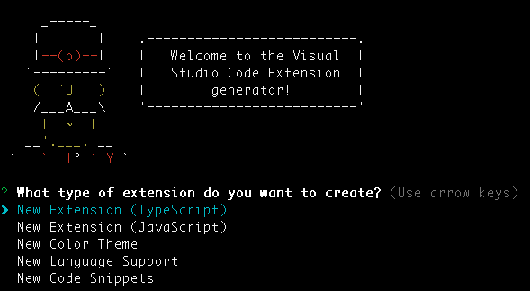
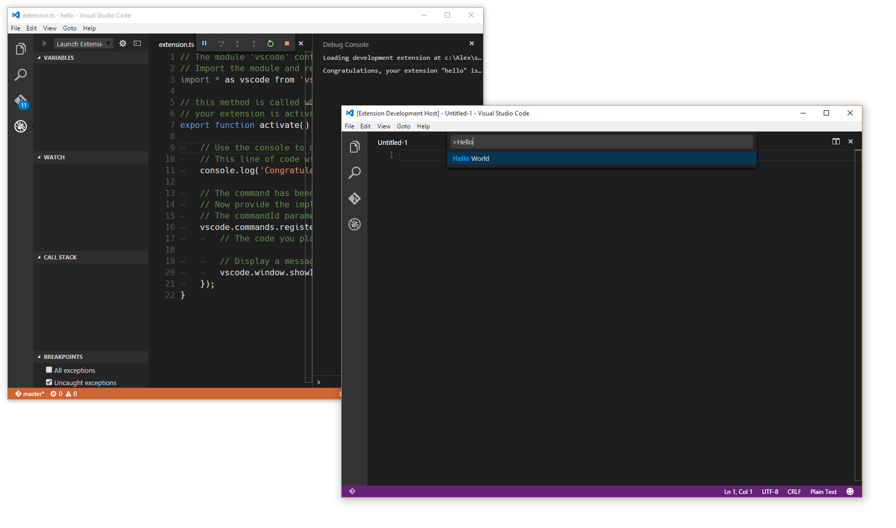
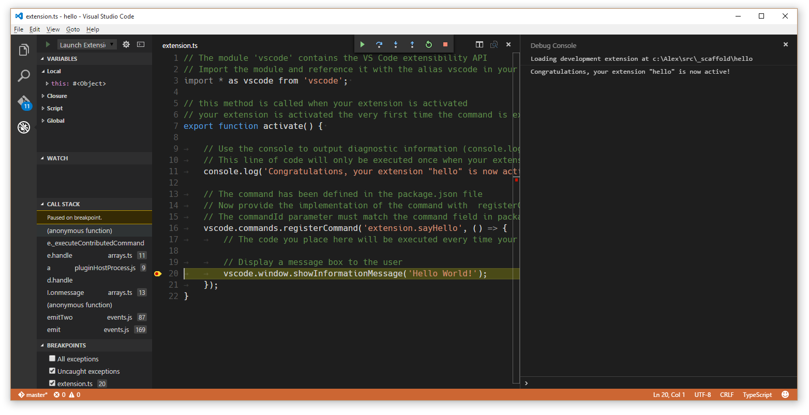
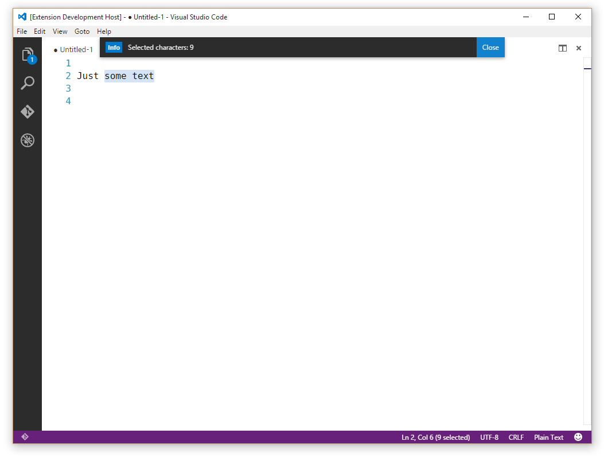

<a href="../../index.html" class="icon icon-home">vscode</a>

-

- [Home](../../index.html)

-

- - Customization
  - [Keyboard shortcuts](../../customization/keyboard-shortcuts/index.html)

-

- - Editor
  - [Accessibility](../../editor/accessibility/index.html)
  - [Codebasics](../../editor/codebasics/index.html)
  - [Command line](../../editor/command-line/index.html)
  - [Debugging](../../editor/debugging/index.html)
  - [Editingevolved](../../editor/editingevolved/index.html)
  - [Emmet](../../editor/emmet/index.html)
  - [Extension gallery](../../editor/extension-gallery/index.html)
  - [Integrated terminal](../../editor/integrated-terminal/index.html)
  - [Intellisense](../../editor/intellisense/index.html)
  - [Tasks appendix](../../editor/tasks-appendix/index.html)
  - [Tasks v1 appendix](../../editor/tasks-v1-appendix/index.html)
  - [Tasks v1](../../editor/tasks-v1/index.html)
  - [Tasks](../../editor/tasks/index.html)
  - [Userdefinedsnippets](../../editor/userdefinedsnippets/index.html)
  - [Versioncontrol](../../editor/versioncontrol/index.html)
  - [Whyvscode](../../editor/whyvscode/index.html)

-

- - extensionAPI
  - [Activation events](../../extensionAPI/activation-events/index.html)
  - [Api debugging](../../extensionAPI/api-debugging/index.html)
  - [Api markdown](../../extensionAPI/api-markdown/index.html)
  - [Api scm](../../extensionAPI/api-scm/index.html)
  - [Extension manifest](../../extensionAPI/extension-manifest/index.html)
  - [Extension points](../../extensionAPI/extension-points/index.html)
  - [Language support](../../extensionAPI/language-support/index.html)
  - [Overview](../../extensionAPI/overview/index.html)
  - [Patterns and principles](../../extensionAPI/patterns-and-principles/index.html)
  - [Vscode api commands](../../extensionAPI/vscode-api-commands/index.html)
  - [Vscode api](../../extensionAPI/vscode-api/index.html)

-

- - Extensions
  - [Debugging extensions](../debugging-extensions/index.html)
  - [Example debuggers](../example-debuggers/index.html)
  - <a href="index.html" class="current">Example hello world</a>
    - [Example - Hello World](#example-hello-world)
    - <a href="#your-first-extension" class="toctree-l4">Your First Extension</a>
    - <a href="#prerequisites" class="toctree-l4">Prerequisites</a>
    - <a href="#generate-a-new-extension" class="toctree-l4">Generate a New Extension</a>
    - <a href="#running-your-extension" class="toctree-l4">Running your Extension</a>
    - <a href="#the-structure-of-an-extension" class="toctree-l4">The Structure of an Extension</a>
    - <a href="#extension-activation" class="toctree-l4">Extension Activation</a>
    - <a href="#debugging-your-extension" class="toctree-l4">Debugging your Extension</a>
    - <a href="#a-simple-change" class="toctree-l4">A Simple Change</a>
    - <a href="#installing-your-extension-locally" class="toctree-l4">Installing your Extension Locally</a>
    - <a href="#publishing-your-extension" class="toctree-l4">Publishing your Extension</a>
    - <a href="#next-steps" class="toctree-l4">Next Steps</a>
  - [Example language server](../example-language-server/index.html)
  - [Example word count](../example-word-count/index.html)
  - [Overview](../overview/index.html)
  - [Publish extension](../publish-extension/index.html)
  - [Samples](../samples/index.html)
  - [Testing extensions](../testing-extensions/index.html)
  - [Themes snippets colorizers](../themes-snippets-colorizers/index.html)
  - [Yocode](../yocode/index.html)

-

- - Getstarted
  - [Introvideos](../../getstarted/introvideos/index.html)
  - [Keybindings](../../getstarted/keybindings/index.html)
  - [Locales](../../getstarted/locales/index.html)
  - [Settings](../../getstarted/settings/index.html)
  - [Theme color reference](../../getstarted/theme-color-reference/index.html)
  - [Themes](../../getstarted/themes/index.html)
  - [Userinterface](../../getstarted/userinterface/index.html)

-

- - Introvideos
  - [Basics](../../introvideos/basics/index.html)
  - [Codeediting](../../introvideos/codeediting/index.html)
  - [Configure](../../introvideos/configure/index.html)
  - [Debugging](../../introvideos/debugging/index.html)
  - [Extend](../../introvideos/extend/index.html)
  - [Intellisense](../../introvideos/intellisense/index.html)
  - [Quicktour](../../introvideos/quicktour/index.html)
  - [Versioncontrol](../../introvideos/versioncontrol/index.html)

-

- - Languages
  - [Cpp](../../languages/cpp/index.html)
  - [Csharp](../../languages/csharp/index.html)
  - [Css](../../languages/css/index.html)
  - [Dockerfile](../../languages/dockerfile/index.html)
  - [Go](../../languages/go/index.html)
  - [Html](../../languages/html/index.html)
  - [Identifiers](../../languages/identifiers/index.html)
  - [Javascript](../../languages/javascript/index.html)
  - [Jsconfig](../../languages/jsconfig/index.html)
  - [Json](../../languages/json/index.html)
  - [Markdown](../../languages/markdown/index.html)
  - [Overview](../../languages/overview/index.html)
  - [Php](../../languages/php/index.html)
  - [Python](../../languages/python/index.html)
  - [Tsql](../../languages/tsql/index.html)
  - [Typescript](../../languages/typescript/index.html)

-

- - Nodejs
  - [Angular tutorial](../../nodejs/angular-tutorial/index.html)
  - [Extensions](../../nodejs/extensions/index.html)
  - [Javascript transpilers](../../nodejs/javascript-transpilers/index.html)
  - [Nodejs debugging](../../nodejs/nodejs-debugging/index.html)
  - [Nodejs deployment](../../nodejs/nodejs-deployment/index.html)
  - [Nodejs tutorial](../../nodejs/nodejs-tutorial/index.html)
  - [Other javascript runtimes](../../nodejs/other-javascript-runtimes/index.html)
  - [Overview](../../nodejs/overview/index.html)
  - [Reactjs tutorial](../../nodejs/reactjs-tutorial/index.html)
  - [Tasks](../../nodejs/tasks/index.html)

-

- - Other
  - [Dotnet](../../other/dotnet/index.html)
  - [Office](../../other/office/index.html)
  - [Unity](../../other/unity/index.html)

-

- - Setup
  - [Additional components](../../setup/additional-components/index.html)
  - [Linux](../../setup/linux/index.html)
  - [Mac](../../setup/mac/index.html)
  - [Network](../../setup/network/index.html)
  - [Setup overview](../../setup/setup-overview/index.html)
  - [Windows](../../setup/windows/index.html)

-

- - Supporting
  - [Errors](../../supporting/errors/index.html)
  - [Faq](../../supporting/faq/index.html)
  - [Requirements](../../supporting/requirements/index.html)

-

[vscode](../../index.html)

- [Docs](../../index.html) »
- Extensions »
- Example hello world
-

---

# Example - Hello World

## Your First Extension

This document will take you through creating your first VS Code extension ("Hello World") and will explain the basic VS Code extensibility concepts.

In this walkthrough, you'll add a new command to VS Code which will display a simple "Hello World" message. Later in the walkthrough, you'll interact with the VS Code editor and query for the user's currently selected text.

## Prerequisites

You need [Node.js](https://nodejs.org/en/) installed and available in your `$PATH`. Node.js includes [npm](https://www.npmjs.com/), the Node.js Package Manager, which will be used to install the extension generator.

## Generate a New Extension

The simplest way to add your own functionality to VS Code is through adding a command. A command registers a callback function which can be invoked from the **Command Palette** or with a key binding.

We have written a Yeoman generator to help get you started. Install Yeoman and the [Yeoman VS Code Extension generator](https://vscode.readthedocs.io/docs/extensions/yocode.md) and scaffold a new extension:

    npm install -g yo generator-code
    yo code

For the hello world extension, you can either create a **TypeScript** extension or a **JavaScript** one. For this example, we pick a **TypeScript** extension.

## Running your Extension

- Launch VS Code, choose `File` > `Open Folder` and pick the folder that you generated.
- Press `kb(workbench.action.debug.start)` or click on the `Debug` icon and click `Start`.
- A new instance of VS Code will start in a special mode (`Extension Development Host`) and **this new instance is now aware of your extension**.
- Press `kb(workbench.action.showCommands)` and run the command named `Hello World`.
- Congratulations! You've just created and executed your first VS Code command!

## The Structure of an Extension

After running, the generated extension should have the following structure:

    .
    ├── .gitignore
    ├── .vscode                     // VS Code integration
    │   ├── launch.json
    │   ├── settings.json
    │   └── tasks.json
    ├── .vscodeignore
    ├── README.md
    ├── src                         // sources
    │   └── extension.ts            // extension.js, in case of JavaScript extension
    ├── test                        // tests folder
    │   ├── extension.test.ts       // extension.test.js, in case of JavaScript extension
    │   └── index.ts                // index.js, in case of JavaScript extension
    ├── node_modules
    │   ├── vscode                  // language services
    │   └── typescript              // compiler for typescript (TypeScript only)
    ├── out                         // compilation output (TypeScript only)
    │   ├── src
    │   |   ├── extension.js
    │   |   └── extension.js.map
    │   └── test
    │       ├── extension.test.js
    │       ├── extension.test.js.map
    │       ├── index.js
    │       └── index.js.map
    ├── package.json                // extension's manifest
    ├── tsconfig.json               // jsconfig.json, in case of JavaScript extension
    └── vsc-extension-quickstart.md // extension development quick start

Let's go through the purpose of all these files and explain what they do:

### The extension manifest: `package.json`

- Please read the [`package.json` extension manifest reference](https://vscode.readthedocs.io/docs/extensionAPI/extension-manifest.md)
- More information on [`package.json` contribution points](https://vscode.readthedocs.io/docs/extensionAPI/extension-points.md)
- Each VS Code extension must have a `package.json` file that describes it and its capabilities.
- VS Code reads this file during start-up and reacts to each `contributes` section immediately.

#### Example TypeScript extension manifest

    {
        "name": "myFirstExtension",
        "description": "",
        "version": "0.0.1",
        "publisher": "",
        "engines": {
            "vscode": "^1.5.0"
        },
        "categories": [
            "Other"
        ],
        "activationEvents": [
            "onCommand:extension.sayHello"
        ],
        "main": "./out/src/extension",
        "contributes": {
            "commands": [{
                "command": "extension.sayHello",
                "title": "Hello World"
            }]
        },
        "scripts": {
            "vscode:prepublish": "tsc -p ./",
            "compile": "tsc -watch -p ./",
            "postinstall": "node ./node_modules/vscode/bin/install",
            "test": "node ./node_modules/vscode/bin/test"
        },
        "devDependencies": {
           "typescript": "^2.0.3",
            "vscode": "^1.5.0",
            "mocha": "^2.3.3",
            "@types/node": "^6.0.40",
            "@types/mocha": "^2.2.32"
       }
    }

> **Note:** A JavaScript extension doesn't require the `scripts` field as no compilation is needed.

- This specific package.json describes an extension that:
- _contributes_ an entry to the Command Palette (`kb(workbench.action.showCommands)`) with the label `"Hello world"` that will invoke a command `"extension.sayHello"`.
- requests to get loaded (_activationEvents_) when the command `"extension.sayHello"` is invoked.
- has its _main_ JavaScript code in a file called `"./out/src/extension.js"`.

> **Note:** VS Code **does not** load the code of an extension eagerly at start-up. An extension must describe, through the [`activationEvents`](https://vscode.readthedocs.io/docs/extensionAPI/activation-events.md) property under what conditions it should get activated (loaded).

### Generated Code

The generated extension's code is in `extension.ts` (or `extension.js` in case of a JavaScript extension):

    // The module 'vscode' contains the VS Code extensibility API
    // Import the module and reference it with the alias vscode in your code below
    import * as vscode from 'vscode';

    // this method is called when your extension is activated
    // your extension is activated the very first time the command is executed
    export function activate(context: vscode.ExtensionContext) {

        // Use the console to output diagnostic information (console.log) and errors (console.error)
        // This line of code will only be executed once when your extension is activated
        console.log('Congratulations, your extension "my-first-extension" is now active!');

        // The command has been defined in the package.json file
        // Now provide the implementation of the command with  registerCommand
        // The commandId parameter must match the command field in package.json
        var disposable = vscode.commands.registerCommand('extension.sayHello', () => {
            // The code you place here will be executed every time your command is executed

            // Display a message box to the user
            vscode.window.showInformationMessage('Hello World!');
        });

        context.subscriptions.push(disposable);
    }

- Each extension should export from its main file a function named `activate()`, which VS Code will invoke **only once** when any of the `activationEvents` described in the `package.json` file occur.
- If an extension makes use of OS resources (e.g. spawns processes), the extension can export from its main file a function named `deactivate()` where it can do clean-up work and VS Code will invoke that function on shutdown.
- This specific extension imports the `vscode` API and then registers a command, associating a function to be called when the command `"extension.sayHello"` gets invoked. The command's implementation displays a "Hello world" message in VS Code.

> **Note:** The `contributes` section of the `package.json` adds an entry to the Command Palette. The code in extension.ts/.js defines the implementation of `"extension.sayHello"`.
>
> **Note:** For TypeScript extensions, the generated file `out/src/extension.js` will be loaded at runtime and executed by VS Code.

### Miscellaneous files

- `.vscode/launch.json` defines launching VS Code in the Extension Development mode. It also points with `preLaunchTask` to a task defined in `.vscode/tasks.json` that runs the TypeScript compiler.
- `.vscode/settings.json` by default excludes the `out` folder. You can modify which file types you want to hide.
- `.gitignore` - Tells Git version control which patterns to ignore.
- [`.vscodeignore`](https://vscode.readthedocs.io/docs/extensions/publish-extension.md#advanced-usage) - Tells the packaging tool which files to ignore when publishing the extension.
- `README.md` - README file describing your extension for VS Code users.
- `vsc-extension-quickstart.md` - A Quick Start guide for you.
- `test/extension.test.ts` - you can put your extension unit tests in here and run your tests against the VS Code API (see [Testing Your Extension](https://vscode.readthedocs.io/docs/extensions/testing-extensions.md))

## Extension Activation

Now that the roles of the files included in the extension are clarified, here is how your extension gets activated:

- The extension development instance discovers the extension and reads its `package.json` file.
- Later when you press `kb(workbench.action.showCommands)`:
- The registered commands are displayed in the Command Palette.
- In this list there is now an entry `"Hello world"` that is defined in the `package.json`.
- When selecting the `"Hello world"` command:
- The command `"extension.sayHello"` is invoked:
- An activation event `"onCommand:extension.sayHello"` is created.
- All extensions listing this activation event in their `activationEvents` are activated.
  - The file at `./out/src/extension.js` gets loaded in the JavaScript VM.
  - VS Code looks for an exported function `activate` and calls it.
  - The command `"extension.sayHello"` is registered and its implementation is now defined.
- The command `"extension.sayHello"` implementation function is invoked.
- The command implementation displays the "Hello World" message.

## Debugging your Extension

Set a breakpoint, for example inside the registered command, and run the `"Hello world"` command in the Extension Development VS Code instance.

> **Note:** For TypeScript extensions, even though VS Code loads and executes `out/src/extension.js`, you are actually able to debug the original TypeScript code due to the generated source map `out/src/extension.js.map` and VS Code's debugger support for source maps.
>
> **Tip:** The Debug Console will show all the messages you log to the console.

To learn more about the extension [development environment](https://vscode.readthedocs.io/docs/extensions/debugging-extensions.md).

## A Simple Change

In `extension.ts` (or `extension.js`, in a JavaScript extension), try replacing the `extension.sayHello` command implementation to show the number of characters selected in the editor:

    var editor = vscode.window.activeTextEditor;
    if (!editor) {
        return; // No open text editor
    }

    var selection = editor.selection;
    var text = editor.document.getText(selection);

    // Display a message box to the user
    vscode.window.showInformationMessage('Selected characters: ' + text.length);

> **Tip:** Once you make changes to the extension source code, you need to restart the Extension Development instance of VS Code. You can do that by using `kbstyle(Ctrl+R)` (Mac: `kbstyle(Cmd+R)`) in the second instance or by clicking the Restart button at the top of your primary VS Code instance.

## Installing your Extension Locally

So far, the extension you have written only runs in a special instance of VS Code, the Extension Development instance. To get your extension running in all instances of VS Code, you need to copy it to a new folder under your local extensions folder:

- Windows: `%USERPROFILE%\.vscode\extensions`
- Mac/Linux: `$HOME/.vscode/extensions`

## Publishing your Extension

Read about how to [Share an Extension](https://vscode.readthedocs.io/docs/extensions/publish-extension.md).

## Next Steps

In this walkthrough, we've seen a very simple extension. For a more detailed example, see the [Word Count Example](https://vscode.readthedocs.io/docs/extensions/example-word-count.md) which shows how to target a specific language (Markdown) and listen to the editor's document changed events.

If you'd like to read more generally about the extension APIs, try these topics:

- [Extension API Overview](https://vscode.readthedocs.io/docs/extensionAPI/overview.md) - Learn about the full VS Code extensibility model.
- [API Principles and Patterns](https://vscode.readthedocs.io/docs/extensionAPI/patterns-and-principles.md) - VS Code extensibility is based on several guiding principles and patterns.
- [Contribution Points](https://vscode.readthedocs.io/docs/extensionAPI/extension-points.md) - Details about the various VS Code contribution points.
- [Activation Events](https://vscode.readthedocs.io/docs/extensionAPI/activation-events.md) - VS Code activation events reference
- [Additional Extension Examples](https://vscode.readthedocs.io/docs/extensions/samples.md) - Take a look at our list of example extension projects.

<a href="../example-language-server/index.html" class="btn btn-neutral float-right" title="Example language server">Next </a> <a href="../example-debuggers/index.html" class="btn btn-neutral" title="Example debuggers"> Previous</a>

---

  Read the Docs  
