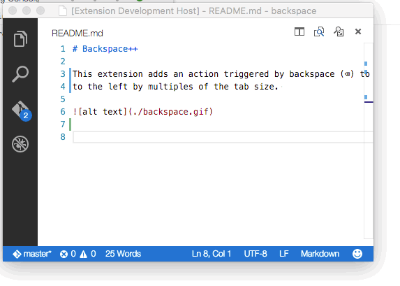
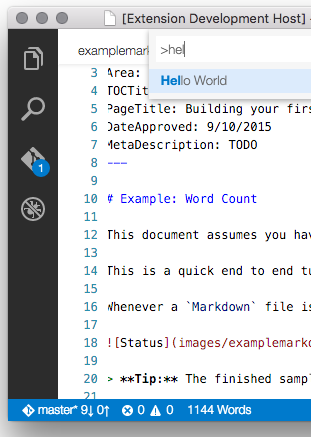
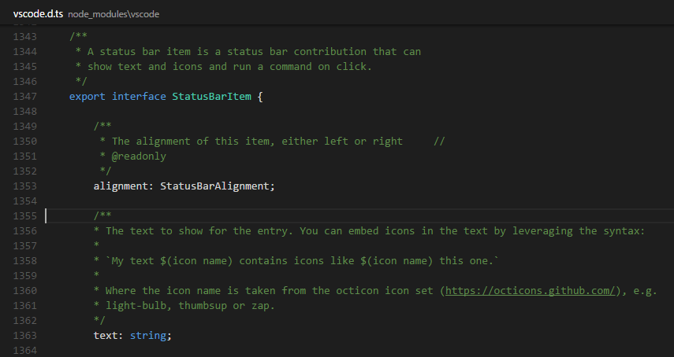

<a href="../../index.html" class="icon icon-home">vscode</a>

-

- [Home](../../index.html)

-

- - Customization
  - [Keyboard shortcuts](../../customization/keyboard-shortcuts/index.html)

-

- - Editor
  - [Accessibility](../../editor/accessibility/index.html)
  - [Codebasics](../../editor/codebasics/index.html)
  - [Command line](../../editor/command-line/index.html)
  - [Debugging](../../editor/debugging/index.html)
  - [Editingevolved](../../editor/editingevolved/index.html)
  - [Emmet](../../editor/emmet/index.html)
  - [Extension gallery](../../editor/extension-gallery/index.html)
  - [Integrated terminal](../../editor/integrated-terminal/index.html)
  - [Intellisense](../../editor/intellisense/index.html)
  - [Tasks appendix](../../editor/tasks-appendix/index.html)
  - [Tasks v1 appendix](../../editor/tasks-v1-appendix/index.html)
  - [Tasks v1](../../editor/tasks-v1/index.html)
  - [Tasks](../../editor/tasks/index.html)
  - [Userdefinedsnippets](../../editor/userdefinedsnippets/index.html)
  - [Versioncontrol](../../editor/versioncontrol/index.html)
  - [Whyvscode](../../editor/whyvscode/index.html)

-

- - extensionAPI
  - [Activation events](../../extensionAPI/activation-events/index.html)
  - [Api debugging](../../extensionAPI/api-debugging/index.html)
  - [Api markdown](../../extensionAPI/api-markdown/index.html)
  - [Api scm](../../extensionAPI/api-scm/index.html)
  - [Extension manifest](../../extensionAPI/extension-manifest/index.html)
  - [Extension points](../../extensionAPI/extension-points/index.html)
  - [Language support](../../extensionAPI/language-support/index.html)
  - [Overview](../../extensionAPI/overview/index.html)
  - [Patterns and principles](../../extensionAPI/patterns-and-principles/index.html)
  - [Vscode api commands](../../extensionAPI/vscode-api-commands/index.html)
  - [Vscode api](../../extensionAPI/vscode-api/index.html)

-

- - Extensions
  - [Debugging extensions](../debugging-extensions/index.html)
  - [Example debuggers](../example-debuggers/index.html)
  - [Example hello world](../example-hello-world/index.html)
  - [Example language server](../example-language-server/index.html)
  - <a href="index.html" class="current">Example word count</a>
    - [Example - Word Count](#example-word-count)
    - <a href="#overview" class="toctree-l4">Overview</a>
    - <a href="#run-the-extension" class="toctree-l4">Run the Extension</a>
    - <a href="#update-the-status-bar" class="toctree-l4">Update the Status Bar</a>
    - <a href="#subscribing-to-events" class="toctree-l4">Subscribing to Events</a>
    - <a href="#customizing-the-status-bar" class="toctree-l4">Customizing the Status Bar</a>
    - <a href="#disposing-extension-resources" class="toctree-l4">Disposing Extension Resources</a>
    - <a href="#installing-your-extension-locally" class="toctree-l4">Installing your Extension Locally</a>
    - <a href="#publishing-your-extension" class="toctree-l4">Publishing your Extension</a>
    - <a href="#next-steps" class="toctree-l4">Next Steps</a>
  - [Overview](../overview/index.html)
  - [Publish extension](../publish-extension/index.html)
  - [Samples](../samples/index.html)
  - [Testing extensions](../testing-extensions/index.html)
  - [Themes snippets colorizers](../themes-snippets-colorizers/index.html)
  - [Yocode](../yocode/index.html)

-

- - Getstarted
  - [Introvideos](../../getstarted/introvideos/index.html)
  - [Keybindings](../../getstarted/keybindings/index.html)
  - [Locales](../../getstarted/locales/index.html)
  - [Settings](../../getstarted/settings/index.html)
  - [Theme color reference](../../getstarted/theme-color-reference/index.html)
  - [Themes](../../getstarted/themes/index.html)
  - [Userinterface](../../getstarted/userinterface/index.html)

-

- - Introvideos
  - [Basics](../../introvideos/basics/index.html)
  - [Codeediting](../../introvideos/codeediting/index.html)
  - [Configure](../../introvideos/configure/index.html)
  - [Debugging](../../introvideos/debugging/index.html)
  - [Extend](../../introvideos/extend/index.html)
  - [Intellisense](../../introvideos/intellisense/index.html)
  - [Quicktour](../../introvideos/quicktour/index.html)
  - [Versioncontrol](../../introvideos/versioncontrol/index.html)

-

- - Languages
  - [Cpp](../../languages/cpp/index.html)
  - [Csharp](../../languages/csharp/index.html)
  - [Css](../../languages/css/index.html)
  - [Dockerfile](../../languages/dockerfile/index.html)
  - [Go](../../languages/go/index.html)
  - [Html](../../languages/html/index.html)
  - [Identifiers](../../languages/identifiers/index.html)
  - [Javascript](../../languages/javascript/index.html)
  - [Jsconfig](../../languages/jsconfig/index.html)
  - [Json](../../languages/json/index.html)
  - [Markdown](../../languages/markdown/index.html)
  - [Overview](../../languages/overview/index.html)
  - [Php](../../languages/php/index.html)
  - [Python](../../languages/python/index.html)
  - [Tsql](../../languages/tsql/index.html)
  - [Typescript](../../languages/typescript/index.html)

-

- - Nodejs
  - [Angular tutorial](../../nodejs/angular-tutorial/index.html)
  - [Extensions](../../nodejs/extensions/index.html)
  - [Javascript transpilers](../../nodejs/javascript-transpilers/index.html)
  - [Nodejs debugging](../../nodejs/nodejs-debugging/index.html)
  - [Nodejs deployment](../../nodejs/nodejs-deployment/index.html)
  - [Nodejs tutorial](../../nodejs/nodejs-tutorial/index.html)
  - [Other javascript runtimes](../../nodejs/other-javascript-runtimes/index.html)
  - [Overview](../../nodejs/overview/index.html)
  - [Reactjs tutorial](../../nodejs/reactjs-tutorial/index.html)
  - [Tasks](../../nodejs/tasks/index.html)

-

- - Other
  - [Dotnet](../../other/dotnet/index.html)
  - [Office](../../other/office/index.html)
  - [Unity](../../other/unity/index.html)

-

- - Setup
  - [Additional components](../../setup/additional-components/index.html)
  - [Linux](../../setup/linux/index.html)
  - [Mac](../../setup/mac/index.html)
  - [Network](../../setup/network/index.html)
  - [Setup overview](../../setup/setup-overview/index.html)
  - [Windows](../../setup/windows/index.html)

-

- - Supporting
  - [Errors](../../supporting/errors/index.html)
  - [Faq](../../supporting/faq/index.html)
  - [Requirements](../../supporting/requirements/index.html)

-

[vscode](../../index.html)

- [Docs](../../index.html) »
- Extensions »
- Example word count
-

---

# Example - Word Count

This document assumes you have read [Your First Extension](https://vscode.readthedocs.io/docs/extensions/example-hello-world.md) which covers the basics of VS Code extensibility.

Word Count is an end to end tutorial to show you how to create an extension to aid in Markdown authoring. Before we get into how all of this works, let's have a quick demo of the core features you will be building so you know what to expect.

Whenever a `Markdown` file is edited, a status bar message is added. The message includes the current word count and updates as you type and move from file to file:

> **Tip:** The finished sample is available from [this GitHub repository](https://github.com/microsoft/vscode-wordcount) should you have any issues.

## Overview

This example has three sections which will take you through a set of related concepts:

1.  [Update the Status Bar](https://vscode.readthedocs.io/docs/extensions/example-word-count.md#update-the-status-bar) - display custom text in the VS Code `Status Bar`
2.  [Subscribing to Events](https://vscode.readthedocs.io/docs/extensions/example-word-count.md#subscribing-to-events) - updating the `Status Bar` based on editor events
3.  [Disposing Extension Resources](https://vscode.readthedocs.io/docs/extensions/example-word-count.md#disposing-extension-resources) - release resources like event subscriptions or UI handles

First make sure you have the latest VS Code extension generator installed then run it:

    npm install -g yo generator-code
    yo code

This will open up the extension generator - we will base this example on the TypeScript `New Extension` option. For now, fill in the fields the same way you see them completed in the image below (using 'WordCount' as the extension name and your own name as the publisher).

You can now open VS Code as described in the generator output:

    cd WordCount
    code .

## Run the Extension

Before we go on, we can run the extension to make sure everything works as expected by pressing `kb(workbench.action.debug.start)`. As you saw in the previous "Hello World" walkthrough, VS Code opens another window (the **\[Extension Development Host\]** window) in which your extension will be loaded. You should find the "Hello World" command in the Command Palette (press `kb(workbench.action.showCommands)`) and when you select it, you will see an information box at the top of the window saying "Hello World".

Now that you have confirmed that the extension is running properly, you can keep the extension development window open if you like. To test out any changes that you make to your extension, you can either press `kb(workbench.action.debug.continue)` again in the development window or reload the extension development window by pressing `kbstyle(Ctrl+R)` (Mac: `kbstyle(Cmd+R)`).

## Update the Status Bar

Replace the contents of the generated `extension.ts` file with the code shown below. It declares and instantiates a `WordCounter` class which can count words and shows them in the VS Code Status Bar. The "Hello Word" command will call `updateWordCount` when invoked.

    // The module 'vscode' contains the VS Code extensibility API
    // Import the necessary extensibility types to use in your code below
    import {window, commands, Disposable, ExtensionContext, StatusBarAlignment, StatusBarItem, TextDocument} from 'vscode';

    // This method is called when your extension is activated. Activation is
    // controlled by the activation events defined in package.json.
    export function activate(context: ExtensionContext) {

        // Use the console to output diagnostic information (console.log) and errors (console.error).
        // This line of code will only be executed once when your extension is activated.
        console.log('Congratulations, your extension "WordCount" is now active!');

        // create a new word counter
        let wordCounter = new WordCounter();

        let disposable = commands.registerCommand('extension.sayHello', () => {
            wordCounter.updateWordCount();
        });

        // Add to a list of disposables which are disposed when this extension is deactivated.
        context.subscriptions.push(wordCounter);
        context.subscriptions.push(disposable);
    }

    class WordCounter {

        private _statusBarItem: StatusBarItem;

        public updateWordCount() {

            // Create as needed
            if (!this._statusBarItem) {
                this._statusBarItem = window.createStatusBarItem(StatusBarAlignment.Left);
            }

            // Get the current text editor
            let editor = window.activeTextEditor;
            if (!editor) {
                this._statusBarItem.hide();
                return;
            }

            let doc = editor.document;

            // Only update status if an Markdown file
            if (doc.languageId === "markdown") {
                let wordCount = this._getWordCount(doc);

                // Update the status bar
                this._statusBarItem.text = wordCount !== 1 ? `${wordCount} Words` : '1 Word';
                this._statusBarItem.show();
            } else {
                this._statusBarItem.hide();
            }
        }

        public _getWordCount(doc: TextDocument): number {

            let docContent = doc.getText();

            // Parse out unwanted whitespace so the split is accurate
            docContent = docContent.replace(/(< ([^>]+)<)/g, '').replace(/\s+/g, ' ');
            docContent = docContent.replace(/^\s\s*/, '').replace(/\s\s*$/, '');
            let wordCount = 0;
            if (docContent != "") {
                wordCount = docContent.split(" ").length;
            }

            return wordCount;
        }

        dispose() {
            this._statusBarItem.dispose();
        }
    }

Now let's try our updates to the extension.

We have the compilation of the TypeScript file set on a watch (in the extension's .vscode\\tasks.json file) so there is no need to re-build. Hit `kbstyle(Ctrl+R)` in the **\[Extension Development Host\]** window where your code is running and the extension will reload (you can also just `kb(workbench.action.debug.start)` from your primary development window). We still need to activate the code in the same way as before with the "Hello World" command. Assuming you are in a Markdown file, your Status Bar will display the word count.

This is a good start but it would be cooler if the count updated as your file changed.

## Subscribing to Events

Let's hook your helper class up to a set of events.

- `onDidChangeTextEditorSelection` - Event is raised as the cursor position changes
- `onDidChangeActiveTextEditor` - Event is raised as the active editor changes.

To do this, we'll add a new class into the `extension.ts` file. It will set up subscriptions to those events and ask the `WordCounter` to update the word count. Also note how this class manages the subscription as Disposables and how it stops listing when being disposed itself.

Add the `WordCounterController` as shown below to the bottom of the `extension.ts` file.

    class WordCounterController {

        private _wordCounter: WordCounter;
        private _disposable: Disposable;

        constructor(wordCounter: WordCounter) {
            this._wordCounter = wordCounter;

            // subscribe to selection change and editor activation events
            let subscriptions: Disposable[] = [];
            window.onDidChangeTextEditorSelection(this._onEvent, this, subscriptions);
            window.onDidChangeActiveTextEditor(this._onEvent, this, subscriptions);

            // update the counter for the current file
            this._wordCounter.updateWordCount();

            // create a combined disposable from both event subscriptions
            this._disposable = Disposable.from(...subscriptions);
        }

        dispose() {
            this._disposable.dispose();
        }

        private _onEvent() {
            this._wordCounter.updateWordCount();
        }
    }

We no longer want the Word Count extension to be loaded when a command is invoked but instead be available for each _Markdown_ file.

First, replace the body of the `activate` function with this:

    // Use the console to output diagnostic information (console.log) and errors (console.error).
    // This line of code will only be executed once when your extension is activated.
    console.log('Congratulations, your extension "WordCount" is now active!');

    // create a new word counter
    let wordCounter = new WordCounter();
    let controller = new WordCounterController(wordCounter);

    // Add to a list of disposables which are disposed when this extension is deactivated.
    context.subscriptions.push(controller);
    context.subscriptions.push(wordCounter);

Second, we must make sure the extension is activated upon the opening of a `Markdown` file. To do this, we'll need to modify the `package.json` file. Previously the extension was activated via the `extension.sayHello` command which we no longer need and so we can delete the entire `contributes` attribute from `package.json`:

        "contributes": {
            "commands":
                [{
                    "command": "extension.sayHello",
                    "title": "Hello World"
                }
            ]
        },

Now change your extension so that it is activated upon the opening of a _Markdown_ file by updating the `activationEvents` attribute to this:

        "activationEvents": [
            "onLanguage:markdown"
        ]

The [`onLanguage:${language}`](https://vscode.readthedocs.io/docs/extensionAPI/activation-events.md#activationeventsonlanguage) event takes the language id, in this case "markdown", and will be raised whenever a file of that language is opened.

Run the extension by either doing a window reload `kbstyle(Ctrl+R)` or with `kb(workbench.action.debug.start)` and then start editing a Markdown file. You should now should have a live updating Word Count.

If you set a breakpoint on the `activate` function, you'll notice that it is only called once when the first Markdown file is opened. The `WordCountController` constructor runs and subscribes to the editor events so that the `updateWordCount` function is called as Markdown files are opened and their text changes.

## Customizing the Status Bar

We've seen how you can display formatted text on the Status Bar. VS Code allows you to customize your Status Bar additions even further with color, icons, tooltips and more. Using IntelliSense, you can see the various `StatusBarItem` fields. Another great resource for learning about the VS Code extensibility APIs is the `vscode.d.ts` type declaration file included in your generated Extension project. Open `node_modules\vscode\vscode.d.ts` in the editor, you'll see the complete VS Code extensibility API with comments.

Replace the StatusBarItem update code with:

        // Update the status bar
        this._statusBarItem.text = wordCount !== 1 ? `$(pencil) ${wordCount} Words` : '$(pencil) 1 Word';
        this._statusBarItem.show();

to display a [GitHub Octicon](https://octicons.github.com/) `pencil` icon to the left of the calculated word count.

## Disposing Extension Resources

Now we'll take a deeper look at how extensions should handle VS Code resources through [Disposables](https://vscode.readthedocs.io/docs/extensionAPI/patterns-and-principles.md#disposables).

When an extension is activated, it is passed an `ExtensionContext` object which has a `subscriptions` collection of Disposables. Extensions can add their Disposable objects to this collection and VS Code will dispose of those objects when the extension is deactivated.

Many VS Code APIs which create workspace or UI objects (e.g. `registerCommand`) return a Disposable and extensions can remove these elements from VS Code by calling their dispose method directly.

Events are another example where `onDid*` event subscriber methods return a Disposable. Extensions unsubscribe to an event by disposing the event's Disposable. In our example, `WordCountController` handles the event subscription Disposables directly by keeping its own Disposable collection which it cleans up on deactivation.

        // subscribe to selection change and editor activation events
        let subscriptions: Disposable[] = [];
        window.onDidChangeTextEditorSelection(this._onEvent, this, subscriptions);
        window.onDidChangeActiveTextEditor(this._onEvent, this, subscriptions);

        // create a combined disposable from both event subscriptions
        this._disposable = Disposable.from(...subscriptions);

## Installing your Extension Locally

So far, the extension you have written only runs in a special instance of VS Code, the Extension Development Host instance. To make your extension available to all VS Code instances, copy the extension folder contents to a new folder under [your `.vscode/extensions` folder](https://vscode.readthedocs.io/docs/extensions/yocode.md#your-extensions-folder).

## Publishing your Extension

Read about how to [Share an Extension](https://vscode.readthedocs.io/docs/extensions/publish-extension.md).

## Next Steps

Read on to find out about:

- [Extension Generator](https://vscode.readthedocs.io/docs/extensions/yocode.md) - Learn about other options in the Yo Code extension generator.
- [Extension API](https://vscode.readthedocs.io/docs/extensionAPI/overview.md) - Get an overview of the Extension API.
- [Publishing Tool](https://vscode.readthedocs.io/docs/extensions/publish-extension.md) - Learn how to publish an extension to the public Marketplace.
- [Editor API](https://vscode.readthedocs.io/docs/extensionAPI/vscode-api.md#window) - Learn more about Text Documents, Text Editors and editing text.
- [Additional Extension Examples](https://vscode.readthedocs.io/docs/extensions/samples.md) - Take a look at our list of example extension projects.

<a href="../overview/index.html" class="btn btn-neutral float-right" title="Overview">Next </a> <a href="../example-language-server/index.html" class="btn btn-neutral" title="Example language server"> Previous</a>

---

  Read the Docs  
