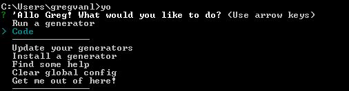

<a href="../../index.html" class="icon icon-home">vscode</a>

-

- [Home](../../index.html)

-

- - Customization
  - [Keyboard shortcuts](../../customization/keyboard-shortcuts/index.html)

-

- - Editor
  - [Accessibility](../../editor/accessibility/index.html)
  - [Codebasics](../../editor/codebasics/index.html)
  - [Command line](../../editor/command-line/index.html)
  - [Debugging](../../editor/debugging/index.html)
  - [Editingevolved](../../editor/editingevolved/index.html)
  - [Emmet](../../editor/emmet/index.html)
  - [Extension gallery](../../editor/extension-gallery/index.html)
  - [Integrated terminal](../../editor/integrated-terminal/index.html)
  - [Intellisense](../../editor/intellisense/index.html)
  - [Tasks appendix](../../editor/tasks-appendix/index.html)
  - [Tasks v1 appendix](../../editor/tasks-v1-appendix/index.html)
  - [Tasks v1](../../editor/tasks-v1/index.html)
  - [Tasks](../../editor/tasks/index.html)
  - [Userdefinedsnippets](../../editor/userdefinedsnippets/index.html)
  - [Versioncontrol](../../editor/versioncontrol/index.html)
  - [Whyvscode](../../editor/whyvscode/index.html)

-

- - extensionAPI
  - [Activation events](../../extensionAPI/activation-events/index.html)
  - [Api debugging](../../extensionAPI/api-debugging/index.html)
  - [Api markdown](../../extensionAPI/api-markdown/index.html)
  - [Api scm](../../extensionAPI/api-scm/index.html)
  - [Extension manifest](../../extensionAPI/extension-manifest/index.html)
  - [Extension points](../../extensionAPI/extension-points/index.html)
  - [Language support](../../extensionAPI/language-support/index.html)
  - [Overview](../../extensionAPI/overview/index.html)
  - [Patterns and principles](../../extensionAPI/patterns-and-principles/index.html)
  - [Vscode api commands](../../extensionAPI/vscode-api-commands/index.html)
  - [Vscode api](../../extensionAPI/vscode-api/index.html)

-

- - Extensions
  - [Debugging extensions](../debugging-extensions/index.html)
  - [Example debuggers](../example-debuggers/index.html)
  - [Example hello world](../example-hello-world/index.html)
  - [Example language server](../example-language-server/index.html)
  - [Example word count](../example-word-count/index.html)
  - [Overview](../overview/index.html)
  - [Publish extension](../publish-extension/index.html)
  - [Samples](../samples/index.html)
  - [Testing extensions](../testing-extensions/index.html)
  - [Themes snippets colorizers](../themes-snippets-colorizers/index.html)
  - <a href="index.html" class="current">Yocode</a>
    - [Yo Code - Extension Generator](#yo-code-extension-generator)
    - <a href="#prerequisites" class="toctree-l4">Prerequisites</a>
    - <a href="#install-the-generator" class="toctree-l4">Install the Generator</a>
    - <a href="#run-yo-code" class="toctree-l4">Run Yo Code</a>
    - <a href="#generator-options" class="toctree-l4">Generator Options</a>
    - <a href="#your-extensions-folder" class="toctree-l4">Your extensions folder</a>
    - <a href="#next-steps" class="toctree-l4">Next Steps</a>
    - <a href="#common-questions" class="toctree-l4">Common Questions</a>

-

- - Getstarted
  - [Introvideos](../../getstarted/introvideos/index.html)
  - [Keybindings](../../getstarted/keybindings/index.html)
  - [Locales](../../getstarted/locales/index.html)
  - [Settings](../../getstarted/settings/index.html)
  - [Theme color reference](../../getstarted/theme-color-reference/index.html)
  - [Themes](../../getstarted/themes/index.html)
  - [Userinterface](../../getstarted/userinterface/index.html)

-

- - Introvideos
  - [Basics](../../introvideos/basics/index.html)
  - [Codeediting](../../introvideos/codeediting/index.html)
  - [Configure](../../introvideos/configure/index.html)
  - [Debugging](../../introvideos/debugging/index.html)
  - [Extend](../../introvideos/extend/index.html)
  - [Intellisense](../../introvideos/intellisense/index.html)
  - [Quicktour](../../introvideos/quicktour/index.html)
  - [Versioncontrol](../../introvideos/versioncontrol/index.html)

-

- - Languages
  - [Cpp](../../languages/cpp/index.html)
  - [Csharp](../../languages/csharp/index.html)
  - [Css](../../languages/css/index.html)
  - [Dockerfile](../../languages/dockerfile/index.html)
  - [Go](../../languages/go/index.html)
  - [Html](../../languages/html/index.html)
  - [Identifiers](../../languages/identifiers/index.html)
  - [Javascript](../../languages/javascript/index.html)
  - [Jsconfig](../../languages/jsconfig/index.html)
  - [Json](../../languages/json/index.html)
  - [Markdown](../../languages/markdown/index.html)
  - [Overview](../../languages/overview/index.html)
  - [Php](../../languages/php/index.html)
  - [Python](../../languages/python/index.html)
  - [Tsql](../../languages/tsql/index.html)
  - [Typescript](../../languages/typescript/index.html)

-

- - Nodejs
  - [Angular tutorial](../../nodejs/angular-tutorial/index.html)
  - [Extensions](../../nodejs/extensions/index.html)
  - [Javascript transpilers](../../nodejs/javascript-transpilers/index.html)
  - [Nodejs debugging](../../nodejs/nodejs-debugging/index.html)
  - [Nodejs deployment](../../nodejs/nodejs-deployment/index.html)
  - [Nodejs tutorial](../../nodejs/nodejs-tutorial/index.html)
  - [Other javascript runtimes](../../nodejs/other-javascript-runtimes/index.html)
  - [Overview](../../nodejs/overview/index.html)
  - [Reactjs tutorial](../../nodejs/reactjs-tutorial/index.html)
  - [Tasks](../../nodejs/tasks/index.html)

-

- - Other
  - [Dotnet](../../other/dotnet/index.html)
  - [Office](../../other/office/index.html)
  - [Unity](../../other/unity/index.html)

-

- - Setup
  - [Additional components](../../setup/additional-components/index.html)
  - [Linux](../../setup/linux/index.html)
  - [Mac](../../setup/mac/index.html)
  - [Network](../../setup/network/index.html)
  - [Setup overview](../../setup/setup-overview/index.html)
  - [Windows](../../setup/windows/index.html)

-

- - Supporting
  - [Errors](../../supporting/errors/index.html)
  - [Faq](../../supporting/faq/index.html)
  - [Requirements](../../supporting/requirements/index.html)

-

[vscode](../../index.html)

- [Docs](../../index.html) »
- Extensions »
- Yocode
-

---

# Yo Code - Extension Generator

We have written a [Yeoman generator](https://github.com/Microsoft/vscode-generator-code) to help get you started.

## Prerequisites

You need [Node.js](https://nodejs.org/en/) installed and available in your `$PATH`. The Node.js install includes [npm](https://www.npmjs.com/), the Node.js Package Manager, which will be used to install the extension generator.

## Install the Generator

Install Yeoman and the VS Code Extension generator from the command prompt:

    npm install -g yo generator-code

## Run Yo Code

The Yeoman generator will walk you through the steps required to create your customization or extension prompting for the required information.

To launch the generator, type the following in a command prompt:

    yo code

## Generator Options

The generator can either create an extension skeleton for a new extension or create a ready-to-use extension for languages, themes or snippets based on existing TextMate definition files.

### New Extension (TypeScript)

Creates an extension skeleton implementing a 'hello world' command. Use this as a starting point for your own extension.

- Prompts for the extension identifier and will create a folder of that name in the current directory.
- Creates a base folder structure with a source, test and output folder.
- Templates out a `package.json` file and an extension main file.
- Sets-up `launch.json` and `tasks.json` so that F5 will compile and run your extension and attach the debugger.
- Optionally sets up a Git repository.

Once created, open VS Code on the created folder. The folder contains a file `vsc-extension-quickstart.md` as a quick guide with the next steps. The extension is setup so that you get IntelliSense for the extension API.

### New Extension (JavaScript)

Does the same as `New Extension (TypeScript)`, but for JavaScript. The extension is setup so that you get IntelliSense for the extension API.

### New Color Theme

Creates an extension that contributes a new color theme based on an existing TextMate color theme.

- Prompts for the location (URL or file path) of the existing TextMate color theme (.tmTheme). This file will be imported into the new extension.
- Prompts for the color theme name as well as the color base theme (light or dark).
- Prompts for the extension identifier and will create a folder of that name in the current directory.

Once created, open VS Code on the created folder and run the extension to test the new theme. Check out `vsc-extension-quickstart.md`. It's a quick guide with the next steps.

### New Language Support

Creates an extension that contributes a language with colorizer.

- Prompts for the location (URL or file path) of an existing TextMate language file (.tmLanguage, .plist or .json). This file will be imported to the new extension. To start a new grammar you can skip this by passing an empty name.
- Prompts for the extension identifier and will create a folder of that name in the current directory.

Once created, open VS Code on the created folder and run the extension to test the colorization. Check out `vsc-extension-quickstart.md` for the next steps. Have a look at the language configuration file that has been created and defines configuration options such what style of comments and brackets the language uses.

### New Code Snippets

Creates an extension that contributes new code snippets.

- Prompts for the folder location that contains TextMate snippets (.tmSnippet) or Sublime snippets (.sublime-snippet). These files are converted to a VS Code snippet file.
- Prompts for the language for which these snippets will be active.
- Prompts for the extension identifier and will create a folder of that name in the current directory.

Once created, open VS Code on the created folder and run the extension to test the snippets. Check out `vsc-extension-quickstart.md` for the next steps.

### New Extension Pack

Creates an extension that contributes a new extension pack with your favorite extensions.

- Prompts for adding the installed extensions to the extension pack.
- Prompts for the extension identifier and will create a folder of that name in the current directory.

Review the `extensionDependencies` in the `package.json` file before publishing the extension pack.

Once created, open VS Code on the created folder and run the extension to test the extension pack. Check out `vsc-extension-quickstart.md` for the next steps.

## Your extensions folder

To load an extension, you need to copy the files to your VS Code extensions folder `.vscode/extensions`. Depending on your platform, it is located in the following folders:

- **Windows** `%USERPROFILE%\.vscode\extensions`
- **Mac** `~/.vscode/extensions`
- **Linux** `~/.vscode/extensions`

If you want to load your extension each time VS Code runs, copy your project ('side loading') to a new folder under `.vscode/extensions`. For example: `~/.vscode/extensions/myextension`.

## Next Steps

- [Publishing Tool](https://vscode.readthedocs.io/docs/extensions/publish-extension.md) - Learn how to publish your extensions to the VS Code Marketplace.
- [Hello World](https://vscode.readthedocs.io/docs/extensions/example-hello-world.md) - Try the 'Hello World' walkthrough to build your first extension.
- [Additional Extension Examples](https://vscode.readthedocs.io/docs/extensions/samples.md) - Take a look at our list of example extension projects.

## Common Questions

**Q: The `yo code` generator doesn't respond to arrow keys on Windows 10.**

**A:** Try starting the Yeoman generator with just `yo` and then select the `Code` generator.

If the arrows keys still do not respond, try starting Yeoman from an elevated shell. To do this, right-click the shell and select **Run as administrator**.

<a href="../../getstarted/introvideos/index.html" class="btn btn-neutral float-right" title="Introvideos">Next </a> <a href="../themes-snippets-colorizers/index.html" class="btn btn-neutral" title="Themes snippets colorizers"> Previous</a>

---

  Read the Docs  
