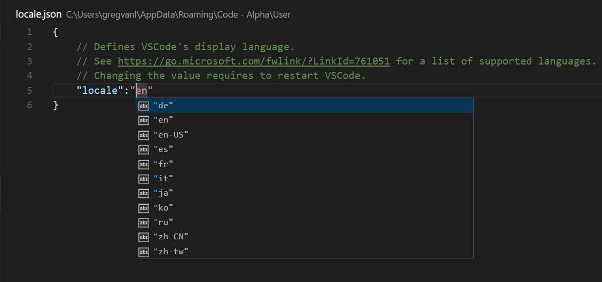

<a href="../../index.html" class="icon icon-home">vscode</a>

-

- [Home](../../index.html)

-

- - Customization
  - [Keyboard shortcuts](../../customization/keyboard-shortcuts/index.html)

-

- - Editor
  - [Accessibility](../../editor/accessibility/index.html)
  - [Codebasics](../../editor/codebasics/index.html)
  - [Command line](../../editor/command-line/index.html)
  - [Debugging](../../editor/debugging/index.html)
  - [Editingevolved](../../editor/editingevolved/index.html)
  - [Emmet](../../editor/emmet/index.html)
  - [Extension gallery](../../editor/extension-gallery/index.html)
  - [Integrated terminal](../../editor/integrated-terminal/index.html)
  - [Intellisense](../../editor/intellisense/index.html)
  - [Tasks appendix](../../editor/tasks-appendix/index.html)
  - [Tasks v1 appendix](../../editor/tasks-v1-appendix/index.html)
  - [Tasks v1](../../editor/tasks-v1/index.html)
  - [Tasks](../../editor/tasks/index.html)
  - [Userdefinedsnippets](../../editor/userdefinedsnippets/index.html)
  - [Versioncontrol](../../editor/versioncontrol/index.html)
  - [Whyvscode](../../editor/whyvscode/index.html)

-

- - extensionAPI
  - [Activation events](../../extensionAPI/activation-events/index.html)
  - [Api debugging](../../extensionAPI/api-debugging/index.html)
  - [Api markdown](../../extensionAPI/api-markdown/index.html)
  - [Api scm](../../extensionAPI/api-scm/index.html)
  - [Extension manifest](../../extensionAPI/extension-manifest/index.html)
  - [Extension points](../../extensionAPI/extension-points/index.html)
  - [Language support](../../extensionAPI/language-support/index.html)
  - [Overview](../../extensionAPI/overview/index.html)
  - [Patterns and principles](../../extensionAPI/patterns-and-principles/index.html)
  - [Vscode api commands](../../extensionAPI/vscode-api-commands/index.html)
  - [Vscode api](../../extensionAPI/vscode-api/index.html)

-

- - Extensions
  - [Debugging extensions](../../extensions/debugging-extensions/index.html)
  - [Example debuggers](../../extensions/example-debuggers/index.html)
  - [Example hello world](../../extensions/example-hello-world/index.html)
  - [Example language server](../../extensions/example-language-server/index.html)
  - [Example word count](../../extensions/example-word-count/index.html)
  - [Overview](../../extensions/overview/index.html)
  - [Publish extension](../../extensions/publish-extension/index.html)
  - [Samples](../../extensions/samples/index.html)
  - [Testing extensions](../../extensions/testing-extensions/index.html)
  - [Themes snippets colorizers](../../extensions/themes-snippets-colorizers/index.html)
  - [Yocode](../../extensions/yocode/index.html)

-

- - Getstarted
  - [Introvideos](../introvideos/index.html)
  - [Keybindings](../keybindings/index.html)
  - <a href="index.html" class="current">Locales</a>
    - [Display Language](#display-language)
    - <a href="#available-locales" class="toctree-l4">Available Locales</a>
    - <a href="#setting-the-language" class="toctree-l4">Setting the Language</a>
    - <a href="#configure-language-command" class="toctree-l4">Configure Language command</a>
  - [Settings](../settings/index.html)
  - [Theme color reference](../theme-color-reference/index.html)
  - [Themes](../themes/index.html)
  - [Userinterface](../userinterface/index.html)

-

- - Introvideos
  - [Basics](../../introvideos/basics/index.html)
  - [Codeediting](../../introvideos/codeediting/index.html)
  - [Configure](../../introvideos/configure/index.html)
  - [Debugging](../../introvideos/debugging/index.html)
  - [Extend](../../introvideos/extend/index.html)
  - [Intellisense](../../introvideos/intellisense/index.html)
  - [Quicktour](../../introvideos/quicktour/index.html)
  - [Versioncontrol](../../introvideos/versioncontrol/index.html)

-

- - Languages
  - [Cpp](../../languages/cpp/index.html)
  - [Csharp](../../languages/csharp/index.html)
  - [Css](../../languages/css/index.html)
  - [Dockerfile](../../languages/dockerfile/index.html)
  - [Go](../../languages/go/index.html)
  - [Html](../../languages/html/index.html)
  - [Identifiers](../../languages/identifiers/index.html)
  - [Javascript](../../languages/javascript/index.html)
  - [Jsconfig](../../languages/jsconfig/index.html)
  - [Json](../../languages/json/index.html)
  - [Markdown](../../languages/markdown/index.html)
  - [Overview](../../languages/overview/index.html)
  - [Php](../../languages/php/index.html)
  - [Python](../../languages/python/index.html)
  - [Tsql](../../languages/tsql/index.html)
  - [Typescript](../../languages/typescript/index.html)

-

- - Nodejs
  - [Angular tutorial](../../nodejs/angular-tutorial/index.html)
  - [Extensions](../../nodejs/extensions/index.html)
  - [Javascript transpilers](../../nodejs/javascript-transpilers/index.html)
  - [Nodejs debugging](../../nodejs/nodejs-debugging/index.html)
  - [Nodejs deployment](../../nodejs/nodejs-deployment/index.html)
  - [Nodejs tutorial](../../nodejs/nodejs-tutorial/index.html)
  - [Other javascript runtimes](../../nodejs/other-javascript-runtimes/index.html)
  - [Overview](../../nodejs/overview/index.html)
  - [Reactjs tutorial](../../nodejs/reactjs-tutorial/index.html)
  - [Tasks](../../nodejs/tasks/index.html)

-

- - Other
  - [Dotnet](../../other/dotnet/index.html)
  - [Office](../../other/office/index.html)
  - [Unity](../../other/unity/index.html)

-

- - Setup
  - [Additional components](../../setup/additional-components/index.html)
  - [Linux](../../setup/linux/index.html)
  - [Mac](../../setup/mac/index.html)
  - [Network](../../setup/network/index.html)
  - [Setup overview](../../setup/setup-overview/index.html)
  - [Windows](../../setup/windows/index.html)

-

- - Supporting
  - [Errors](../../supporting/errors/index.html)
  - [Faq](../../supporting/faq/index.html)
  - [Requirements](../../supporting/requirements/index.html)

-

[vscode](../../index.html)

- [Docs](../../index.html) »
- Getstarted »
- Locales
-

---

--- Order: 7 Area: getstarted TOCTitle: Display Language PageTitle: Visual Studio Code Display Language (Locale) ContentId: 413A7FA3-94F8-4FCB-A4A3-F4C1E77EF716 DateApproved: 9/7/2017 MetaDescription: How to change the display language (locale) of Visual Studio Code.

---

# Display Language

Visual Studio Code ships with 10 available display languages (locales): English (US), Simplified Chinese, Traditional Chinese, French, German, Italian, Japanese, Korean, Russian and Spanish. Localized display text for all 10 languages is included in the main VS Code download and as such, doesn't require a secondary install.

By default, VS Code picks up the operating system's display language, falling back to English (US) if the locale is not supported.

## Available Locales

<table><thead><tr class="header"><th>Display Language</th><th>Locale</th></tr></thead><tbody><tr class="odd"><td>English (US)</td><td><code>en</code></td></tr><tr class="even"><td>Simplified Chinese</td><td><code>zh-CN</code></td></tr><tr class="odd"><td>Traditional Chinese</td><td><code>zh-TW</code></td></tr><tr class="even"><td>French</td><td><code>fr</code></td></tr><tr class="odd"><td>German</td><td><code>de</code></td></tr><tr class="even"><td>Italian</td><td><code>it</code></td></tr><tr class="odd"><td>Japanese</td><td><code>ja</code></td></tr><tr class="even"><td>Korean</td><td><code>ko</code></td></tr><tr class="odd"><td>Russian</td><td><code>ru</code></td></tr><tr class="even"><td>Spanish</td><td><code>es</code></td></tr></tbody></table>

## Setting the Language

If you want to configure a specific language, you can either use the command line switch `--locale` to specify a locale when you launch a VS Code session or use the **Configure Language** command to persist the display language to use when VS Code is started.

Below is an example of using the `--locale` command line switch to set the VS Code display language to French:

    code . --locale=fr

## Configure Language command

The **Configure Language** command creates a `locale.json` file in your user VS Code folder. Set the `locale` attribute to your preferred locale.

Press `kb(workbench.action.showCommands)` to bring up the **Command Palette** then start typing "config" to filter and display the **Configure Language** command.

Press `kbstyle(Enter)` and a `locale.json` file is created with the default value set to your operating system language. You can use IntelliSense (`kb(editor.action.triggerSuggest)`) to select a different supported language locale.

Save `locale.json` and restart VS Code to use the new display language.

The example below sets VS Code to display Simplified Chinese `zh-CN`:

    {
        // Defines VS Code's display language.
        "locale":"zh-CN"
    }

You can rerun the **Configure Language** command to review and change your `locale.json` file.

> **Note:** Changing the `locale` value requires a restart of VS Code.

<a href="../settings/index.html" class="btn btn-neutral float-right" title="Settings">Next </a> <a href="../keybindings/index.html" class="btn btn-neutral" title="Keybindings"> Previous</a>

---

  Read the Docs  
