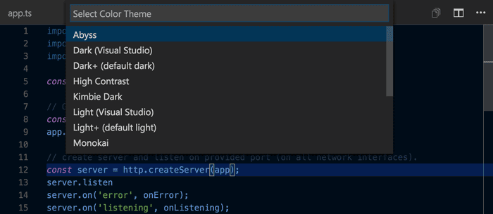
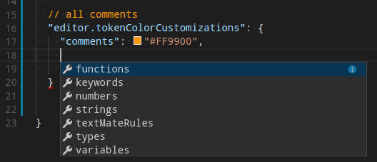

<a href="../../index.html" class="icon icon-home">vscode</a>

-

- [Home](../../index.html)

-

- - Customization
  - [Keyboard shortcuts](../../customization/keyboard-shortcuts/index.html)

-

- - Editor
  - [Accessibility](../../editor/accessibility/index.html)
  - [Codebasics](../../editor/codebasics/index.html)
  - [Command line](../../editor/command-line/index.html)
  - [Debugging](../../editor/debugging/index.html)
  - [Editingevolved](../../editor/editingevolved/index.html)
  - [Emmet](../../editor/emmet/index.html)
  - [Extension gallery](../../editor/extension-gallery/index.html)
  - [Integrated terminal](../../editor/integrated-terminal/index.html)
  - [Intellisense](../../editor/intellisense/index.html)
  - [Tasks appendix](../../editor/tasks-appendix/index.html)
  - [Tasks v1 appendix](../../editor/tasks-v1-appendix/index.html)
  - [Tasks v1](../../editor/tasks-v1/index.html)
  - [Tasks](../../editor/tasks/index.html)
  - [Userdefinedsnippets](../../editor/userdefinedsnippets/index.html)
  - [Versioncontrol](../../editor/versioncontrol/index.html)
  - [Whyvscode](../../editor/whyvscode/index.html)

-

- - extensionAPI
  - [Activation events](../../extensionAPI/activation-events/index.html)
  - [Api debugging](../../extensionAPI/api-debugging/index.html)
  - [Api markdown](../../extensionAPI/api-markdown/index.html)
  - [Api scm](../../extensionAPI/api-scm/index.html)
  - [Extension manifest](../../extensionAPI/extension-manifest/index.html)
  - [Extension points](../../extensionAPI/extension-points/index.html)
  - [Language support](../../extensionAPI/language-support/index.html)
  - [Overview](../../extensionAPI/overview/index.html)
  - [Patterns and principles](../../extensionAPI/patterns-and-principles/index.html)
  - [Vscode api commands](../../extensionAPI/vscode-api-commands/index.html)
  - [Vscode api](../../extensionAPI/vscode-api/index.html)

-

- - Extensions
  - [Debugging extensions](../../extensions/debugging-extensions/index.html)
  - [Example debuggers](../../extensions/example-debuggers/index.html)
  - [Example hello world](../../extensions/example-hello-world/index.html)
  - [Example language server](../../extensions/example-language-server/index.html)
  - [Example word count](../../extensions/example-word-count/index.html)
  - [Overview](../../extensions/overview/index.html)
  - [Publish extension](../../extensions/publish-extension/index.html)
  - [Samples](../../extensions/samples/index.html)
  - [Testing extensions](../../extensions/testing-extensions/index.html)
  - [Themes snippets colorizers](../../extensions/themes-snippets-colorizers/index.html)
  - [Yocode](../../extensions/yocode/index.html)

-

- - Getstarted
  - [Introvideos](../introvideos/index.html)
  - [Keybindings](../keybindings/index.html)
  - [Locales](../locales/index.html)
  - [Settings](../settings/index.html)
  - [Theme color reference](../theme-color-reference/index.html)
  - <a href="index.html" class="current">Themes</a>
    - [Color Themes](#color-themes)
    - <a href="#selecting-the-color-theme" class="toctree-l4">Selecting the Color Theme</a>
    - <a href="#color-themes-from-the-marketplace" class="toctree-l4">Color Themes from the Marketplace</a>
    - <a href="#customize-a-color-theme" class="toctree-l4">Customize a Color Theme</a>
    - <a href="#using-existing-textmate-themes" class="toctree-l4">Using existing TextMate Themes</a>
    - <a href="#icon-themes" class="toctree-l4">Icon Themes</a>
    - <a href="#selecting-the-file-icon-theme" class="toctree-l4">Selecting the File Icon Theme</a>
    - <a href="#creating-your-own-file-icon-theme" class="toctree-l4">Creating your own File Icon Theme</a>
    - <a href="#next-steps" class="toctree-l4">Next Steps</a>
  - [Userinterface](../userinterface/index.html)

-

- - Introvideos
  - [Basics](../../introvideos/basics/index.html)
  - [Codeediting](../../introvideos/codeediting/index.html)
  - [Configure](../../introvideos/configure/index.html)
  - [Debugging](../../introvideos/debugging/index.html)
  - [Extend](../../introvideos/extend/index.html)
  - [Intellisense](../../introvideos/intellisense/index.html)
  - [Quicktour](../../introvideos/quicktour/index.html)
  - [Versioncontrol](../../introvideos/versioncontrol/index.html)

-

- - Languages
  - [Cpp](../../languages/cpp/index.html)
  - [Csharp](../../languages/csharp/index.html)
  - [Css](../../languages/css/index.html)
  - [Dockerfile](../../languages/dockerfile/index.html)
  - [Go](../../languages/go/index.html)
  - [Html](../../languages/html/index.html)
  - [Identifiers](../../languages/identifiers/index.html)
  - [Javascript](../../languages/javascript/index.html)
  - [Jsconfig](../../languages/jsconfig/index.html)
  - [Json](../../languages/json/index.html)
  - [Markdown](../../languages/markdown/index.html)
  - [Overview](../../languages/overview/index.html)
  - [Php](../../languages/php/index.html)
  - [Python](../../languages/python/index.html)
  - [Tsql](../../languages/tsql/index.html)
  - [Typescript](../../languages/typescript/index.html)

-

- - Nodejs
  - [Angular tutorial](../../nodejs/angular-tutorial/index.html)
  - [Extensions](../../nodejs/extensions/index.html)
  - [Javascript transpilers](../../nodejs/javascript-transpilers/index.html)
  - [Nodejs debugging](../../nodejs/nodejs-debugging/index.html)
  - [Nodejs deployment](../../nodejs/nodejs-deployment/index.html)
  - [Nodejs tutorial](../../nodejs/nodejs-tutorial/index.html)
  - [Other javascript runtimes](../../nodejs/other-javascript-runtimes/index.html)
  - [Overview](../../nodejs/overview/index.html)
  - [Reactjs tutorial](../../nodejs/reactjs-tutorial/index.html)
  - [Tasks](../../nodejs/tasks/index.html)

-

- - Other
  - [Dotnet](../../other/dotnet/index.html)
  - [Office](../../other/office/index.html)
  - [Unity](../../other/unity/index.html)

-

- - Setup
  - [Additional components](../../setup/additional-components/index.html)
  - [Linux](../../setup/linux/index.html)
  - [Mac](../../setup/mac/index.html)
  - [Network](../../setup/network/index.html)
  - [Setup overview](../../setup/setup-overview/index.html)
  - [Windows](../../setup/windows/index.html)

-

- - Supporting
  - [Errors](../../supporting/errors/index.html)
  - [Faq](../../supporting/faq/index.html)
  - [Requirements](../../supporting/requirements/index.html)

-

[vscode](../../index.html)

- [Docs](../../index.html) »
- Getstarted »
- Themes
-

---

# Color Themes

Color themes let you modify VS Code's background, text, and language syntax colorization to suit your preferences and work environment. VS Code supports light, dark and high contrast themes.

## Selecting the Color Theme

The current color theme is configured in the [settings](https://vscode.readthedocs.io/docs/getstarted/settings.md).

      // Specifies the color theme used in the workbench.
      "workbench.colorTheme": "Default Dark+"
    }

However, there is no need to edit the settings directly. It's easier to use the Color Theme Picker to preview and select a theme.

1.  Open the Color Theme picker with **File** > **Preferences** > **Color Theme**. (**Code** > **Preferences** > **Color Theme** on Mac)
2.  Use the cursor keys to preview the colors of the theme.
3.  Select the theme you want and hit `kbstyle(Enter)`.

> **Tip:** By default, the theme is configured in the user settings and applies to all workspaces. But you can also configure a workspace specific theme. To do so, set a theme in the workspace settings.

## Color Themes from the Marketplace

There are several out-of-the-box color themes in VS Code for you to try.

Many more themes have been uploaded to the VS Code [Extension Marketplace](https://vscode.readthedocs.io/docs/editor/extension-gallery.md) by the community. If you find one you want to use, install it and restart VS Code and the new theme will be available.

> **Tip:** To search for themes, type 'theme' in the Extensions view (`kb(workbench.view.extensions)`) search box.

You can also browse the [VS Code Marketplace](https://marketplace.visualstudio.com/vscode/Themes) site directly to find available themes.

## Customize a Color Theme

> **Note**: Supported on VS Code version 1.12 or higher.

You can also customize your active color theme with the `workbench.colorCustomizations` user [setting](https://vscode.readthedocs.io/docs/getstarted/settings.md). You can set the colors of VS Code UI elements such as list & trees (File Explorer, suggestions widget), diff editor, Activity Bar, notifications, scroll bar, split view, buttons and more.

You can use IntelliSense while setting `workbench.colorCustomizations` values or, for a list of all customizable colors, see the [Theme Color Reference](https://vscode.readthedocs.io/docs/getstarted/theme-color-reference.md).

In VS Code version 1.15 or higher, you can also tune the syntax highlighting colors using the `editor.tokenColorCustomizations` setting:

A pre-configured set of syntax tokens ('comments', 'strings', ...) is available for the most common constructs. If you want more, you can do so by directly specifying TextMate theme color rules:

> **Note**: Directly configuring TextMate rules is an advanced skill as you need to understand on how TextMate grammars work. Go [here](https://vscode.readthedocs.io/docs/extensions/themes-snippets-colorizers.md#textmate-theme-rules) for more information

## Using existing TextMate Themes

You can add existing TextMate color themes (.tmTheme) to VS Code. For example, the [Color Sublime](http://colorsublime.com/) site has hundreds of TextMate themes available. See the [Adding a new Theme](https://vscode.readthedocs.io/docs/extensions/themes-snippets-colorizers.md#adding-a-new-theme) topic in our Extension Authoring section to learn more.

## Icon Themes

File icon themes can be contributed by extensions and selected by users as their favorite set of file icons. File icons are shown in the File Explorer and tabbed headings.

## Selecting the File Icon Theme

The current File Icon theme is persisted in your user [settings](https://vscode.readthedocs.io/docs/getstarted/settings.md).

      // Specifies the icon theme used in the workbench.
      "workbench.iconTheme": null
    }

There is no need to edit the `settings.json` file directly. It is better to use the File Icon Theme picker to preview and select a theme.

1.  Open the Icon Theme picker with **File** > **Preferences** > **File Icon Theme**. (**Code** > **Preferences** > **File Icon Theme** on Mac)
2.  Use the cursor keys to preview the icons of the theme.
3.  Select the theme you want and hit `kbstyle(Enter)`.

By default, no file icon set is configured, therefore the File Explorer shows no icons. Once an icon theme is selected, the selected theme will be remembered and set again when VS Code is started the next time .

VS code ships with two icon themes; **Minimal** and **Seti**. To install more icon themes, select the **Find more in the Marketplace...** item in the icon theme picker.

You can also browse the [VS Code Marketplace](https://marketplace.visualstudio.com/vscode/Themes) site directly to find available themes.

## Creating your own File Icon Theme

You can create your own File Icon Theme from icons (preferably SVG), see the [Adding a new Icon Theme](https://vscode.readthedocs.io/docs/extensions/themes-snippets-colorizers.md#adding-a-new-icon-theme) topic in our Extension Authoring section for details.

## Next Steps

Themes are just one way to customize VS Code. If you'd like to learn more about VS Code customization and extensibility, try these topics:

- [Settings](../../docs/getstarted/settings-2.html) - Learn how to configure VS Code to your preferences through user and workspace settings.
- [Snippets](https://vscode.readthedocs.io/docs/editor/userdefinedsnippets.md) - Add additional snippets to your favorite language.
- [Extending Visual Studio Code](https://vscode.readthedocs.io/docs/extensions/overview.md) - Learn about other ways to extend VS Code.
- [Themes, Snippets, and Colorizers](https://vscode.readthedocs.io/docs/extensions/themes-snippets-colorizers.md) - You can package themes, snippets and language colorizers for use in VS Code.

<a href="../userinterface/index.html" class="btn btn-neutral float-right" title="Userinterface">Next </a> <a href="../theme-color-reference/index.html" class="btn btn-neutral" title="Theme color reference"> Previous</a>

---

  Read the Docs  
