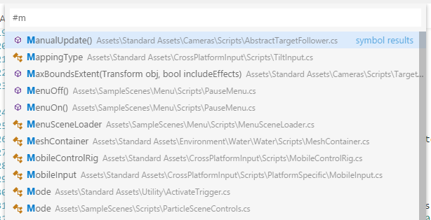

<a href="../../index.html" class="icon icon-home">vscode</a>

-

- [Home](../../index.html)

-

- - Customization
  - [Keyboard shortcuts](../../customization/keyboard-shortcuts/index.html)

-

- - Editor
  - [Accessibility](../../editor/accessibility/index.html)
  - [Codebasics](../../editor/codebasics/index.html)
  - [Command line](../../editor/command-line/index.html)
  - [Debugging](../../editor/debugging/index.html)
  - [Editingevolved](../../editor/editingevolved/index.html)
  - [Emmet](../../editor/emmet/index.html)
  - [Extension gallery](../../editor/extension-gallery/index.html)
  - [Integrated terminal](../../editor/integrated-terminal/index.html)
  - [Intellisense](../../editor/intellisense/index.html)
  - [Tasks appendix](../../editor/tasks-appendix/index.html)
  - [Tasks v1 appendix](../../editor/tasks-v1-appendix/index.html)
  - [Tasks v1](../../editor/tasks-v1/index.html)
  - [Tasks](../../editor/tasks/index.html)
  - [Userdefinedsnippets](../../editor/userdefinedsnippets/index.html)
  - [Versioncontrol](../../editor/versioncontrol/index.html)
  - [Whyvscode](../../editor/whyvscode/index.html)

-

- - extensionAPI
  - [Activation events](../../extensionAPI/activation-events/index.html)
  - [Api debugging](../../extensionAPI/api-debugging/index.html)
  - [Api markdown](../../extensionAPI/api-markdown/index.html)
  - [Api scm](../../extensionAPI/api-scm/index.html)
  - [Extension manifest](../../extensionAPI/extension-manifest/index.html)
  - [Extension points](../../extensionAPI/extension-points/index.html)
  - [Language support](../../extensionAPI/language-support/index.html)
  - [Overview](../../extensionAPI/overview/index.html)
  - [Patterns and principles](../../extensionAPI/patterns-and-principles/index.html)
  - [Vscode api commands](../../extensionAPI/vscode-api-commands/index.html)
  - [Vscode api](../../extensionAPI/vscode-api/index.html)

-

- - Extensions
  - [Debugging extensions](../../extensions/debugging-extensions/index.html)
  - [Example debuggers](../../extensions/example-debuggers/index.html)
  - [Example hello world](../../extensions/example-hello-world/index.html)
  - [Example language server](../../extensions/example-language-server/index.html)
  - [Example word count](../../extensions/example-word-count/index.html)
  - [Overview](../../extensions/overview/index.html)
  - [Publish extension](../../extensions/publish-extension/index.html)
  - [Samples](../../extensions/samples/index.html)
  - [Testing extensions](../../extensions/testing-extensions/index.html)
  - [Themes snippets colorizers](../../extensions/themes-snippets-colorizers/index.html)
  - [Yocode](../../extensions/yocode/index.html)

-

- - Getstarted
  - [Introvideos](../../getstarted/introvideos/index.html)
  - [Keybindings](../../getstarted/keybindings/index.html)
  - [Locales](../../getstarted/locales/index.html)
  - [Settings](../../getstarted/settings/index.html)
  - [Theme color reference](../../getstarted/theme-color-reference/index.html)
  - [Themes](../../getstarted/themes/index.html)
  - [Userinterface](../../getstarted/userinterface/index.html)

-

- - Introvideos
  - [Basics](../../introvideos/basics/index.html)
  - [Codeediting](../../introvideos/codeediting/index.html)
  - [Configure](../../introvideos/configure/index.html)
  - [Debugging](../../introvideos/debugging/index.html)
  - [Extend](../../introvideos/extend/index.html)
  - [Intellisense](../../introvideos/intellisense/index.html)
  - [Quicktour](../../introvideos/quicktour/index.html)
  - [Versioncontrol](../../introvideos/versioncontrol/index.html)

-

- - Languages
  - [Cpp](../cpp/index.html)
  - <a href="index.html" class="current">Csharp</a>
    - [Working with C#](#working-with-c)
    - <a href="#installing-c-support" class="toctree-l4">Installing C# support</a>
    - <a href="#roslyn-and-omnisharp" class="toctree-l4">Roslyn and OmniSharp</a>
    - <a href="#editing-evolved" class="toctree-l4">Editing Evolved</a>
    - <a href="#intellisense" class="toctree-l4">IntelliSense</a>
    - <a href="#snippets-for-c" class="toctree-l4">Snippets for C#</a>
    - <a href="#search-for-symbols" class="toctree-l4">Search for Symbols</a>
    - <a href="#codelens" class="toctree-l4">CodeLens</a>
    - <a href="#find-referencespeek-definition" class="toctree-l4">Find References/Peek Definition</a>
    - <a href="#quick-fixes-suggestions" class="toctree-l4">Quick Fixes / Suggestions</a>
    - <a href="#next-steps" class="toctree-l4">Next Steps</a>
    - <a href="#common-questions" class="toctree-l4">Common Questions</a>
  - [Css](../css/index.html)
  - [Dockerfile](../dockerfile/index.html)
  - [Go](../go/index.html)
  - [Html](../html/index.html)
  - [Identifiers](../identifiers/index.html)
  - [Javascript](../javascript/index.html)
  - [Jsconfig](../jsconfig/index.html)
  - [Json](../json/index.html)
  - [Markdown](../markdown/index.html)
  - [Overview](../overview/index.html)
  - [Php](../php/index.html)
  - [Python](../python/index.html)
  - [Tsql](../tsql/index.html)
  - [Typescript](../typescript/index.html)

-

- - Nodejs
  - [Angular tutorial](../../nodejs/angular-tutorial/index.html)
  - [Extensions](../../nodejs/extensions/index.html)
  - [Javascript transpilers](../../nodejs/javascript-transpilers/index.html)
  - [Nodejs debugging](../../nodejs/nodejs-debugging/index.html)
  - [Nodejs deployment](../../nodejs/nodejs-deployment/index.html)
  - [Nodejs tutorial](../../nodejs/nodejs-tutorial/index.html)
  - [Other javascript runtimes](../../nodejs/other-javascript-runtimes/index.html)
  - [Overview](../../nodejs/overview/index.html)
  - [Reactjs tutorial](../../nodejs/reactjs-tutorial/index.html)
  - [Tasks](../../nodejs/tasks/index.html)

-

- - Other
  - [Dotnet](../../other/dotnet/index.html)
  - [Office](../../other/office/index.html)
  - [Unity](../../other/unity/index.html)

-

- - Setup
  - [Additional components](../../setup/additional-components/index.html)
  - [Linux](../../setup/linux/index.html)
  - [Mac](../../setup/mac/index.html)
  - [Network](../../setup/network/index.html)
  - [Setup overview](../../setup/setup-overview/index.html)
  - [Windows](../../setup/windows/index.html)

-

- - Supporting
  - [Errors](../../supporting/errors/index.html)
  - [Faq](../../supporting/faq/index.html)
  - [Requirements](../../supporting/requirements/index.html)

-

[vscode](../../index.html)

- [Docs](../../index.html) »
- Languages »
- Csharp
-

---

# Working with C#

The C# support in VS Code is optimized for cross-platform .NET Core development (see [working with .NET Core and VS Code](https://vscode.readthedocs.io/docs/other/dotnet.md) for another relevant article). Our focus with VS Code is to be a great editor for cross-platform C# development. For instance, many [Unity](https://vscode.readthedocs.io/docs/other/unity.md) game developers enjoy using VS Code in place of the MonoDevelop IDE.

VS Code supports debugging of C# applications running on either .NET Core or Mono.

For detailed instructions on:

- .NET Core debugging - see the [Microsoft C# extension's GitHub page](https://github.com/OmniSharp/omnisharp-vscode/blob/master/debugger.md).
- Mono debugging - see the [Mono Debug extension's README](https://marketplace.visualstudio.com/items?itemName=ms-vscode.mono-debug).

> **Note:** VS Code does not support debugging applications running on the Desktop .NET Framework.

Due to this focus, many standard C# project types are not recognized by VS Code. An example of a non-supported project type is an ASP.NET MVC Application (though ASP.NET Core is supported). In these cases, if you want to have a lightweight tool to edit a file - VS Code has you covered. If you want the best possible experience for those projects and development on Windows in general, we recommend you use [Visual Studio Community](https://www.visualstudio.com/products/visual-studio-community-vs).

## Installing C# support

C# language support is an optional [install from the Marketplace](https://marketplace.visualstudio.com/items?itemName=ms-vscode.csharp). You can install it from within VS Code by searching for 'C#' in the **Extensions: Install Extension** dropdown (`kb(workbench.action.showCommands)` and type `ext install`) or if you already have a project with C# files, VS Code will prompt you to install the extension as soon as you open a C# file.

[Video Tutorial on Getting Started with C# in VS Code with .NET Core](https://channel9.msdn.com/Blogs/dotnet/Get-started-with-VS-Code-using-CSharp-and-NET-Core)

In addition to the [Microsoft C# extension](https://marketplace.visualstudio.com/items?itemName=ms-vscode.csharp), the community has produced other extensions.

> Tip: The extensions shown above are dynamically queried. Click on an extension tile above to read the description and reviews to decide which extension is best for you. See more in the [Marketplace](https://marketplace.visualstudio.com/).

## Roslyn and OmniSharp

Visual Studio Code uses the power of [Roslyn](https://github.com/dotnet/roslyn) and [OmniSharp](http://www.omnisharp.net/) to offer an enhanced C# experience. We offer support for:

- .NET Core projects
- MSBuild projects
- C# scripts (CSX)

On startup the best matching projects are loaded automatically but you can also choose your projects manually. The status bar will show what projects have been loaded and also allows you to select a different set of projects. To do so, click on the status bar projects item and select _Change projects…_. In the image below a single project has been picked up:

The available options include:

- Selecting a `project.json` file will open a .NET Core project and VS Code will load that project plus the referenced projects.
- Selecting a `*.sln` file opens a MSBuild-project. It will load the referenced `*.csproj` projects and sibling or descendant `project.json` files but no other project files that are referenced from the solution file.
- Selecting a `folder` will make VS Code scan for `*.sln`, `project.json` and `*.csx` files (C# scripts) and VS Code will attempt to load them all.

Once the project is loaded the enhanced experiences light up...

## Editing Evolved

There is a lot to discover with C# and the editor, such as format on type, IntelliSense, the rename-refactoring, etc.

For a full description of our editing features, go to the [Basic Editing](https://vscode.readthedocs.io/docs/editor/codebasics.md) and [Code Navigation](https://vscode.readthedocs.io/docs/editor/editingevolved.md) documentation.

Here are a few highlights...

## IntelliSense

IntelliSense just works hit `kb(editor.action.triggerSuggest)` at any time to get context specific suggestions.

## Snippets for C#

We have several built-in snippets included in VS Code that will come up as you type or you can press `kb(editor.action.triggerSuggest)` (Trigger Suggest) and we will give you a context specific list of suggestions.

> **Tip:** You can add in your own User Defined Snippets for C#. Take a look at [User Defined Snippets](https://vscode.readthedocs.io/docs/editor/userdefinedsnippets.md) to find out how.

## Search for Symbols

There are also features outside the editor. One is the ability to search for symbols from wherever you are. Hit `kb(workbench.action.showAllSymbols)`, start typing, and see a list of matching C# symbols. Select one and you’ll be taken straight to its code location.

## CodeLens

Another cool feature is the ability to see the number of references to a method directly above the method. Click on the reference info to see the references in the Peek view. This reference information updates as you type.

> **Note:** Methods defined in `object`, such as `equals` and `hashCode` do not get reference information due to performance reasons.

> **Tip:** You can turn off references information displayed in CodeLens with the `editor.codeLens` [setting](https://vscode.readthedocs.io/docs/getstarted/settings.md).

## Find References/Peek Definition

You can click on the references of an object to find the locations of its use in place without losing context. This same experience works in reverse where you can Peek the definition of an object and see it inline without leaving your location.

## Quick Fixes / Suggestions

There are some basic quick fixes supported in VS Code. You will see a lightbulb and clicking on it, or pressing `kb(editor.action.quickFix)` provides you with a simple list of fixes/suggestions.

## Next Steps

Read on to find out about:

- [.NET Core Development](https://vscode.readthedocs.io/docs/other/dotnet.md) - get up and running with cross-platform .NET
- [Basic Editing](https://vscode.readthedocs.io/docs/editor/codebasics.md) - Learn about the powerful VS Code editor.
- [Code Navigation](https://vscode.readthedocs.io/docs/editor/editingevolved.md) - Move quickly through your source code.
- [Tasks](https://vscode.readthedocs.io/docs/editor/tasks.md) - use tasks to build your project and more
- [Debugging](https://vscode.readthedocs.io/docs/editor/debugging.md) - find out how to use the debugger with your project

## Common Questions

**Q: My Project won't load.**

**A:** VS Code only supports a limited set of project types (primarily .NET Core). For full .NET project support, we suggest you use [Visual Studio Community](https://www.visualstudio.com/products/visual-studio-community-vs).

**Q: IntelliSense is not working.**

**A:** This is typically as a result of the current project type not being supported. You can see an indication in the OmniSharp flame in the bottom left hand side of the status bar.

**Q: How do I build/run my project?**

**A:** VS Code supports tasks for build and natively understand the output of MSBuild, CSC, XBuild. Find out more in the [Tasks](https://vscode.readthedocs.io/docs/editor/tasks.md) documentation.

<a href="../css/index.html" class="btn btn-neutral float-right" title="Css">Next </a> <a href="../cpp/index.html" class="btn btn-neutral" title="Cpp"> Previous</a>

---

  Read the Docs  
