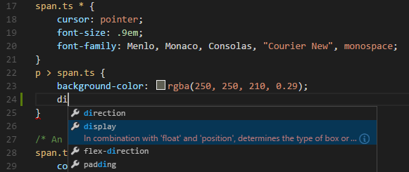

<a href="../../index.html" class="icon icon-home">vscode</a>

-

- [Home](../../index.html)

-

- - Customization
  - [Keyboard shortcuts](../../customization/keyboard-shortcuts/index.html)

-

- - Editor
  - [Accessibility](../../editor/accessibility/index.html)
  - [Codebasics](../../editor/codebasics/index.html)
  - [Command line](../../editor/command-line/index.html)
  - [Debugging](../../editor/debugging/index.html)
  - [Editingevolved](../../editor/editingevolved/index.html)
  - [Emmet](../../editor/emmet/index.html)
  - [Extension gallery](../../editor/extension-gallery/index.html)
  - [Integrated terminal](../../editor/integrated-terminal/index.html)
  - [Intellisense](../../editor/intellisense/index.html)
  - [Tasks appendix](../../editor/tasks-appendix/index.html)
  - [Tasks v1 appendix](../../editor/tasks-v1-appendix/index.html)
  - [Tasks v1](../../editor/tasks-v1/index.html)
  - [Tasks](../../editor/tasks/index.html)
  - [Userdefinedsnippets](../../editor/userdefinedsnippets/index.html)
  - [Versioncontrol](../../editor/versioncontrol/index.html)
  - [Whyvscode](../../editor/whyvscode/index.html)

-

- - extensionAPI
  - [Activation events](../../extensionAPI/activation-events/index.html)
  - [Api debugging](../../extensionAPI/api-debugging/index.html)
  - [Api markdown](../../extensionAPI/api-markdown/index.html)
  - [Api scm](../../extensionAPI/api-scm/index.html)
  - [Extension manifest](../../extensionAPI/extension-manifest/index.html)
  - [Extension points](../../extensionAPI/extension-points/index.html)
  - [Language support](../../extensionAPI/language-support/index.html)
  - [Overview](../../extensionAPI/overview/index.html)
  - [Patterns and principles](../../extensionAPI/patterns-and-principles/index.html)
  - [Vscode api commands](../../extensionAPI/vscode-api-commands/index.html)
  - [Vscode api](../../extensionAPI/vscode-api/index.html)

-

- - Extensions
  - [Debugging extensions](../../extensions/debugging-extensions/index.html)
  - [Example debuggers](../../extensions/example-debuggers/index.html)
  - [Example hello world](../../extensions/example-hello-world/index.html)
  - [Example language server](../../extensions/example-language-server/index.html)
  - [Example word count](../../extensions/example-word-count/index.html)
  - [Overview](../../extensions/overview/index.html)
  - [Publish extension](../../extensions/publish-extension/index.html)
  - [Samples](../../extensions/samples/index.html)
  - [Testing extensions](../../extensions/testing-extensions/index.html)
  - [Themes snippets colorizers](../../extensions/themes-snippets-colorizers/index.html)
  - [Yocode](../../extensions/yocode/index.html)

-

- - Getstarted
  - [Introvideos](../../getstarted/introvideos/index.html)
  - [Keybindings](../../getstarted/keybindings/index.html)
  - [Locales](../../getstarted/locales/index.html)
  - [Settings](../../getstarted/settings/index.html)
  - [Theme color reference](../../getstarted/theme-color-reference/index.html)
  - [Themes](../../getstarted/themes/index.html)
  - [Userinterface](../../getstarted/userinterface/index.html)

-

- - Introvideos
  - [Basics](../../introvideos/basics/index.html)
  - [Codeediting](../../introvideos/codeediting/index.html)
  - [Configure](../../introvideos/configure/index.html)
  - [Debugging](../../introvideos/debugging/index.html)
  - [Extend](../../introvideos/extend/index.html)
  - [Intellisense](../../introvideos/intellisense/index.html)
  - [Quicktour](../../introvideos/quicktour/index.html)
  - [Versioncontrol](../../introvideos/versioncontrol/index.html)

-

- - Languages
  - [Cpp](../cpp/index.html)
  - [Csharp](../csharp/index.html)
  - <a href="index.html" class="current">Css</a>
    - [CSS, Sass and Less](#css-sass-and-less)
    - <a href="#intellisense" class="toctree-l4">IntelliSense</a>
    - <a href="#emmet-snippets" class="toctree-l4">Emmet snippets</a>
    - <a href="#syntax-coloring-color-preview" class="toctree-l4">Syntax coloring &amp; color preview</a>
    - <a href="#syntax-verification-linting" class="toctree-l4">Syntax Verification &amp; Linting</a>
    - <a href="#go-to-symbol-in-file" class="toctree-l4">Go to Symbol in file</a>
    - <a href="#hovers" class="toctree-l4">Hovers</a>
    - <a href="#go-to-declaration-and-find-references" class="toctree-l4">Go to Declaration and Find References</a>
    - <a href="#transpiling-sass-and-less-into-css" class="toctree-l4">Transpiling Sass and Less into CSS</a>
    - <a href="#automating-sassless-compilation" class="toctree-l4">Automating Sass/Less compilation</a>
    - <a href="#customizing-css-sass-and-less-settings" class="toctree-l4">Customizing CSS, Sass and Less Settings</a>
    - <a href="#next-steps" class="toctree-l4">Next Steps</a>
    - <a href="#common-questions" class="toctree-l4">Common Questions</a>
  - [Dockerfile](../dockerfile/index.html)
  - [Go](../go/index.html)
  - [Html](../html/index.html)
  - [Identifiers](../identifiers/index.html)
  - [Javascript](../javascript/index.html)
  - [Jsconfig](../jsconfig/index.html)
  - [Json](../json/index.html)
  - [Markdown](../markdown/index.html)
  - [Overview](../overview/index.html)
  - [Php](../php/index.html)
  - [Python](../python/index.html)
  - [Tsql](../tsql/index.html)
  - [Typescript](../typescript/index.html)

-

- - Nodejs
  - [Angular tutorial](../../nodejs/angular-tutorial/index.html)
  - [Extensions](../../nodejs/extensions/index.html)
  - [Javascript transpilers](../../nodejs/javascript-transpilers/index.html)
  - [Nodejs debugging](../../nodejs/nodejs-debugging/index.html)
  - [Nodejs deployment](../../nodejs/nodejs-deployment/index.html)
  - [Nodejs tutorial](../../nodejs/nodejs-tutorial/index.html)
  - [Other javascript runtimes](../../nodejs/other-javascript-runtimes/index.html)
  - [Overview](../../nodejs/overview/index.html)
  - [Reactjs tutorial](../../nodejs/reactjs-tutorial/index.html)
  - [Tasks](../../nodejs/tasks/index.html)

-

- - Other
  - [Dotnet](../../other/dotnet/index.html)
  - [Office](../../other/office/index.html)
  - [Unity](../../other/unity/index.html)

-

- - Setup
  - [Additional components](../../setup/additional-components/index.html)
  - [Linux](../../setup/linux/index.html)
  - [Mac](../../setup/mac/index.html)
  - [Network](../../setup/network/index.html)
  - [Setup overview](../../setup/setup-overview/index.html)
  - [Windows](../../setup/windows/index.html)

-

- - Supporting
  - [Errors](../../supporting/errors/index.html)
  - [Faq](../../supporting/faq/index.html)
  - [Requirements](../../supporting/requirements/index.html)

-

[vscode](../../index.html)

- [Docs](../../index.html) »
- Languages »
- Css
-

---

# CSS, Sass and Less

Visual Studio Code has built-in support for editing style sheets in CSS `.css`, Sass `.scss` and Less `.less`. In addition, you can install an extension for greater functionality.

> Tip: Click on an extension tile above to read the description and reviews to decide which extension is best for you. See more in the [Marketplace](https://marketplace.visualstudio.com/).

## IntelliSense

We have support for selectors, properties and values. Use `kb(editor.action.triggerSuggest)` to get a list of context specific options.

Proposals contain extensive documentation, including a list of browsers that support the property. To see the full description text of the selected entry, use `kb(toggleSuggestionDetails)`.

## Emmet snippets

Emmet abbreviations are listed along with other suggestions and snippets in the editor auto-completion list.

> **Tip:** See the CSS section of the [Emmet cheat sheet](https://docs.emmet.io/cheat-sheet) for valid abbreviations.

If you'd like to use CSS Emmet abbreviations with other languages, you can associate one of the Emmet modes (such as `css`, `html`) with other languages with the `emmet.includeLanguages` [setting](https://vscode.readthedocs.io/docs/getstarted/settings.md). The setting takes a [language id](https://vscode.readthedocs.io/docs/languages/overview.md#language-id) and associates it with the language id of an Emmet supported mode.

For example, to use Emmet CSS abbreviations inside JavaScript:

    {
        "emmet.includeLanguages": {
            "javascript": "css"
         }
    }

We also support [User Defined Snippets](https://vscode.readthedocs.io/docs/editor/userdefinedsnippets.md).

## Syntax coloring & color preview

As you type, we provide syntax highlighting as well as in context preview of colors.

> **Note:** You can hide VS Code's color previews by setting the corresponding `.colorDecorators.enable` [settings](https://vscode.readthedocs.io/docs/getstarted/settings.md). `json "css.colorDecorators.enable": false`

## Syntax Verification & Linting

We support CSS version &lt;= 2.1, Sass version &lt;= 3.2 and Less version &lt;= 2.3.

> **Note:** You can disable VS Code's default CSS, Sass or Less validation by setting the corresponding `.validate` User or Workspace [setting](https://vscode.readthedocs.io/docs/getstarted/settings.md) to false. `json "css.validate": false`

## Go to Symbol in file

Press `kb(workbench.action.gotoSymbol)`.

## Hovers

Hovering over a selector or property will provide an HTML snippet that is matched by the CSS rule.

## Go to Declaration and Find References

This is supported for Sass and Less variables in the same file. [CSS variables](https://developer.mozilla.org/en-US/docs/Web/CSS/Using_CSS_variables) per the [draft standards proposal](https://drafts.csswg.org/css-variables/) are also supported.

> **Note:** Cross file references ('imports') are not resolved.

## Transpiling Sass and Less into CSS

VS Code can integrate with Sass and Less transpilers through our integrated [task runner](https://vscode.readthedocs.io/docs/editor/tasks.md). We can use this to transpile `.scss` or `.less` files into `.css` files. Let's walk through transpiling a simple Sass/Less file.

### Step 1: Install a Sass or Less transpiler

For this walkthrough, let's use either the [node-sass](https://www.npmjs.com/package/node-sass) or [less](https://www.npmjs.com/package/less) Node.js module.

> **Note:** If you don't have [Node.js](https://nodejs.org/) and the [NPM](https://www.npmjs.com/) package manager already installed, you'll need to do so for this walkthrough. [Install Node.js for your platform](https://nodejs.org/en/download/). The Node Package Manager (NPM) is included in the Node.js distribution. You'll need to open a new terminal (command prompt) for `npm` to be on your PATH.

    npm install -g node-sass less

### Step 2: Create a simple Sass or Less file

Open VS Code on an empty folder and create a `styles.scss` or `styles.less` file. Place the following code in that file:

    $padding: 6px;

    nav {
      ul {
        margin: 0;
        padding: $padding;
        list-style: none;
      }

      li { display: inline-block; }

      a {
        display: block;
        padding: $padding 12px;
        text-decoration: none;
      }
    }

For the Less version of the above file, just change `$padding` to `@padding`.

> **Note:** This is a very simple example, which is why the source code is almost identical between both file types. In more advanced scenarios, the syntaxes and constructs will be much different.

### Step 3: Create tasks.json

The next step is to set up the task configuration. To do this open the **Command Palette** with `kb(workbench.action.showCommands)` and type in **Configure Task Runner**, press `kbstyle(Enter)` to select it. In the selection dialog that shows up, select `Others`.

This will create a sample `tasks.json` file in the workspace `.vscode` folder. The initial version of file has an example to run an arbitrary command. We will modify that configuration for transpiling Less/Sass instead:

    // Less configuration
    {
        // See https://go.microsoft.com/fwlink/?LinkId=733558
        // for the documentation about the tasks.json format
        "version": "2.0.0",
        "tasks": [
            {
                "taskName": "Less Compile",
                "type": "shell",
                "command": "lessc style.less style.css",
                "group": "build"
            }
        ]
    }

    // Sass configuration
    {
        // See https://go.microsoft.com/fwlink/?LinkId=733558
        // for the documentation about the tasks.json format
        "version": "2.0.0",
        "tasks": [
            {
                "taskName": "Sass Compile",
                "type": "shell",
                "command": "node-sass style.scss style.css",
                "group": "build"
            }
        ]
    }

### Step 4: Run the Build Task

As this is the only command in the file, you can execute it by pressing `kb(workbench.action.tasks.build)` (**Run Build Task**). The sample Sass/Less file should not have any compile problems, so by running the task all that happens is a corresponding `styles.css` file is created.

Since in more complex environments there can be more than one build task we prompt you to pick the task to execute after pressing `kb(workbench.action.tasks.build)` (**Run Build Task**). In addition we allow you to scan the output for compile problems (errors and warnings). Depending on the compiler select an apropriate entry in the list to scan the tool output for errors and warnings. If you don't want to scan the output select **Never scan the build output** from the presented list.

At this point, you should see an additional file show up in the file list `sample.html`.

If you want to make the task the default build task to run execute **Configure Default Build Task** from the global **Tasks** menu and select the corresponding **Sass** or **Less** task from the presented list.

> **Note:** If your build fails or you see an error message such as "An output directory must be specified when compiling a directory", be sure the filenames in your `tasks.json` match the filenames on disk. You can always test your build by running `node-sass styles.scss styles.css` from the command line.

## Automating Sass/Less compilation

Let's take things a little further and automate Sass/Less compilation with VS Code. We can do so with the same task runner integration as before, but with a few modifications.

### Step 1: Install Gulp and some plug-ins

We will use [Gulp](http://gulpjs.com/) to create a task that will automate Sass/Less compilation. We will also use the [gulp-sass](https://www.npmjs.com/package/gulp-sass) plug-in to make things a little easier. The Less plug-in is [gulp-less](https://www.npmjs.com/package/gulp-less).

We need to install gulp both globally (`-g` switch) and locally:

    npm install -g gulp
    npm install gulp gulp-sass gulp-less

> **Note:** `gulp-sass` and `gulp-less` are Gulp plug-ins for the `node-sass` and `lessc` modules we were using before. There are many other Gulp Sass and Less plug-ins you can use, as well as plug-ins for Grunt.

You can test that your gulp installation was successful but typing `gulp -v`. You should see a version displayed for both the global (CLI) and local installations.

### Step 2: Create a simple Gulp task

Open VS Code on the same folder from before (contains `styles.scss`/`styles.less` and `tasks.json` under the `.vscode` folder), and create `gulpfile.js` at the root.

Place the following code in the `gulpfile.js` file:

    // Sass configuration
    var gulp = require('gulp');
    var sass = require('gulp-sass');

    gulp.task('sass', function() {
        gulp.src('*.scss')
            .pipe(sass())
            .pipe(gulp.dest(function(f) {
                return f.base;
            }))
    });

    gulp.task('default', ['sass'], function() {
        gulp.watch('*.scss', ['sass']);
    })

    // Less configuration
    var gulp = require('gulp');
    var less = require('gulp-less');

    gulp.task('less', function() {
        gulp.src('*.less')
            .pipe(less())
            .pipe(gulp.dest(function(f) {
                return f.base;
            }))
    });

    gulp.task('default', ['less'], function() {
        gulp.watch('*.less', ['less']);
    })

What is happening here?

1.  Our `default` gulp task first runs the `sass` or `less` task once when it starts up.
2.  It then watches for changes to any Sass/Less file at the root of our workspace, for example the current folder open in VS Code.
3.  It takes the set of Sass/Less files that have changed and runs them through our respective compiler, for example `gulp-sass`, `gulp-less`.
4.  We now have a set of CSS files, each named respectively after their original Sass/Less file. We then put these files in the same directory.

### Step 3: Run the gulp default task

To complete the tasks integration with VS Code, we will need to modify the task configuration from before to run the default Gulp task we just created. You can either delete the `tasks.json` file or empty it only keeping the `"version": "2.0.0"` property. Now execute **Run Task** from the global **Tasks** menu. Observe that you are presented with a picker listing the tasks defined in the gulp file. Select **gulp: default** to start the task. We allow you to scan the output for compile problems. Depending on the compiler select an apropriate entry in the list to scan the tool output for errors and warnings. If you don't want to scan the output select **Never scan the build output** from the presented list. At this point, if you create and/or modify Less or SASS files, you see the respective CSS files generated and/or changes reflected on save. You can also enable [Auto Save](https://vscode.readthedocs.io/docs/editor/codebasics.md#saveauto-save) to make things even more streamlined.

If you want to make the **gulp: default** task the default build task executed when pressing `kb(workbench.action.tasks.build)` run **Configure Default Build Task** from the global **Tasks** menu and select **gulp: default** from the presented list.

### Step 4: Terminate the gulp default Task

The **gulp: default** task runs in the background and watches for file changes to Markdown files. If you want to stop the task, you can use the **Terminate Running Task** from the global **Tasks** menu.

## Customizing CSS, Sass and Less Settings

You can configure the following lint warnings as [User and Workspace Settings](https://vscode.readthedocs.io/docs/getstarted/settings.md).

The `validate` setting allows you turn off the built-in validation. You would do this if you rather use a different linter.

<table><thead><tr class="header"><th>Id</th><th>Description</th><th>Default</th></tr></thead><tbody><tr class="odd"><td>css.validate</td><td>Enables or disables all css validations</td><td>true</td></tr><tr class="even"><td>less.validate</td><td>Enables or disables all less validations</td><td>true</td></tr><tr class="odd"><td>scss.validate</td><td>Enables or disables all scss validations</td><td>true</td></tr></tbody></table>

To configure an option for CSS, use `css.lint.` as the prefix to the id; for Sass and Less, use `scss.lint.` and `less.lint.`.

Set a setting to `warning` or `error` if you want to enable lint checking, use `ignore` to disable it. Lint checks are performed as you type.

<table><thead><tr class="header"><th>Id</th><th>Description</th><th>Default</th></tr></thead><tbody><tr class="odd"><td>validate</td><td>Enables or disables all validations</td><td>true</td></tr><tr class="even"><td>compatibleVendorPrefixes</td><td>When using a property with a vendor-specific prefix (for example <code>-webkit-transition</code>), make sure to also include all other vendor-specific properties eg. <code>-moz-transition</code>, <code>-ms-transition</code> and <code>-o-transition</code></td><td>ignore</td></tr><tr class="odd"><td>vendorPrefix</td><td>When using a property with a vendor-specific prefix for example <code>-webkit-transition</code>, make sure to also include the standard property if it exists eg. <code>transition</code></td><td>warning</td></tr><tr class="even"><td>duplicateProperties</td><td>Warn about duplicate properties in the same ruleset</td><td>ignore</td></tr><tr class="odd"><td>emptyRules</td><td>Warn about empty rulesets</td><td>warning</td></tr><tr class="even"><td>importStatement</td><td>Warn about using an <code>import</code> statement as import statements are loaded sequentially which has a negative impact on web page performance</td><td>ignore</td></tr><tr class="odd"><td>boxModel</td><td>Do not use <code>width</code> or <code>height</code> when using <code>padding</code> or <code>border</code></td><td>ignore</td></tr><tr class="even"><td>universalSelector</td><td>Warn when using the universal selector <code>*</code> as it is known to be slow and should be avoided</td><td>ignore</td></tr><tr class="odd"><td>zeroUnits</td><td>Warn when having zero with a unit e.g. <code>0em</code> as zero does not need a unit.</td><td>ignore</td></tr><tr class="even"><td>fontFaceProperties</td><td>Warn when using <code>@font-face</code> rule without defining a <code>src</code> and <code>font-family</code> property</td><td>warning</td></tr><tr class="odd"><td>hexColorLength</td><td>Warn when using hex numbers that don't consist of three or six hex numbers</td><td>error</td></tr><tr class="even"><td>argumentsInColorFunction</td><td>Warn when an invalid number of parameters in color functions e.g. <code>rgb</code></td><td>error</td></tr><tr class="odd"><td>unknownProperties</td><td>Warn when using an unknown property</td><td>warning</td></tr><tr class="even"><td>ieHack</td><td>Warn when using an IE hack <code>*propertyName</code> or <code>_propertyName</code></td><td>ignore</td></tr><tr class="odd"><td>unknownVendorSpecificProperties</td><td>Warn when using an unknown vendor-specific property</td><td>ignore</td></tr><tr class="even"><td>propertyIgnoredDueToDisplay</td><td>Warn when using a property that is ignored due to the display. For example with <code>display: inline</code>, the <code>width</code>, <code>height</code>, <code>margin-top</code>, <code>margin-bottom</code>, and <code>float</code> properties have no effect.</td><td>warning</td></tr><tr class="odd"><td>important</td><td>Warn when using <code>!important</code> as it is an indication that the specificity of the entire CSS has gotten out of control and needs to be refactored.</td><td>ignore</td></tr><tr class="even"><td>float</td><td>Warn when using <code>float</code> as floats lead to fragile CSS that is easy to break if one aspect of the layout changes.</td><td>ignore</td></tr><tr class="odd"><td>idSelector</td><td>Warn when using selectors for an id <code>#id</code> as selectors should not contain IDs because these rules are too tightly coupled with the HTML.</td><td>ignore</td></tr></tbody></table>

## Next Steps

Read on to find out about:

- [Configure Tasks](https://vscode.readthedocs.io/docs/editor/tasks.md) - Dig into Tasks to help you transpile your Sass and Less to CSS.
- [Basic Editing](https://vscode.readthedocs.io/docs/editor/codebasics.md) - Learn about the powerful VS Code editor.
- [Code Navigation](https://vscode.readthedocs.io/docs/editor/editingevolved.md) - Move quickly through your source code.
- [HTML](https://vscode.readthedocs.io/docs/languages/html.md) - CSS is just the start, HTML is also very well supported in VS Code.

## Common Questions

**Q: Do you provide a color picker?**

**A:** Yes, color picker has been added in version 1.15.

**Q: Do you support the indentation based Sass syntax (.sass) ?**

**A:** No, but there are several extensions in the Marketplace supporting the indented flavor of Sass.

<a href="../dockerfile/index.html" class="btn btn-neutral float-right" title="Dockerfile">Next </a> <a href="../csharp/index.html" class="btn btn-neutral" title="Csharp"> Previous</a>

---

  Read the Docs  
