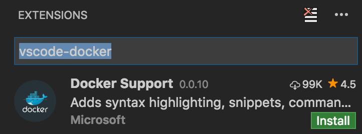
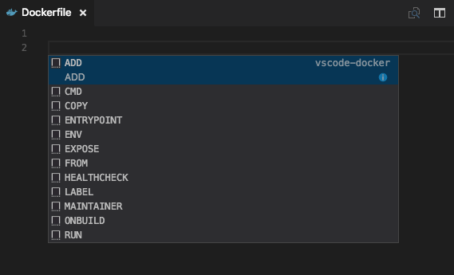
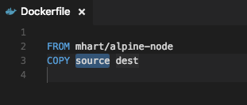
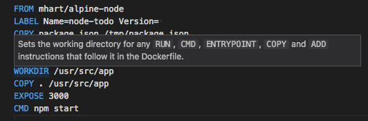
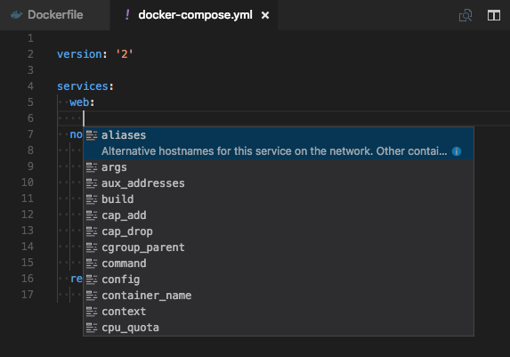
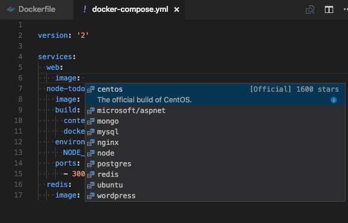
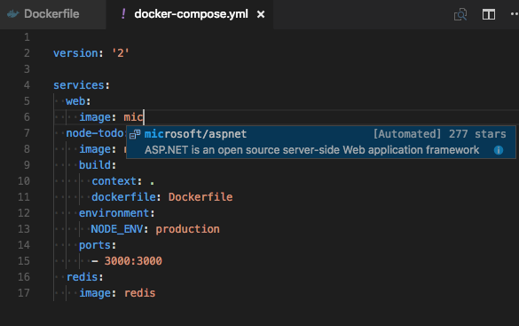
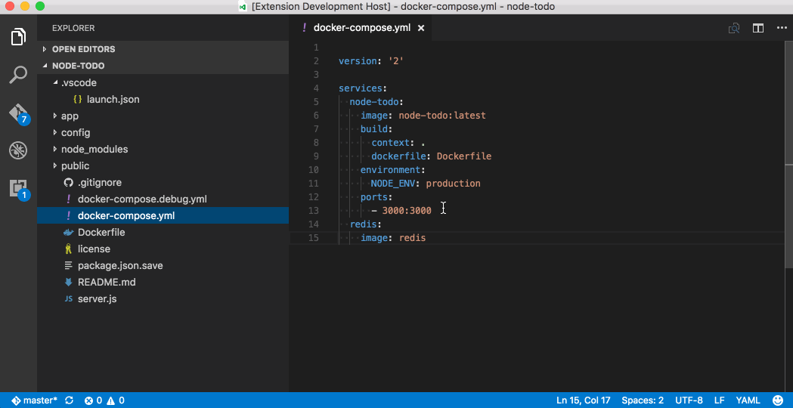
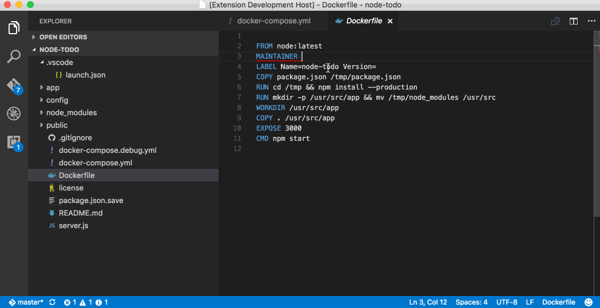

<a href="../../index.html" class="icon icon-home">vscode</a>

-

- [Home](../../index.html)

-

- - Customization
  - [Keyboard shortcuts](../../customization/keyboard-shortcuts/index.html)

-

- - Editor
  - [Accessibility](../../editor/accessibility/index.html)
  - [Codebasics](../../editor/codebasics/index.html)
  - [Command line](../../editor/command-line/index.html)
  - [Debugging](../../editor/debugging/index.html)
  - [Editingevolved](../../editor/editingevolved/index.html)
  - [Emmet](../../editor/emmet/index.html)
  - [Extension gallery](../../editor/extension-gallery/index.html)
  - [Integrated terminal](../../editor/integrated-terminal/index.html)
  - [Intellisense](../../editor/intellisense/index.html)
  - [Tasks appendix](../../editor/tasks-appendix/index.html)
  - [Tasks v1 appendix](../../editor/tasks-v1-appendix/index.html)
  - [Tasks v1](../../editor/tasks-v1/index.html)
  - [Tasks](../../editor/tasks/index.html)
  - [Userdefinedsnippets](../../editor/userdefinedsnippets/index.html)
  - [Versioncontrol](../../editor/versioncontrol/index.html)
  - [Whyvscode](../../editor/whyvscode/index.html)

-

- - extensionAPI
  - [Activation events](../../extensionAPI/activation-events/index.html)
  - [Api debugging](../../extensionAPI/api-debugging/index.html)
  - [Api markdown](../../extensionAPI/api-markdown/index.html)
  - [Api scm](../../extensionAPI/api-scm/index.html)
  - [Extension manifest](../../extensionAPI/extension-manifest/index.html)
  - [Extension points](../../extensionAPI/extension-points/index.html)
  - [Language support](../../extensionAPI/language-support/index.html)
  - [Overview](../../extensionAPI/overview/index.html)
  - [Patterns and principles](../../extensionAPI/patterns-and-principles/index.html)
  - [Vscode api commands](../../extensionAPI/vscode-api-commands/index.html)
  - [Vscode api](../../extensionAPI/vscode-api/index.html)

-

- - Extensions
  - [Debugging extensions](../../extensions/debugging-extensions/index.html)
  - [Example debuggers](../../extensions/example-debuggers/index.html)
  - [Example hello world](../../extensions/example-hello-world/index.html)
  - [Example language server](../../extensions/example-language-server/index.html)
  - [Example word count](../../extensions/example-word-count/index.html)
  - [Overview](../../extensions/overview/index.html)
  - [Publish extension](../../extensions/publish-extension/index.html)
  - [Samples](../../extensions/samples/index.html)
  - [Testing extensions](../../extensions/testing-extensions/index.html)
  - [Themes snippets colorizers](../../extensions/themes-snippets-colorizers/index.html)
  - [Yocode](../../extensions/yocode/index.html)

-

- - Getstarted
  - [Introvideos](../../getstarted/introvideos/index.html)
  - [Keybindings](../../getstarted/keybindings/index.html)
  - [Locales](../../getstarted/locales/index.html)
  - [Settings](../../getstarted/settings/index.html)
  - [Theme color reference](../../getstarted/theme-color-reference/index.html)
  - [Themes](../../getstarted/themes/index.html)
  - [Userinterface](../../getstarted/userinterface/index.html)

-

- - Introvideos
  - [Basics](../../introvideos/basics/index.html)
  - [Codeediting](../../introvideos/codeediting/index.html)
  - [Configure](../../introvideos/configure/index.html)
  - [Debugging](../../introvideos/debugging/index.html)
  - [Extend](../../introvideos/extend/index.html)
  - [Intellisense](../../introvideos/intellisense/index.html)
  - [Quicktour](../../introvideos/quicktour/index.html)
  - [Versioncontrol](../../introvideos/versioncontrol/index.html)

-

- - Languages
  - [Cpp](../cpp/index.html)
  - [Csharp](../csharp/index.html)
  - [Css](../css/index.html)
  - <a href="index.html" class="current">Dockerfile</a>
    - [Working with Docker](#working-with-docker)
    - <a href="#install-the-docker-extension" class="toctree-l4">Install the Docker extension</a>
    - <a href="#dockerfiles" class="toctree-l4">Dockerfiles</a>
    - <a href="#docker-compose" class="toctree-l4">Docker Compose</a>
    - <a href="#docker-commands" class="toctree-l4">Docker commands</a>
    - <a href="#dockerfile-linting" class="toctree-l4">Dockerfile linting</a>
    - <a href="#running-commands-on-linux" class="toctree-l4">Running commands on Linux</a>
  - [Go](../go/index.html)
  - [Html](../html/index.html)
  - [Identifiers](../identifiers/index.html)
  - [Javascript](../javascript/index.html)
  - [Jsconfig](../jsconfig/index.html)
  - [Json](../json/index.html)
  - [Markdown](../markdown/index.html)
  - [Overview](../overview/index.html)
  - [Php](../php/index.html)
  - [Python](../python/index.html)
  - [Tsql](../tsql/index.html)
  - [Typescript](../typescript/index.html)

-

- - Nodejs
  - [Angular tutorial](../../nodejs/angular-tutorial/index.html)
  - [Extensions](../../nodejs/extensions/index.html)
  - [Javascript transpilers](../../nodejs/javascript-transpilers/index.html)
  - [Nodejs debugging](../../nodejs/nodejs-debugging/index.html)
  - [Nodejs deployment](../../nodejs/nodejs-deployment/index.html)
  - [Nodejs tutorial](../../nodejs/nodejs-tutorial/index.html)
  - [Other javascript runtimes](../../nodejs/other-javascript-runtimes/index.html)
  - [Overview](../../nodejs/overview/index.html)
  - [Reactjs tutorial](../../nodejs/reactjs-tutorial/index.html)
  - [Tasks](../../nodejs/tasks/index.html)

-

- - Other
  - [Dotnet](../../other/dotnet/index.html)
  - [Office](../../other/office/index.html)
  - [Unity](../../other/unity/index.html)

-

- - Setup
  - [Additional components](../../setup/additional-components/index.html)
  - [Linux](../../setup/linux/index.html)
  - [Mac](../../setup/mac/index.html)
  - [Network](../../setup/network/index.html)
  - [Setup overview](../../setup/setup-overview/index.html)
  - [Windows](../../setup/windows/index.html)

-

- - Supporting
  - [Errors](../../supporting/errors/index.html)
  - [Faq](../../supporting/faq/index.html)
  - [Requirements](../../supporting/requirements/index.html)

-

[vscode](../../index.html)

- [Docs](../../index.html) »
- Languages »
- Dockerfile
-

---

# Working with Docker

[Docker](https://www.docker.com/) is a very popular container platform that lets you easily package, deploy, and consume applications and services. Whether you are a seasoned Docker developer or just getting started, Visual Studio Code makes it easy to author `Dockerfile` and `docker-compose.yml` files in your workspace.

## Install the Docker extension

Docker support for VS Code is provided by an extension. To install the Docker extension, open the Extension Viewlet by pressing `kb(workbench.view.extensions)` and search for `vscode-docker` to filter the results. Select the [Docker Support](https://marketplace.visualstudio.com/items?itemName=PeterJausovec.vscode-docker) extension.

While here, you can install many other extensions to make you more productive with VS Code.

> Tip: The extensions are dynamically queried. Click on an extension tile to read the description and reviews to decide which extension is best for you. See more in the [Marketplace](https://marketplace.visualstudio.com/).

## Dockerfiles

With Docker, you can build images by specifying the step by step commands needed to build the image in a `Dockerfile`. A Dockerfile is just a text file that contains the build instructions.

VS Code understands the structure of Dockerfiles as well as the available set of instructions, meaning we can give you a great experience when authoring these files in the tool.

1.  Create a new file in your workspace named `Dockerfile`
2.  Press `kb(editor.action.triggerSuggest)` to bring up a list of snippets corresponding to valid `Dockerfile` commands

1.  Press `kbstyle(Tab)` to move between fields within the snippet. For example, with the `COPY` snippet you can fill in the `source` and then press `kbstyle(Tab)` to move to the `dest` field.

In addition to snippets for authoring your `Dockerfile`, Visual Studio Code will provide you with a description of any Docker command you hover over with the mouse. For example, when hovering over `WORKDIR` you will see the following.

For more information on Dockerfiles, check out [Dockerfile best practices](https://docs.docker.com/articles/dockerfile_best-practices/) on [docker.com](https://docker.com/).

## Docker Compose

[Docker Compose](https://docs.docker.com/compose/) lets you define and run multi-container applications with Docker. You define what the shape of these containers look like with a file called `docker-compose.yml`.

Visual Studio Code's experience for authoring `docker-compose.yml` is also very rich, providing IntelliSense for valid Docker compose directives and it will query Docker Hub for metadata on public Docker images.

1.  Create a new file in your workspace called `docker-compose.yml`
2.  Define a new service called `web:`
3.  On the second line, bring up IntelliSense by pressing `kb(editor.action.triggerSuggest)` to see a list of all valid compose directives.

1.  For the `image` directive, you can press `kb(editor.action.triggerSuggest)` again and VS Code will query the Docker Hub index for public images.

VS Code will first show a list of popular images along with metadata such as the number of stars and description. If you continue typing VS Code will query the Docker Hub index for matching images, including searching public profiles. For example, searching for `Microsoft` will show you all the public Microsoft images.

## Docker commands

Many of the most common Docker and docker-compose commands are built right into the **Command Palette** (`kb(workbench.action.showCommands)`).

## Dockerfile linting

You can enable linting of Dockerfile files through the `docker.enableLinting` [setting](https://vscode.readthedocs.io/docs/getstarted/settings.md). The extension uses the [dockerfile_lint](https://github.com/projectatomic/dockerfile_lint) rules based linter to analyze the Dockerfile. You can provide your own customized rules file by using the `docker.linterRuleFile` setting. You can find [more information](https://github.com/projectatomic/dockerfile_lint#extending-and-customizing-rule-files) on how to create rules files as well as [sample rules files](https://github.com/projectatomic/dockerfile_lint/tree/master/sample_rules) in the [dockerfile_lint](https://github.com/projectatomic/dockerfile_lint) project.

## Running commands on Linux

By default, Docker runs as the root user on Linux, requiring other users to access it with `sudo`. This extension does not assume root access, so you will need to create a Unix group called "docker" and add users to it. Instructions can be found here: [Create a Docker group](https://docs.docker.com/engine/installation/linux/ubuntulinux/#/create-a-docker-group)

<a href="../go/index.html" class="btn btn-neutral float-right" title="Go">Next </a> <a href="../css/index.html" class="btn btn-neutral" title="Css"> Previous</a>

---

  Read the Docs  
