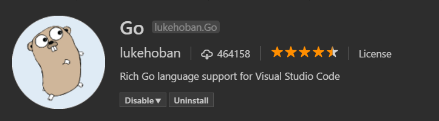
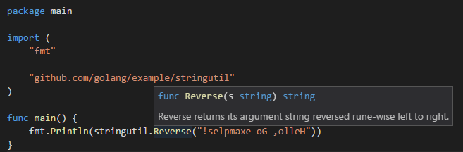

<a href="../../index.html" class="icon icon-home">vscode</a>

-

- [Home](../../index.html)

-

- - Customization
  - [Keyboard shortcuts](../../customization/keyboard-shortcuts/index.html)

-

- - Editor
  - [Accessibility](../../editor/accessibility/index.html)
  - [Codebasics](../../editor/codebasics/index.html)
  - [Command line](../../editor/command-line/index.html)
  - [Debugging](../../editor/debugging/index.html)
  - [Editingevolved](../../editor/editingevolved/index.html)
  - [Emmet](../../editor/emmet/index.html)
  - [Extension gallery](../../editor/extension-gallery/index.html)
  - [Integrated terminal](../../editor/integrated-terminal/index.html)
  - [Intellisense](../../editor/intellisense/index.html)
  - [Tasks appendix](../../editor/tasks-appendix/index.html)
  - [Tasks v1 appendix](../../editor/tasks-v1-appendix/index.html)
  - [Tasks v1](../../editor/tasks-v1/index.html)
  - [Tasks](../../editor/tasks/index.html)
  - [Userdefinedsnippets](../../editor/userdefinedsnippets/index.html)
  - [Versioncontrol](../../editor/versioncontrol/index.html)
  - [Whyvscode](../../editor/whyvscode/index.html)

-

- - extensionAPI
  - [Activation events](../../extensionAPI/activation-events/index.html)
  - [Api debugging](../../extensionAPI/api-debugging/index.html)
  - [Api markdown](../../extensionAPI/api-markdown/index.html)
  - [Api scm](../../extensionAPI/api-scm/index.html)
  - [Extension manifest](../../extensionAPI/extension-manifest/index.html)
  - [Extension points](../../extensionAPI/extension-points/index.html)
  - [Language support](../../extensionAPI/language-support/index.html)
  - [Overview](../../extensionAPI/overview/index.html)
  - [Patterns and principles](../../extensionAPI/patterns-and-principles/index.html)
  - [Vscode api commands](../../extensionAPI/vscode-api-commands/index.html)
  - [Vscode api](../../extensionAPI/vscode-api/index.html)

-

- - Extensions
  - [Debugging extensions](../../extensions/debugging-extensions/index.html)
  - [Example debuggers](../../extensions/example-debuggers/index.html)
  - [Example hello world](../../extensions/example-hello-world/index.html)
  - [Example language server](../../extensions/example-language-server/index.html)
  - [Example word count](../../extensions/example-word-count/index.html)
  - [Overview](../../extensions/overview/index.html)
  - [Publish extension](../../extensions/publish-extension/index.html)
  - [Samples](../../extensions/samples/index.html)
  - [Testing extensions](../../extensions/testing-extensions/index.html)
  - [Themes snippets colorizers](../../extensions/themes-snippets-colorizers/index.html)
  - [Yocode](../../extensions/yocode/index.html)

-

- - Getstarted
  - [Introvideos](../../getstarted/introvideos/index.html)
  - [Keybindings](../../getstarted/keybindings/index.html)
  - [Locales](../../getstarted/locales/index.html)
  - [Settings](../../getstarted/settings/index.html)
  - [Theme color reference](../../getstarted/theme-color-reference/index.html)
  - [Themes](../../getstarted/themes/index.html)
  - [Userinterface](../../getstarted/userinterface/index.html)

-

- - Introvideos
  - [Basics](../../introvideos/basics/index.html)
  - [Codeediting](../../introvideos/codeediting/index.html)
  - [Configure](../../introvideos/configure/index.html)
  - [Debugging](../../introvideos/debugging/index.html)
  - [Extend](../../introvideos/extend/index.html)
  - [Intellisense](../../introvideos/intellisense/index.html)
  - [Quicktour](../../introvideos/quicktour/index.html)
  - [Versioncontrol](../../introvideos/versioncontrol/index.html)

-

- - Languages
  - [Cpp](../cpp/index.html)
  - [Csharp](../csharp/index.html)
  - [Css](../css/index.html)
  - [Dockerfile](../dockerfile/index.html)
  - <a href="index.html" class="current">Go</a>
    - [Go programming in VS Code](#go-programming-in-vs-code)
    - <a href="#intellisense" class="toctree-l4">IntelliSense</a>
    - <a href="#code-navigation" class="toctree-l4">Code navigation</a>
    - <a href="#build-lint-and-vet" class="toctree-l4">Build, Lint and Vet</a>
    - <a href="#formatting" class="toctree-l4">Formatting</a>
    - <a href="#test" class="toctree-l4">Test</a>
    - <a href="#import-packages" class="toctree-l4">Import packages</a>
    - <a href="#rename-symbols" class="toctree-l4">Rename Symbols</a>
    - <a href="#debugging" class="toctree-l4">Debugging</a>
    - <a href="#next-steps" class="toctree-l4">Next Steps</a>
  - [Html](../html/index.html)
  - [Identifiers](../identifiers/index.html)
  - [Javascript](../javascript/index.html)
  - [Jsconfig](../jsconfig/index.html)
  - [Json](../json/index.html)
  - [Markdown](../markdown/index.html)
  - [Overview](../overview/index.html)
  - [Php](../php/index.html)
  - [Python](../python/index.html)
  - [Tsql](../tsql/index.html)
  - [Typescript](../typescript/index.html)

-

- - Nodejs
  - [Angular tutorial](../../nodejs/angular-tutorial/index.html)
  - [Extensions](../../nodejs/extensions/index.html)
  - [Javascript transpilers](../../nodejs/javascript-transpilers/index.html)
  - [Nodejs debugging](../../nodejs/nodejs-debugging/index.html)
  - [Nodejs deployment](../../nodejs/nodejs-deployment/index.html)
  - [Nodejs tutorial](../../nodejs/nodejs-tutorial/index.html)
  - [Other javascript runtimes](../../nodejs/other-javascript-runtimes/index.html)
  - [Overview](../../nodejs/overview/index.html)
  - [Reactjs tutorial](../../nodejs/reactjs-tutorial/index.html)
  - [Tasks](../../nodejs/tasks/index.html)

-

- - Other
  - [Dotnet](../../other/dotnet/index.html)
  - [Office](../../other/office/index.html)
  - [Unity](../../other/unity/index.html)

-

- - Setup
  - [Additional components](../../setup/additional-components/index.html)
  - [Linux](../../setup/linux/index.html)
  - [Mac](../../setup/mac/index.html)
  - [Network](../../setup/network/index.html)
  - [Setup overview](../../setup/setup-overview/index.html)
  - [Windows](../../setup/windows/index.html)

-

- - Supporting
  - [Errors](../../supporting/errors/index.html)
  - [Faq](../../supporting/faq/index.html)
  - [Requirements](../../supporting/requirements/index.html)

-

[vscode](../../index.html)

- [Docs](../../index.html) »
- Languages »
- Go
-

---

# Go programming in VS Code

Using the Go extension for Visual Studio Code, you get language features like IntelliSense, code navigation, symbol search, bracket matching, snippets and many more that will help you in [Golang](https://golang.org/) development.

You can install the Go extension from the VS Code [Marketplace](https://marketplace.visualstudio.com/items?itemName=lukehoban.Go).

## IntelliSense

### Auto completions

As you type in a Go file, you can see IntelliSense providing you with suggested completions. This even works for members in current, imported, and not yet imported packages. Just type any package name followed by `.`, and you will get suggestions for the corresponding package members.

By setting `go.autocompleteUnimportedPackages` to `true` in your [settings](https://vscode.readthedocs.io/docs/getstarted/settings.md), you can also get suggestion for packages that you could import. Select one of these suggestions and an import to the selected package will be added to your file.

> **Tip**: Use `kb(editor.action.triggerSuggest)` to trigger the suggestions manually.

### Hover Information

Hovering on any variable, function, or struct will give you information on that item such as documentation, signature, etc.

By default, the extension uses `godef` and `godoc` to get this information. You can choose to use `gogetdoc` instead by changing the setting `go.docsTool` in your User or Workspace Settings.

### Signature help

When you open the `(` while calling a function, a pop-up provides signature help for the function. As you keep typing the parameters, the hint (underline) moves to the next parameter.

> **Tip**: Use `kb(editor.action.triggerParameterHints)` to manually trigger the signature help when the cursor is inside the `()` in the function call.

The extension's signature help also uses `godef` and `godoc`. You can choose to use `gogetdoc` instead by changing the setting `go.docsTool` in your User or Workspace Settings.

## Code navigation

Code navigation features are available in the context menu in the editor.

- **Go To Definition** `kb(editor.action.goToDeclaration)` - Go to the source code of the type definition.
- **Peek Definition** `kb(editor.action.previewDeclaration)` - Bring up a Peek window with the type definition.
- **Find All References** `kb(editor.action.referenceSearch.trigger)` - Find all references for the type.

You can navigate via symbol search using the **Go to Symbol** commands from the **Command Palette** (`kb(workbench.action.showCommands)`).

- Go to Symbol in File - `kb(workbench.action.gotoSymbol)`
- Go to Symbol in Workspace - `kb(workbench.action.showAllSymbols)`

You can also navigate back and forth between a Go file and its test implementation using the **Go: Toggle Test File** command.

## Build, Lint and Vet

On save, the Go extension can run `go build`, `go vet` and your choice of linting tool (`golint` or `gometalinter`) on the package of the current file. You can control these features via the settings below:

- `go.buildOnSave`
- `go.buildFlags`
- `go.vetOnSave`
- `go.vetFlags`
- `go.lintOnSave`
- `go.lintFlags`
- `go.lintTool`
- `go.testOnSave`

The errors and warnings from running any/all of the above will be shown red/green squiggly lines in the editor. These also show up in the **Problems** panel (**View** &gt; **Problems**).

## Formatting

You can format your Go file using `kb(editor.action.formatDocument)` or by running the **Format Document** command from the **Command Palette** or the context menu in the editor.

By default, formatting is run when you save your Go file. You can disable this behavior by setting `go.formatOnSave` to `false`.

You can choose among three formatting tools: `gofmt`, `goreturns` and `goimports` by changing the setting `go.formatTool`.

## Test

There are many test related commands that you can explore by typing "Go: test" in the **Command Palette**.

The first three above can be used to generate test skeletons for the functions in the current package, file or at cursor using `gotests`. The last few can be used to run tests in the current package, file or at cursor using `go test`. There is also a command for getting test coverage.

## Import packages

Run the command **Go: Add Import** to get a list of packages that can be imported to your Go file. Choose one and it will get added in the import block of your Go file.

## Rename Symbols

You can rename symbols using `kb(editor.action.rename)` or by running the **Rename Symbol** command in the context menu in the editor.

## Debugging

The Go extension lets you debug Go code as well. You will need to install the [Delve](https://github.com/derekparker/delve) debugger manually as a prerequisite. Read [Debugging Go code using VS Code](https://github.com/Microsoft/vscode-go/wiki/Debugging-Go-code-using-VS-Code) for setup steps, information on remote debugging and a troubleshooting guide.

## Next Steps

This has been a brief overview showing the Go extension features within VS Code. For more information, see the details provided in the Go extension [README](https://marketplace.visualstudio.com/items?itemName=lukehoban.Go).

To stay up to date on the latest features/bug fixes for the Go extension, see the [CHANGELOG](https://github.com/Microsoft/vscode-go/blob/master/CHANGELOG.md).

If you have any issues or feature requests, feel free to log them in the Go extension [repo](https://github.com/Microsoft/vscode-go/issues).

If you'd like to learn more about VS Code, try these topics:

- [Basic Editing](https://vscode.readthedocs.io/docs/editor/codebasics.md) - A quick introduction to the basics of the VS Code editor.
- [Install an Extension](https://vscode.readthedocs.io/docs/editor/extension-gallery.md) - Learn about other extensions are available in the [Marketplace](https://marketplace.visualstudio.com/vscode).
- [Code Navigation](https://vscode.readthedocs.io/docs/editor/editingevolved.md) - Move quickly through your source code.

<a href="../html/index.html" class="btn btn-neutral float-right" title="Html">Next </a> <a href="../dockerfile/index.html" class="btn btn-neutral" title="Dockerfile"> Previous</a>

---

  Read the Docs  
