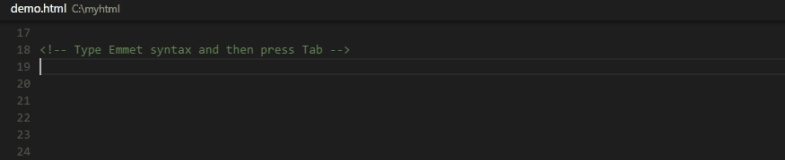

<a href="../../index.html" class="icon icon-home">vscode</a>

-

- [Home](../../index.html)

-

- - Customization
  - [Keyboard shortcuts](../../customization/keyboard-shortcuts/index.html)

-

- - Editor
  - [Accessibility](../../editor/accessibility/index.html)
  - [Codebasics](../../editor/codebasics/index.html)
  - [Command line](../../editor/command-line/index.html)
  - [Debugging](../../editor/debugging/index.html)
  - [Editingevolved](../../editor/editingevolved/index.html)
  - [Emmet](../../editor/emmet/index.html)
  - [Extension gallery](../../editor/extension-gallery/index.html)
  - [Integrated terminal](../../editor/integrated-terminal/index.html)
  - [Intellisense](../../editor/intellisense/index.html)
  - [Tasks appendix](../../editor/tasks-appendix/index.html)
  - [Tasks v1 appendix](../../editor/tasks-v1-appendix/index.html)
  - [Tasks v1](../../editor/tasks-v1/index.html)
  - [Tasks](../../editor/tasks/index.html)
  - [Userdefinedsnippets](../../editor/userdefinedsnippets/index.html)
  - [Versioncontrol](../../editor/versioncontrol/index.html)
  - [Whyvscode](../../editor/whyvscode/index.html)

-

- - extensionAPI
  - [Activation events](../../extensionAPI/activation-events/index.html)
  - [Api debugging](../../extensionAPI/api-debugging/index.html)
  - [Api markdown](../../extensionAPI/api-markdown/index.html)
  - [Api scm](../../extensionAPI/api-scm/index.html)
  - [Extension manifest](../../extensionAPI/extension-manifest/index.html)
  - [Extension points](../../extensionAPI/extension-points/index.html)
  - [Language support](../../extensionAPI/language-support/index.html)
  - [Overview](../../extensionAPI/overview/index.html)
  - [Patterns and principles](../../extensionAPI/patterns-and-principles/index.html)
  - [Vscode api commands](../../extensionAPI/vscode-api-commands/index.html)
  - [Vscode api](../../extensionAPI/vscode-api/index.html)

-

- - Extensions
  - [Debugging extensions](../../extensions/debugging-extensions/index.html)
  - [Example debuggers](../../extensions/example-debuggers/index.html)
  - [Example hello world](../../extensions/example-hello-world/index.html)
  - [Example language server](../../extensions/example-language-server/index.html)
  - [Example word count](../../extensions/example-word-count/index.html)
  - [Overview](../../extensions/overview/index.html)
  - [Publish extension](../../extensions/publish-extension/index.html)
  - [Samples](../../extensions/samples/index.html)
  - [Testing extensions](../../extensions/testing-extensions/index.html)
  - [Themes snippets colorizers](../../extensions/themes-snippets-colorizers/index.html)
  - [Yocode](../../extensions/yocode/index.html)

-

- - Getstarted
  - [Introvideos](../../getstarted/introvideos/index.html)
  - [Keybindings](../../getstarted/keybindings/index.html)
  - [Locales](../../getstarted/locales/index.html)
  - [Settings](../../getstarted/settings/index.html)
  - [Theme color reference](../../getstarted/theme-color-reference/index.html)
  - [Themes](../../getstarted/themes/index.html)
  - [Userinterface](../../getstarted/userinterface/index.html)

-

- - Introvideos
  - [Basics](../../introvideos/basics/index.html)
  - [Codeediting](../../introvideos/codeediting/index.html)
  - [Configure](../../introvideos/configure/index.html)
  - [Debugging](../../introvideos/debugging/index.html)
  - [Extend](../../introvideos/extend/index.html)
  - [Intellisense](../../introvideos/intellisense/index.html)
  - [Quicktour](../../introvideos/quicktour/index.html)
  - [Versioncontrol](../../introvideos/versioncontrol/index.html)

-

- - Languages
  - [Cpp](../cpp/index.html)
  - [Csharp](../csharp/index.html)
  - [Css](../css/index.html)
  - [Dockerfile](../dockerfile/index.html)
  - [Go](../go/index.html)
  - <a href="index.html" class="current">Html</a>
    - [HTML Programming in VS Code](#html-programming-in-vs-code)
    - <a href="#intellisense" class="toctree-l4">IntelliSense</a>
    - <a href="#hover" class="toctree-l4">Hover</a>
    - <a href="#validation" class="toctree-l4">Validation</a>
    - <a href="#format-html" class="toctree-l4">Format HTML</a>
    - <a href="#emmet-snippets" class="toctree-l4">Emmet snippets</a>
    - <a href="#next-steps" class="toctree-l4">Next Steps</a>
  - [Identifiers](../identifiers/index.html)
  - [Javascript](../javascript/index.html)
  - [Jsconfig](../jsconfig/index.html)
  - [Json](../json/index.html)
  - [Markdown](../markdown/index.html)
  - [Overview](../overview/index.html)
  - [Php](../php/index.html)
  - [Python](../python/index.html)
  - [Tsql](../tsql/index.html)
  - [Typescript](../typescript/index.html)

-

- - Nodejs
  - [Angular tutorial](../../nodejs/angular-tutorial/index.html)
  - [Extensions](../../nodejs/extensions/index.html)
  - [Javascript transpilers](../../nodejs/javascript-transpilers/index.html)
  - [Nodejs debugging](../../nodejs/nodejs-debugging/index.html)
  - [Nodejs deployment](../../nodejs/nodejs-deployment/index.html)
  - [Nodejs tutorial](../../nodejs/nodejs-tutorial/index.html)
  - [Other javascript runtimes](../../nodejs/other-javascript-runtimes/index.html)
  - [Overview](../../nodejs/overview/index.html)
  - [Reactjs tutorial](../../nodejs/reactjs-tutorial/index.html)
  - [Tasks](../../nodejs/tasks/index.html)

-

- - Other
  - [Dotnet](../../other/dotnet/index.html)
  - [Office](../../other/office/index.html)
  - [Unity](../../other/unity/index.html)

-

- - Setup
  - [Additional components](../../setup/additional-components/index.html)
  - [Linux](../../setup/linux/index.html)
  - [Mac](../../setup/mac/index.html)
  - [Network](../../setup/network/index.html)
  - [Setup overview](../../setup/setup-overview/index.html)
  - [Windows](../../setup/windows/index.html)

-

- - Supporting
  - [Errors](../../supporting/errors/index.html)
  - [Faq](../../supporting/faq/index.html)
  - [Requirements](../../supporting/requirements/index.html)

-

[vscode](../../index.html)

- [Docs](../../index.html) »
- Languages »
- Html
-

---

# HTML Programming in VS Code

VS Code provides basic support for HTML programming out of the box. Install an extension for greater functionality.

> Tip: Click on an extension tile above to read the description and reviews to decide which extension is best for you. See more in the [Marketplace](https://marketplace.visualstudio.com/).

## IntelliSense

As you type in HTML, we offer suggestions via HTML IntelliSense. In the image below you can see a suggested HTML element closure `
` as well as a context specific list of suggested elements.

We also offer up suggestions for elements, tags, some values (as defined in HTML 5), Ionic and AngularJS tags,

You can also work with embedded CSS and JavaScript. However, note that script and style includes are not followed, the language support only looks at the content of the HTML file.

You can trigger suggestions at any time by pressing `kb(editor.action.triggerSuggest)`.

You can also control which built-in code completion providers are active. Override these in your user or workspace [settings](https://vscode.readthedocs.io/docs/getstarted/settings.md) if you prefer not to see the corresponding suggestions.

    // Configures if the built-in HTML language suggests Angular V1 tags and properties.
    "html.suggest.angular1": true,

    // Configures if the built-in HTML language suggests Ionic tags, properties and values.
    "html.suggest.ionic": true,

    // Configures if the built-in HTML language suggests HTML5 tags, properties and values.
    "html.suggest.html5": true

## Hover

Move the mouse over HTML tags or embedded styles and JavaScript to get more information on the symbol under the cursor.

## Validation

The HTML language support performs validation on all embedded JavaScript and CSS.

You can turn that validation off with the following settings:

    // Configures if the built-in HTML language support validates embedded scripts.
    "html.validate.scripts": true,

    // Configures if the built-in HTML language support validates embedded styles.
    "html.validate.styles": true

## Format HTML

To improve the formatting of your HTML source code, press `kb(editor.action.formatSelection)` and the selected area will be reformatted.

> **Tip:** The formatter does not format the tags listed in the `html.format.unformatted` settings. Embedded JavaScript is formatted unless 'script' tags are excluded.
>
> **Tip:** Configure the HTML formatter settings in the [User and Workspace Settings](https://vscode.readthedocs.io/docs/getstarted/settings.md).

## Emmet snippets

We support Emmet snippet expansion. Emmet abbreviations are listed along with other suggestions and snippets in the editor auto-completion list.

> **Tip:** See the HTML section of the [Emmet cheat sheet](https://docs.emmet.io/cheat-sheet) for valid abbreviations.

If you'd like to use HTML Emmet abbreviations with other languages, you can associate one of the Emmet modes (such as `css`, `html`) with other languages with the `emmet.includeLanguages` [setting](https://vscode.readthedocs.io/docs/getstarted/settings.md). The setting takes a [language id](https://vscode.readthedocs.io/docs/languages/overview.md#language-id) and associates it with the language id of an Emmet supported mode.

For example, to use Emmet HTML abbreviations inside JavaScript:

    {
        "emmet.includeLanguages": {
            "javascript": "html"
         }
    }

We also support [User Defined Snippets](https://vscode.readthedocs.io/docs/editor/userdefinedsnippets.md).

## Next Steps

Read on to find out about:

- [CSS, Less and Sass](https://vscode.readthedocs.io/docs/languages/css.md) - VS Code has first class support for CSS including Less and Sass.

<a href="../identifiers/index.html" class="btn btn-neutral float-right" title="Identifiers">Next </a> <a href="../go/index.html" class="btn btn-neutral" title="Go"> Previous</a>

---

  Read the Docs  
