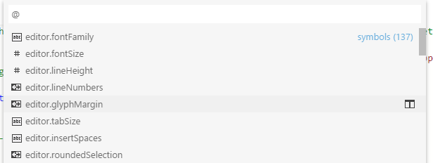
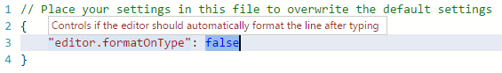

<a href="../../index.html" class="icon icon-home">vscode</a>

-

- [Home](../../index.html)

-

- - Customization
  - [Keyboard shortcuts](../../customization/keyboard-shortcuts/index.html)

-

- - Editor
  - [Accessibility](../../editor/accessibility/index.html)
  - [Codebasics](../../editor/codebasics/index.html)
  - [Command line](../../editor/command-line/index.html)
  - [Debugging](../../editor/debugging/index.html)
  - [Editingevolved](../../editor/editingevolved/index.html)
  - [Emmet](../../editor/emmet/index.html)
  - [Extension gallery](../../editor/extension-gallery/index.html)
  - [Integrated terminal](../../editor/integrated-terminal/index.html)
  - [Intellisense](../../editor/intellisense/index.html)
  - [Tasks appendix](../../editor/tasks-appendix/index.html)
  - [Tasks v1 appendix](../../editor/tasks-v1-appendix/index.html)
  - [Tasks v1](../../editor/tasks-v1/index.html)
  - [Tasks](../../editor/tasks/index.html)
  - [Userdefinedsnippets](../../editor/userdefinedsnippets/index.html)
  - [Versioncontrol](../../editor/versioncontrol/index.html)
  - [Whyvscode](../../editor/whyvscode/index.html)

-

- - extensionAPI
  - [Activation events](../../extensionAPI/activation-events/index.html)
  - [Api debugging](../../extensionAPI/api-debugging/index.html)
  - [Api markdown](../../extensionAPI/api-markdown/index.html)
  - [Api scm](../../extensionAPI/api-scm/index.html)
  - [Extension manifest](../../extensionAPI/extension-manifest/index.html)
  - [Extension points](../../extensionAPI/extension-points/index.html)
  - [Language support](../../extensionAPI/language-support/index.html)
  - [Overview](../../extensionAPI/overview/index.html)
  - [Patterns and principles](../../extensionAPI/patterns-and-principles/index.html)
  - [Vscode api commands](../../extensionAPI/vscode-api-commands/index.html)
  - [Vscode api](../../extensionAPI/vscode-api/index.html)

-

- - Extensions
  - [Debugging extensions](../../extensions/debugging-extensions/index.html)
  - [Example debuggers](../../extensions/example-debuggers/index.html)
  - [Example hello world](../../extensions/example-hello-world/index.html)
  - [Example language server](../../extensions/example-language-server/index.html)
  - [Example word count](../../extensions/example-word-count/index.html)
  - [Overview](../../extensions/overview/index.html)
  - [Publish extension](../../extensions/publish-extension/index.html)
  - [Samples](../../extensions/samples/index.html)
  - [Testing extensions](../../extensions/testing-extensions/index.html)
  - [Themes snippets colorizers](../../extensions/themes-snippets-colorizers/index.html)
  - [Yocode](../../extensions/yocode/index.html)

-

- - Getstarted
  - [Introvideos](../../getstarted/introvideos/index.html)
  - [Keybindings](../../getstarted/keybindings/index.html)
  - [Locales](../../getstarted/locales/index.html)
  - [Settings](../../getstarted/settings/index.html)
  - [Theme color reference](../../getstarted/theme-color-reference/index.html)
  - [Themes](../../getstarted/themes/index.html)
  - [Userinterface](../../getstarted/userinterface/index.html)

-

- - Introvideos
  - [Basics](../../introvideos/basics/index.html)
  - [Codeediting](../../introvideos/codeediting/index.html)
  - [Configure](../../introvideos/configure/index.html)
  - [Debugging](../../introvideos/debugging/index.html)
  - [Extend](../../introvideos/extend/index.html)
  - [Intellisense](../../introvideos/intellisense/index.html)
  - [Quicktour](../../introvideos/quicktour/index.html)
  - [Versioncontrol](../../introvideos/versioncontrol/index.html)

-

- - Languages
  - [Cpp](../cpp/index.html)
  - [Csharp](../csharp/index.html)
  - [Css](../css/index.html)
  - [Dockerfile](../dockerfile/index.html)
  - [Go](../go/index.html)
  - [Html](../html/index.html)
  - [Identifiers](../identifiers/index.html)
  - [Javascript](../javascript/index.html)
  - [Jsconfig](../jsconfig/index.html)
  - <a href="index.html" class="current">Json</a>
    - [Editing JSON with VS Code](#editing-json-with-vs-code)
    - <a href="#json-comments" class="toctree-l4">JSON Comments</a>
    - <a href="#intellisense-validation" class="toctree-l4">IntelliSense &amp; Validation</a>
    - <a href="#quick-navigation" class="toctree-l4">Quick Navigation</a>
    - <a href="#hovers" class="toctree-l4">Hovers</a>
    - <a href="#formatting" class="toctree-l4">Formatting</a>
    - <a href="#json-schemas-settings" class="toctree-l4">JSON Schemas &amp; Settings</a>
  - [Markdown](../markdown/index.html)
  - [Overview](../overview/index.html)
  - [Php](../php/index.html)
  - [Python](../python/index.html)
  - [Tsql](../tsql/index.html)
  - [Typescript](../typescript/index.html)

-

- - Nodejs
  - [Angular tutorial](../../nodejs/angular-tutorial/index.html)
  - [Extensions](../../nodejs/extensions/index.html)
  - [Javascript transpilers](../../nodejs/javascript-transpilers/index.html)
  - [Nodejs debugging](../../nodejs/nodejs-debugging/index.html)
  - [Nodejs deployment](../../nodejs/nodejs-deployment/index.html)
  - [Nodejs tutorial](../../nodejs/nodejs-tutorial/index.html)
  - [Other javascript runtimes](../../nodejs/other-javascript-runtimes/index.html)
  - [Overview](../../nodejs/overview/index.html)
  - [Reactjs tutorial](../../nodejs/reactjs-tutorial/index.html)
  - [Tasks](../../nodejs/tasks/index.html)

-

- - Other
  - [Dotnet](../../other/dotnet/index.html)
  - [Office](../../other/office/index.html)
  - [Unity](../../other/unity/index.html)

-

- - Setup
  - [Additional components](../../setup/additional-components/index.html)
  - [Linux](../../setup/linux/index.html)
  - [Mac](../../setup/mac/index.html)
  - [Network](../../setup/network/index.html)
  - [Setup overview](../../setup/setup-overview/index.html)
  - [Windows](../../setup/windows/index.html)

-

- - Supporting
  - [Errors](../../supporting/errors/index.html)
  - [Faq](../../supporting/faq/index.html)
  - [Requirements](../../supporting/requirements/index.html)

-

[vscode](../../index.html)

- [Docs](../../index.html) »
- Languages »
- Json
-

---

# Editing JSON with VS Code

JSON is a data format that is common in configuration files like `package.json` or `project.json`. We also use it extensively in VS Code for our configuration files. When opening a file that ends with `.json`, VS Code provides features out of the box to make it simpler to write or modify the file's content.

## JSON Comments

Comments in JSON are an extension to JSON specification that is supported by VS Code. You can use single line (//) as well as block comments (/ /) as used in JavaScript.

## IntelliSense & Validation

For properties and values, both for JSON data with and without a schema, we offer up suggestions as you type with IntelliSense. You can also manually see suggestions with the **Trigger Suggestions** command (`kb(editor.action.triggerSuggest)`). We also perform structural and value verification based on an associated JSON schema giving you red squigglies.

### Package and Project Dependencies

We also offer IntelliSense for specific value sets such as package and project dependencies in `package.json`, `project.json` and `bower.json`.

## Quick Navigation

JSON files can get pretty large and we support quick navigation to properties the **Go to Symbol** command (`kb(workbench.action.gotoSymbol)`).

## Hovers

When you hover over properties and values for JSON data with or without schema, we will provide additional context.

## Formatting

You can format your JSON document using `kb(editor.action.formatDocument)` or **Format Document** from the context menu.

## JSON Schemas & Settings

To understand the structure of JSON files, we use [JSON schemas](http://json-schema.org/). JSON schemas describe the shape of the JSON file, as well as value sets, default values, and descriptions.

Servers like [JSON Schema Store](http://schemastore.org/) provide schemas for most of the common JSON based configuration files. However, schemas can also be defined in a file in the VS Code workspace, as well as the VS Code settings files.

The association of a JSON file to a schema can be done either in the JSON file itself using the `$schema` attribute, or in the User or Workspace [settings](https://vscode.readthedocs.io/docs/getstarted/settings.md) (**File** &gt; **Preferences** &gt; **Settings**) under the property `json.schemas`.

VS Code extensions can also define schemas and schema mapping. That's why VS Code already knows about the schema of some well known JSON files such as `package.json`, `bower.json` and `tsconfig.json`.

### Mapping in the JSON

In the following example, the JSON file specifies that its contents follow the [CoffeeLint](http://www.coffeelint.org/) schema.

    {
       "$schema": "http://json.schemastore.org/coffeelint",
       "line_endings": "unix"
    }

Please note that this syntax is VS Code-specific and not part of the [JSON Schema specification](http://json-schema.org/latest/json-schema-core.html#rfc.section.7). Adding the `$schema` key changes the JSON itself, which systems consuming the JSON might not expect, for example, schema validation might fail. If this is the case, you can use one of the other mapping methods.

### Mapping in the User Settings

The following excerpt from User [settings](https://vscode.readthedocs.io/docs/getstarted/settings.md) shows how `.babelrc` files are mapped to the [babelrc](https://babeljs.io/docs/usage/babelrc) schema located on <http://json.schemastore.org/babelrc>.

    "json.schemas": [
        {
            "fileMatch": [
                "/.babelrc"
            ],
            "url": "http://json.schemastore.org/babelrc"
        },

> **Tip:** Additionally to defining a schema for `.babelrc`, also make sure that `.babelrc` is associated to the JSON language mode. This is also done in the settings using the `files.association` array setting.

### Mapping to a Schema in the Workspace

To map a schema that is located in the workspace, use a relative path. In this example, a file in the workspace root called `myschema.json` will be used as the schema for all files ending with `.foo.json`.

    "json.schemas": [
        {
            "fileMatch": [
                "/*.foo.json"
            ],
            "url": "./myschema.json"
        },

### Mapping to a Schema Defined in Settings

To map a schema that is defined in the User or Workspace settings, use the `schema` property. In this example, a schema is defined that will be used for all files named `.myconfig`.

    "json.schemas": [
        {
            "fileMatch": [
                "/.myconfig"
            ],
            "schema": {
                "type": "object",
                "properties": {
                    "name" : {
                        "type": "string",
                        "description": "The name of the entry"
                    }
                }
            }
        },

### Mapping a Schema in an Extension

Schemas and schema associations can also be defined by an extension. Check out the [jsonValidation contribution point](https://vscode.readthedocs.io/docs/extensionAPI/extension-points.md#contributesjsonvalidation).

### Define Snippets in JSON Schemas

JSON schemas describe the shape of the JSON file, as well as value sets and default values which are used by the JSON language support to provide completion proposals. If you are a schema author and want to provide even more customized completion proposals, you can also specify snippets in the schema. The following example shows a schema for a key binding settings file defining a snippet:

    {
        "type": "array",
        "title": "Keybindings configuration",
        "items": {
            "type": "object",
            "required": ["key"],
            "defaultSnippets": [
                {
                    "label": "New keybinding",
                    "description": "Binds a key to a command for a given state",
                    "body": { "key": "$1", "command": "$2", "when": "$3" }
                }
            ],
            "properties": {
                "key": {
                    "type": "string",
                }
                ...
            }
        }
    };

Use the property `defaultSnippets` to specify any number of snippets for the given JSON object.

- `label` and `description` will be shown in the completion selection dialog. If no label is provided, a stringified object representation of the snippet will be shown as label instead.
- `body` is the JSON object that is stringified and inserted when the completion is selected by the user. [Snippet syntax](https://github.com/Microsoft/vscode/blob/master/src/vs/editor/contrib/snippet/common/snippet.md) can be used inside strings literals to define tabstops, placeholders and variables. If a string starts with `^`, the string content will be inserted as-is, not stringified. You can use this to specify snippets for numbers and booleans.

Note that `defaultSnippets` is not part of the JSON schema spec but a VS Code specific schema extension.

<a href="../markdown/index.html" class="btn btn-neutral float-right" title="Markdown">Next </a> <a href="../jsconfig/index.html" class="btn btn-neutral" title="Jsconfig"> Previous</a>

---

  Read the Docs  
