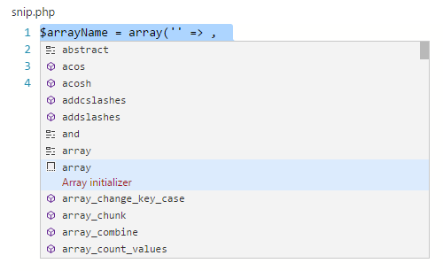
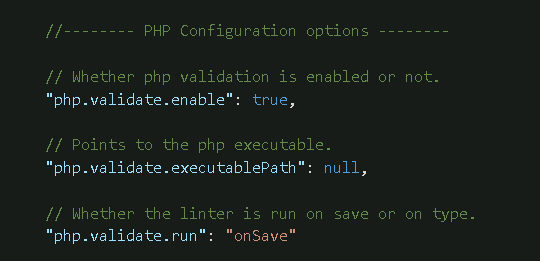

<a href="../../index.html" class="icon icon-home">vscode</a>

-

- [Home](../../index.html)

-

- - Customization
  - [Keyboard shortcuts](../../customization/keyboard-shortcuts/index.html)

-

- - Editor
  - [Accessibility](../../editor/accessibility/index.html)
  - [Codebasics](../../editor/codebasics/index.html)
  - [Command line](../../editor/command-line/index.html)
  - [Debugging](../../editor/debugging/index.html)
  - [Editingevolved](../../editor/editingevolved/index.html)
  - [Emmet](../../editor/emmet/index.html)
  - [Extension gallery](../../editor/extension-gallery/index.html)
  - [Integrated terminal](../../editor/integrated-terminal/index.html)
  - [Intellisense](../../editor/intellisense/index.html)
  - [Tasks appendix](../../editor/tasks-appendix/index.html)
  - [Tasks v1 appendix](../../editor/tasks-v1-appendix/index.html)
  - [Tasks v1](../../editor/tasks-v1/index.html)
  - [Tasks](../../editor/tasks/index.html)
  - [Userdefinedsnippets](../../editor/userdefinedsnippets/index.html)
  - [Versioncontrol](../../editor/versioncontrol/index.html)
  - [Whyvscode](../../editor/whyvscode/index.html)

-

- - extensionAPI
  - [Activation events](../../extensionAPI/activation-events/index.html)
  - [Api debugging](../../extensionAPI/api-debugging/index.html)
  - [Api markdown](../../extensionAPI/api-markdown/index.html)
  - [Api scm](../../extensionAPI/api-scm/index.html)
  - [Extension manifest](../../extensionAPI/extension-manifest/index.html)
  - [Extension points](../../extensionAPI/extension-points/index.html)
  - [Language support](../../extensionAPI/language-support/index.html)
  - [Overview](../../extensionAPI/overview/index.html)
  - [Patterns and principles](../../extensionAPI/patterns-and-principles/index.html)
  - [Vscode api commands](../../extensionAPI/vscode-api-commands/index.html)
  - [Vscode api](../../extensionAPI/vscode-api/index.html)

-

- - Extensions
  - [Debugging extensions](../../extensions/debugging-extensions/index.html)
  - [Example debuggers](../../extensions/example-debuggers/index.html)
  - [Example hello world](../../extensions/example-hello-world/index.html)
  - [Example language server](../../extensions/example-language-server/index.html)
  - [Example word count](../../extensions/example-word-count/index.html)
  - [Overview](../../extensions/overview/index.html)
  - [Publish extension](../../extensions/publish-extension/index.html)
  - [Samples](../../extensions/samples/index.html)
  - [Testing extensions](../../extensions/testing-extensions/index.html)
  - [Themes snippets colorizers](../../extensions/themes-snippets-colorizers/index.html)
  - [Yocode](../../extensions/yocode/index.html)

-

- - Getstarted
  - [Introvideos](../../getstarted/introvideos/index.html)
  - [Keybindings](../../getstarted/keybindings/index.html)
  - [Locales](../../getstarted/locales/index.html)
  - [Settings](../../getstarted/settings/index.html)
  - [Theme color reference](../../getstarted/theme-color-reference/index.html)
  - [Themes](../../getstarted/themes/index.html)
  - [Userinterface](../../getstarted/userinterface/index.html)

-

- - Introvideos
  - [Basics](../../introvideos/basics/index.html)
  - [Codeediting](../../introvideos/codeediting/index.html)
  - [Configure](../../introvideos/configure/index.html)
  - [Debugging](../../introvideos/debugging/index.html)
  - [Extend](../../introvideos/extend/index.html)
  - [Intellisense](../../introvideos/intellisense/index.html)
  - [Quicktour](../../introvideos/quicktour/index.html)
  - [Versioncontrol](../../introvideos/versioncontrol/index.html)

-

- - Languages
  - [Cpp](../cpp/index.html)
  - [Csharp](../csharp/index.html)
  - [Css](../css/index.html)
  - [Dockerfile](../dockerfile/index.html)
  - [Go](../go/index.html)
  - [Html](../html/index.html)
  - [Identifiers](../identifiers/index.html)
  - [Javascript](../javascript/index.html)
  - [Jsconfig](../jsconfig/index.html)
  - [Json](../json/index.html)
  - [Markdown](../markdown/index.html)
  - [Overview](../overview/index.html)
  - <a href="index.html" class="current">Php</a>
    - [PHP Programming in VS Code](#php-programming-in-vs-code)
    - <a href="#php-extensions" class="toctree-l4">PHP Extensions</a>
    - <a href="#snippets" class="toctree-l4">Snippets</a>
    - <a href="#linting" class="toctree-l4">Linting</a>
    - <a href="#debugging" class="toctree-l4">Debugging</a>
    - <a href="#next-steps" class="toctree-l4">Next Steps</a>
  - [Python](../python/index.html)
  - [Tsql](../tsql/index.html)
  - [Typescript](../typescript/index.html)

-

- - Nodejs
  - [Angular tutorial](../../nodejs/angular-tutorial/index.html)
  - [Extensions](../../nodejs/extensions/index.html)
  - [Javascript transpilers](../../nodejs/javascript-transpilers/index.html)
  - [Nodejs debugging](../../nodejs/nodejs-debugging/index.html)
  - [Nodejs deployment](../../nodejs/nodejs-deployment/index.html)
  - [Nodejs tutorial](../../nodejs/nodejs-tutorial/index.html)
  - [Other javascript runtimes](../../nodejs/other-javascript-runtimes/index.html)
  - [Overview](../../nodejs/overview/index.html)
  - [Reactjs tutorial](../../nodejs/reactjs-tutorial/index.html)
  - [Tasks](../../nodejs/tasks/index.html)

-

- - Other
  - [Dotnet](../../other/dotnet/index.html)
  - [Office](../../other/office/index.html)
  - [Unity](../../other/unity/index.html)

-

- - Setup
  - [Additional components](../../setup/additional-components/index.html)
  - [Linux](../../setup/linux/index.html)
  - [Mac](../../setup/mac/index.html)
  - [Network](../../setup/network/index.html)
  - [Setup overview](../../setup/setup-overview/index.html)
  - [Windows](../../setup/windows/index.html)

-

- - Supporting
  - [Errors](../../supporting/errors/index.html)
  - [Faq](../../supporting/faq/index.html)
  - [Requirements](../../supporting/requirements/index.html)

-

[vscode](../../index.html)

- [Docs](../../index.html) »
- Languages »
- Php
-

---

# PHP Programming in VS Code

Visual Studio Code is a great editor for PHP development. You get features like syntax highlighting and bracket matching, IntelliSense (code completion), and snippets out of the box and you can add more functionality through community created VS Code [extensions](https://vscode.readthedocs.io/docs/editor/extension-gallery.md).

## PHP Extensions

There are many PHP language extensions available on the [VS Code Marketplace](https://marketplace.visualstudio.com/VSCode) and more are being created. You can search for PHP extensions from within VS Code by running the **Extensions: Install Extension** command (`kb(workbench.action.showCommands)` and type `ext install`) then filter the extensions drop down list by typing `php`.

> Tip: The extensions shown above are dynamically queried. Click on an extension tile above to read the description and reviews to decide which extension is best for you. See more in the [Marketplace](https://marketplace.visualstudio.com/).
>
> Tip: The following [setting](https://vscode.readthedocs.io/docs/getstarted/settings.md) allows to disable the built-in PHP completions in favor of proposals created by installed PHP extensions.

- `php.suggest.basic`: Configures if the built-in PHP language suggestions are enabled. Enabled by default.

## Snippets

Visual Studio Code includes a set of common snippets for PHP. To access these, hit `kb(editor.action.triggerSuggest)` to get a context specific list.

## Linting

VS Code uses the official PHP linter (`php -l`) for PHP language diagnostics. This allows VS Code to stay current with PHP linter improvements.

> Tip: Using XAMPP? Install the full version of PHP in order to obtain the development libraries.

There are three [settings](https://vscode.readthedocs.io/docs/getstarted/settings.md) to control the PHP linter:

- `php.validate.enable`: controls whether to enable PHP linting at all. Enabled by default.
- `php.validate.executablePath`: points to the PHP executable on disk. Set this if the PHP executable is not on the system path.
- `php.validate.run`: controls whether the validation is triggered on save (value: `"onSave"`) or on type (value: `"onType"`). Default is on save.

To set the PHP executable path, open your **User or Workspace Settings** and add the `php.validate.executablePath`:

### Windows

    {
        "php.validate.executablePath": "c:/php/php.exe"
    }

### Linux and macOS

    {
        "php.validate.executablePath": "/usr/bin/php"
    }

## Debugging

PHP debugging with **XDebug** is supported through a [PHP Debug extension](https://marketplace.visualstudio.com/items?itemName=felixfbecker.php-debug). Follow the extension's instructions for configuring **XDebug** to work with VS Code.

## Next Steps

Read on to find out about:

- [Extension Marketplace](https://vscode.readthedocs.io/docs/editor/extension-gallery.md) - Browse the extensions others have shared
- [Debugging](https://vscode.readthedocs.io/docs/editor/debugging.md) - Learn more about VS Code debugging

<a href="../python/index.html" class="btn btn-neutral float-right" title="Python">Next </a> <a href="../overview/index.html" class="btn btn-neutral" title="Overview"> Previous</a>

---

  Read the Docs  
