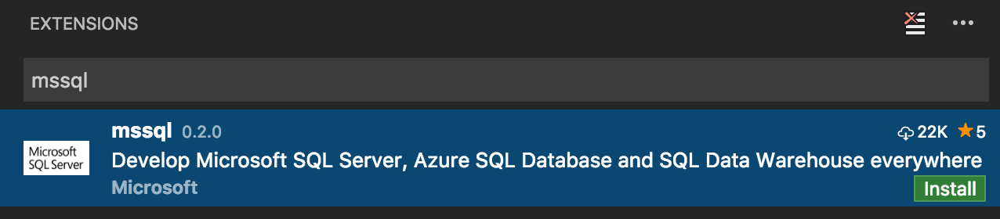

<a href="../../index.html" class="icon icon-home">vscode</a>

-

- [Home](../../index.html)

-

- - Customization
  - [Keyboard shortcuts](../../customization/keyboard-shortcuts/index.html)

-

- - Editor
  - [Accessibility](../../editor/accessibility/index.html)
  - [Codebasics](../../editor/codebasics/index.html)
  - [Command line](../../editor/command-line/index.html)
  - [Debugging](../../editor/debugging/index.html)
  - [Editingevolved](../../editor/editingevolved/index.html)
  - [Emmet](../../editor/emmet/index.html)
  - [Extension gallery](../../editor/extension-gallery/index.html)
  - [Integrated terminal](../../editor/integrated-terminal/index.html)
  - [Intellisense](../../editor/intellisense/index.html)
  - [Tasks appendix](../../editor/tasks-appendix/index.html)
  - [Tasks v1 appendix](../../editor/tasks-v1-appendix/index.html)
  - [Tasks v1](../../editor/tasks-v1/index.html)
  - [Tasks](../../editor/tasks/index.html)
  - [Userdefinedsnippets](../../editor/userdefinedsnippets/index.html)
  - [Versioncontrol](../../editor/versioncontrol/index.html)
  - [Whyvscode](../../editor/whyvscode/index.html)

-

- - extensionAPI
  - [Activation events](../../extensionAPI/activation-events/index.html)
  - [Api debugging](../../extensionAPI/api-debugging/index.html)
  - [Api markdown](../../extensionAPI/api-markdown/index.html)
  - [Api scm](../../extensionAPI/api-scm/index.html)
  - [Extension manifest](../../extensionAPI/extension-manifest/index.html)
  - [Extension points](../../extensionAPI/extension-points/index.html)
  - [Language support](../../extensionAPI/language-support/index.html)
  - [Overview](../../extensionAPI/overview/index.html)
  - [Patterns and principles](../../extensionAPI/patterns-and-principles/index.html)
  - [Vscode api commands](../../extensionAPI/vscode-api-commands/index.html)
  - [Vscode api](../../extensionAPI/vscode-api/index.html)

-

- - Extensions
  - [Debugging extensions](../../extensions/debugging-extensions/index.html)
  - [Example debuggers](../../extensions/example-debuggers/index.html)
  - [Example hello world](../../extensions/example-hello-world/index.html)
  - [Example language server](../../extensions/example-language-server/index.html)
  - [Example word count](../../extensions/example-word-count/index.html)
  - [Overview](../../extensions/overview/index.html)
  - [Publish extension](../../extensions/publish-extension/index.html)
  - [Samples](../../extensions/samples/index.html)
  - [Testing extensions](../../extensions/testing-extensions/index.html)
  - [Themes snippets colorizers](../../extensions/themes-snippets-colorizers/index.html)
  - [Yocode](../../extensions/yocode/index.html)

-

- - Getstarted
  - [Introvideos](../../getstarted/introvideos/index.html)
  - [Keybindings](../../getstarted/keybindings/index.html)
  - [Locales](../../getstarted/locales/index.html)
  - [Settings](../../getstarted/settings/index.html)
  - [Theme color reference](../../getstarted/theme-color-reference/index.html)
  - [Themes](../../getstarted/themes/index.html)
  - [Userinterface](../../getstarted/userinterface/index.html)

-

- - Introvideos
  - [Basics](../../introvideos/basics/index.html)
  - [Codeediting](../../introvideos/codeediting/index.html)
  - [Configure](../../introvideos/configure/index.html)
  - [Debugging](../../introvideos/debugging/index.html)
  - [Extend](../../introvideos/extend/index.html)
  - [Intellisense](../../introvideos/intellisense/index.html)
  - [Quicktour](../../introvideos/quicktour/index.html)
  - [Versioncontrol](../../introvideos/versioncontrol/index.html)

-

- - Languages
  - [Cpp](../cpp/index.html)
  - [Csharp](../csharp/index.html)
  - [Css](../css/index.html)
  - [Dockerfile](../dockerfile/index.html)
  - [Go](../go/index.html)
  - [Html](../html/index.html)
  - [Identifiers](../identifiers/index.html)
  - [Javascript](../javascript/index.html)
  - [Jsconfig](../jsconfig/index.html)
  - [Json](../json/index.html)
  - [Markdown](../markdown/index.html)
  - [Overview](../overview/index.html)
  - [Php](../php/index.html)
  - [Python](../python/index.html)
  - <a href="index.html" class="current">Tsql</a>
    - [Transact-SQL in VS Code](#transact-sql-in-vs-code)
    - <a href="#install-t-sql-support" class="toctree-l4">Install T-SQL support</a>
    - <a href="#connect-and-execute-t-sql" class="toctree-l4">Connect and Execute T-SQL</a>
    - <a href="#view-and-save-results" class="toctree-l4">View and Save Results</a>
    - <a href="#t-sql-intellisense" class="toctree-l4">T-SQL IntelliSense</a>
    - <a href="#linting" class="toctree-l4">Linting</a>
    - <a href="#peek-definitiongo-to-definition" class="toctree-l4">Peek Definition/Go to Definition</a>
    - <a href="#snippets" class="toctree-l4">Snippets</a>
    - <a href="#next-steps" class="toctree-l4">Next Steps</a>
    - <a href="#further-reading" class="toctree-l4">Further Reading</a>
  - [Typescript](../typescript/index.html)

-

- - Nodejs
  - [Angular tutorial](../../nodejs/angular-tutorial/index.html)
  - [Extensions](../../nodejs/extensions/index.html)
  - [Javascript transpilers](../../nodejs/javascript-transpilers/index.html)
  - [Nodejs debugging](../../nodejs/nodejs-debugging/index.html)
  - [Nodejs deployment](../../nodejs/nodejs-deployment/index.html)
  - [Nodejs tutorial](../../nodejs/nodejs-tutorial/index.html)
  - [Other javascript runtimes](../../nodejs/other-javascript-runtimes/index.html)
  - [Overview](../../nodejs/overview/index.html)
  - [Reactjs tutorial](../../nodejs/reactjs-tutorial/index.html)
  - [Tasks](../../nodejs/tasks/index.html)

-

- - Other
  - [Dotnet](../../other/dotnet/index.html)
  - [Office](../../other/office/index.html)
  - [Unity](../../other/unity/index.html)

-

- - Setup
  - [Additional components](../../setup/additional-components/index.html)
  - [Linux](../../setup/linux/index.html)
  - [Mac](../../setup/mac/index.html)
  - [Network](../../setup/network/index.html)
  - [Setup overview](../../setup/setup-overview/index.html)
  - [Windows](../../setup/windows/index.html)

-

- - Supporting
  - [Errors](../../supporting/errors/index.html)
  - [Faq](../../supporting/faq/index.html)
  - [Requirements](../../supporting/requirements/index.html)

-

[vscode](../../index.html)

- [Docs](../../index.html) »
- Languages »
- Tsql
-

---

# Transact-SQL in VS Code

Turn Visual Studio Code into a powerful editor for [Transact-SQL](https://msdn.microsoft.com/en-us/library/bb510741.aspx) (T-SQL) development with the [mssql](https://aka.ms/mssql-marketplace) extension available in the VS Code Marketplace. The [mssql](https://aka.ms/mssql-marketplace) extension is optimized to work with SQL Server running on-premises, in any cloud, Azure SQL Database, and Azure SQL Data Warehouse.

Connect to SQL databases, type T-SQL code, execute T-SQL code, view results, and save results as JSON or CSV files. While typing T-SQL code, you get rich T-SQL language features like T-SQL IntelliSense (code completion), syntax highlighting, linting, code navigation and code snippets.

> [Download VS Code](https://code.visualstudio.com/download) - If you haven't downloaded VS Code yet, quickly install for your platform (Linux, Mac or Windows).

## Install T-SQL support

Add T-SQL language support to VS Code by installing the [mssql](https://aka.ms/mssql-marketplace) extension from the VS Code marketplace as follows:

1.  Open the **Extensions** view from VS Code Side Bar (`kb(workbench.view.extensions)`).
2.  Type "mssql" in the search bar, click **Install**, and reload VS Code when prompted.

## Connect and Execute T-SQL

Easily connect to SQL Server running on-premises, in any cloud, Azure SQL Database, and Azure SQL Data Warehouse. Then, execute your T-SQL statements and batches to view results and messages - all within VS Code. Your recent connections are saved across sessions so you can quickly connect to your databases again.

## View and Save Results

View results and messages when you execute your T-SQL code. Save results as a JSON or CSV file to use the data in your applications with just a few clicks.

## T-SQL IntelliSense

As you type T-SQL code in the editor, VS Code provides intelligent code completion for T-SQL keywords, suggestions for schema object names (tables, columns, views), and parameter help for functions and procedures when connected to a database.

## Linting

Linting is the analysis of your T-SQL code for potential syntax errors. Use Visual Studio Code to quickly navigate to the errors and warnings in your T-SQL code as you type.

## Peek Definition/Go to Definition

Use **Peek Definition** and **Go to Definition** to quickly browse the definition of schema objects in your database such as tables, functions, and procedures while typing T-SQL code.

## Snippets

T-SQL snippets provide code templates for commonly used T-SQL statements. Type "sql" to get the list of T-SQL snippets.

## Next Steps

- Download the free [SQL Server 2016 Developer Edition](https://www.microsoft.com/en-us/sql-server/sql-server-downloads).
- Install the [mssql](https://aka.ms/mssql-marketplace) extension from the Visual Studio Code Marketplace.
- [Build an app](https://aka.ms/sqldev) using SQL Server - Get started with SQL Server on macOS, Linux, and Windows using your favorite programming language.
- Contribute to the mssql extension on [GitHub](https://github.com/Microsoft/vscode-mssql). Submit a bug report or a feature suggestion on our [GitHub Issue Tracker](https://github.com/Microsoft/vscode-mssql/issues).

## Further Reading

- [SQL Server documentation](<https://msdn.microsoft.com/en-us/library/mt590198(v=sql.1).aspx>)
- [SQL Server on Linux documentation](https://docs.microsoft.com/en-us/sql/linux/)
- [SQL Server Blog](https://blogs.technet.microsoft.com/dataplatforminsider/)
- [SQL Server Videos](https://channel9.msdn.com/Tags/sql+server) on Channel9

<a href="../typescript/index.html" class="btn btn-neutral float-right" title="Typescript">Next </a> <a href="../python/index.html" class="btn btn-neutral" title="Python"> Previous</a>

---

  Read the Docs  
