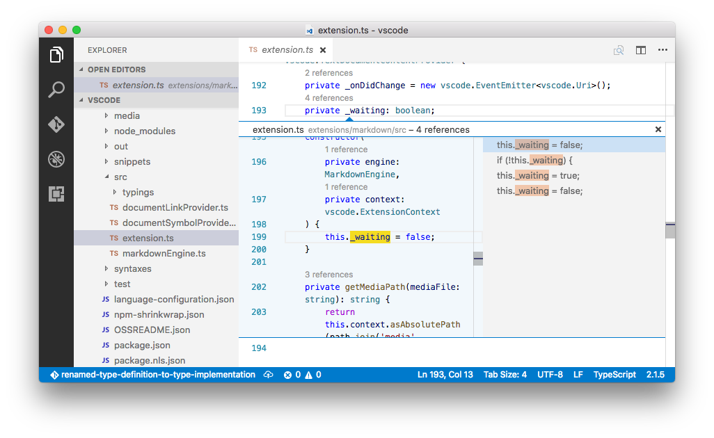

<a href="../../index.html" class="icon icon-home">vscode</a>

-

- [Home](../../index.html)

-

- - Customization
  - [Keyboard shortcuts](../../customization/keyboard-shortcuts/index.html)

-

- - Editor
  - [Accessibility](../../editor/accessibility/index.html)
  - [Codebasics](../../editor/codebasics/index.html)
  - [Command line](../../editor/command-line/index.html)
  - [Debugging](../../editor/debugging/index.html)
  - [Editingevolved](../../editor/editingevolved/index.html)
  - [Emmet](../../editor/emmet/index.html)
  - [Extension gallery](../../editor/extension-gallery/index.html)
  - [Integrated terminal](../../editor/integrated-terminal/index.html)
  - [Intellisense](../../editor/intellisense/index.html)
  - [Tasks appendix](../../editor/tasks-appendix/index.html)
  - [Tasks v1 appendix](../../editor/tasks-v1-appendix/index.html)
  - [Tasks v1](../../editor/tasks-v1/index.html)
  - [Tasks](../../editor/tasks/index.html)
  - [Userdefinedsnippets](../../editor/userdefinedsnippets/index.html)
  - [Versioncontrol](../../editor/versioncontrol/index.html)
  - [Whyvscode](../../editor/whyvscode/index.html)

-

- - extensionAPI
  - [Activation events](../../extensionAPI/activation-events/index.html)
  - [Api debugging](../../extensionAPI/api-debugging/index.html)
  - [Api markdown](../../extensionAPI/api-markdown/index.html)
  - [Api scm](../../extensionAPI/api-scm/index.html)
  - [Extension manifest](../../extensionAPI/extension-manifest/index.html)
  - [Extension points](../../extensionAPI/extension-points/index.html)
  - [Language support](../../extensionAPI/language-support/index.html)
  - [Overview](../../extensionAPI/overview/index.html)
  - [Patterns and principles](../../extensionAPI/patterns-and-principles/index.html)
  - [Vscode api commands](../../extensionAPI/vscode-api-commands/index.html)
  - [Vscode api](../../extensionAPI/vscode-api/index.html)

-

- - Extensions
  - [Debugging extensions](../../extensions/debugging-extensions/index.html)
  - [Example debuggers](../../extensions/example-debuggers/index.html)
  - [Example hello world](../../extensions/example-hello-world/index.html)
  - [Example language server](../../extensions/example-language-server/index.html)
  - [Example word count](../../extensions/example-word-count/index.html)
  - [Overview](../../extensions/overview/index.html)
  - [Publish extension](../../extensions/publish-extension/index.html)
  - [Samples](../../extensions/samples/index.html)
  - [Testing extensions](../../extensions/testing-extensions/index.html)
  - [Themes snippets colorizers](../../extensions/themes-snippets-colorizers/index.html)
  - [Yocode](../../extensions/yocode/index.html)

-

- - Getstarted
  - [Introvideos](../../getstarted/introvideos/index.html)
  - [Keybindings](../../getstarted/keybindings/index.html)
  - [Locales](../../getstarted/locales/index.html)
  - [Settings](../../getstarted/settings/index.html)
  - [Theme color reference](../../getstarted/theme-color-reference/index.html)
  - [Themes](../../getstarted/themes/index.html)
  - [Userinterface](../../getstarted/userinterface/index.html)

-

- - Introvideos
  - [Basics](../../introvideos/basics/index.html)
  - [Codeediting](../../introvideos/codeediting/index.html)
  - [Configure](../../introvideos/configure/index.html)
  - [Debugging](../../introvideos/debugging/index.html)
  - [Extend](../../introvideos/extend/index.html)
  - [Intellisense](../../introvideos/intellisense/index.html)
  - [Quicktour](../../introvideos/quicktour/index.html)
  - [Versioncontrol](../../introvideos/versioncontrol/index.html)

-

- - Languages
  - [Cpp](../cpp/index.html)
  - [Csharp](../csharp/index.html)
  - [Css](../css/index.html)
  - [Dockerfile](../dockerfile/index.html)
  - [Go](../go/index.html)
  - [Html](../html/index.html)
  - [Identifiers](../identifiers/index.html)
  - [Javascript](../javascript/index.html)
  - [Jsconfig](../jsconfig/index.html)
  - [Json](../json/index.html)
  - [Markdown](../markdown/index.html)
  - [Overview](../overview/index.html)
  - [Php](../php/index.html)
  - [Python](../python/index.html)
  - [Tsql](../tsql/index.html)
  - <a href="index.html" class="current">Typescript</a>
    - [Editing TypeScript](#editing-typescript)
    - <a href="#installing-the-typescript-compiler" class="toctree-l4">Installing the TypeScript compiler</a>
    - <a href="#typescript-files-and-projects" class="toctree-l4">TypeScript Files and Projects</a>
    - <a href="#tsconfigjson" class="toctree-l4">tsconfig.json</a>
    - <a href="#transpiling-typescript-into-javascript" class="toctree-l4">Transpiling TypeScript into JavaScript</a>
    - <a href="#goto-symbol-show-all-symbols" class="toctree-l4">Goto Symbol &amp; Show All Symbols</a>
    - <a href="#format-code" class="toctree-l4">Format Code</a>
    - <a href="#jsdoc-support" class="toctree-l4">JSDoc Support</a>
    - <a href="#javascript-source-map-support" class="toctree-l4">JavaScript Source Map Support</a>
    - <a href="#setting-a-different-outfiles-for-generated-files" class="toctree-l4">Setting a different outFiles for generated files</a>
    - <a href="#hiding-derived-javascript-files" class="toctree-l4">Hiding derived JavaScript files</a>
    - <a href="#mixed-typescript-and-javascript-projects" class="toctree-l4">Mixed TypeScript and JavaScript projects</a>
    - <a href="#using-newer-typescript-versions" class="toctree-l4">Using newer TypeScript versions</a>
    - <a href="#references-codelens" class="toctree-l4">References CodeLens</a>
    - <a href="#typescript-extensions" class="toctree-l4">TypeScript Extensions</a>
    - <a href="#next-steps" class="toctree-l4">Next Steps</a>
    - <a href="#common-questions" class="toctree-l4">Common Questions</a>

-

- - Nodejs
  - [Angular tutorial](../../nodejs/angular-tutorial/index.html)
  - [Extensions](../../nodejs/extensions/index.html)
  - [Javascript transpilers](../../nodejs/javascript-transpilers/index.html)
  - [Nodejs debugging](../../nodejs/nodejs-debugging/index.html)
  - [Nodejs deployment](../../nodejs/nodejs-deployment/index.html)
  - [Nodejs tutorial](../../nodejs/nodejs-tutorial/index.html)
  - [Other javascript runtimes](../../nodejs/other-javascript-runtimes/index.html)
  - [Overview](../../nodejs/overview/index.html)
  - [Reactjs tutorial](../../nodejs/reactjs-tutorial/index.html)
  - [Tasks](../../nodejs/tasks/index.html)

-

- - Other
  - [Dotnet](../../other/dotnet/index.html)
  - [Office](../../other/office/index.html)
  - [Unity](../../other/unity/index.html)

-

- - Setup
  - [Additional components](../../setup/additional-components/index.html)
  - [Linux](../../setup/linux/index.html)
  - [Mac](../../setup/mac/index.html)
  - [Network](../../setup/network/index.html)
  - [Setup overview](../../setup/setup-overview/index.html)
  - [Windows](../../setup/windows/index.html)

-

- - Supporting
  - [Errors](../../supporting/errors/index.html)
  - [Faq](../../supporting/faq/index.html)
  - [Requirements](../../supporting/requirements/index.html)

-

[vscode](../../index.html)

- [Docs](../../index.html) »
- Languages »
- Typescript
-

---

# Editing TypeScript

[TypeScript](https://typescriptlang.org/) is a typed superset of JavaScript that compiles to plain JavaScript. It offers classes, modules, and interfaces to help you build robust components. The TypeScript language specification can be found [here](https://github.com/Microsoft/TypeScript/tree/master/doc).

## Installing the TypeScript compiler

Visual Studio Code includes TypeScript language support but does not include the TypeScript compiler, `tsc`. You will need to install the TypeScript compiler either globally or in your workspace to transpile TypeScript source code to JavaScript (`tsc HelloWorld.ts`).

The easiest way to install TypeScript is through npm, the [Node.js Package Manager](https://www.npmjs.com/). If you have npm installed, you can install TypeScript globally (`-g`) on your computer by:

    npm install -g typescript

You can test your install by checking the version or help.

    tsc --version
    tsc --help

Another option is to install the TypeScript compiler locally in your project (`npm install --save-dev typescript`) and has the benefit of avoiding possible interactions with other TypeScript projects you may have.

## TypeScript Files and Projects

VS Code's TypeScript support can operate in two different modes:

- **File Scope**: In this mode, TypeScript files opened in Visual Studio Code are treated as independent units. As long as a file `a.ts` doesn't reference a file `b.ts` explicitly (either using [/// reference directives](https://www.typescriptlang.org/docs/handbook/triple-slash-directives.html) or external modules), there is no common project context between the two files.

- **Explicit Project**: A TypeScript project is defined via a `tsconfig.json` file. The presence of such a file in a directory indicates that the directory is the root of a TypeScript project. The file itself lists the files belonging to the project as well as compiler options. Details about the `tsconfig.json` file can be found [here](https://www.typescriptlang.org/docs/handbook/tsconfig-json.html).

> **Tip:** We recommend that you use explicit projects over file scope projects. Since explicit projects list the files belonging to a project language, features like `Find All References` `kb(editor.action.referenceSearch.trigger)` consider the project scope and not the file scope only.

## tsconfig.json

Typically the first step in any new TypeScript project is to add in a `tsconfig.json` file. This defines the TypeScript [project settings](https://www.typescriptlang.org/docs/handbook/tsconfig-json.html) such as the compiler options and the files that should be included. To do this, open up the folder where you want to store your source and add in a new file named `tsconfig.json`. Once in this file, IntelliSense (`kb(editor.action.triggerSuggest)`) will help you along the way.

A simple `tsconfig.json` looks like this for ES5, **CommonJS** [modules](http://www.commonjs.org/specs/modules/1.0) and source maps:

    {
        "compilerOptions": {
            "target": "es5",
            "module": "commonjs",
            "sourceMap": true
        }
    }

Now when you create a `.ts` file as part of the project we will offer up rich editing experiences and syntax validation.

## Transpiling TypeScript into JavaScript

VS Code integrates with `tsc` through our integrated [task runner](https://vscode.readthedocs.io/docs/editor/tasks.md). We can use this to transpile `.ts` files into `.js` files. Let's walk through transpiling a simple TypeScript Hello World program.

### Step 1: Create a simple TS file

Open VS Code on an empty folder and create a `HelloWorld.ts` file, place the following code in that file...

    class Startup {
        public static main(): number {
            console.log('Hello World');
            return 0;
        }
    }

    Startup.main();

### Step 2: Run the TypeScript Build

Execute **Run Build Task...** from the global **Tasks** menu. If you created a `tsconfig.json` file in the earlier section, this should present the following picker:

Select the entry. This will produce a `HelloWorld.js` and `HelloWorld.js.map` file in the workspace.

Under the covers, we run the TypeScript compiler as a task. The command we use is: `tsc -p .`

> **Tip:** If you don't have the TypeScript compiler installed, you can [get it here](https://www.typescriptlang.org/).

### Step 3: Make the TypeScript Build the default

You can also define the TypeScript build task as the default build task so that it is executed directly when triggering **Run Build Task** (`kb(workbench.action.tasks.build)`). To do so select **Configure Default Build Task** from the global **Tasks** menu. This shows you a picker with the available build tasks. Select the TypeScript one which generates the following `tasks.json` file:

    {
        // See https://go.microsoft.com/fwlink/?LinkId=733558
        // for the documentation about the tasks.json format
        "version": "2.0.0",
        "tasks": [
            {
                "type": "typescript",
                "tsconfig": "tsconfig.json",
                "group": {
                    "kind": "build",
                    "isDefault": true
                }
            }
        ]
    }

The example TypeScript file did not have any compile problems, so by running the task all that happened was a corresponding `HelloWorld.js` and `HelloWorld.js.map` file was created.

If you have [Node.js](https://nodejs.org/) installed, you can run your simple Hello World example by opening up a terminal and running:

    node HelloWorld.js

> **Tip:** You can also run the program using VS Code's Run/Debug feature. Details about running and debugging Node.js applications in VS Code can be found [here](https://vscode.readthedocs.io/docs/nodejs/nodejs-tutorial.md#debugging-your-node-application)

### Step 4: Reviewing Build Issues

Unfortunately, most builds don't go that smoothly and the result is often some additional information. For instance, if there was a simple error in our TypeScript file, we may get the following output from `tsc`:

    HelloWorld.ts(3,17): error TS2339: Property 'logg' does not exist on type 'Console'.

This would show up in the terminal window (which can be opened using `kb(workbench.action.terminal.toggleTerminal)`) and selecting the terminal **Tasks - build tsconfig.json** in the terminal view drop-down. We parse this output for you and highlight detected problems in the Status Bar.

You can click on that icon to get a list of the problems and navigate to them.

You can also use the keyboard to open the list `kb(workbench.actions.view.problems)`.

> **Tip:** Tasks offer rich support for many actions. Check the [Tasks](https://vscode.readthedocs.io/docs/editor/tasks.md) topic for more information on how to configure them.

## Goto Symbol & Show All Symbols

`kb(workbench.action.gotoSymbol)`: lists all defined symbols of the current open TypeScript and lets you navigate in it.

`kb(workbench.action.showAllSymbols)`: lets you search all symbols defined in the current project or file scope. You need to have a TypeScript file open in the active editor.

## Format Code

`kb(editor.action.formatDocument)`: formats the whole document. `kb(editor.action.formatSelection)`: formats the currently selected source code.

## JSDoc Support

VS Code offers **JSDoc** support for TypeScript. Besides syntax coloring, we help you enter **JSDoc** comments. Type `/**` and it will auto insert the closing `*/`. Pressing `kbstyle(Enter)` inside a **JSDoc** block will indent the next line and auto insert a `*`.

## JavaScript Source Map Support

TypeScript debugging supports JavaScript source maps. Enable this by setting the `sourceMaps` attribute to `true` in the project's launch configuration file `launch.json`. In addition, you can specify a TypeScript file with the `program` attribute.

To generate source maps for your TypeScript files, compile with the `--sourcemap` option or set the `sourceMap` property in the `tsconfig.json` file to `true`.

In-lined source maps (a source map where the content is stored as a data URL instead of a separate file) are also supported, although in-lined source is not yet supported.

## Setting a different outFiles for generated files

If generated (transpiled) JavaScript files do not live next to their source, you can help the VS Code debugger locate them by setting the `outFiles` attribute in the launch configuration. Whenever you set a breakpoint in the original source, VS Code tries to find the generated source by searching the files specified by glob patterns in `outFiles`.

## Hiding derived JavaScript files

When you are working with TypeScript, you often don’t want to see generated JavaScript files in the explorer or in search results. VS Code offers filtering capabilities with a `files.exclude` [workspace setting](https://vscode.readthedocs.io/docs/getstarted/settings.md) (**File** &gt; **Preferences** &gt; **Settings**) and you can easily create an expression to hide those derived files:

`"**/*.js": { "when": "$(basename).ts"}`

This pattern will match on any JavaScript file (`**/*.js`) but only if a sibling TypeScript file with the same name is present. The file explorer will no longer show derived resources for JavaScript if they are compiled to the same location.

 

To exclude JavaScript files generated from both `.ts` and `.tsx` source files, use this expression:

    "**/*.js": { "when": "$(basename).ts" },
    "**/**.js": { "when": "$(basename).tsx" }

This is a bit of a trick. The search glob pattern is used as a key. The settings above use two different glob patterns to provide two unique keys but the search will still match the same files.

## Mixed TypeScript and JavaScript projects

It is now possible to have mixed TypeScript and JavaScript projects. To enable JavaScript inside a TypeScript project, you can set the `allowJs` property to `true` in the `tsconfig.json`.

> **Tip:** The `tsc` compiler does not detect the presence of a `jsconfig.json` file automatically. Use the `–p` argument to make `tsc` use your `jsconfig.json` file, e.g. `tsc -p jsconfig.json`.

## Using newer TypeScript versions

VS Code ships with a recent stable version of the TypeScript language service and the active version of the TypeScript language service is displayed in the Status Bar when viewing a TypeScript or JavaScript file:

> **Tip:** To get a specific TypeScript version, specify `@version` during npm install. For example for TypeScript 2.2.1, you would use `npm install --save-dev typescript@2.2.1`. To preview the next version of TypeScript, run `npm install --save-dev typescript@next`.

To use a different TypeScript version by default, configure `typescript.tsdk` in your user settings to point to a directory containing the TypeScript `tsserver.js` file. You can find the TypeScript installation location using `npm list -g typescript`. The `tsserver.js` file is usually in the `lib` folder.

For example:

    {
       "typescript.tsdk": "/usr/local/lib/node_modules/typescript/lib"
    }

You can also configure a specific version of TypeScript in a particular workspace by adding a `typescript.tsdk` workspace setting pointing to the directory of the `tsserver.js` file:

    {
       "typescript.tsdk": "./node_modules/typescript/lib"
    }

Note that while `typescript.tsdk` points to the `lib` directory inside of `typescript` in these examples, the `typescript` directory must be a full TypeScript install that contains the TypeScript `package.json` file.

### Using the workspace version of TypeScript

If your workspace has a specific TypeScript version, you can switch between the workspace version of TypeScript and the version that VS Code uses by default by opening a TypeScript or JavaScript file in the workspace and clicking on the TypeScript version number in the Status Bar. A message box will appear asking you which version of TypeScript VS Code should use:

You can switch back to the version of TypeScript that comes with VS Code by clicking on the TypeScript version in the Status Bar again.

## References CodeLens

The TypeScript references CodeLens displays an inline count of reference for classes, interfaces, methods, properties, and exported objects:

You can enable this by setting `"typescript.referencesCodeLens.enabled": true`.

Click on the reference count to quickly browse a list of references:

## TypeScript Extensions

VS Code provides many features for TypeScript out of the box. In addition to what comes built-in, you can install an extension for greater functionality.

> Tip: Click on an extension tile above to read the description and reviews to decide which extension is best for you. See more in the [Marketplace](https://marketplace.visualstudio.com/).

## Next Steps

OK, read on to find out about:

- [JavaScript](https://vscode.readthedocs.io/docs/languages/javascript.md) - we have several JavaScript specific features in VS Code
- [Tasks](https://vscode.readthedocs.io/docs/editor/tasks.md) - we used tasks to transpile your TS file. Read more to find out what else tasks can do
- [Basic Editing](https://vscode.readthedocs.io/docs/editor/codebasics.md) - Learn about the powerful VS Code editor.
- [Code Navigation](https://vscode.readthedocs.io/docs/editor/editingevolved.md) - Move quickly through your source code.
- [Debugging](https://vscode.readthedocs.io/docs/editor/debugging.md) - we support debugging TypeScript Node.js apps

## Common Questions

**Q: How do I resolve a TypeScript "Cannot compile external module" error?**

**A**: If you get that error, resolve it by creating a `tsconfig.json` file in the root folder of your project. The tsconfig.json file lets you control how Visual Studio Code compiles your TypeScript code. For more information, see the [tsconfig.json overview](https://www.typescriptlang.org/docs/handbook/tsconfig-json.html).

Due to a current limitation, you must restart VS Code after adding the `tsconfig.json` file.

**Q: Why do I get different errors and warnings with VS Code than when I compile my TypeScript project?**

VS Code ships with a recent stable version of the TypeScript language service and it may not match the version of TypeScript installed globally on your computer or locally in your workspace. For that reason, you may see differences between your compiler output and errors detected by the active TypeScript language service. See [Using newer TypeScript versions](https://vscode.readthedocs.io/docs/languages/typescript.md#using-newer-typescript-versions) for details on installing a matching TypeScript version.

**Q: Can I use the version of TypeScript that ships with VS 2015?**

**A**: No, the TypeScript language service which ships with Visual Studio 2015 and 2017 isn't compatible with VS Code. You will need to install a separate version of TypeScript from [npm](https://www.npmjs.com/package/typescript).

<a href="../../nodejs/angular-tutorial/index.html" class="btn btn-neutral float-right" title="Angular tutorial">Next </a> <a href="../tsql/index.html" class="btn btn-neutral" title="Tsql"> Previous</a>

---

  Read the Docs  
