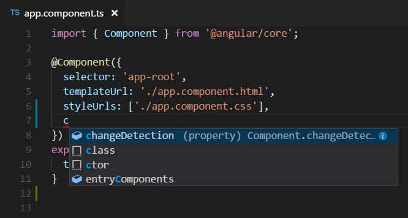
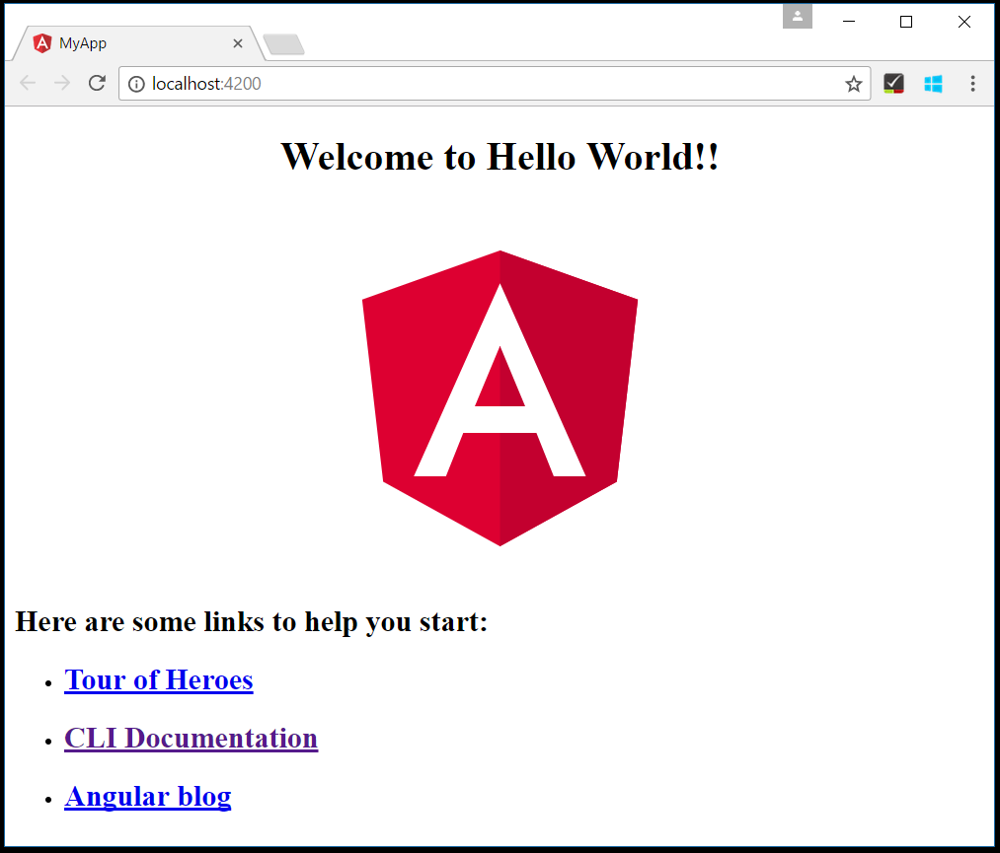
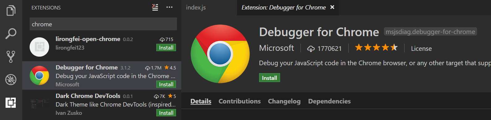

<a href="../../index.html" class="icon icon-home">vscode</a>

-

- [Home](../../index.html)

-

- - Customization
  - [Keyboard shortcuts](../../customization/keyboard-shortcuts/index.html)

-

- - Editor
  - [Accessibility](../../editor/accessibility/index.html)
  - [Codebasics](../../editor/codebasics/index.html)
  - [Command line](../../editor/command-line/index.html)
  - [Debugging](../../editor/debugging/index.html)
  - [Editingevolved](../../editor/editingevolved/index.html)
  - [Emmet](../../editor/emmet/index.html)
  - [Extension gallery](../../editor/extension-gallery/index.html)
  - [Integrated terminal](../../editor/integrated-terminal/index.html)
  - [Intellisense](../../editor/intellisense/index.html)
  - [Tasks appendix](../../editor/tasks-appendix/index.html)
  - [Tasks v1 appendix](../../editor/tasks-v1-appendix/index.html)
  - [Tasks v1](../../editor/tasks-v1/index.html)
  - [Tasks](../../editor/tasks/index.html)
  - [Userdefinedsnippets](../../editor/userdefinedsnippets/index.html)
  - [Versioncontrol](../../editor/versioncontrol/index.html)
  - [Whyvscode](../../editor/whyvscode/index.html)

-

- - extensionAPI
  - [Activation events](../../extensionAPI/activation-events/index.html)
  - [Api debugging](../../extensionAPI/api-debugging/index.html)
  - [Api markdown](../../extensionAPI/api-markdown/index.html)
  - [Api scm](../../extensionAPI/api-scm/index.html)
  - [Extension manifest](../../extensionAPI/extension-manifest/index.html)
  - [Extension points](../../extensionAPI/extension-points/index.html)
  - [Language support](../../extensionAPI/language-support/index.html)
  - [Overview](../../extensionAPI/overview/index.html)
  - [Patterns and principles](../../extensionAPI/patterns-and-principles/index.html)
  - [Vscode api commands](../../extensionAPI/vscode-api-commands/index.html)
  - [Vscode api](../../extensionAPI/vscode-api/index.html)

-

- - Extensions
  - [Debugging extensions](../../extensions/debugging-extensions/index.html)
  - [Example debuggers](../../extensions/example-debuggers/index.html)
  - [Example hello world](../../extensions/example-hello-world/index.html)
  - [Example language server](../../extensions/example-language-server/index.html)
  - [Example word count](../../extensions/example-word-count/index.html)
  - [Overview](../../extensions/overview/index.html)
  - [Publish extension](../../extensions/publish-extension/index.html)
  - [Samples](../../extensions/samples/index.html)
  - [Testing extensions](../../extensions/testing-extensions/index.html)
  - [Themes snippets colorizers](../../extensions/themes-snippets-colorizers/index.html)
  - [Yocode](../../extensions/yocode/index.html)

-

- - Getstarted
  - [Introvideos](../../getstarted/introvideos/index.html)
  - [Keybindings](../../getstarted/keybindings/index.html)
  - [Locales](../../getstarted/locales/index.html)
  - [Settings](../../getstarted/settings/index.html)
  - [Theme color reference](../../getstarted/theme-color-reference/index.html)
  - [Themes](../../getstarted/themes/index.html)
  - [Userinterface](../../getstarted/userinterface/index.html)

-

- - Introvideos
  - [Basics](../../introvideos/basics/index.html)
  - [Codeediting](../../introvideos/codeediting/index.html)
  - [Configure](../../introvideos/configure/index.html)
  - [Debugging](../../introvideos/debugging/index.html)
  - [Extend](../../introvideos/extend/index.html)
  - [Intellisense](../../introvideos/intellisense/index.html)
  - [Quicktour](../../introvideos/quicktour/index.html)
  - [Versioncontrol](../../introvideos/versioncontrol/index.html)

-

- - Languages
  - [Cpp](../../languages/cpp/index.html)
  - [Csharp](../../languages/csharp/index.html)
  - [Css](../../languages/css/index.html)
  - [Dockerfile](../../languages/dockerfile/index.html)
  - [Go](../../languages/go/index.html)
  - [Html](../../languages/html/index.html)
  - [Identifiers](../../languages/identifiers/index.html)
  - [Javascript](../../languages/javascript/index.html)
  - [Jsconfig](../../languages/jsconfig/index.html)
  - [Json](../../languages/json/index.html)
  - [Markdown](../../languages/markdown/index.html)
  - [Overview](../../languages/overview/index.html)
  - [Php](../../languages/php/index.html)
  - [Python](../../languages/python/index.html)
  - [Tsql](../../languages/tsql/index.html)
  - [Typescript](../../languages/typescript/index.html)

-

- - Nodejs
  - <a href="index.html" class="current">Angular tutorial</a>
    - [Using Angular in VS Code](#using-angular-in-vs-code)
    - <a href="#welcome-to-angular" class="toctree-l4">Welcome to Angular</a>
    - <a href="#hello-world" class="toctree-l4">Hello World!</a>
    - <a href="#debugging-angular" class="toctree-l4">Debugging Angular</a>
    - <a href="#popular-starter-kits" class="toctree-l4">Popular Starter Kits</a>
    - <a href="#angular-extensions" class="toctree-l4">Angular Extensions</a>
  - [Extensions](../extensions/index.html)
  - [Javascript transpilers](../javascript-transpilers/index.html)
  - [Nodejs debugging](../nodejs-debugging/index.html)
  - [Nodejs deployment](../nodejs-deployment/index.html)
  - [Nodejs tutorial](../nodejs-tutorial/index.html)
  - [Other javascript runtimes](../other-javascript-runtimes/index.html)
  - [Overview](../overview/index.html)
  - [Reactjs tutorial](../reactjs-tutorial/index.html)
  - [Tasks](../tasks/index.html)

-

- - Other
  - [Dotnet](../../other/dotnet/index.html)
  - [Office](../../other/office/index.html)
  - [Unity](../../other/unity/index.html)

-

- - Setup
  - [Additional components](../../setup/additional-components/index.html)
  - [Linux](../../setup/linux/index.html)
  - [Mac](../../setup/mac/index.html)
  - [Network](../../setup/network/index.html)
  - [Setup overview](../../setup/setup-overview/index.html)
  - [Windows](../../setup/windows/index.html)

-

- - Supporting
  - [Errors](../../supporting/errors/index.html)
  - [Faq](../../supporting/faq/index.html)
  - [Requirements](../../supporting/requirements/index.html)

-

[vscode](../../index.html)

- [Docs](../../index.html) »
- Nodejs »
- Angular tutorial
-

---

# Using Angular in VS Code

[Angular](https://angular.io/) is a popular JavaScript library for building web application user interfaces developed by Google. The Visual Studio Code editor supports Angular IntelliSense and code navigation out of the box.

## Welcome to Angular

We'll be using the [Angular CLI](https://cli.angular.io/) for this tutorial. To install and use the command line interface as well as run the Angular application server, you'll need the [Node.js](https://nodejs.org/) JavaScript runtime and [npm](https://www.npmjs.com/) (the Node.js package manager) installed. npm is included with Node.js which you can install from [here](https://nodejs.org/en/download/).

> **Tip**: To test that you have Node.js and npm correctly install on your machine, you can type `node --version` and `npm --version`.

To install the Angular CLI, in a terminal or command prompt type:

    npm install -g @angular/cli

This may take a few minutes to install. You can now create a new Angular application by typing:

    ng new my-app

`my-app` is the name of the folder for your application. This may take a few minutes to create the Angular application in [TypeScript](https://vscode.readthedocs.io/docs/languages/typescript.md) and install it's dependencies.

Let's quickly run our Angular application by navigating to the new folder and typing `ng serve` to start the web server and open the application in a browser:

    cd my-app
    ng serve

You should see "Welcome to app!!" on `http://localhost:4200` in your browser. We'll leave the web server running while we look at the application with VS Code.

To open your Angular application in VS Code, open another terminal (or command prompt) and navigate to the `my-app` folder and type `code .`:

    cd my-app
    code .

### Syntax highlighting and bracket matching

Now expand the `src\app` folder and select the `app.component.ts` file. You'll notice that VS Code has syntax highlighting for the various source code elements and, if you put the cursor on a parentheses, the matching bracket is also selected.

### IntelliSense

As you hover your mouse over text in the file, you'll see that VS Code gives you information about key items in your source code. Items such as variables, classes and Angular decorators are a few examples where you'll be presented with this information.

As you start typing in `app.component.ts`, you'll see smart suggestions and code snippets.

You can click the information button (`i`) to see a flyout with more documentation.

VS Code uses the TypeScript language service for code intelligence ([IntelliSense](https://vscode.readthedocs.io/docs/editor/intellisense.md)) and it has a feature called [Automatic Type Acquisition](https://vscode.readthedocs.io/docs/languages/javascript.md#automatic-type-acquisition) (ATA). ATA pulls down the npm Type Declaration files (`*.d.ts`) for the npm modules referenced in the `package.json`.

### Go to Definition, Peek definition

Through the TypeScript language service, VS Code can also provide type definition information in the editor through **Go to Definition** (`kb(editor.action.gotodeclaration)`) or **Peek Definition** (`kb(editor.action.peekImplementation)`). Open the `app.module.ts` file and put the cursor over `AppComponent` in the `bootstrap` property declaration, right click and select **Peek Definition**. A [Peek window](https://vscode.readthedocs.io/docs/editor/editingevolved.md#peek) will open showing the `AppComponent` definition from `app.component.ts`.

Press `kbstyle(Escape)` to close the Peek window.

## Hello World!

Let's update the sample application to "Hello World". Go back to the `app.component.ts` file and change the `title` string in `AppComponent` to "Hello World".

    import { Component } from '@angular/core';

    @Component({
      selector: 'app-root',
      templateUrl: './app.component.html',
      styleUrls: ['./app.component.css']
    })
    export class AppComponent {
      title = 'Hello World';
    }

Once you save the `app.component.ts` file, the running instance of the server will update the web page and you'll see "Welcome to Hello World!!".

> **Tip**: VS Code supports Auto Save, which by default saves your files after a delay. Check the **Auto Save** option in the **File** menu to turn on Auto Save or directly configure the `files.autoSave` user [setting](https://vscode.readthedocs.io/docs/getstarted/settings.md).

## Debugging Angular

To debug the client side Angular code, we'll need to install the [Debugger for Chrome](https://marketplace.visualstudio.com/items?itemName=msjsdiag.debugger-for-chrome) extension.

> Note: This tutorial assumes you have the Chrome browser installed. The builders of the Debugger for Chrome extension also have versions for the [Safari on iOS](https://marketplace.visualstudio.com/items?itemName=msjsdiag.debugger-for-ios-web) and [Edge](https://marketplace.visualstudio.com/items?itemName=msjsdiag.debugger-for-edge) browsers.

Open the Extensions view (`kb(workbench.view.extensions)`) and type 'chrome\` in the search box. You'll see several extensions which reference Chrome.

Press the **Install** button for **Debugger for Chrome**. The button will change to **Installing** then, after completing the installation, it will change to **Reload**. Press **Reload** to restart VS Code and activate the extension.

### Set a breakpoint

To set a breakpoint in `app.component.ts`, click on the gutter to the left of the line numbers. This will set a breakpoint which will be visible as a red circle.

### Configure the Chrome debugger

We need to initially configure the [debugger](https://vscode.readthedocs.io/docs/editor/debugging.md). To do so, go to the Debug view (`kb(workbench.view.debug)`) and click on gear button to create a `launch.json` debugger configuration file. Choose **Chrome** from the **Select Environment** dropdown. This will create a `launch.json` file in a new `.vscode` folder in your project which includes configuration to both launch the website or attach to a running instance.

We need to make one change for our example: change the port from `8080` to `4200`. Your `launch.json` should look like this:

    {
        "version": "0.2.0",
        "configurations": [
            {
                "type": "chrome",
                "request": "launch",
                "name": "Launch Chrome against localhost",
                "url": "http://localhost:4200",
                "webRoot": "${workspaceRoot}"
            },
            {
                "type": "chrome",
                "request": "attach",
                "name": "Attach to Chrome",
                "port": 9222,
                "webRoot": "${workspaceRoot}"
            }
        ]
    }

Press `kb(workbench.action.debug.start)` or the green arrow to launch the debugger and open a new browser instance. The source code where the breakpoint is set runs on startup before the debugger was attached so we won't hit the breakpoint until we refresh the web page. Refresh the page and you should hit your breakpoint.

You can step through your source code (`kb(workbench.action.debug.stepOver)`), inspect variables such as `AppComponent`, and see the call stack of the client side Angular application.

The **Debugger for Chrome** extension README has lots of information on other configurations, working with sourcemaps, and troubleshooting. You can review it directly within VS Code from the **Extensions** view by clicking on the extension item and opening the **Details** view.

## Popular Starter Kits

In this tutorial, we used the Angular CLI to create a simple Angular application. There are lots of great samples and starter kits available to help build your first Angular application.

### Recipes

The VS Code team has created [recipes](https://github.com/Microsoft/vscode-recipes) for more complex debugging scenarios. There you'll find the [Chrome Debugging with Angular CLI](https://github.com/Microsoft/vscode-recipes/tree/master/Angular-CLI) recipe which also uses the Angular CLI and goes into detail on debugging the generated project's unit tests.

### MEAN Starter

If you'd like to see a full MEAN (MongoDB, Express, Angular, Node.js) stack example, look at [MEAN.IO](http://mean.io/). They have documentation and an application generator for a sample MEAN project. You'll need to install and start [MongoDB](https://docs.mongodb.com/v3.0/installation/), but you'll quickly have a MEAN application running.

### React

[React](https://facebook.github.io/react/) is another popular web framework. If you'd like to see an example of React working with VS Code, check out the [Using React in VS Code](https://vscode.readthedocs.io/docs/nodejs/reactjs-tutorial.md) tutorial. It will walk you through creating an React application and configuring the `launch.json` file for the [Debugger for Chrome](https://marketplace.visualstudio.com/items?itemName=msjsdiag.debugger-for-chrome) extension.

## Angular Extensions

In addition to the functionality VS Code provides out of the box, you can install VS Code extensions for greater functionality.

Click on an extension tile above to read the description and reviews on the [Marketplace](https://marketplace.visualstudio.com/).

To find other Angular extensions, open the Extensions view (`kb(workbench.view.extensions)`) and type 'angular' to see a filtered list of Angular extensions.

The community has also created "Extension Packs" which bundle useful extensions together (for example, a linter, debugger, and snippets) into a single download. To see available Angular extension packs, add the "extension packs" category to your filter (angular @category:"extension packs").

<a href="../extensions/index.html" class="btn btn-neutral float-right" title="Extensions">Next </a> <a href="../../languages/typescript/index.html" class="btn btn-neutral" title="Typescript"> Previous</a>

---

  Read the Docs  
