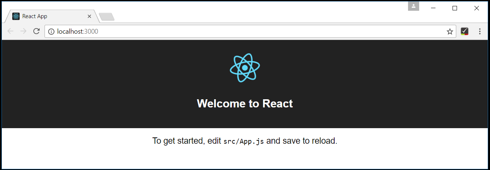
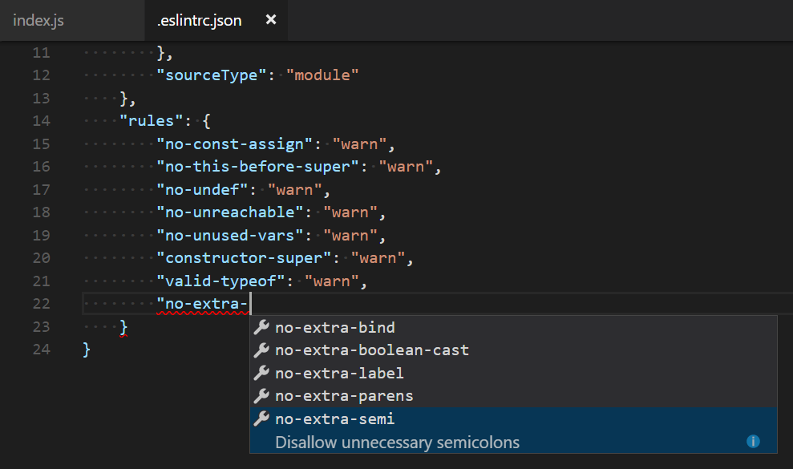

<a href="../../index.html" class="icon icon-home">vscode</a>

-

- [Home](../../index.html)

-

- - Customization
  - [Keyboard shortcuts](../../customization/keyboard-shortcuts/index.html)

-

- - Editor
  - [Accessibility](../../editor/accessibility/index.html)
  - [Codebasics](../../editor/codebasics/index.html)
  - [Command line](../../editor/command-line/index.html)
  - [Debugging](../../editor/debugging/index.html)
  - [Editingevolved](../../editor/editingevolved/index.html)
  - [Emmet](../../editor/emmet/index.html)
  - [Extension gallery](../../editor/extension-gallery/index.html)
  - [Integrated terminal](../../editor/integrated-terminal/index.html)
  - [Intellisense](../../editor/intellisense/index.html)
  - [Tasks appendix](../../editor/tasks-appendix/index.html)
  - [Tasks v1 appendix](../../editor/tasks-v1-appendix/index.html)
  - [Tasks v1](../../editor/tasks-v1/index.html)
  - [Tasks](../../editor/tasks/index.html)
  - [Userdefinedsnippets](../../editor/userdefinedsnippets/index.html)
  - [Versioncontrol](../../editor/versioncontrol/index.html)
  - [Whyvscode](../../editor/whyvscode/index.html)

-

- - extensionAPI
  - [Activation events](../../extensionAPI/activation-events/index.html)
  - [Api debugging](../../extensionAPI/api-debugging/index.html)
  - [Api markdown](../../extensionAPI/api-markdown/index.html)
  - [Api scm](../../extensionAPI/api-scm/index.html)
  - [Extension manifest](../../extensionAPI/extension-manifest/index.html)
  - [Extension points](../../extensionAPI/extension-points/index.html)
  - [Language support](../../extensionAPI/language-support/index.html)
  - [Overview](../../extensionAPI/overview/index.html)
  - [Patterns and principles](../../extensionAPI/patterns-and-principles/index.html)
  - [Vscode api commands](../../extensionAPI/vscode-api-commands/index.html)
  - [Vscode api](../../extensionAPI/vscode-api/index.html)

-

- - Extensions
  - [Debugging extensions](../../extensions/debugging-extensions/index.html)
  - [Example debuggers](../../extensions/example-debuggers/index.html)
  - [Example hello world](../../extensions/example-hello-world/index.html)
  - [Example language server](../../extensions/example-language-server/index.html)
  - [Example word count](../../extensions/example-word-count/index.html)
  - [Overview](../../extensions/overview/index.html)
  - [Publish extension](../../extensions/publish-extension/index.html)
  - [Samples](../../extensions/samples/index.html)
  - [Testing extensions](../../extensions/testing-extensions/index.html)
  - [Themes snippets colorizers](../../extensions/themes-snippets-colorizers/index.html)
  - [Yocode](../../extensions/yocode/index.html)

-

- - Getstarted
  - [Introvideos](../../getstarted/introvideos/index.html)
  - [Keybindings](../../getstarted/keybindings/index.html)
  - [Locales](../../getstarted/locales/index.html)
  - [Settings](../../getstarted/settings/index.html)
  - [Theme color reference](../../getstarted/theme-color-reference/index.html)
  - [Themes](../../getstarted/themes/index.html)
  - [Userinterface](../../getstarted/userinterface/index.html)

-

- - Introvideos
  - [Basics](../../introvideos/basics/index.html)
  - [Codeediting](../../introvideos/codeediting/index.html)
  - [Configure](../../introvideos/configure/index.html)
  - [Debugging](../../introvideos/debugging/index.html)
  - [Extend](../../introvideos/extend/index.html)
  - [Intellisense](../../introvideos/intellisense/index.html)
  - [Quicktour](../../introvideos/quicktour/index.html)
  - [Versioncontrol](../../introvideos/versioncontrol/index.html)

-

- - Languages
  - [Cpp](../../languages/cpp/index.html)
  - [Csharp](../../languages/csharp/index.html)
  - [Css](../../languages/css/index.html)
  - [Dockerfile](../../languages/dockerfile/index.html)
  - [Go](../../languages/go/index.html)
  - [Html](../../languages/html/index.html)
  - [Identifiers](../../languages/identifiers/index.html)
  - [Javascript](../../languages/javascript/index.html)
  - [Jsconfig](../../languages/jsconfig/index.html)
  - [Json](../../languages/json/index.html)
  - [Markdown](../../languages/markdown/index.html)
  - [Overview](../../languages/overview/index.html)
  - [Php](../../languages/php/index.html)
  - [Python](../../languages/python/index.html)
  - [Tsql](../../languages/tsql/index.html)
  - [Typescript](../../languages/typescript/index.html)

-

- - Nodejs
  - [Angular tutorial](../angular-tutorial/index.html)
  - [Extensions](../extensions/index.html)
  - [Javascript transpilers](../javascript-transpilers/index.html)
  - [Nodejs debugging](../nodejs-debugging/index.html)
  - [Nodejs deployment](../nodejs-deployment/index.html)
  - [Nodejs tutorial](../nodejs-tutorial/index.html)
  - [Other javascript runtimes](../other-javascript-runtimes/index.html)
  - [Overview](../overview/index.html)
  - <a href="index.html" class="current">Reactjs tutorial</a>
    - [Using React in VS Code](#using-react-in-vs-code)
    - <a href="#welcome-to-react" class="toctree-l4">Welcome to React</a>
    - <a href="#hello-world" class="toctree-l4">Hello World!</a>
    - <a href="#debugging-react" class="toctree-l4">Debugging React</a>
    - <a href="#linting" class="toctree-l4">Linting</a>
    - <a href="#popular-starter-kits" class="toctree-l4">Popular Starter Kits</a>
    - <a href="#common-questions" class="toctree-l4">Common Questions</a>
  - [Tasks](../tasks/index.html)

-

- - Other
  - [Dotnet](../../other/dotnet/index.html)
  - [Office](../../other/office/index.html)
  - [Unity](../../other/unity/index.html)

-

- - Setup
  - [Additional components](../../setup/additional-components/index.html)
  - [Linux](../../setup/linux/index.html)
  - [Mac](../../setup/mac/index.html)
  - [Network](../../setup/network/index.html)
  - [Setup overview](../../setup/setup-overview/index.html)
  - [Windows](../../setup/windows/index.html)

-

- - Supporting
  - [Errors](../../supporting/errors/index.html)
  - [Faq](../../supporting/faq/index.html)
  - [Requirements](../../supporting/requirements/index.html)

-

[vscode](../../index.html)

- [Docs](../../index.html) »
- Nodejs »
- Reactjs tutorial
-

---

# Using React in VS Code

[React](https://facebook.github.io/react/) is a popular JavaScript library developed by Facebook for building web application user interfaces. The Visual Studio Code editor supports React.js IntelliSense and code navigation out of the box.

## Welcome to React

We'll be using the `create-react-app` [generator](https://facebook.github.io/react/docs/installation.html#creating-a-new-application) for this tutorial. To install and use the generator as well as run the React application server, you'll need the [Node.js](https://nodejs.org/) JavaScript runtime and [npm](https://www.npmjs.com/) (the Node.js package manager) installed. npm is included with Node.js which you can install from [here](https://nodejs.org/en/download/).

> **Tip**: To test that you have Node.js and npm correctly install on your machine, you can type `node --version` and `npm --version`.

To install the `create-react-app` generator, in a terminal or command prompt type:

    npm install -g create-react-app

This may take a few minutes to install. You can now create a new React application by typing:

    create-react-app my-app

where `my-app` is the name of the folder for your application. This may take a few minutes to create the React application and install it's dependencies.

Let's quickly run our React application by navigating to the new folder and typing `npm start` to start the web server and open the application in a browser:

    cd my-app
    npm start

You should see "Welcome to React" on `http://localhost:3000` in your browser. We'll leave the web server running while we look at the application with VS Code.

To open your React application in VS Code, open another terminal (or command prompt) and navigate to the `my-app` folder and type `code .`:

    cd my-app
    code .

### Markdown Preview

In the File Explorer, one file you'll see is the application `README.md` Markdown file. This has lots of great information about the application and React in general. A nice way to review the README is by using the VS Code [Markdown Preview](https://vscode.readthedocs.io/docs/languages/markdown.md#markdown-preview). You can open the preview in either the current editor group (**Markdown: Open Preview** `kb(markdown.showPreview)`) or in a new editor group to the side (**Markdown: Open Preview to the Side** `kb(markdown.showPreviewToSide)`). You'll get nice formatting, hyperlink navigation to headers, and syntax highlighting in code blocks.

### Syntax highlighting and bracket matching

Now expand the `src` folder and select the `index.js` file. You'll notice that VS Code has syntax highlighting for the various source code elements and, if you put the cursor on a parentheses, the matching bracket is also selected.

### IntelliSense

As you start typing in `index.js`, you'll see smart suggestions or completions.

After you select a suggestion and type `.`, you see the types and methods on the object through [IntelliSense](https://vscode.readthedocs.io/docs/editor/intellisense.md).

VS Code uses the TypeScript language service for it's JavaScript code intelligence and it has a feature called [Automatic Type Acquisition](https://vscode.readthedocs.io/docs/languages/javascript.md#automatic-type-acquisition) (ATA). ATA pulls down the npm Type Declaration files (`*.d.ts`) for the npm modules referenced in the `package.json`.

If you select a method, you'll also get parameter help:

### Go to Definition, Peek definition

Through the TypeScript language service, VS Code can also provide type definition information in the editor through **Go to Definition** (`kb(editor.action.gotodeclaration)`) or **Peek Definition** (`kb(editor.action.peekImplementation)`). Put the cursor over the `App`, right click and select **Peek Definition**. A [Peek window](https://vscode.readthedocs.io/docs/editor/editingevolved.md#peek) will open showing the `App` definition from `App.js`.

Press `kbstyle(Escape)` to close the Peek window.

## Hello World!

Let's update the sample application to "Hello World!". Add the link to declare a new H1 header and replace the `<App />` tag in `ReactDOM.render` with `element`.

    import React from 'react';
    import ReactDOM from 'react-dom';
    import App from './App';
    import registerServiceWorker from './registerServiceWorker';
    import './index.css';

    var element = React.createElement('h1', { className: 'greeting' }, 'Hello, world!');
    ReactDOM.render(element, document.getElementById('root'));
    registerServiceWorker();

Once you save the `index.js` file, the running instance of the server will update the web page and you'll see "Hello World!".

> **Tip**: VS Code supports Auto Save, which by default saves your files after a delay. Check the **Auto Save** option in the **File** menu to turn on Auto Save or directly configure the `files.autoSave` user [setting](https://vscode.readthedocs.io/docs/getstarted/settings.md).

## Debugging React

To debug the client side React code, we'll need to install the [Debugger for Chrome](https://marketplace.visualstudio.com/items?itemName=msjsdiag.debugger-for-chrome) extension.

> Note: This tutorial assumes you have the Chrome browser installed. The builders of the Debugger for Chrome extension also have versions for the [Safari on iOS](https://marketplace.visualstudio.com/items?itemName=msjsdiag.debugger-for-ios-web) and [Edge](https://marketplace.visualstudio.com/items?itemName=msjsdiag.debugger-for-edge) browsers.

Open the Extensions view (`kb(workbench.view.extensions)`) and type 'chrome\` in the search box. You'll see several extensions which reference Chrome.

Press the **Install** button for **Debugger for Chrome**. The button will change to **Installing** then, after completing the installation, it will change to **Reload**. Press **Reload** to restart VS Code and activate the extension.

### Set a breakpoint

To set a breakpoint in `index.js`, click on the gutter to the left of the line numbers. This will set a breakpoint which will be visible as a red circle.

### Configure the Chrome debugger

We need to initially configure the [debugger](https://vscode.readthedocs.io/docs/editor/debugging.md). To do so, go to the Debug view (`kb(workbench.view.debug)`) and click on gear button to create a `launch.json` debugger configuration file. Choose **Chrome** from the **Select Environment** dropdown. This will create a `launch.json` file in a new `.vscode` folder in your project which includes configuration to both launch the website or attach to a running instance.

We need to make one change for our example: change the port from `8080` to `3000`. Your `launch.json` should look like this:

    {
        "version": "0.2.0",
        "configurations": [
            {
                "type": "chrome",
                "request": "launch",
                "name": "Launch Chrome against localhost",
                "url": "http://localhost:3000",
                "webRoot": "${workspaceRoot}"
            },
            {
                "type": "chrome",
                "request": "attach",
                "name": "Attach to Chrome",
                "port": 9222,
                "webRoot": "${workspaceRoot}"
            }
        ]
    }

Ensure that your development server is running ("npm start"). Then press `kb(workbench.action.debug.start)` or the green arrow to launch the debugger and open a new browser instance. The source code where the breakpoint is set runs on startup before the debugger was attached so we won't hit the breakpoint until we refresh the web page. Refresh the page and you should hit your breakpoint.

You can step through your source code (`kb(workbench.action.debug.stepOver)`), inspect variables such as `element`, and see the call stack of the client side React application.

The **Debugger for Chrome** extension README has lots of information on other configurations, working with sourcemaps, and troubleshooting. You can review it directly within VS Code from the **Extensions** view by clicking on the extension item and opening the **Details** view.

## Linting

Linters analyze your source code and can warn you about potential problems before you run your application. The JavaScript language services included with VS Code has syntax error checking support by default which you can see in action in the **Problems** panel (**View** &gt; **Problems** `kb(workbench.actions.view.problems)`).

Try making a small error in your React source code and you'll see a red squiggle and an error in the **Problems** panel.

Linters can provide more sophisticated analysis, enforcing coding conventions and detecting anti-patterns. A popular JavaScript linter is [ESLint](http://eslint.org/). ESLint when combined with the ESLint VS Code [extension](https://marketplace.visualstudio.com/items/dbaeumer.vscode-eslint) provides a great in-product linting experience.

First install the ESLint command line tool:

    npm install -g eslint

Then install the ESLint extension by going to the **Extensions** view and typing 'eslint'.

Once the ESLint extension is installed and VS Code reloaded, you'll want to create an ESLint configuration file `eslintrc.json`. You can create one using the extension's **ESLint: Create 'eslintrc.json' File** command from the **Command Palette** (`kb(workbench.action.showCommands)`).

The command will create a `.eslintrc.json` file in your project root:

    {
        "env": {
            "browser": true,
            "commonjs": true,
            "es6": true,
            "node": true
        },
        "parserOptions": {
            "ecmaFeatures": {
                "jsx": true
            },
            "sourceType": "module"
        },
        "rules": {
            "no-const-assign": "warn",
            "no-this-before-super": "warn",
            "no-undef": "warn",
            "no-unreachable": "warn",
            "no-unused-vars": "warn",
            "constructor-super": "warn",
            "valid-typeof": "warn"
        }
    }

ESLint will now analyze open files and shows a warning in `index.js` about 'App' being defined but never used.

You can modify the ESLint [rules](http://eslint.org/docs/rules/) and the ESLint extension provides IntelliSense in `eslintrc.json`.

Let's add an error rule for extra semi-colons:

     "rules": {
            "no-const-assign": "warn",
            "no-this-before-super": "warn",
            "no-undef": "warn",
            "no-unreachable": "warn",
            "no-unused-vars": "warn",
            "constructor-super": "warn",
            "valid-typeof": "warn",
            "no-extra-semi":"error"
        }

Now when you mistakenly have multiple semicolons on a line, you'll see an error (red squiggle) in the editor and error entry in the **Problems** panel.

## Popular Starter Kits

In this tutorial, we used the `create-react-app` generator to create a simple React application. There are lots of great samples and starter kits available to help build your first React application.

### VS Code React Sample

This is a [sample](https://github.com/Microsoft/vscode-react-sample) React application used for a [demo](https://channel9.msdn.com/events/Build/2017/T6078) at this year's //Build conference. The sample creates a simple TODO application and includes the source code for a Node.js [Express](https://expressjs.com/) server. It also shows how to use the [Babel](https://babeljs.io/) ES6 transpiler and then use [webpack](https://webpack.js.org/) to bundle the site assets.

### MERN Starter

If you'd like to see a full MERN (MongoDB, Express, React, Node.js) stack example, look at the [MERN Starter](http://mern.io/). You'll need to install and start [MongoDB](https://docs.mongodb.com/v3.0/installation/) but you'll quickly have a MERN application running. There is helpful VS Code-specific documentation at [vscode-recipes](https://github.com/Microsoft/vscode-recipes/tree/master/MERN-Starter) which details setting up Node.js server debugging.

### TypeScript React

If you're curious about TypeScript and React, you can also create a TypeScript version of the `create-react-app` application. See the details at [TypeScript-React-Starter](https://github.com/Microsoft/TypeScript-React-Starter) on the [TypeScript Quick Start](http://www.typescriptlang.org/samples/index.html) site.

### Angular

[Angular](https://angular.io/) is another popular web framework. If you'd like to see an example of Angular working with VS Code, check out the [Chrome Debugging with Angular CLI](https://github.com/Microsoft/vscode-recipes/tree/master/Angular-CLI) recipe. It will walk you through creating an Angular application and configuring the `launch.json` file for the [Debugger for Chrome](https://marketplace.visualstudio.com/items?itemName=msjsdiag.debugger-for-chrome) extension.

## Common Questions

**Q: Can I get IntelliSense within declarative JSX?**

**A:** Yes. For example, if you open the `create-react-app` project's `app.js` file, you can see IntelliSense within the React JSX in the `render()` method.

<a href="../tasks/index.html" class="btn btn-neutral float-right" title="Tasks">Next </a> <a href="../overview/index.html" class="btn btn-neutral" title="Overview"> Previous</a>

---

  Read the Docs  
