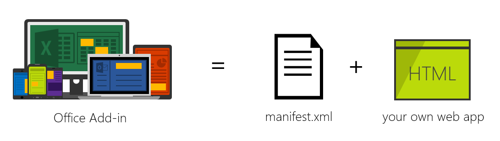
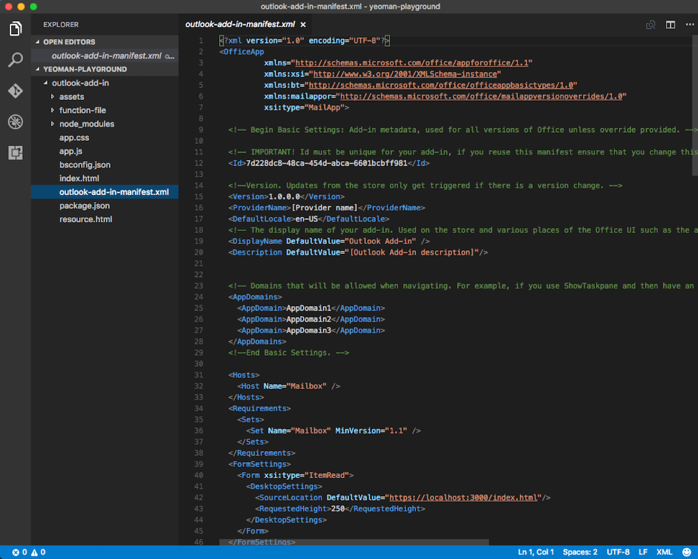
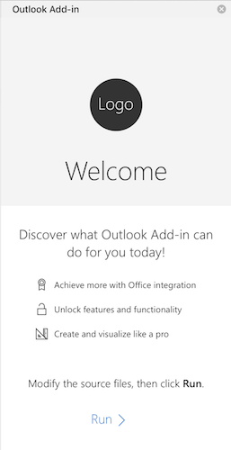
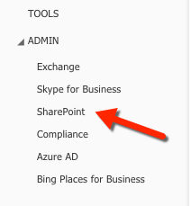
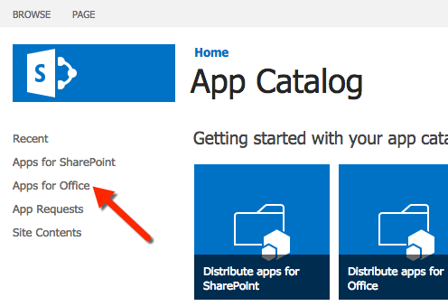

<a href="../../index.html" class="icon icon-home">vscode</a>

-

- [Home](../../index.html)

-

- - Customization
  - [Keyboard shortcuts](../../customization/keyboard-shortcuts/index.html)

-

- - Editor
  - [Accessibility](../../editor/accessibility/index.html)
  - [Codebasics](../../editor/codebasics/index.html)
  - [Command line](../../editor/command-line/index.html)
  - [Debugging](../../editor/debugging/index.html)
  - [Editingevolved](../../editor/editingevolved/index.html)
  - [Emmet](../../editor/emmet/index.html)
  - [Extension gallery](../../editor/extension-gallery/index.html)
  - [Integrated terminal](../../editor/integrated-terminal/index.html)
  - [Intellisense](../../editor/intellisense/index.html)
  - [Tasks appendix](../../editor/tasks-appendix/index.html)
  - [Tasks v1 appendix](../../editor/tasks-v1-appendix/index.html)
  - [Tasks v1](../../editor/tasks-v1/index.html)
  - [Tasks](../../editor/tasks/index.html)
  - [Userdefinedsnippets](../../editor/userdefinedsnippets/index.html)
  - [Versioncontrol](../../editor/versioncontrol/index.html)
  - [Whyvscode](../../editor/whyvscode/index.html)

-

- - extensionAPI
  - [Activation events](../../extensionAPI/activation-events/index.html)
  - [Api debugging](../../extensionAPI/api-debugging/index.html)
  - [Api markdown](../../extensionAPI/api-markdown/index.html)
  - [Api scm](../../extensionAPI/api-scm/index.html)
  - [Extension manifest](../../extensionAPI/extension-manifest/index.html)
  - [Extension points](../../extensionAPI/extension-points/index.html)
  - [Language support](../../extensionAPI/language-support/index.html)
  - [Overview](../../extensionAPI/overview/index.html)
  - [Patterns and principles](../../extensionAPI/patterns-and-principles/index.html)
  - [Vscode api commands](../../extensionAPI/vscode-api-commands/index.html)
  - [Vscode api](../../extensionAPI/vscode-api/index.html)

-

- - Extensions
  - [Debugging extensions](../../extensions/debugging-extensions/index.html)
  - [Example debuggers](../../extensions/example-debuggers/index.html)
  - [Example hello world](../../extensions/example-hello-world/index.html)
  - [Example language server](../../extensions/example-language-server/index.html)
  - [Example word count](../../extensions/example-word-count/index.html)
  - [Overview](../../extensions/overview/index.html)
  - [Publish extension](../../extensions/publish-extension/index.html)
  - [Samples](../../extensions/samples/index.html)
  - [Testing extensions](../../extensions/testing-extensions/index.html)
  - [Themes snippets colorizers](../../extensions/themes-snippets-colorizers/index.html)
  - [Yocode](../../extensions/yocode/index.html)

-

- - Getstarted
  - [Introvideos](../../getstarted/introvideos/index.html)
  - [Keybindings](../../getstarted/keybindings/index.html)
  - [Locales](../../getstarted/locales/index.html)
  - [Settings](../../getstarted/settings/index.html)
  - [Theme color reference](../../getstarted/theme-color-reference/index.html)
  - [Themes](../../getstarted/themes/index.html)
  - [Userinterface](../../getstarted/userinterface/index.html)

-

- - Introvideos
  - [Basics](../../introvideos/basics/index.html)
  - [Codeediting](../../introvideos/codeediting/index.html)
  - [Configure](../../introvideos/configure/index.html)
  - [Debugging](../../introvideos/debugging/index.html)
  - [Extend](../../introvideos/extend/index.html)
  - [Intellisense](../../introvideos/intellisense/index.html)
  - [Quicktour](../../introvideos/quicktour/index.html)
  - [Versioncontrol](../../introvideos/versioncontrol/index.html)

-

- - Languages
  - [Cpp](../../languages/cpp/index.html)
  - [Csharp](../../languages/csharp/index.html)
  - [Css](../../languages/css/index.html)
  - [Dockerfile](../../languages/dockerfile/index.html)
  - [Go](../../languages/go/index.html)
  - [Html](../../languages/html/index.html)
  - [Identifiers](../../languages/identifiers/index.html)
  - [Javascript](../../languages/javascript/index.html)
  - [Jsconfig](../../languages/jsconfig/index.html)
  - [Json](../../languages/json/index.html)
  - [Markdown](../../languages/markdown/index.html)
  - [Overview](../../languages/overview/index.html)
  - [Php](../../languages/php/index.html)
  - [Python](../../languages/python/index.html)
  - [Tsql](../../languages/tsql/index.html)
  - [Typescript](../../languages/typescript/index.html)

-

- - Nodejs
  - [Angular tutorial](../../nodejs/angular-tutorial/index.html)
  - [Extensions](../../nodejs/extensions/index.html)
  - [Javascript transpilers](../../nodejs/javascript-transpilers/index.html)
  - [Nodejs debugging](../../nodejs/nodejs-debugging/index.html)
  - [Nodejs deployment](../../nodejs/nodejs-deployment/index.html)
  - [Nodejs tutorial](../../nodejs/nodejs-tutorial/index.html)
  - [Other javascript runtimes](../../nodejs/other-javascript-runtimes/index.html)
  - [Overview](../../nodejs/overview/index.html)
  - [Reactjs tutorial](../../nodejs/reactjs-tutorial/index.html)
  - [Tasks](../../nodejs/tasks/index.html)

-

- - Other
  - [Dotnet](../dotnet/index.html)
  - <a href="index.html" class="current">Office</a>
    - [Office Add-ins with VS Code](#office-add-ins-with-vs-code)
    - <a href="#step-1-get-set-up" class="toctree-l4">Step 1: Get set up</a>
    - <a href="#use-vs-code-to-develop-your-office-add-in" class="toctree-l4">Use VS Code to Develop Your Office Add-in!</a>
    - <a href="#install-the-add-in" class="toctree-l4">Install the Add-in</a>
    - <a href="#next-steps" class="toctree-l4">Next Steps</a>
    - <a href="#common-questions" class="toctree-l4">Common Questions</a>
  - [Unity](../unity/index.html)

-

- - Setup
  - [Additional components](../../setup/additional-components/index.html)
  - [Linux](../../setup/linux/index.html)
  - [Mac](../../setup/mac/index.html)
  - [Network](../../setup/network/index.html)
  - [Setup overview](../../setup/setup-overview/index.html)
  - [Windows](../../setup/windows/index.html)

-

- - Supporting
  - [Errors](../../supporting/errors/index.html)
  - [Faq](../../supporting/faq/index.html)
  - [Requirements](../../supporting/requirements/index.html)

-

[vscode](../../index.html)

- [Docs](../../index.html) »
- Other »
- Office
-

---

# Office Add-ins with VS Code

[Office Add-ins](https://dev.office.com/getting-started/addins) run inside an Office application and can interact with the contents of the Office document using the rich JavaScript API.

Under the hood, an Office Add-in is just a web app that you can host anywhere. Using a `manifest.xml` file, you tell the Office application where your web app is located and how you want it to appear. The Office application takes care of hosting it within Office.

## Step 1: Get set up

Follow the instructions to [Create an Office Add-in using any editor](https://github.com/OfficeDev/office-js-docs/blob/master/docs/get-started/create-an-office-add-in-using-any-editor.md) to install the necessary prerequisites, and use Yo Office to create a new add-in project. The following table lists the project attributes to select in the Yeoman generator.

<table><thead><tr class="header"><th style="text-align: left;">Option</th><th style="text-align: left;">Value</th></tr></thead><tbody><tr class="odd"><td style="text-align: left;">New subfolder</td><td style="text-align: left;">(accept the default)</td></tr><tr class="even"><td style="text-align: left;">Add-in name</td><td style="text-align: left;">Outlook Add-in</td></tr><tr class="odd"><td style="text-align: left;">Supported Office application</td><td style="text-align: left;">(select Outlook)</td></tr><tr class="even"><td style="text-align: left;">Create new add-in</td><td style="text-align: left;">Yes, I want a new add-in</td></tr><tr class="odd"><td style="text-align: left;">Add <a href="https://www.typescriptlang.org/">TypeScript</a></td><td style="text-align: left;">No</td></tr><tr class="even"><td style="text-align: left;">Choose framework</td><td style="text-align: left;">Jquery</td></tr></tbody></table>

## Use VS Code to Develop Your Office Add-in!

VS Code is a great tool to help you develop your custom Office Add-ins regardless if they are for Outlook, Word, Excel, PowerPoint and run in the web clients, Windows clients, iOS clients or on macOS!

### Getting Started

Open the project in Visual Studio Code by entering the following on the command line from within the same folder where you ran the generator:

    code .

Open the `manifest.xml` file that was created by Yo Office and locate the `SourceLocation` node. Update this URL to the URL where you will host the Add-in.

> **Tip:** If you are using an Azure Web App as the host, the URL will look something like `https://[name-of-your-web-app].azurewebsites.net/[path-to-add-in]`. If you are using the self-hosted option listed above, it will be `http://localhost:3000/[path-to-add-in]`.

### Debugging your Office Add-in

VS Code does not currently support client-side debugging. To debug your client-side Add-in, you can use the Office web clients and open the browser's developer tools and debug the Add-in just like any other client-side JavaScript application.

If you are using Node.js or ASP.NET Core for server-side logic that supports your Office Add-in, refer to the [Debugging](https://vscode.readthedocs.io/docs/editor/debugging.md) page to configure VS Code for debugging either of these runtimes.

## Install the Add-in

Office Add-ins must be installed, or registered, with the Office application in order to load. This is done using the `manifest.xml` file you modified earlier.

### Side Loading Mail Add-ins

Mail Add-ins can be installed within the Outlook Web App. Browse to your Outlook Web App (https://mail.office365.com) and login. Once logged in, click the gear icon in the top-right section and select **Manage add-ins**:

On the **Manage add-ins** page, select the _+_ icon and then select **Add from a file**.

Locate the `manifest.xml` file for your custom Add-in and install it, accepting all prompts when installing it.

Once that's done, select an existing email and you will see a horizontal bar below the email header that includes the Add-in:

Next try creating an email, click the **Add-ins** or **Apps** menu item to get the Task Pane to appear:

Select the Add-in and see it appear in the Task Pane:

### Deploying Add-ins to the Office 365 Tenancy's App Catalog

All Office Add-ins (including Mail Add-ins) can be installed from your Office 365 tenancy's App Catalog site. Log in to your [Office 365 Portal](http://portal.office365.com/). In the left-hand navigation, towards the bottom, select the **Admin / SharePoint** option:

From the **SharePoint Admin Center**, select the **Apps** option in the left-hand menu and then select the **App Catalog**. On the **App Catalog** page, select the **Apps for Office** option and upload the `manifest.xml` file.

### Install Content & Task Pane Add-ins in Word / Excel / PowerPoint

Depending on the type of Add-in you created, you can add it to one of the Office applications. Task Pane and Content Add-ins can be installed in Word, Excel & PowerPoint. Mail Add-ins can be installed in Outlook.

To install an Add-in within an Office application, select the **Insert** tab and click the **Office Add-ins** button, as shown here using the Excel Web App:

Using the Office Add-ins dialog you can select Add-ins you've uploaded to your Office 365 tenancy's App Catalog (_listed under My Organization_) or acquire Add-ins from the Office Store.

## Next Steps

Check out the other pages on the VS Code site to find out how you can leverage more capabilities of the editor when creating custom Office Add-ins:

- [Language Overview](https://vscode.readthedocs.io/docs/languages/overview.md) - You can write Office Add-ins in many languages. Find out what VS Code has to offer.
- [User Interface](https://vscode.readthedocs.io/docs/getstarted/userinterface.md) - Just starting out with VS Code? This is worth reviewing.
- [Basic Editing](https://vscode.readthedocs.io/docs/editor/codebasics.md) - Learn about the powerful VS Code editor.

## Common Questions

**Q: Can I create an Office Add-in with the generator and use VS Code regardless of the language or client-side framework?**

**A:** Yes, you can. You can use pure HTML, Angular, Ember, React, Aurelia... anything you like!

**Q: Can I use TypeScript to create my Office Add-in?**

**A:** Absolutely and VS Code has great support for [TypeScript](https://vscode.readthedocs.io/docs/languages/typescript.md)!

<a href="../unity/index.html" class="btn btn-neutral float-right" title="Unity">Next </a> <a href="../dotnet/index.html" class="btn btn-neutral" title="Dotnet"> Previous</a>

---

  Read the Docs  
