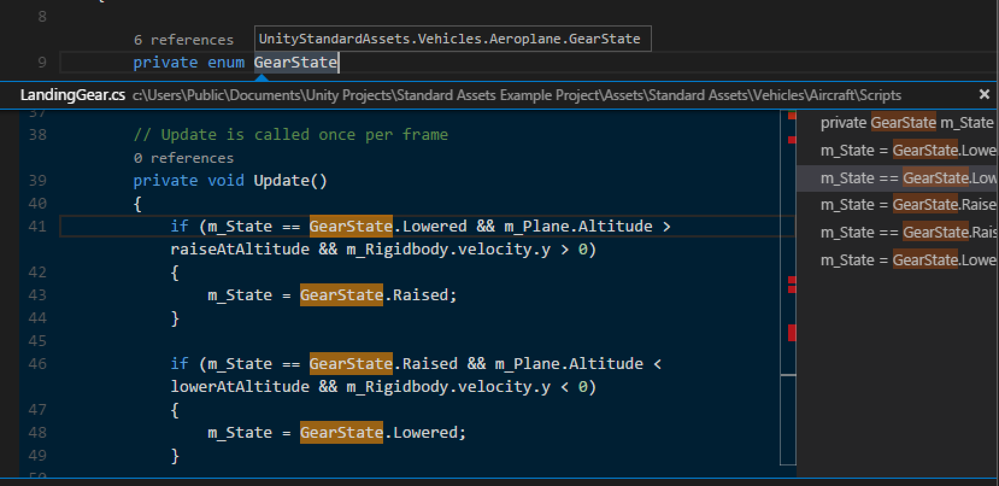
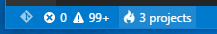
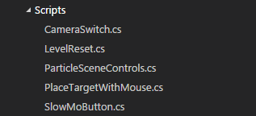

<a href="../../index.html" class="icon icon-home">vscode</a>

-

- [Home](../../index.html)

-

- - Customization
  - [Keyboard shortcuts](../../customization/keyboard-shortcuts/index.html)

-

- - Editor
  - [Accessibility](../../editor/accessibility/index.html)
  - [Codebasics](../../editor/codebasics/index.html)
  - [Command line](../../editor/command-line/index.html)
  - [Debugging](../../editor/debugging/index.html)
  - [Editingevolved](../../editor/editingevolved/index.html)
  - [Emmet](../../editor/emmet/index.html)
  - [Extension gallery](../../editor/extension-gallery/index.html)
  - [Integrated terminal](../../editor/integrated-terminal/index.html)
  - [Intellisense](../../editor/intellisense/index.html)
  - [Tasks appendix](../../editor/tasks-appendix/index.html)
  - [Tasks v1 appendix](../../editor/tasks-v1-appendix/index.html)
  - [Tasks v1](../../editor/tasks-v1/index.html)
  - [Tasks](../../editor/tasks/index.html)
  - [Userdefinedsnippets](../../editor/userdefinedsnippets/index.html)
  - [Versioncontrol](../../editor/versioncontrol/index.html)
  - [Whyvscode](../../editor/whyvscode/index.html)

-

- - extensionAPI
  - [Activation events](../../extensionAPI/activation-events/index.html)
  - [Api debugging](../../extensionAPI/api-debugging/index.html)
  - [Api markdown](../../extensionAPI/api-markdown/index.html)
  - [Api scm](../../extensionAPI/api-scm/index.html)
  - [Extension manifest](../../extensionAPI/extension-manifest/index.html)
  - [Extension points](../../extensionAPI/extension-points/index.html)
  - [Language support](../../extensionAPI/language-support/index.html)
  - [Overview](../../extensionAPI/overview/index.html)
  - [Patterns and principles](../../extensionAPI/patterns-and-principles/index.html)
  - [Vscode api commands](../../extensionAPI/vscode-api-commands/index.html)
  - [Vscode api](../../extensionAPI/vscode-api/index.html)

-

- - Extensions
  - [Debugging extensions](../../extensions/debugging-extensions/index.html)
  - [Example debuggers](../../extensions/example-debuggers/index.html)
  - [Example hello world](../../extensions/example-hello-world/index.html)
  - [Example language server](../../extensions/example-language-server/index.html)
  - [Example word count](../../extensions/example-word-count/index.html)
  - [Overview](../../extensions/overview/index.html)
  - [Publish extension](../../extensions/publish-extension/index.html)
  - [Samples](../../extensions/samples/index.html)
  - [Testing extensions](../../extensions/testing-extensions/index.html)
  - [Themes snippets colorizers](../../extensions/themes-snippets-colorizers/index.html)
  - [Yocode](../../extensions/yocode/index.html)

-

- - Getstarted
  - [Introvideos](../../getstarted/introvideos/index.html)
  - [Keybindings](../../getstarted/keybindings/index.html)
  - [Locales](../../getstarted/locales/index.html)
  - [Settings](../../getstarted/settings/index.html)
  - [Theme color reference](../../getstarted/theme-color-reference/index.html)
  - [Themes](../../getstarted/themes/index.html)
  - [Userinterface](../../getstarted/userinterface/index.html)

-

- - Introvideos
  - [Basics](../../introvideos/basics/index.html)
  - [Codeediting](../../introvideos/codeediting/index.html)
  - [Configure](../../introvideos/configure/index.html)
  - [Debugging](../../introvideos/debugging/index.html)
  - [Extend](../../introvideos/extend/index.html)
  - [Intellisense](../../introvideos/intellisense/index.html)
  - [Quicktour](../../introvideos/quicktour/index.html)
  - [Versioncontrol](../../introvideos/versioncontrol/index.html)

-

- - Languages
  - [Cpp](../../languages/cpp/index.html)
  - [Csharp](../../languages/csharp/index.html)
  - [Css](../../languages/css/index.html)
  - [Dockerfile](../../languages/dockerfile/index.html)
  - [Go](../../languages/go/index.html)
  - [Html](../../languages/html/index.html)
  - [Identifiers](../../languages/identifiers/index.html)
  - [Javascript](../../languages/javascript/index.html)
  - [Jsconfig](../../languages/jsconfig/index.html)
  - [Json](../../languages/json/index.html)
  - [Markdown](../../languages/markdown/index.html)
  - [Overview](../../languages/overview/index.html)
  - [Php](../../languages/php/index.html)
  - [Python](../../languages/python/index.html)
  - [Tsql](../../languages/tsql/index.html)
  - [Typescript](../../languages/typescript/index.html)

-

- - Nodejs
  - [Angular tutorial](../../nodejs/angular-tutorial/index.html)
  - [Extensions](../../nodejs/extensions/index.html)
  - [Javascript transpilers](../../nodejs/javascript-transpilers/index.html)
  - [Nodejs debugging](../../nodejs/nodejs-debugging/index.html)
  - [Nodejs deployment](../../nodejs/nodejs-deployment/index.html)
  - [Nodejs tutorial](../../nodejs/nodejs-tutorial/index.html)
  - [Other javascript runtimes](../../nodejs/other-javascript-runtimes/index.html)
  - [Overview](../../nodejs/overview/index.html)
  - [Reactjs tutorial](../../nodejs/reactjs-tutorial/index.html)
  - [Tasks](../../nodejs/tasks/index.html)

-

- - Other
  - [Dotnet](../dotnet/index.html)
  - [Office](../office/index.html)
  - <a href="index.html" class="current">Unity</a>
    - [Unity Development with VS Code](#unity-development-with-vs-code)
    - <a href="#setup-vs-code-as-unity-script-editor" class="toctree-l4">Setup VS Code as Unity Script Editor</a>
    - <a href="#editing-evolved" class="toctree-l4">Editing Evolved</a>
    - <a href="#unity-extensions" class="toctree-l4">Unity Extensions</a>
    - <a href="#next-steps" class="toctree-l4">Next Steps</a>
    - <a href="#common-questions" class="toctree-l4">Common Questions</a>

-

- - Setup
  - [Additional components](../../setup/additional-components/index.html)
  - [Linux](../../setup/linux/index.html)
  - [Mac](../../setup/mac/index.html)
  - [Network](../../setup/network/index.html)
  - [Setup overview](../../setup/setup-overview/index.html)
  - [Windows](../../setup/windows/index.html)

-

- - Supporting
  - [Errors](../../supporting/errors/index.html)
  - [Faq](../../supporting/faq/index.html)
  - [Requirements](../../supporting/requirements/index.html)

-

[vscode](../../index.html)

- [Docs](../../index.html) »
- Other »
- Unity
-

---

# Unity Development with VS Code

Visual Studio Code can be a great companion to Unity for editing and debugging C# files. All of the [C#](https://vscode.readthedocs.io/docs/languages/csharp.md) features are supported and more. In the screen below, you can see code colorization, bracket matching, IntelliSense, CodeLens and that's just the start.

Read on to find out how to configure Unity and your project to get the best possible experience.

## Setup VS Code as Unity Script Editor

Open up **Unity Preferences**, **External Tools**, then browse for the Visual Studio Code executable as **External Script Editor**.

> The Visual Studio Code executable can be found at `/Applications/Visual Studio Code.app` on OSX, `C:\Program Files (x86)\Microsoft VS Code\Code.exe` on Windows by default.

**Unity has built-in support for opening scripts in Visual Studio Code** as an external script editor on Windows and OSX. Unity will detect when Visual Studio Code is selected as an external script editor and pass the correct arguments to it when opening scripts from Unity. Unity will also set up a default `.vscode/settings.json` with file excludes, if it does not already exist (from [Unity 5.5 Release notes](https://unity3d.com/unity/whats-new/unity-5.5.0)).

## Editing Evolved

With the solution file selected, you are now ready to start editing with VS Code. Here is a list of some of the things you can expect:

- Syntax Highlighting
- Bracket matching
- IntelliSense
- Snippets
- CodeLens
- Peek
- Go-to Definition
- Code Actions/Lightbulbs
- Go to symbol
- Hover

Two topics that will help you are [Basic Editing](https://vscode.readthedocs.io/docs/editor/codebasics.md) and [C#](https://vscode.readthedocs.io/docs/languages/csharp.md). In the image below, you can see VS Code showing hover context, peeking references and more.

## Unity Extensions

The community is continually developing more and more valuable extensions for Unity. Here are some popular extensions that you might find useful. You can search for more extensions in the [VS Code Extension Marketplace](https://marketplace.visualstudio.com/search?term=Unity&target=VSCode).

The extensions shown above are dynamically queried. Click on an extension tile above to read the description and reviews to decide which extension is best for you. See more in the [Marketplace](https://marketplace.visualstudio.com/vscode).

## Next Steps

Read on to learn more about:

- [Basic Editing](https://vscode.readthedocs.io/docs/editor/codebasics.md) - Learn about the powerful VS Code editor.
- [Code Navigation](https://vscode.readthedocs.io/docs/editor/editingevolved.md) - Move quickly through your source code.
- [Debugging](https://vscode.readthedocs.io/docs/editor/debugging.md) - how to use the debugger with your project
- [C#](https://vscode.readthedocs.io/docs/languages/csharp.md) - learn about the C# support in VS Code

## Common Questions

**Q: I don't have IntelliSense.**

**A:** You need to ensure that your solution is open in VS Code (not just a single file). Open the folder with your solution and you usually will not need to do anything else. If for some reason VS Code has not selected the right solution context, you can change the selected project by clicking on the OmniSharp flame icon on the status bar.

Choose the `-CSharp` version of the solution file and VS Code will light up.

**Q: How can I change the file exclusions?**

**A:** Unity creates a number of additional files that can clutter your workspace in VS Code. You can easily hide these so that you can focus on the files you actually want to edit.

To do this, add the following JSON to your [workspace settings](https://vscode.readthedocs.io/docs/getstarted/settings.md).

        // Configure glob patterns for excluding files and folders.
        "files.exclude": {
            "**/.git": true,
            "**/.DS_Store": true,
            "**/*.meta": true,
            "**/*.*.meta": true,
            "**/*.unity": true,
            "**/*.unityproj": true,
            "**/*.mat": true,
            "**/*.fbx": true,
            "**/*.FBX": true,
            "**/*.tga": true,
            "**/*.cubemap": true,
            "**/*.prefab": true,
            "**/Library": true,
            "**/ProjectSettings": true,
            "**/Temp": true
        }

As you can see below this will clean things up a lot...

<table><thead><tr class="header"><th>Before</th><th>After</th></tr></thead><tbody><tr class="odd"><td></td><td></td></tr></tbody></table>

**Q: How can I debug Unity?**

**A:** Install the [Debugger for Unity](https://marketplace.visualstudio.com/items/Unity.unity-debug) extension.

<a href="../../setup/additional-components/index.html" class="btn btn-neutral float-right" title="Additional components">Next </a> <a href="../office/index.html" class="btn btn-neutral" title="Office"> Previous</a>

---

  Read the Docs  
