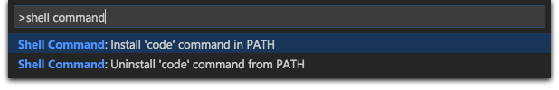

<a href="../../index.html" class="icon icon-home">vscode</a>

-

- [Home](../../index.html)

-

- - Customization
  - [Keyboard shortcuts](../../customization/keyboard-shortcuts/index.html)

-

- - Editor
  - [Accessibility](../../editor/accessibility/index.html)
  - [Codebasics](../../editor/codebasics/index.html)
  - [Command line](../../editor/command-line/index.html)
  - [Debugging](../../editor/debugging/index.html)
  - [Editingevolved](../../editor/editingevolved/index.html)
  - [Emmet](../../editor/emmet/index.html)
  - [Extension gallery](../../editor/extension-gallery/index.html)
  - [Integrated terminal](../../editor/integrated-terminal/index.html)
  - [Intellisense](../../editor/intellisense/index.html)
  - [Tasks appendix](../../editor/tasks-appendix/index.html)
  - [Tasks v1 appendix](../../editor/tasks-v1-appendix/index.html)
  - [Tasks v1](../../editor/tasks-v1/index.html)
  - [Tasks](../../editor/tasks/index.html)
  - [Userdefinedsnippets](../../editor/userdefinedsnippets/index.html)
  - [Versioncontrol](../../editor/versioncontrol/index.html)
  - [Whyvscode](../../editor/whyvscode/index.html)

-

- - extensionAPI
  - [Activation events](../../extensionAPI/activation-events/index.html)
  - [Api debugging](../../extensionAPI/api-debugging/index.html)
  - [Api markdown](../../extensionAPI/api-markdown/index.html)
  - [Api scm](../../extensionAPI/api-scm/index.html)
  - [Extension manifest](../../extensionAPI/extension-manifest/index.html)
  - [Extension points](../../extensionAPI/extension-points/index.html)
  - [Language support](../../extensionAPI/language-support/index.html)
  - [Overview](../../extensionAPI/overview/index.html)
  - [Patterns and principles](../../extensionAPI/patterns-and-principles/index.html)
  - [Vscode api commands](../../extensionAPI/vscode-api-commands/index.html)
  - [Vscode api](../../extensionAPI/vscode-api/index.html)

-

- - Extensions
  - [Debugging extensions](../../extensions/debugging-extensions/index.html)
  - [Example debuggers](../../extensions/example-debuggers/index.html)
  - [Example hello world](../../extensions/example-hello-world/index.html)
  - [Example language server](../../extensions/example-language-server/index.html)
  - [Example word count](../../extensions/example-word-count/index.html)
  - [Overview](../../extensions/overview/index.html)
  - [Publish extension](../../extensions/publish-extension/index.html)
  - [Samples](../../extensions/samples/index.html)
  - [Testing extensions](../../extensions/testing-extensions/index.html)
  - [Themes snippets colorizers](../../extensions/themes-snippets-colorizers/index.html)
  - [Yocode](../../extensions/yocode/index.html)

-

- - Getstarted
  - [Introvideos](../../getstarted/introvideos/index.html)
  - [Keybindings](../../getstarted/keybindings/index.html)
  - [Locales](../../getstarted/locales/index.html)
  - [Settings](../../getstarted/settings/index.html)
  - [Theme color reference](../../getstarted/theme-color-reference/index.html)
  - [Themes](../../getstarted/themes/index.html)
  - [Userinterface](../../getstarted/userinterface/index.html)

-

- - Introvideos
  - [Basics](../../introvideos/basics/index.html)
  - [Codeediting](../../introvideos/codeediting/index.html)
  - [Configure](../../introvideos/configure/index.html)
  - [Debugging](../../introvideos/debugging/index.html)
  - [Extend](../../introvideos/extend/index.html)
  - [Intellisense](../../introvideos/intellisense/index.html)
  - [Quicktour](../../introvideos/quicktour/index.html)
  - [Versioncontrol](../../introvideos/versioncontrol/index.html)

-

- - Languages
  - [Cpp](../../languages/cpp/index.html)
  - [Csharp](../../languages/csharp/index.html)
  - [Css](../../languages/css/index.html)
  - [Dockerfile](../../languages/dockerfile/index.html)
  - [Go](../../languages/go/index.html)
  - [Html](../../languages/html/index.html)
  - [Identifiers](../../languages/identifiers/index.html)
  - [Javascript](../../languages/javascript/index.html)
  - [Jsconfig](../../languages/jsconfig/index.html)
  - [Json](../../languages/json/index.html)
  - [Markdown](../../languages/markdown/index.html)
  - [Overview](../../languages/overview/index.html)
  - [Php](../../languages/php/index.html)
  - [Python](../../languages/python/index.html)
  - [Tsql](../../languages/tsql/index.html)
  - [Typescript](../../languages/typescript/index.html)

-

- - Nodejs
  - [Angular tutorial](../../nodejs/angular-tutorial/index.html)
  - [Extensions](../../nodejs/extensions/index.html)
  - [Javascript transpilers](../../nodejs/javascript-transpilers/index.html)
  - [Nodejs debugging](../../nodejs/nodejs-debugging/index.html)
  - [Nodejs deployment](../../nodejs/nodejs-deployment/index.html)
  - [Nodejs tutorial](../../nodejs/nodejs-tutorial/index.html)
  - [Other javascript runtimes](../../nodejs/other-javascript-runtimes/index.html)
  - [Overview](../../nodejs/overview/index.html)
  - [Reactjs tutorial](../../nodejs/reactjs-tutorial/index.html)
  - [Tasks](../../nodejs/tasks/index.html)

-

- - Other
  - [Dotnet](../../other/dotnet/index.html)
  - [Office](../../other/office/index.html)
  - [Unity](../../other/unity/index.html)

-

- - Setup
  - [Additional components](../additional-components/index.html)
  - [Linux](../linux/index.html)
  - <a href="index.html" class="current">Mac</a>
    - [Running VS Code on Mac](#running-vs-code-on-mac)
    - <a href="#installation" class="toctree-l4">Installation</a>
    - <a href="#updates" class="toctree-l4">Updates</a>
    - <a href="#preferences-menu" class="toctree-l4">Preferences Menu</a>
    - <a href="#next-steps" class="toctree-l4">Next Steps</a>
    - <a href="#common-questions" class="toctree-l4">Common Questions</a>
  - [Network](../network/index.html)
  - [Setup overview](../setup-overview/index.html)
  - [Windows](../windows/index.html)

-

- - Supporting
  - [Errors](../../supporting/errors/index.html)
  - [Faq](../../supporting/faq/index.html)
  - [Requirements](../../supporting/requirements/index.html)

-

[vscode](../../index.html)

- [Docs](../../index.html) »
- Setup »
- Mac
-

---

# Running VS Code on Mac

## Installation

1.  [Download Visual Studio Code](https://go.microsoft.com/fwlink/?LinkID=534106) for Mac.
2.  Double-click on the downloaded archive to expand the contents.
3.  Drag `Visual Studio Code.app` to the `Applications` folder, making it available in the `Launchpad`.
4.  Add VS Code to your Dock by right-clicking on the icon and choosing `Options`, `Keep in Dock`.

### Command Line

You can also run VS Code from the terminal by typing 'code' after adding it to the path:

- Launch VS Code.
- Open the **Command Palette** (`kb(workbench.action.showCommands)`) and type 'shell command' to find the **Shell Command: Install 'code' command in PATH** command.

- Restart the terminal for the new `$PATH` value to take effect. You'll be able to type 'code .' in any folder to start editing files in that folder.

> **Note:** If you still have the old `code` alias in your `.bash_profile` (or equivalent) from an early VS Code version, remove it and replace it by executing the **Shell Command: Install 'code' command in PATH** command.

To manually add VS Code to your path:

    cat << EOF >> ~/.bash_profile
    # Add Visual Studio Code (code)
    export PATH="$PATH:/Applications/Visual Studio Code.app/Contents/Resources/app/bin"
    EOF

## Updates

VS Code ships monthly [releases](../../updates.html) and supports auto-update when a new release is available. If you're prompted by VS Code, accept the newest update and it will get installed (you won't need to do anything else to get the latest bits). If you'd rather control VS Code updates manually, see [How do I opt out of auto-updates](https://vscode.readthedocs.io/docs/supporting/faq.md#how-do-i-opt-out-of-vs-code-autoupdates).

## Preferences Menu

You can configure VS Code through [settings](https://vscode.readthedocs.io/docs/getstarted/settings.md), [color themes](https://vscode.readthedocs.io/docs/getstarted/themes.md) and [custom keybindings](https://vscode.readthedocs.io/docs/getstarted/keybindings.md) and you will often see mention in our documentation of the **File** &gt; **Preferences** menu group. On a Mac, the **Preferences** menu group is under **Code**, not **File**.

## Next Steps

Once you have installed VS Code, these topics will help you learn more about VS Code:

- [Additional Components](https://vscode.readthedocs.io/docs/setup/additional-components.md) - Learn how to install Git, Node.js, TypeScript and tools like Yeoman.
- [User Interface](https://vscode.readthedocs.io/docs/getstarted/userinterface.md) - A quick orientation around VS Code.
- [User/Workspace Settings](https://vscode.readthedocs.io/docs/getstarted/settings.md) - Learn how to configure VS Code to your preferences settings.

## Common Questions

### Mono and El Capitan

Mono stopped working in Visual Studio Code after I installed OS X 10.11 El Capitan Public Beta. What do I do?

Run these commands:

    brew update
    brew reinstall mono

<a href="../network/index.html" class="btn btn-neutral float-right" title="Network">Next </a> <a href="../linux/index.html" class="btn btn-neutral" title="Linux"> Previous</a>

---

  Read the Docs  
